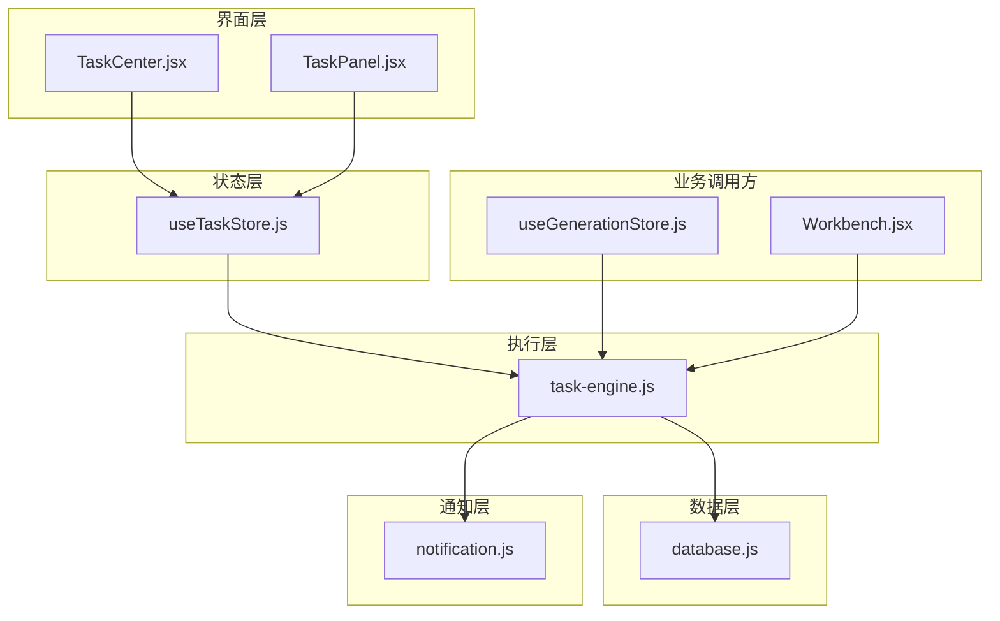
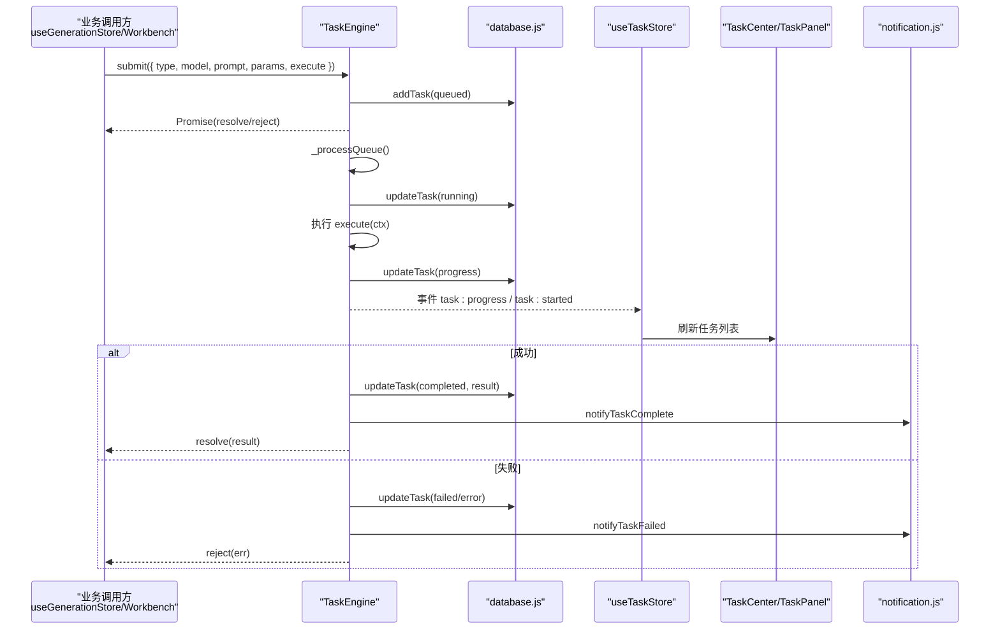
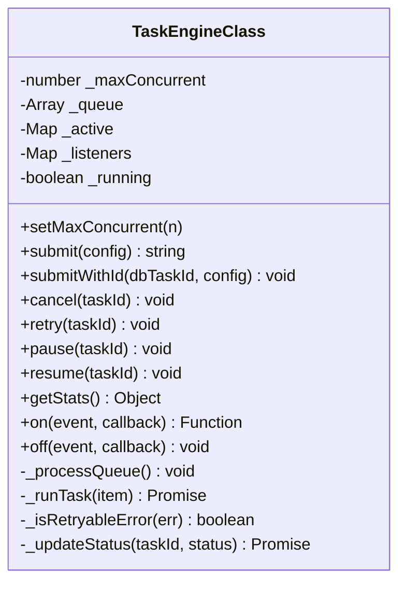
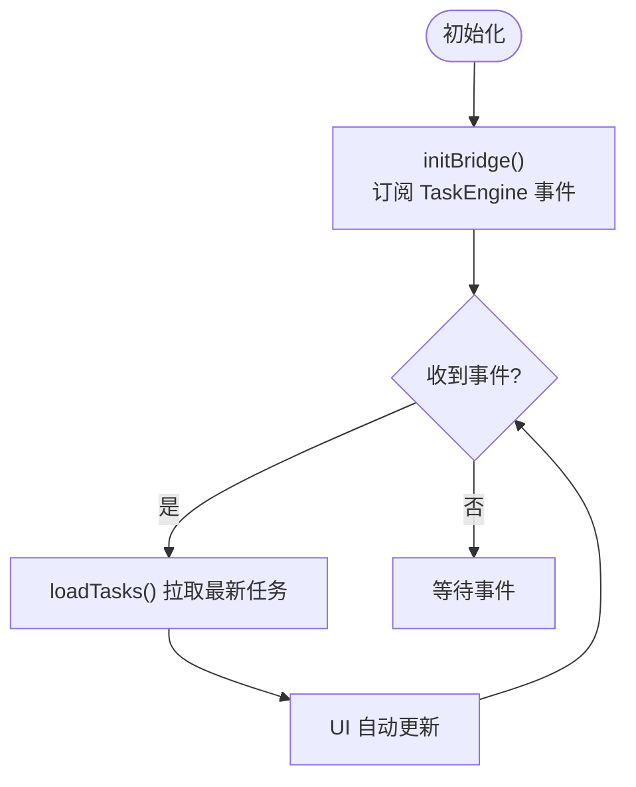
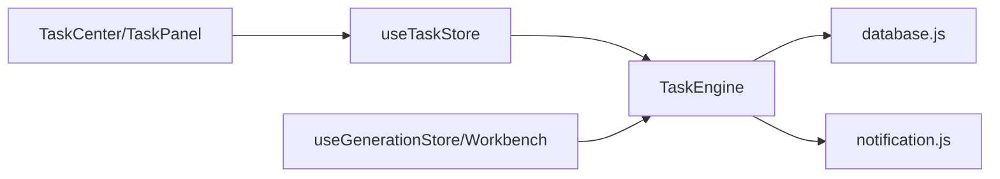

# 任务中心

<cite>
**本文引用的文件**
- [TaskCenter.jsx](file://app/src/pages/TaskCenter.jsx)
- [TaskPanel.jsx](file://app/src/components/TaskPanel.jsx)
- [task-engine.js](file://app/src/services/task-engine.js)
- [useTaskStore.js](file://app/src/stores/useTaskStore.js)
- [database.js](file://app/src/db/database.js)
- [notification.js](file://app/src/services/notification.js)
- [useGenerationStore.js](file://app/src/stores/useGenerationStore.js)
- [Workbench.jsx](file://app/src/pages/Workbench.jsx)
</cite>

## 目录
1. [简介](#简介)
2. [项目结构](#项目结构)
3. [核心组件](#核心组件)
4. [架构总览](#架构总览)
5. [详细组件分析](#详细组件分析)
6. [依赖关系分析](#依赖关系分析)
7. [性能与并发控制](#性能与并发控制)
8. [配置与调度选项](#配置与调度选项)
9. [用户操作指南](#用户操作指南)
10. [故障排查](#故障排查)
11. [结论](#结论)

## 简介
本章节面向“任务中心”功能，系统性介绍后台任务队列管理系统。内容覆盖任务提交、进度跟踪、状态监控、错误处理与重试机制；深入说明并发控制、优先级调度（当前实现为 FIFO）、超时与资源管理；并提供用户查看与管理任务的交互方式（暂停、取消、重试等），以及配置项与性能优化建议、常见问题排查方法。

## 项目结构
任务中心由前端页面、侧边面板、状态存储、任务引擎、数据库层与通知服务组成：
- 页面与面板：TaskCenter.jsx、TaskPanel.jsx
- 状态桥接：useTaskStore.js
- 任务引擎：task-engine.js
- 持久化：database.js（IndexedDB）
- 通知：notification.js
- 业务集成示例：useGenerationStore.js、Workbench.jsx

图表来源
- [TaskCenter.jsx:1-218](file://app/src/pages/TaskCenter.jsx#L1-L218)
- [TaskPanel.jsx:1-538](file://app/src/components/TaskPanel.jsx#L1-L538)
- [useTaskStore.js:1-173](file://app/src/stores/useTaskStore.js#L1-L173)
- [task-engine.js:1-319](file://app/src/services/task-engine.js#L1-L319)
- [database.js:1-339](file://app/src/db/database.js#L1-L339)
- [notification.js:1-113](file://app/src/services/notification.js#L1-L113)
- [useGenerationStore.js:250-360](file://app/src/stores/useGenerationStore.js#L250-L360)
- [Workbench.jsx:360-420](file://app/src/pages/Workbench.jsx#L360-L420)

章节来源
- [TaskCenter.jsx:1-218](file://app/src/pages/TaskCenter.jsx#L1-L218)
- [TaskPanel.jsx:1-538](file://app/src/components/TaskPanel.jsx#L1-L538)
- [useTaskStore.js:1-173](file://app/src/stores/useTaskStore.js#L1-L173)
- [task-engine.js:1-319](file://app/src/services/task-engine.js#L1-L319)
- [database.js:1-339](file://app/src/db/database.js#L1-L339)
- [notification.js:1-113](file://app/src/services/notification.js#L1-L113)
- [useGenerationStore.js:250-360](file://app/src/stores/useGenerationStore.js#L250-L360)
- [Workbench.jsx:360-420](file://app/src/pages/Workbench.jsx#L360-L420)

## 核心组件
- 任务引擎 TaskEngine：单例，负责任务入队、并发执行、状态机流转、事件广播、进度上报、失败重试与浏览器通知。
- 任务存储 useTaskStore：桥接 TaskEngine 事件到 Zustand 状态，提供加载、增删改查、重试、取消、暂停/恢复等操作。
- 任务中心页面 TaskCenter.jsx：按状态分组展示任务列表，支持统计概览、展开/折叠、批量清空已完成等。
- 任务面板 TaskPanel.jsx：右侧抽屉式任务面板，提供快速查看与常用操作。
- 数据库 database.js：基于 Dexie 的 IndexedDB 封装，维护 tasks 表及 CRUD 接口。
- 通知 notification.js：封装浏览器 Notification API，在任务完成或失败时推送系统通知。
- 业务集成：useGenerationStore.js 与 Workbench.jsx 通过 TaskEngine.submit 提交生成/编辑类任务。

章节来源
- [task-engine.js:1-319](file://app/src/services/task-engine.js#L1-L319)
- [useTaskStore.js:1-173](file://app/src/stores/useTaskStore.js#L1-L173)
- [TaskCenter.jsx:1-218](file://app/src/pages/TaskCenter.jsx#L1-L218)
- [TaskPanel.jsx:1-538](file://app/src/components/TaskPanel.jsx#L1-L538)
- [database.js:1-339](file://app/src/db/database.js#L1-L339)
- [notification.js:1-113](file://app/src/services/notification.js#L1-L113)
- [useGenerationStore.js:250-360](file://app/src/stores/useGenerationStore.js#L250-L360)
- [Workbench.jsx:360-420](file://app/src/pages/Workbench.jsx#L360-L420)

## 架构总览
下图展示了从业务调用到任务执行、状态更新与 UI 更新的完整链路。

图表来源
- [task-engine.js:57-319](file://app/src/services/task-engine.js#L57-L319)
- [useTaskStore.js:39-64](file://app/src/stores/useTaskStore.js#L39-L64)
- [TaskCenter.jsx:24-66](file://app/src/pages/TaskCenter.jsx#L24-L66)
- [TaskPanel.jsx:9-28](file://app/src/components/TaskPanel.jsx#L9-L28)
- [database.js:235-274](file://app/src/db/database.js#L235-L274)
- [notification.js:78-103](file://app/src/services/notification.js#L78-L103)
- [useGenerationStore.js:256-282](file://app/src/stores/useGenerationStore.js#L256-L282)
- [Workbench.jsx:368-406](file://app/src/pages/Workbench.jsx#L368-L406)

## 详细组件分析

### 任务引擎 TaskEngine
- 并发控制：内部维护最大并发数（默认 3），使用 Map 记录活跃任务，循环从队列取任务直到达到上限。
- 队列策略：FIFO 队列，新任务追加至尾部。
- 状态机：定义合法状态转换，包括 queued、running、completed、failed、cancelled、paused。
- 事件系统：内置 on/off/_emit，对外广播 task:queued、task:started、task:progress、task:completed、task:failed、task:cancelled、task:paused、task:retry。
- 进度上报：execute 上下文提供 onProgress(percent)，引擎持久化并广播进度事件。
- 错误处理与重试：捕获异常后判断是否可重试（如 5xx、网络错误），指数退避（最多 3 次），失败则标记 failed 并触发通知。
- 取消与暂停：对运行中任务通过 AbortController 中断；对排队中任务直接移除或置为 paused。
- 恢复：将 paused 任务重新入队（注意：pause 会丢失 execute 引用，需上层重新提交）。
- 持久化：所有关键状态变更均落库，保证刷新不丢失。

图表来源
- [task-engine.js:33-319](file://app/src/services/task-engine.js#L33-L319)

章节来源
- [task-engine.js:1-319](file://app/src/services/task-engine.js#L1-L319)

### 任务存储 useTaskStore
- 职责：维护 tasks 列表与 activeTaskCount；初始化 TaskEngine 事件桥，统一刷新 UI；暴露 add/update/remove/retry/cancel/pause/resume/getTaskStats/clearCompleted 等方法。
- 事件桥：监听 TaskEngine 全部事件，每次事件后调用 loadTasks 同步最新状态。
- 容错：当 TaskEngine 操作失败时，回退到本地状态更新，确保 UI 一致性。

图表来源
- [useTaskStore.js:39-64](file://app/src/stores/useTaskStore.js#L39-L64)
- [useTaskStore.js:23-33](file://app/src/stores/useTaskStore.js#L23-L33)

章节来源
- [useTaskStore.js:1-173](file://app/src/stores/useTaskStore.js#L1-L173)

### 任务中心页面 TaskCenter.jsx
- 功能：按状态分组显示任务（进行中、排队中、已完成、失败、已暂停），提供统计条、展开/折叠、清空已完成、单个任务的操作（暂停、取消、重试、恢复、移除）。
- 数据来源：useTaskStore.tasks；操作通过 store 的方法委托给 TaskEngine。
- 交互反馈：使用 UI 全局 toast 提示操作结果。

章节来源
- [TaskCenter.jsx:1-218](file://app/src/pages/TaskCenter.jsx#L1-L218)
- [useTaskStore.js:109-171](file://app/src/stores/useTaskStore.js#L109-L171)

### 任务面板 TaskPanel.jsx
- 功能：右侧抽屉面板，聚合进行中和暂停任务为一组，便于快速查看与操作；支持跳转到“查看全部任务”。
- 数据来源与操作：同 TaskCenter.jsx，复用 useTaskStore。

章节来源
- [TaskPanel.jsx:1-538](file://app/src/components/TaskPanel.jsx#L1-L538)

### 数据库 database.js
- 任务表 tasks：字段包含 id、type、status、model、prompt、params、progress、error、result、retryCount、createdAt、updatedAt 等。
- 索引：按 createdAt 倒序查询，支持按 status 过滤与分页 limit。
- 统计：提供 getTaskStats 汇总各状态数量。

章节来源
- [database.js:235-274](file://app/src/db/database.js#L235-L274)

### 通知 notification.js
- 能力：请求权限、发送系统通知；封装任务完成/失败的通知消息体。
- 集成点：TaskEngine 在任务完成或失败时调用对应通知函数。

章节来源
- [notification.js:1-113](file://app/src/services/notification.js#L1-L113)
- [task-engine.js:256-291](file://app/src/services/task-engine.js#L256-L291)

### 业务集成示例
- 文本到图像生成：useGenerationStore 构造 execute 函数，调用适配器生成图片，写入 images 表，并通过 TaskEngine.submit 提交任务。
- 局部重绘（Inpainting）：Workbench.jsx 构建 execute 逻辑，调用适配器执行编辑，同样通过 TaskEngine.submit 提交。

章节来源
- [useGenerationStore.js:256-282](file://app/src/stores/useGenerationStore.js#L256-L282)
- [Workbench.jsx:368-406](file://app/src/pages/Workbench.jsx#L368-L406)

## 依赖关系分析
- 组件耦合：
  - TaskCenter.jsx 与 TaskPanel.jsx 仅依赖 useTaskStore，解耦了具体执行细节。
  - useTaskStore 依赖 database.js 与 TaskEngine，承担事件桥与状态同步。
  - TaskEngine 依赖 database.js 与 notification.js，屏蔽底层 IO 与通知。
- 外部依赖：
  - Dexie（IndexedDB）用于持久化。
  - uuid 用于生成 taskId。
  - lucide-react 图标库用于 UI。
- 潜在循环依赖：无直接循环引用；store 与 engine 单向依赖。

图表来源
- [TaskCenter.jsx:1-218](file://app/src/pages/TaskCenter.jsx#L1-L218)
- [TaskPanel.jsx:1-538](file://app/src/components/TaskPanel.jsx#L1-L538)
- [useTaskStore.js:1-173](file://app/src/stores/useTaskStore.js#L1-L173)
- [task-engine.js:1-319](file://app/src/services/task-engine.js#L1-L319)
- [database.js:1-339](file://app/src/db/database.js#L1-L339)
- [notification.js:1-113](file://app/src/services/notification.js#L1-L113)
- [useGenerationStore.js:250-360](file://app/src/stores/useGenerationStore.js#L250-L360)
- [Workbench.jsx:360-420](file://app/src/pages/Workbench.jsx#L360-L420)

## 性能与并发控制
- 并发上限：默认 3，可通过 setMaxConcurrent 调整。建议根据后端限流与客户端资源情况调优。
- 队列策略：FIFO，适合通用场景；如需优先级，可在入队前对队列排序或引入多级队列。
- 进度上报：onProgress 频繁调用时会多次写库与广播事件，建议合并节流或降低频率以提升性能。
- 重试退避：指数退避避免雪崩，但可能拉长失败任务的处理时间，应结合业务容忍度设置最大重试次数。
- 内存占用：活跃任务 Map 与队列数组随任务量增长，建议定期清理已完成/失败任务。
- 渲染优化：useTaskStore 在每次事件后全量刷新任务列表，若任务量大可考虑增量更新或虚拟滚动。

[本节为通用性能建议，无需特定文件来源]

## 配置与调度选项
- 并发数：TaskEngine.setMaxConcurrent(n)
- 重试策略：内部固定最大 3 次，指数退避；可根据需求扩展为可配置参数。
- 超时处理：当前未内置超时控制，建议在 execute 中结合 signal 自行实现超时逻辑。
- 优先级调度：当前为 FIFO；如需优先级，可在入队前按优先级插入或维护多队列。
- 通知开关：notification.js 支持权限检查与静默模式，可按需关闭。

章节来源
- [task-engine.js:44-48](file://app/src/services/task-engine.js#L44-L48)
- [task-engine.js:269-281](file://app/src/services/task-engine.js#L269-L281)
- [notification.js:19-43](file://app/src/services/notification.js#L19-L43)

## 用户操作指南
- 查看任务：打开“任务中心”页面或右侧“任务”面板，按状态分组查看。
- 暂停/恢复：对运行中任务点击“暂停”，对已暂停任务点击“恢复”。
- 取消：对运行中或排队中的任务点击“取消”。
- 重试：对失败的任务点击“重试”，任务将重新入队并按退避策略执行。
- 移除：删除指定任务记录。
- 清空已完成：一键清理已完成任务，释放空间。
- 跳转查看：在面板底部点击“查看全部任务”进入任务中心页面。

章节来源
- [TaskCenter.jsx:60-66](file://app/src/pages/TaskCenter.jsx#L60-L66)
- [TaskPanel.jsx:244-272](file://app/src/components/TaskPanel.jsx#L244-L272)
- [useTaskStore.js:109-171](file://app/src/stores/useTaskStore.js#L109-L171)

## 故障排查
- 任务无法开始执行
  - 检查并发上限是否为 0 或负数；确认队列非空且未被阻塞。
  - 参考：[task-engine.js:215-220](file://app/src/services/task-engine.js#L215-L220)
- 任务被取消但未从 UI 消失
  - 确认 TaskEngine 已广播 task:cancelled 事件；检查 useTaskStore.initBridge 是否正确初始化。
  - 参考：[useTaskStore.js:39-64](file://app/src/stores/useTaskStore.js#L39-L64)
- 进度不更新
  - 检查 execute 是否调用 onProgress；确认数据库更新与事件广播正常。
  - 参考：[task-engine.js:233-236](file://app/src/services/task-engine.js#L233-L236)
- 失败任务未自动重试
  - 检查错误类型是否属于可重试范围（如 5xx、网络错误）；确认 retryCount 未超过上限。
  - 参考：[task-engine.js:299-305](file://app/src/services/task-engine.js#L299-L305)
- 通知未弹出
  - 检查浏览器是否允许通知权限；确认 TaskEngine 在完成/失败路径调用通知函数。
  - 参考：[notification.js:19-43](file://app/src/services/notification.js#L19-L43)、[task-engine.js:256-291](file://app/src/services/task-engine.js#L256-L291)
- 任务状态不一致
  - 对比数据库实际状态与 UI 展示；必要时手动调用 loadTasks 刷新。
  - 参考：[useTaskStore.js:23-33](file://app/src/stores/useTaskStore.js#L23-L33)

章节来源
- [task-engine.js:215-220](file://app/src/services/task-engine.js#L215-L220)
- [task-engine.js:233-236](file://app/src/services/task-engine.js#L233-L236)
- [task-engine.js:299-305](file://app/src/services/task-engine.js#L299-L305)
- [task-engine.js:256-291](file://app/src/services/task-engine.js#L256-L291)
- [useTaskStore.js:39-64](file://app/src/stores/useTaskStore.js#L39-L64)
- [useTaskStore.js:23-33](file://app/src/stores/useTaskStore.js#L23-L33)
- [notification.js:19-43](file://app/src/services/notification.js#L19-L43)

## 结论
任务中心以 TaskEngine 为核心，结合 useTaskStore 的事件桥与 IndexedDB 持久化，提供了稳定可靠的后台任务管理能力。其并发控制、FIFO 队列、指数退避重试与浏览器通知构成了完整的任务生命周期闭环。对于更复杂的调度需求（如优先级、超时控制），可在现有基础上扩展配置与策略。通过合理的并发与重试策略、增量更新与清理机制，可在大规模任务场景下保持良好性能与用户体验。