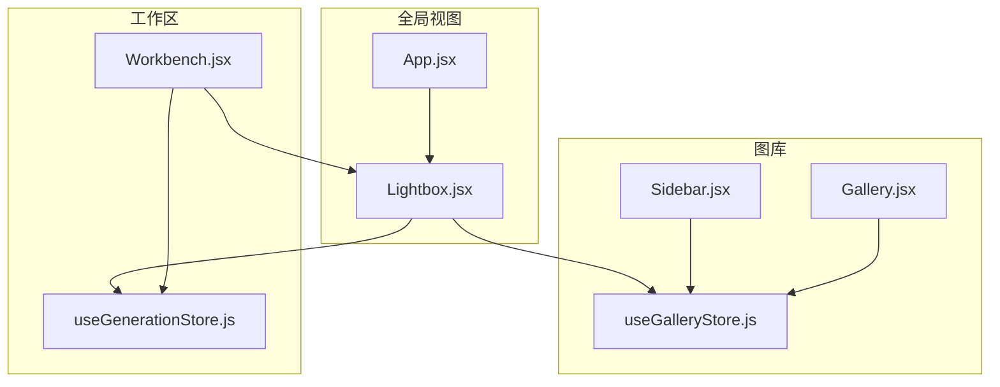
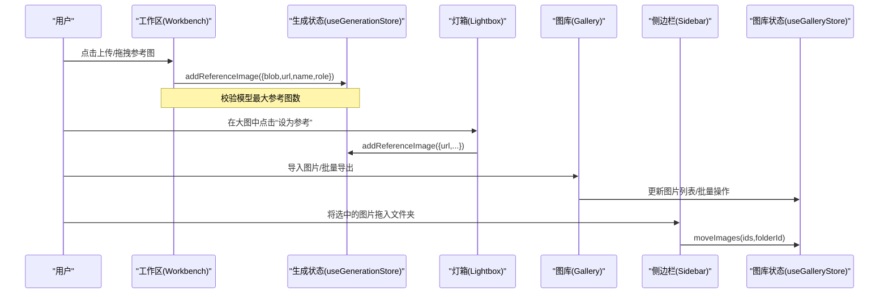
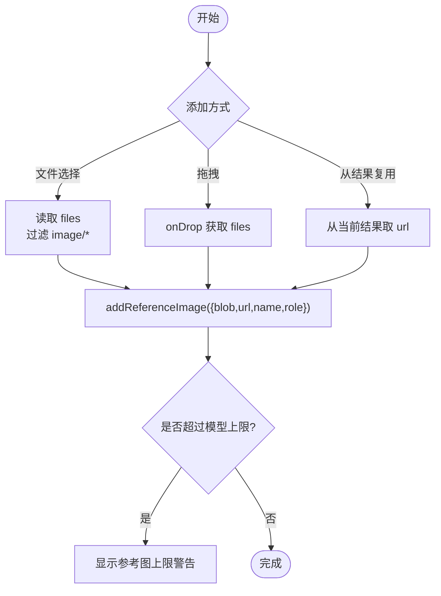
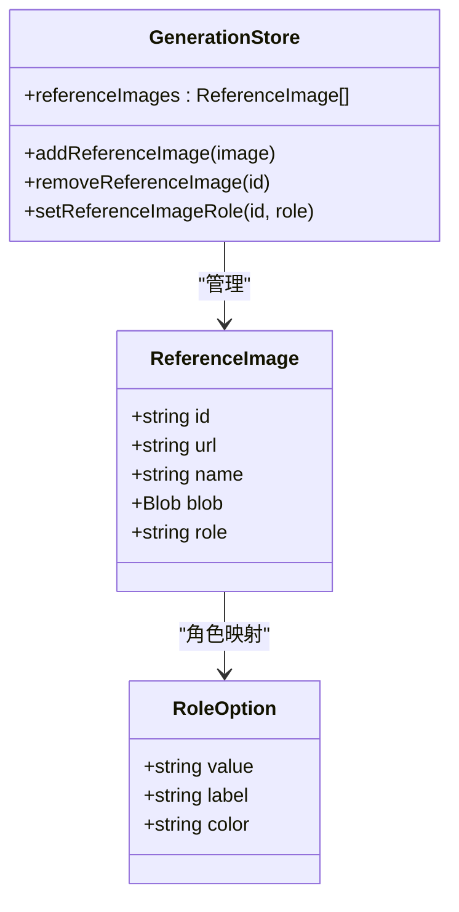
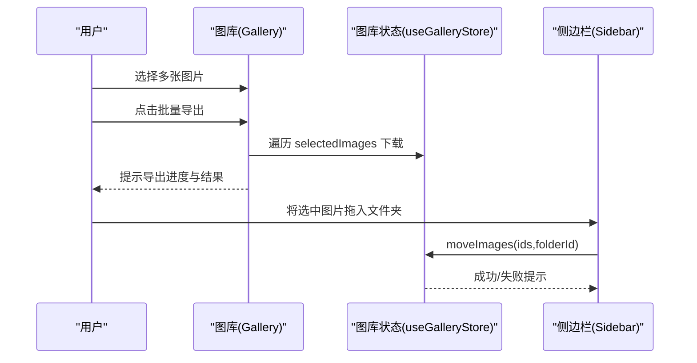
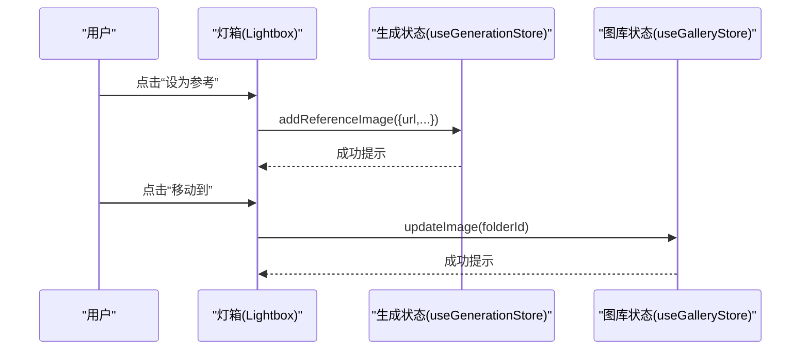
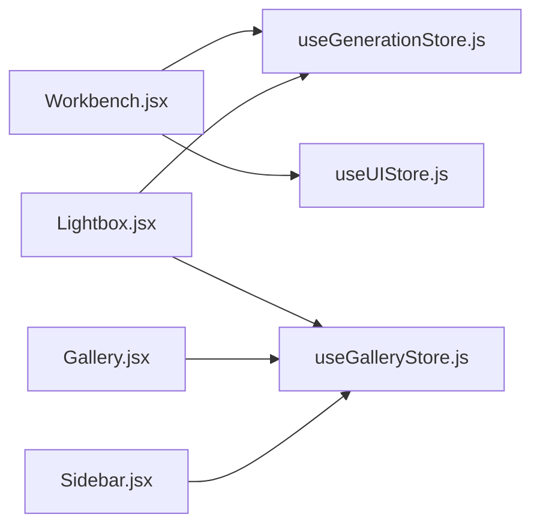

# 参考图片管理

<cite>
**本文引用的文件**   
- [Workbench.jsx](file://app/src/pages/Workbench.jsx)
- [useGenerationStore.js](file://app/src/stores/useGenerationStore.js)
- [Lightbox.jsx](file://app/src/components/Lightbox.jsx)
- [App.jsx](file://app/src/App.jsx)
- [Gallery.jsx](file://app/src/pages/Gallery.jsx)
- [Sidebar.jsx](file://app/src/components/Sidebar.jsx)
- [useGalleryStore.js](file://app/src/stores/useGalleryStore.js)
</cite>

## 目录
1. [简介](#简介)
2. [项目结构](#项目结构)
3. [核心组件](#核心组件)
4. [架构总览](#架构总览)
5. [详细组件分析](#详细组件分析)
6. [依赖关系分析](#依赖关系分析)
7. [性能与体验优化建议](#性能与体验优化建议)
8. [故障排查指南](#故障排查指南)
9. [结论](#结论)
10. [附录：最佳实践与注意事项](#附录最佳实践与注意事项)

## 简介
本文件围绕“参考图片管理”功能，系统梳理并说明以下能力：
- 多种添加方式：本地文件选择、拖拽上传、从生成结果复用
- 角色标注体系：通用、风格参考、构图参考、色彩参考、主体参考
- 批量管理与操作：多选、移动、删除、收藏等
- 交互细节：预览、放大查看、快速设为参考图、提示词复制、局部重绘入口等
- 数据流与状态：工作区与图库的状态联动、持久化策略

## 项目结构
参考图片管理涉及工作区（Workbench）、全局灯箱（Lightbox）、图库（Gallery）与侧边栏（Sidebar），以及两个核心状态仓库（useGenerationStore、useGalleryStore）。

图表来源
- [Workbench.jsx:640-812](file://app/src/pages/Workbench.jsx#L640-L812)
- [useGenerationStore.js:59-97](file://app/src/stores/useGenerationStore.js#L59-L97)
- [Lightbox.jsx:87-92](file://app/src/components/Lightbox.jsx#L87-L92)
- [App.jsx:199-239](file://app/src/App.jsx#L199-L239)
- [Gallery.jsx:147-228](file://app/src/pages/Gallery.jsx#L147-L228)
- [Sidebar.jsx:236-244](file://app/src/components/Sidebar.jsx#L236-L244)
- [useGalleryStore.js:101-123](file://app/src/stores/useGalleryStore.js#L101-L123)

章节来源
- [Workbench.jsx:640-812](file://app/src/pages/Workbench.jsx#L640-L812)
- [useGenerationStore.js:59-97](file://app/src/stores/useGenerationStore.js#L59-L97)
- [Lightbox.jsx:87-92](file://app/src/components/Lightbox.jsx#L87-L92)
- [App.jsx:199-239](file://app/src/App.jsx#L199-L239)
- [Gallery.jsx:147-228](file://app/src/pages/Gallery.jsx#L147-L228)
- [Sidebar.jsx:236-244](file://app/src/components/Sidebar.jsx#L236-L244)
- [useGalleryStore.js:101-123](file://app/src/stores/useGalleryStore.js#L101-L123)

## 核心组件
- 工作区（Workbench）
  - 提供参考图区域，支持点击上传、拖拽上传、从结果复用为参考图
  - 展示参考图数量上限与模型限制提示
  - 提供角色下拉菜单，切换参考图角色
- 全局灯箱（Lightbox）
  - 大图预览、缩放、复制提示词、下载、设为参考图、局部重绘、移动到文件夹、加入知识库
- 图库（Gallery）
  - 导入图片（JPG/PNG/WebP）、批量导出、选中后移动至文件夹
- 侧边栏（Sidebar）
  - 文件夹树、拖拽移动图片到文件夹
- 状态仓库
  - useGenerationStore：维护当前模型的参考图列表、增删改角色、提交生成任务
  - useGalleryStore：维护图库图片、文件夹、搜索筛选、批量操作

章节来源
- [Workbench.jsx:197-230](file://app/src/pages/Workbench.jsx#L197-L230)
- [Workbench.jsx:640-812](file://app/src/pages/Workbench.jsx#L640-L812)
- [Lightbox.jsx:87-92](file://app/src/components/Lightbox.jsx#L87-L92)
- [Gallery.jsx:147-228](file://app/src/pages/Gallery.jsx#L147-L228)
- [Sidebar.jsx:236-244](file://app/src/components/Sidebar.jsx#L236-L244)
- [useGenerationStore.js:59-97](file://app/src/stores/useGenerationStore.js#L59-L97)
- [useGalleryStore.js:101-123](file://app/src/stores/useGalleryStore.js#L101-L123)

## 架构总览
参考图在“工作区”中创建与管理，通过状态仓库集中存储；在“灯箱”中可便捷复用为参考图；图库与侧边栏负责素材的导入与组织。

图表来源
- [Workbench.jsx:197-230](file://app/src/pages/Workbench.jsx#L197-L230)
- [useGenerationStore.js:59-97](file://app/src/stores/useGenerationStore.js#L59-L97)
- [Lightbox.jsx:87-92](file://app/src/components/Lightbox.jsx#L87-L92)
- [Gallery.jsx:147-228](file://app/src/pages/Gallery.jsx#L147-L228)
- [Sidebar.jsx:236-244](file://app/src/components/Sidebar.jsx#L236-L244)
- [useGalleryStore.js:101-123](file://app/src/stores/useGalleryStore.js#L101-L123)

## 详细组件分析

### 参考图添加方式与实现细节
- 文件选择上传
  - 触发：点击占位卡片或隐藏 input[type=file]
  - 处理：过滤非图片类型，逐个调用 addReferenceImage
  - 反馈：超出模型上限时显示警告提示
- 拖拽上传
  - 触发：在参考图容器或空槽位上 onDrop
  - 处理：读取 dataTransfer.files，统一走 handleRefUpload
- 从结果复用
  - 触发：灯箱内“设为参考”按钮或工作区结果项“使用为参考”
  - 处理：以 url 形式新增参考图，默认角色为“通用”

图表来源
- [Workbench.jsx:197-230](file://app/src/pages/Workbench.jsx#L197-L230)
- [Workbench.jsx:640-812](file://app/src/pages/Workbench.jsx#L640-L812)
- [Lightbox.jsx:87-92](file://app/src/components/Lightbox.jsx#L87-L92)
- [useGenerationStore.js:59-76](file://app/src/stores/useGenerationStore.js#L59-L76)

章节来源
- [Workbench.jsx:197-230](file://app/src/pages/Workbench.jsx#L197-L230)
- [Workbench.jsx:640-812](file://app/src/pages/Workbench.jsx#L640-L812)
- [Lightbox.jsx:87-92](file://app/src/components/Lightbox.jsx#L87-L92)
- [useGenerationStore.js:59-76](file://app/src/stores/useGenerationStore.js#L59-L76)

### 角色标注系统
- 角色定义
  - 通用：默认角色，灰色标识
  - 风格参考：紫色标识，用于传递整体画风
  - 构图参考：蓝色标识，强调画面结构与布局
  - 色彩参考：橙色标识，侧重色调与配色
  - 主体参考：绿色标识，聚焦主体形态与特征
- 视觉呈现
  - 每张参考图底部有带颜色的标签条，显示当前角色
  - 点击标签弹出下拉菜单，选择新角色后即时生效
- 数据结构
  - 每个参考图对象包含 id、url、name、blob、role 字段
  - 角色变更通过 setReferenceImageRole 更新

图表来源
- [useGenerationStore.js:27-27](file://app/src/stores/useGenerationStore.js#L27-L27)
- [useGenerationStore.js:59-97](file://app/src/stores/useGenerationStore.js#L59-L97)
- [Workbench.jsx:250-256](file://app/src/pages/Workbench.jsx#L250-L256)

章节来源
- [Workbench.jsx:250-256](file://app/src/pages/Workbench.jsx#L250-L256)
- [useGenerationStore.js:59-97](file://app/src/stores/useGenerationStore.js#L59-L97)

### 批量管理与操作
- 图库批量导入
  - 支持 JPG/PNG/WebP，失败会给出错误提示
  - 导入成功后刷新列表并提示成功数量
- 批量导出
  - 对选中图片逐一下载，间隔避免浏览器拦截
- 批量移动
  - 侧边栏支持将选中的图片拖入目标文件夹
  - 通过 moveImages 接口执行，完成后清空选择并刷新

图表来源
- [Gallery.jsx:147-228](file://app/src/pages/Gallery.jsx#L147-L228)
- [Gallery.jsx:231-255](file://app/src/pages/Gallery.jsx#L231-L255)
- [Sidebar.jsx:236-244](file://app/src/components/Sidebar.jsx#L236-L244)
- [useGalleryStore.js:101-123](file://app/src/stores/useGalleryStore.js#L101-L123)

章节来源
- [Gallery.jsx:147-228](file://app/src/pages/Gallery.jsx#L147-L228)
- [Gallery.jsx:231-255](file://app/src/pages/Gallery.jsx#L231-L255)
- [Sidebar.jsx:236-244](file://app/src/components/Sidebar.jsx#L236-L244)
- [useGalleryStore.js:101-123](file://app/src/stores/useGalleryStore.js#L101-L123)

### 灯箱与参考图复用
- 打开灯箱：点击任意图片进入大图预览
- 快捷操作：复制提示词、下载、收藏、淘汰、重新生成、设为参考、局部重绘、移动到文件夹、加入知识库
- 键盘导航：Esc 关闭，左右箭头切换图片

图表来源
- [Lightbox.jsx:87-92](file://app/src/components/Lightbox.jsx#L87-L92)
- [Lightbox.jsx:127-139](file://app/src/components/Lightbox.jsx#L127-L139)
- [useGenerationStore.js:59-76](file://app/src/stores/useGenerationStore.js#L59-L76)

章节来源
- [Lightbox.jsx:87-92](file://app/src/components/Lightbox.jsx#L87-L92)
- [Lightbox.jsx:127-139](file://app/src/components/Lightbox.jsx#L127-L139)
- [useGenerationStore.js:59-76](file://app/src/stores/useGenerationStore.js#L59-L76)

## 依赖关系分析
- 工作区依赖生成状态仓库进行参考图的增删改，同时依赖 UI 状态打开灯箱
- 灯箱依赖生成状态与图库状态，以便在不同数据源中查找图片并执行操作
- 图库与侧边栏共同维护图库状态，实现导入、导出、移动等批量操作

图表来源
- [Workbench.jsx:64-92](file://app/src/pages/Workbench.jsx#L64-L92)
- [Lightbox.jsx:19-25](file://app/src/components/Lightbox.jsx#L19-L25)
- [Gallery.jsx:147-228](file://app/src/pages/Gallery.jsx#L147-L228)
- [Sidebar.jsx:159-178](file://app/src/components/Sidebar.jsx#L159-L178)
- [useGalleryStore.js:101-123](file://app/src/stores/useGalleryStore.js#L101-L123)

章节来源
- [Workbench.jsx:64-92](file://app/src/pages/Workbench.jsx#L64-L92)
- [Lightbox.jsx:19-25](file://app/src/components/Lightbox.jsx#L19-L25)
- [Gallery.jsx:147-228](file://app/src/pages/Gallery.jsx#L147-L228)
- [Sidebar.jsx:159-178](file://app/src/components/Sidebar.jsx#L159-L178)
- [useGalleryStore.js:101-123](file://app/src/stores/useGalleryStore.js#L101-L123)

## 性能与体验优化建议
- 大文件处理
  - 参考图上传建议使用 URL.createObjectURL 快速预览，必要时在后台压缩或转缩略图
  - 批量导出采用节流策略，避免浏览器一次性拦截大量下载
- 渲染性能
  - 参考图网格在数量较多时自动切换为横向滚动，减少重排
  - 灯箱缩放使用 transform，避免频繁重绘
- 用户体验
  - 明确提示模型支持的参考图上限，并在超限时阻止继续添加
  - 角色标签颜色对比度良好，便于快速识别不同用途

[本节为通用建议，不直接分析具体文件]

## 故障排查指南
- 无法添加参考图
  - 检查是否超过模型上限，查看工作区顶部警告提示
  - 确认文件类型是否为图片格式
- 灯箱无法打开或图片未加载
  - 确认 App 层是否正确解析图片 ID 并从 results 或 images 列表中定位
- 批量导出失败
  - 检查 StorageService 是否能获取对应图片 Blob
  - 关注浏览器安全策略导致的下载拦截
- 移动图片失败
  - 检查文件夹是否存在、权限是否足够
  - 查看 moveImages 返回的错误信息

章节来源
- [Workbench.jsx:145-151](file://app/src/pages/Workbench.jsx#L145-L151)
- [App.jsx:214-228](file://app/src/App.jsx#L214-L228)
- [Lightbox.jsx:59-69](file://app/src/components/Lightbox.jsx#L59-L69)
- [Sidebar.jsx:236-244](file://app/src/components/Sidebar.jsx#L236-L244)

## 结论
参考图片管理在工作区、灯箱与图库之间形成闭环：工作区负责采集与标注，灯箱提供便捷复用与编辑入口，图库与侧边栏承担素材的组织与批量操作。通过清晰的角色系统与严格的模型上限控制，既保证了灵活性，也提升了可控性与稳定性。

[本节为总结性内容，不直接分析具体文件]

## 附录：最佳实践与注意事项
- 添加方式
  - 优先使用拖拽上传提升效率；大批量导入建议在图库页面进行
  - 从结果复用参考图时，尽量保持原图清晰度，以获得更好的参考效果
- 角色标注
  - 风格参考适合传递整体画风与笔触
  - 构图参考适合强调画面结构与空间关系
  - 色彩参考适合限定主色调与明暗对比
  - 主体参考适合约束主体形态与细节
  - 通用角色作为兜底，适用于无特定倾向的场景
- 批量管理
  - 利用文件夹分类管理素材，结合搜索与筛选提高检索效率
  - 批量导出前确认网络与磁盘空间，避免中断
- 注意事项
  - 注意模型对参考图数量的限制，超限会被忽略
  - 部分操作（如移动、删除）不可逆，请谨慎执行
  - 灯箱中“局部重绘”需要图片资源可用，冷存储路径需正确解析

[本节为通用指导，不直接分析具体文件]