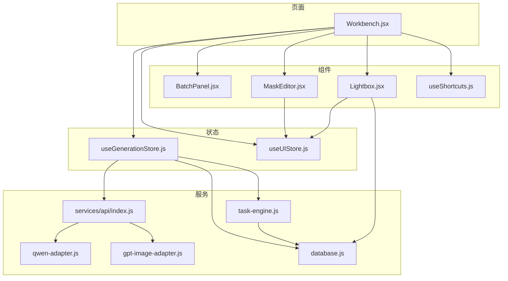
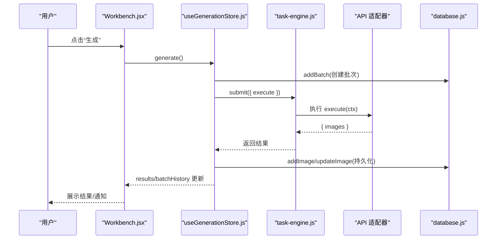
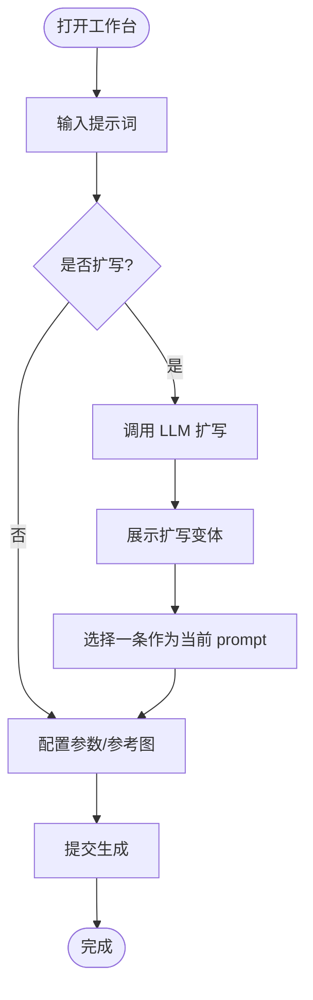
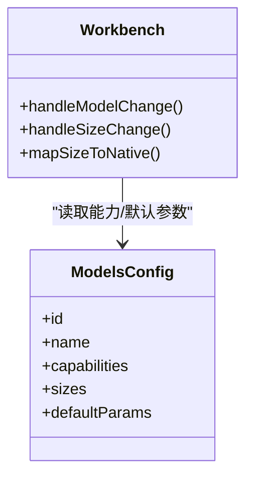
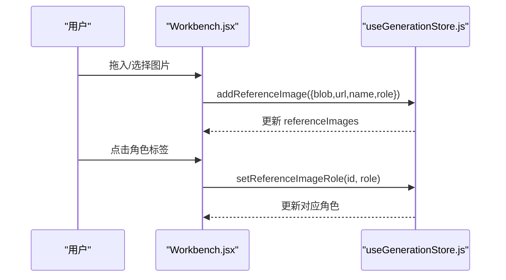
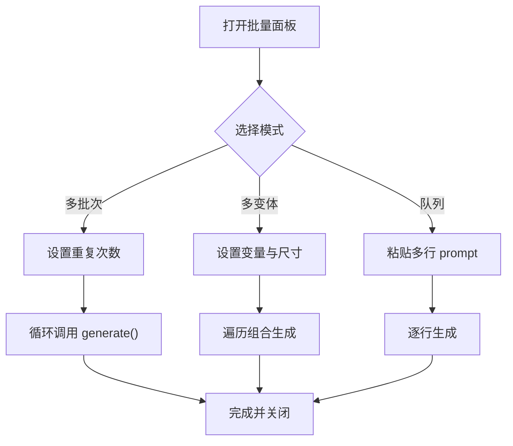
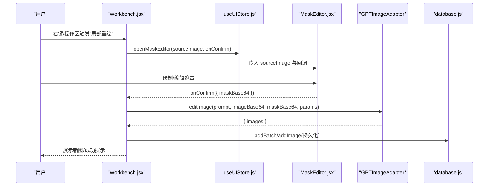
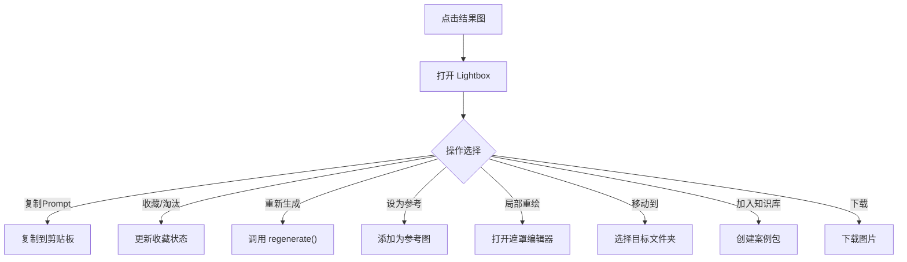
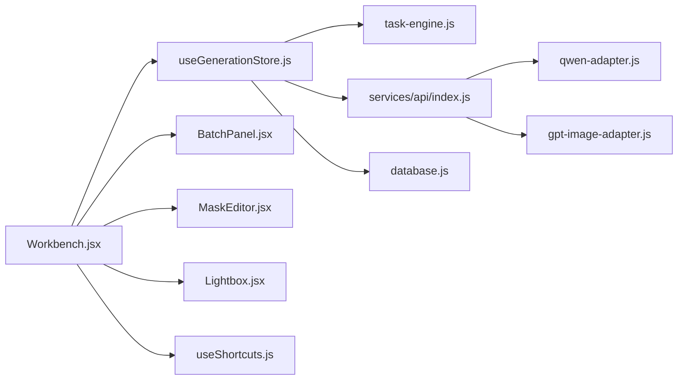

# 图像生成工作台

<cite>
**本文引用的文件**   
- [Workbench.jsx](file://app/src/pages/Workbench.jsx)
- [BatchPanel.jsx](file://app/src/components/BatchPanel.jsx)
- [MaskEditor.jsx](file://app/src/components/MaskEditor.jsx)
- [Lightbox.jsx](file://app/src/components/Lightbox.jsx)
- [useGenerationStore.js](file://app/src/stores/useGenerationStore.js)
- [useUIStore.js](file://app/src/stores/useUIStore.js)
- [useShortcuts.js](file://app/src/hooks/useShortcuts.js)
- [models.js](file://app/src/constants/models.js)
- [task-engine.js](file://app/src/services/task-engine.js)
- [api/index.js](file://app/src/services/api/index.js)
- [qwen-adapter.js](file://app/src/services/api/qwen-adapter.js)
- [gpt-image-adapter.js](file://app/src/services/api/gpt-image-adapter.js)
- [database.js](file://app/src/db/database.js)
</cite>

## 目录
1. [简介](#简介)
2. [项目结构](#项目结构)
3. [核心组件](#核心组件)
4. [架构总览](#架构总览)
5. [详细组件分析](#详细组件分析)
6. [依赖关系分析](#依赖关系分析)
7. [性能与体验优化](#性能与体验优化)
8. [故障排查指南](#故障排查指南)
9. [结论](#结论)
10. [附录：快捷键与最佳实践](#附录快捷键与最佳实践)

## 简介
本文件面向“图像生成工作台”功能，系统性梳理提示词编辑器、模型选择器、参考图片管理、生成参数配置、结果展示等核心组件，并深入说明用户操作流程（包括提示词输入与扩写、多模型切换、参考图上传与角色标注、批量生成设置、局部重绘等）。文档同时解释状态管理与数据流转路径，提供使用示例与最佳实践，覆盖键盘快捷键支持、错误处理与性能优化建议。

## 项目结构
工作台的主体页面位于 pages/Workbench.jsx，围绕它组织以下关键模块：
- 状态层：Zustand store（生成状态、UI 状态）
- 服务层：任务调度引擎、API 适配器（Qwen/GPT/NanoBanana）、数据库持久化
- 组件层：批量面板、遮罩编辑器、灯箱查看器、快捷方式系统

图表来源
- [Workbench.jsx:1-120](file://app/src/pages/Workbench.jsx#L1-L120)
- [useGenerationStore.js:1-60](file://app/src/stores/useGenerationStore.js#L1-L60)
- [useUIStore.js:1-60](file://app/src/stores/useUIStore.js#L1-L60)
- [task-engine.js:1-60](file://app/src/services/task-engine.js#L1-L60)
- [api/index.js:1-39](file://app/src/services/api/index.js#L1-L39)
- [qwen-adapter.js:1-60](file://app/src/services/api/qwen-adapter.js#L1-L60)
- [gpt-image-adapter.js:1-60](file://app/src/services/api/gpt-image-adapter.js#L1-L60)
- [database.js:1-40](file://app/src/db/database.js#L1-L40)

章节来源
- [Workbench.jsx:1-120](file://app/src/pages/Workbench.jsx#L1-L120)
- [models.js:1-106](file://app/src/constants/models.js#L1-L106)

## 核心组件
- 提示词编辑器：支持文本输入、长度统计、AI 扩写助手、扩写历史选择
- 模型选择器：基于常量配置的模型标签页，动态适配能力与默认参数
- 参考图片管理：拖拽/点击上传、数量限制、角色标注（通用/风格/构图/色彩/主体）
- 生成参数配置：尺寸预设、质量等级、种子、批量数量、模型专属开关
- 结果展示：网格预览、收藏/淘汰/复制 Prompt/下载/重新生成/设为参考/局部重绘/加入知识库
- 批量生成：多批次、多变体、Prompt 队列三种模式
- 遮罩编辑器：双画布绘制掩码、撤销/重做、对比原图、导出黑白掩码
- 全局快捷键：按作用域启停，统一入口维护

章节来源
- [Workbench.jsx:503-800](file://app/src/pages/Workbench.jsx#L503-L800)
- [BatchPanel.jsx:1-120](file://app/src/components/BatchPanel.jsx#L1-L120)
- [MaskEditor.jsx:1-120](file://app/src/components/MaskEditor.jsx#L1-L120)
- [Lightbox.jsx:1-120](file://app/src/components/Lightbox.jsx#L1-L120)
- [useGenerationStore.js:1-120](file://app/src/stores/useGenerationStore.js#L1-L120)
- [useShortcuts.js:1-120](file://app/src/hooks/useShortcuts.js#L1-L120)

## 架构总览
工作台采用“页面 + Store + 服务 + 组件”的分层架构：
- 页面负责 UI 编排与交互事件
- Store 集中管理业务状态与异步流程
- 服务层封装外部调用（任务调度、API 适配、本地存储）
- 组件聚焦可复用交互（批量面板、遮罩编辑器、灯箱）

图表来源
- [useGenerationStore.js:112-290](file://app/src/stores/useGenerationStore.js#L112-L290)
- [task-engine.js:57-120](file://app/src/services/task-engine.js#L57-L120)
- [qwen-adapter.js:60-105](file://app/src/services/api/qwen-adapter.js#L60-L105)
- [gpt-image-adapter.js:252-272](file://app/src/services/api/gpt-image-adapter.js#L252-L272)
- [database.js:43-90](file://app/src/db/database.js#L43-L90)

## 详细组件分析

### 提示词编辑器与扩写
- 输入与计数：实时显示字符数与 token 估算；超长提示词给出质量风险提示
- AI 扩写：调用 LLM 适配器生成多个变体，支持一键选用
- 链式提示：展示“原始 prompt → 主动扩写 → prompt_extend”的链路标识

图表来源
- [Workbench.jsx:523-638](file://app/src/pages/Workbench.jsx#L523-L638)
- [useGenerationStore.js:295-313](file://app/src/stores/useGenerationStore.js#L295-L313)
- [api/index.js:33-39](file://app/src/services/api/index.js#L33-L39)

章节来源
- [Workbench.jsx:523-638](file://app/src/pages/Workbench.jsx#L523-L638)
- [useGenerationStore.js:295-313](file://app/src/stores/useGenerationStore.js#L295-L313)

### 模型选择器与参数映射
- 模型能力由常量定义，包含最大参考图数量、数量范围、是否支持 inpainting、prompt 扩写、质量等级等
- UI 根据当前模型动态调整可用参数（如固定数量、尺寸预设、分辨率选项）
- 尺寸映射函数将比例预设转换为各模型原生尺寸字符串

图表来源
- [models.js:8-92](file://app/src/constants/models.js#L8-L92)
- [Workbench.jsx:22-58](file://app/src/pages/Workbench.jsx#L22-L58)
- [Workbench.jsx:138-162](file://app/src/pages/Workbench.jsx#L138-L162)

章节来源
- [models.js:8-92](file://app/src/constants/models.js#L8-L92)
- [Workbench.jsx:22-58](file://app/src/pages/Workbench.jsx#L22-L58)
- [Workbench.jsx:138-162](file://app/src/pages/Workbench.jsx#L138-L162)

### 参考图片管理与角色标注
- 上传：支持拖放与点击选择，自动校验类型
- 数量限制：依据模型 maxRefs 限制，超出时给出警告
- 角色标注：为每张参考图设置角色（通用/风格/构图/色彩/主体），通过下拉菜单切换
- 生命周期：移除时清理引用 URL，避免内存泄漏

图表来源
- [Workbench.jsx:197-210](file://app/src/pages/Workbench.jsx#L197-L210)
- [Workbench.jsx:640-780](file://app/src/pages/Workbench.jsx#L640-L780)
- [useGenerationStore.js:60-97](file://app/src/stores/useGenerationStore.js#L60-L97)

章节来源
- [Workbench.jsx:197-210](file://app/src/pages/Workbench.jsx#L197-L210)
- [Workbench.jsx:640-780](file://app/src/pages/Workbench.jsx#L640-L780)
- [useGenerationStore.js:60-97](file://app/src/stores/useGenerationStore.js#L60-L97)

### 批量生成设置
- 多批次：同一 prompt 重复 N 批，每批固定张数
- 多变体：对 prompt 中的变量与尺寸进行排列组合批量生成
- Prompt 队列：逐行输入不同 prompt，依次生成

图表来源
- [BatchPanel.jsx:48-101](file://app/src/components/BatchPanel.jsx#L48-L101)
- [BatchPanel.jsx:200-339](file://app/src/components/BatchPanel.jsx#L200-L339)
- [BatchPanel.jsx:341-564](file://app/src/components/BatchPanel.jsx#L341-L564)
- [BatchPanel.jsx:566-668](file://app/src/components/BatchPanel.jsx#L566-L668)

章节来源
- [BatchPanel.jsx:1-120](file://app/src/components/BatchPanel.jsx#L1-L120)
- [BatchPanel.jsx:48-101](file://app/src/components/BatchPanel.jsx#L48-L101)

### 局部重绘（遮罩编辑器）
- 双画布架构：背景画布仅重绘缩放/平移，遮罩画布叠加半透明红色区域
- 工具：画笔/橡皮擦、全选/清除/反转、撤销/重做、上传外部 Mask
- 交互：滚轮缩放、空格键对比原图、鼠标中键或按住空格平移
- 输出：将遮罩转为黑白 PNG（白色=需重绘区域），以 base64 回传

图表来源
- [Workbench.jsx:345-429](file://app/src/pages/Workbench.jsx#L345-L429)
- [useUIStore.js:135-143](file://app/src/stores/useUIStore.js#L135-L143)
- [MaskEditor.jsx:348-360](file://app/src/components/MaskEditor.jsx#L348-L360)
- [gpt-image-adapter.js:316-334](file://app/src/services/api/gpt-image-adapter.js#L316-L334)
- [database.js:144-171](file://app/src/db/database.js#L144-L171)

章节来源
- [MaskEditor.jsx:1-120](file://app/src/components/MaskEditor.jsx#L1-L120)
- [MaskEditor.jsx:348-360](file://app/src/components/MaskEditor.jsx#L348-L360)
- [Workbench.jsx:345-429](file://app/src/pages/Workbench.jsx#L345-L429)

### 结果展示与操作
- 灯箱查看：上一张/下一张、放大缩小、复制 Prompt、收藏/淘汰、重新生成、设为参考、移动到文件夹、加入知识库、下载
- 快捷操作：在 Lightbox 内直接触发局部重绘（仅支持支持该能力的模型）

图表来源
- [Lightbox.jsx:101-165](file://app/src/components/Lightbox.jsx#L101-L165)
- [Lightbox.jsx:502-554](file://app/src/components/Lightbox.jsx#L502-L554)
- [useGenerationStore.js:316-344](file://app/src/stores/useGenerationStore.js#L316-L344)

章节来源
- [Lightbox.jsx:1-120](file://app/src/components/Lightbox.jsx#L1-L120)
- [Lightbox.jsx:101-165](file://app/src/components/Lightbox.jsx#L101-L165)

## 依赖关系分析
- 页面与工作流
  - Workbench 订阅 useGenerationStore 与 useUIStore，驱动 UI 与业务流程
  - 批量面板与遮罩编辑器通过 UI Store 控制显隐与回调
- 生成流程
  - useGenerationStore.generate 创建批次、提交 TaskEngine、调用模型适配器、持久化结果
  - TaskEngine 负责并发控制、重试、进度上报、状态机转换
- 适配器
  - QwenAdapter：同步长耗时请求，带超时与错误解析
  - GPTImageAdapter：异步任务提交+指数退避轮询，支持图像编辑（含遮罩）
- 数据持久化
  - database.js 基于 Dexie 管理 images/batches/tasks 等表，提供增删改查与索引

图表来源
- [useGenerationStore.js:112-290](file://app/src/stores/useGenerationStore.js#L112-L290)
- [task-engine.js:57-120](file://app/src/services/task-engine.js#L57-L120)
- [api/index.js:20-31](file://app/src/services/api/index.js#L20-L31)
- [qwen-adapter.js:60-105](file://app/src/services/api/qwen-adapter.js#L60-L105)
- [gpt-image-adapter.js:252-272](file://app/src/services/api/gpt-image-adapter.js#L252-L272)
- [database.js:43-90](file://app/src/db/database.js#L43-L90)

章节来源
- [useGenerationStore.js:112-290](file://app/src/stores/useGenerationStore.js#L112-L290)
- [task-engine.js:57-120](file://app/src/services/task-engine.js#L57-L120)
- [api/index.js:20-31](file://app/src/services/api/index.js#L20-L31)

## 性能与体验优化
- 任务并发与重试
  - TaskEngine 默认最大并发 3，失败自动指数退避重试（最多 3 次），网络/5xx 错误可重试
  - 建议在高负载场景下调低并发，避免后端限流
- 长耗时请求
  - Qwen 同步接口设置较长超时（约 5 分钟），适配器内部分阶段上报进度
  - GPT 异步接口采用指数退避轮询，上限 5 分钟，支持取消信号
- 遮罩编辑器性能
  - 采样计算遮罩百分比（每隔若干像素采样），降低全量像素扫描开销
  - 双画布分离，背景仅在缩放/平移时重绘
- 前端渲染
  - 结果列表按需加载，大图使用懒加载与缩略图策略（结合 StorageService 冷热分区）
- 用户体验
  - Toast 提示自动消失，避免阻塞
  - 快捷键按作用域启用，减少误触

[本节为通用指导，不直接分析具体文件]

## 故障排查指南
- 生成失败
  - 检查浏览器控制台日志（适配器会打印请求/响应结构与错误详情）
  - 确认模型能力与参数匹配（例如某些模型不支持 seed 或 inpainting）
  - 若出现网络错误或 5xx，TaskEngine 会自动重试；多次失败后查看错误消息
- 遮罩无效
  - 确认遮罩非空（底部显示已选区域百分比）
  - 仅 GPT-image-2 支持局部重绘，其他模型不可用
- 图片无法下载
  - 检查 StorageService 是否返回 blob，冷区图片可能需要先拉取 OSS 地址
- 任务中断
  - 使用 TaskEngine.cancel 或 AbortSignal 中止正在运行的任务

章节来源
- [qwen-adapter.js:100-105](file://app/src/services/api/qwen-adapter.js#L100-L105)
- [gpt-image-adapter.js:183-190](file://app/src/services/api/gpt-image-adapter.js#L183-L190)
- [task-engine.js:259-296](file://app/src/services/task-engine.js#L259-L296)
- [Lightbox.jsx:59-69](file://app/src/components/Lightbox.jsx#L59-L69)

## 结论
图像生成工作台通过清晰的层次化架构与统一的 Store 管理，实现了从提示词到结果的完整闭环。借助任务引擎与多模型适配器，系统具备良好的扩展性与稳定性；遮罩编辑器与批量面板进一步提升了创作效率。配合快捷键与完善的错误处理，整体体验流畅且专业。

[本节为总结性内容，不直接分析具体文件]

## 附录：快捷键与最佳实践

### 快捷键速览
- 全局
  - Shift+/：打开/关闭快捷键面板
  - Esc：关闭浮层/Lightbox
  - G > W / G > G / G > K / G > T：快速导航至工作台/图库/知识库/任务中心
- 工作台
  - ⌘/Ctrl + Enter：生成图片
  - E：扩写提示词
  - 1 / 2 / 3：切换模型（Qwen Image 3 / GPT Image 2 / Nano Banana 2）
- Lightbox
  - ← / →：上一张/下一张
  - F：收藏/取消收藏
  - D：下载
  - C：复制 Prompt
  - Esc：关闭
- 遮罩编辑器
  - B：画笔
  - E：橡皮擦
  - [ / ]：减小/增大笔刷
  - Ctrl+Z：撤销
  - Ctrl+Shift+Z：重做
  - Space：对比原图
  - 滚轮：缩放

章节来源
- [useShortcuts.js:52-110](file://app/src/hooks/useShortcuts.js#L52-L110)
- [useShortcuts.js:139-184](file://app/src/hooks/useShortcuts.js#L139-L184)
- [MaskEditor.jsx:397-429](file://app/src/components/MaskEditor.jsx#L397-L429)

### 使用示例与最佳实践
- 提示词工程
  - 先用简短描述，再使用扩写助手丰富细节；必要时开启 prompt_extend 提升质量
  - 注意提示词长度，过长可能影响生成质量
- 模型选择
  - 需要局部重绘：选择 GPT-image-2
  - 需要多参考图：Nano Banana 2 支持较多参考图
  - 需要内置扩写：Qwen Image 3 支持 prompt_extend
- 参考图管理
  - 合理标注角色（风格/构图/色彩/主体），有助于模型理解意图
  - 遵循模型最大参考图数量限制，避免被忽略
- 批量生成
  - 多变体适合探索风格与尺寸组合；队列模式适合流水线式产出
  - 控制并发与批次规模，避免后端限流
- 局部重绘
  - 精准涂抹需重绘区域，尽量保持边缘清晰；利用反转/全选提高效率
  - 完成后及时保存与归档，便于后续迭代
- 结果管理
  - 善用收藏与文件夹分类；加入知识库沉淀优质案例
  - 下载前确认清晰度与版权要求

[本节为通用指导，不直接分析具体文件]