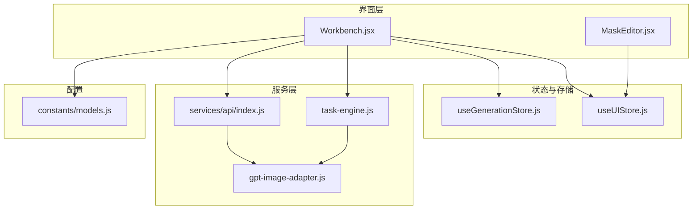
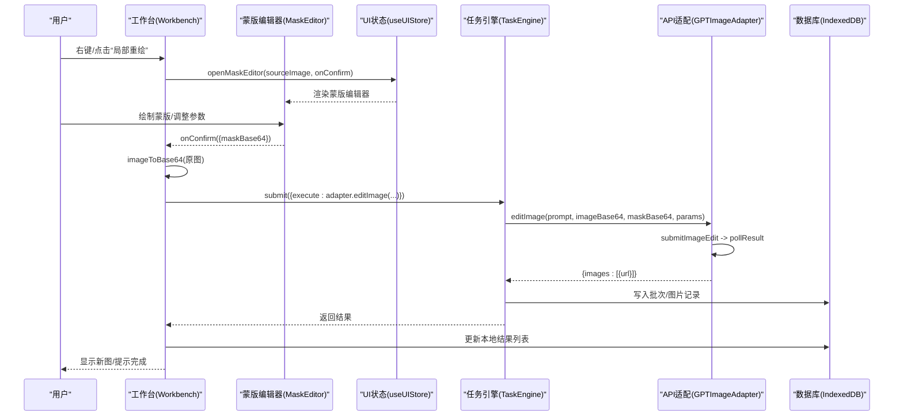
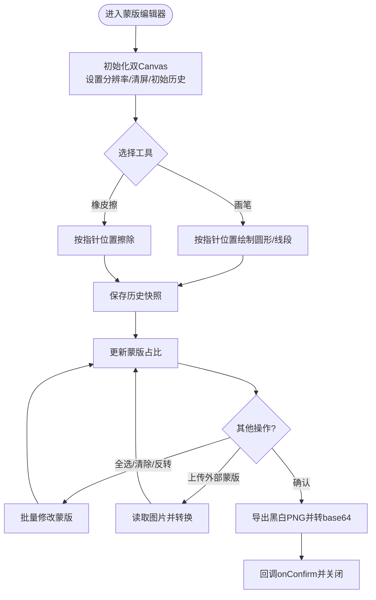
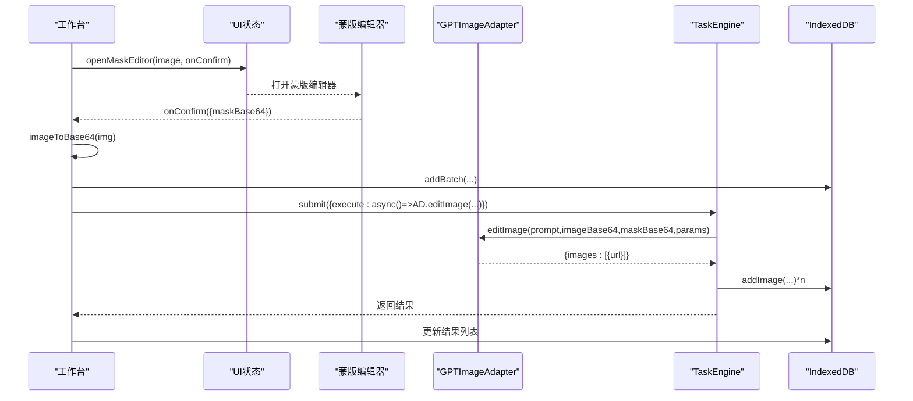
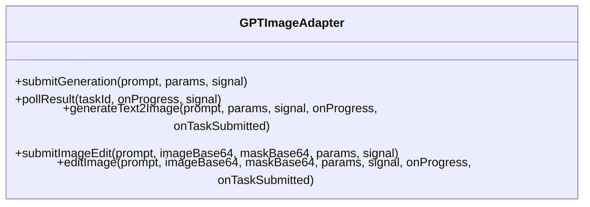
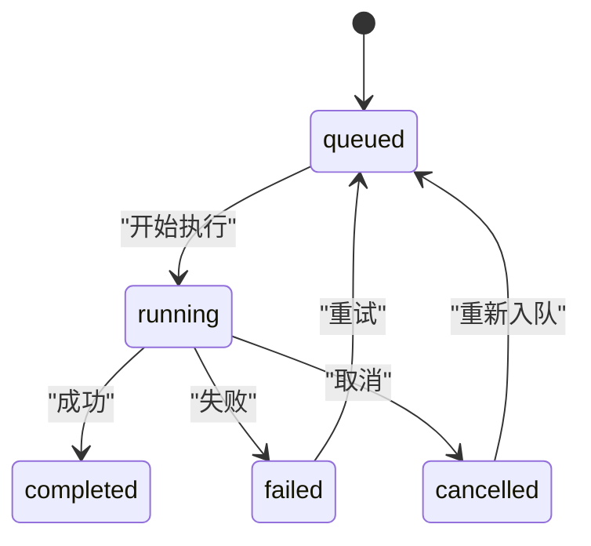
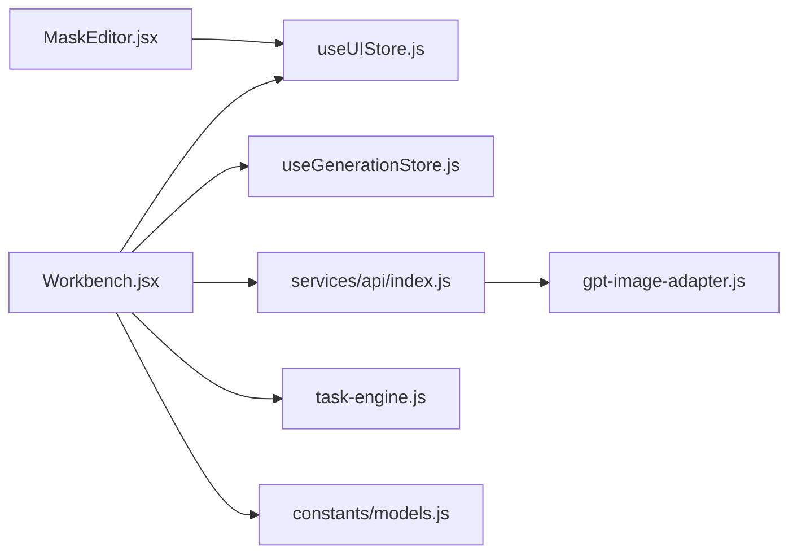

# 局部重绘编辑器

<cite>
**本文引用的文件**   
- [MaskEditor.jsx](file://app/src/components/MaskEditor.jsx)
- [Workbench.jsx](file://app/src/pages/Workbench.jsx)
- [useGenerationStore.js](file://app/src/stores/useGenerationStore.js)
- [useUIStore.js](file://app/src/stores/useUIStore.js)
- [gpt-image-adapter.js](file://app/src/services/api/gpt-image-adapter.js)
- [api/index.js](file://app/src/services/api/index.js)
- [models.js](file://app/src/constants/models.js)
- [task-engine.js](file://app/src/services/task-engine.js)
</cite>

## 目录
1. [简介](#简介)
2. [项目结构](#项目结构)
3. [核心组件](#核心组件)
4. [架构总览](#架构总览)
5. [详细组件分析](#详细组件分析)
6. [依赖关系分析](#依赖关系分析)
7. [性能与体验优化](#性能与体验优化)
8. [蒙版绘制技巧与最佳实践](#蒙版绘制技巧与最佳实践)
9. [常见问题排查](#常见问题排查)
10. [结论](#结论)

## 简介
本文件面向“局部重绘”功能，系统性梳理蒙版编辑器的交互逻辑、技术实现与调用流程。重点覆盖：
- 蒙版绘制工具（画笔、橡皮擦）、区域选择（全选、反转、上传外部蒙版）
- 重绘参数配置（尺寸、质量、数量等）
- 原图提取、蒙版处理、API 调用流程
- 快捷键与对比预览
- 错误处理与重试机制
- 使用技巧与常见问题解决方案

## 项目结构
局部重绘相关代码主要分布在以下模块：
- 蒙版编辑器 UI：基于双 Canvas 的蒙版绘制与导出
- 工作台页面：触发蒙版编辑器、组装请求参数、提交任务
- 生成状态管理：统一的状态与持久化
- API 适配层：封装 GPT-image-2 的异步提交与轮询
- 任务引擎：并发控制、进度上报、失败重试
- 模型能力常量：声明是否支持蒙版重绘

图表来源
- [Workbench.jsx:1-120](file://app/src/pages/Workbench.jsx#L1-L120)
- [MaskEditor.jsx:1-120](file://app/src/components/MaskEditor.jsx#L1-L120)
- [useUIStore.js:1-159](file://app/src/stores/useUIStore.js#L1-L159)
- [useGenerationStore.js:1-120](file://app/src/stores/useGenerationStore.js#L1-L120)
- [task-engine.js:1-120](file://app/src/services/task-engine.js#L1-L120)
- [api/index.js:1-39](file://app/src/services/api/index.js#L1-L39)
- [gpt-image-adapter.js:1-120](file://app/src/services/api/gpt-image-adapter.js#L1-L120)
- [models.js:1-106](file://app/src/constants/models.js#L1-L106)

章节来源
- [Workbench.jsx:1-120](file://app/src/pages/Workbench.jsx#L1-L120)
- [MaskEditor.jsx:1-120](file://app/src/components/MaskEditor.jsx#L1-L120)
- [useUIStore.js:1-159](file://app/src/stores/useUIStore.js#L1-L159)
- [useGenerationStore.js:1-120](file://app/src/stores/useGenerationStore.js#L1-L120)
- [task-engine.js:1-120](file://app/src/services/task-engine.js#L1-L120)
- [api/index.js:1-39](file://app/src/services/api/index.js#L1-L39)
- [gpt-image-adapter.js:1-120](file://app/src/services/api/gpt-image-adapter.js#L1-L120)
- [models.js:1-106](file://app/src/constants/models.js#L1-L106)

## 核心组件
- 蒙版编辑器（MaskEditor）
  - 双 Canvas 架构：背景底图 + 透明蒙版叠加
  - 工具：画笔、橡皮擦；操作：全选、清除、反转、上传外部蒙版
  - 缩放/平移：滚轮缩放、空格+拖拽平移
  - 撤销/重做：历史栈保存 ImageData
  - 蒙版导出：将透明度通道转为黑白 PNG（白=需重绘）
  - 对比模式：按住空格或切换按钮临时隐藏蒙版查看原图
- 工作台（Workbench）
  - 打开蒙版编辑器并传入源图
  - 确认蒙版后，提取原图 base64，构造 editImage 请求
  - 通过 TaskEngine 提交任务，持久化批次与结果
- 生成状态（useGenerationStore）
  - 统一管理当前模型、提示词、参考图、参数、结果、批记录
  - 提供 generate 入口（文本到图像），局部重绘在工作台直接调用适配器
- API 适配（GPTImageAdapter）
  - 提交编辑任务（image + mask），支持同步返回与异步轮询
  - 指数退避轮询、取消信号、进度回调
- 任务引擎（TaskEngine）
  - 并发队列、状态机、事件通知、自动重试
- 模型能力（models.js）
  - gpt-image-2 标记为支持 inpainting（蒙版重绘）

章节来源
- [MaskEditor.jsx:1-120](file://app/src/components/MaskEditor.jsx#L1-L120)
- [Workbench.jsx:311-429](file://app/src/pages/Workbench.jsx#L311-L429)
- [useGenerationStore.js:1-120](file://app/src/stores/useGenerationStore.js#L1-L120)
- [gpt-image-adapter.js:274-336](file://app/src/services/api/gpt-image-adapter.js#L274-L336)
- [task-engine.js:1-120](file://app/src/services/task-engine.js#L1-L120)
- [models.js:41-63](file://app/src/constants/models.js#L41-L63)

## 架构总览
下图展示从用户操作到最终结果的端到端流程，包括蒙版编辑、原图提取、API 调用与结果落库。

图表来源
- [Workbench.jsx:345-429](file://app/src/pages/Workbench.jsx#L345-L429)
- [MaskEditor.jsx:348-360](file://app/src/components/MaskEditor.jsx#L348-L360)
- [useUIStore.js:135-143](file://app/src/stores/useUIStore.js#L135-L143)
- [task-engine.js:57-92](file://app/src/services/task-engine.js#L57-L92)
- [gpt-image-adapter.js:316-334](file://app/src/services/api/gpt-image-adapter.js#L316-L334)

## 详细组件分析

### 蒙版编辑器（MaskEditor）
- 双 Canvas 设计
  - 背景 Canvas：静态底图，仅在缩放/平移时重绘
  - 蒙版 Canvas：半透明红色覆盖层，用于指示需要重绘的区域
- 绘制与擦除
  - 画笔：以圆形笔刷填充半透明红色
  - 橡皮擦：使用合成模式擦除蒙版像素
  - 线段插值：在移动事件中绘制连续线条，避免断点
- 历史记录
  - 最大保留 20 步，保存 ImageData 快照
  - 撤销/重做：恢复对应快照并刷新蒙版占比
- 蒙版统计
  - 采样计算蒙版像素占比，实时反馈百分比
- 蒙版操作
  - 全选：填充整幅画布
  - 清除：清空蒙版
  - 反转：基于现有蒙版反相
  - 上传外部蒙版：将黑白图转换为红遮罩
- 导出与确认
  - 导出为黑白 PNG（白=蒙版区域），转 base64 回传
- 交互与快捷键
  - 滚轮缩放、空格+拖拽平移
  - Ctrl+Z 撤销、Ctrl+Shift+Z 重做
  - 对比模式：隐藏蒙版查看原图

图表来源
- [MaskEditor.jsx:43-87](file://app/src/components/MaskEditor.jsx#L43-L87)
- [MaskEditor.jsx:103-154](file://app/src/components/MaskEditor.jsx#L103-L154)
- [MaskEditor.jsx:169-217](file://app/src/components/MaskEditor.jsx#L169-L217)
- [MaskEditor.jsx:267-316](file://app/src/components/MaskEditor.jsx#L267-L316)
- [MaskEditor.jsx:319-360](file://app/src/components/MaskEditor.jsx#L319-L360)

章节来源
- [MaskEditor.jsx:1-800](file://app/src/components/MaskEditor.jsx#L1-L800)

### 工作台（Workbench）中的局部重绘流程
- 打开蒙版编辑器
  - 构建 sourceImage 对象，注册 onConfirm 回调
- 确认蒙版后
  - 优先从 StorageService 获取原图 blob，否则回退 fetch URL
  - 将原图转为 base64
  - 获取当前 prompt 与 params
  - 创建批次记录
  - 通过 TaskEngine.submit 提交执行函数，内部调用 GPTImageAdapter.editImage
  - 将结果写入 IndexedDB 并更新 UI 列表
- 错误处理
  - 捕获异常并弹出 toast 提示

图表来源
- [Workbench.jsx:345-429](file://app/src/pages/Workbench.jsx#L345-L429)
- [useUIStore.js:135-143](file://app/src/stores/useUIStore.js#L135-L143)
- [task-engine.js:57-92](file://app/src/services/task-engine.js#L57-L92)
- [gpt-image-adapter.js:316-334](file://app/src/services/api/gpt-image-adapter.js#L316-L334)

章节来源
- [Workbench.jsx:311-429](file://app/src/pages/Workbench.jsx#L311-L429)

### API 适配层（GPTImageAdapter）
- 提交编辑任务
  - 构造 body：model、prompt、image、size、n、quality（可选）、mask（可选）
  - 调用 /evolink/v1/images/edits
- 响应解析
  - 支持同步返回 images 或异步返回 taskId
- 轮询策略
  - 指数退避：2s → 4s → 8s → 10s 上限
  - 最长等待 5 分钟
  - 支持 AbortSignal 取消
- 进度上报
  - 服务端 progress 字段透传，客户端估算进度至 90%

图表来源
- [gpt-image-adapter.js:156-336](file://app/src/services/api/gpt-image-adapter.js#L156-L336)

章节来源
- [gpt-image-adapter.js:1-336](file://app/src/services/api/gpt-image-adapter.js#L1-L336)

### 任务引擎（TaskEngine）
- 并发控制：默认最多 3 个并行任务
- 状态机：queued → running → completed/failed/cancelled/paused
- 事件系统：task:queued、task:started、task:progress、task:completed、task:failed、task:retry
- 自动重试：网络/5xx 错误指数退避重试，最多 3 次
- 持久化：任务状态、进度、错误信息写入 IndexedDB

图表来源
- [task-engine.js:18-31](file://app/src/services/task-engine.js#L18-L31)
- [task-engine.js:222-297](file://app/src/services/task-engine.js#L222-L297)

章节来源
- [task-engine.js:1-319](file://app/src/services/task-engine.js#L1-L319)

### 模型能力与参数映射
- gpt-image-2 支持蒙版重绘（inpainting=true）
- 尺寸映射：根据比例预设映射到具体 size 字符串
- 质量等级：low/medium/high/auto（auto 不显式传递）
- 数量范围：[1,4]

章节来源
- [models.js:41-63](file://app/src/constants/models.js#L41-L63)
- [Workbench.jsx:49-58](file://app/src/pages/Workbench.jsx#L49-L58)

## 依赖关系分析
- 组件耦合
  - Workbench 依赖 useUIStore 控制蒙版编辑器开关与回调
  - MaskEditor 仅依赖 React 与 Canvas API，无全局状态耦合
  - Workbench 通过 getModelAdapter('gpt-image-2') 获取适配器实例
  - TaskEngine 作为单例被多处复用，解耦业务与调度
- 外部依赖
  - IndexedDB 用于持久化任务与图片
  - EvoLink API 用于图像生成与编辑
- 潜在循环依赖
  - 当前未发现循环引用；适配器与任务引擎单向依赖

图表来源
- [Workbench.jsx:1-120](file://app/src/pages/Workbench.jsx#L1-L120)
- [api/index.js:1-39](file://app/src/services/api/index.js#L1-L39)
- [task-engine.js:1-120](file://app/src/services/task-engine.js#L1-L120)
- [models.js:1-106](file://app/src/constants/models.js#L1-L106)
- [useUIStore.js:1-159](file://app/src/stores/useUIStore.js#L1-L159)
- [MaskEditor.jsx:1-120](file://app/src/components/MaskEditor.jsx#L1-L120)

章节来源
- [api/index.js:1-39](file://app/src/services/api/index.js#L1-L39)
- [task-engine.js:1-120](file://app/src/services/task-engine.js#L1-L120)
- [models.js:1-106](file://app/src/constants/models.js#L1-L106)
- [useUIStore.js:1-159](file://app/src/stores/useUIStore.js#L1-L159)
- [MaskEditor.jsx:1-120](file://app/src/components/MaskEditor.jsx#L1-L120)
- [Workbench.jsx:1-120](file://app/src/pages/Workbench.jsx#L1-L120)

## 性能与体验优化
- 蒙版绘制性能
  - 使用 willReadFrequently 上下文减少频繁读像素开销
  - 蒙版占比采用采样（每第 16 像素）降低遍历成本
- 历史栈限制
  - 固定 MAX_HISTORY=20，避免内存膨胀
- 缩放/平移
  - 通过 CSS transform 实现，避免重绘整图
- 轮询与重试
  - 指数退避与超时保护，提升稳定性
- 任务并发
  - 默认 3 并发，避免浏览器资源争用

章节来源
- [MaskEditor.jsx:142-154](file://app/src/components/MaskEditor.jsx#L142-L154)
- [gpt-image-adapter.js:63-91](file://app/src/services/api/gpt-image-adapter.js#L63-L91)
- [task-engine.js:33-48](file://app/src/services/task-engine.js#L33-L48)

## 蒙版绘制技巧与最佳实践
- 蒙版语义
  - 白色（或高亮）区域表示“需要重绘”，黑色表示“保持不变”
- 边缘过渡
  - 对边界处适当羽化，使融合更自然
- 面积控制
  - 建议蒙版面积适中，过大可能影响一致性
- 多轮迭代
  - 先粗选大区域，再细化关键部位
- 外部蒙版导入
  - 可使用外部黑白图快速导入，注意与原图尺寸一致
- 对比检查
  - 使用对比模式核对蒙版覆盖范围

章节来源
- [MaskEditor.jsx:726-749](file://app/src/components/MaskEditor.jsx#L726-L749)
- [MaskEditor.jsx:363-395](file://app/src/components/MaskEditor.jsx#L363-L395)

## 常见问题排查
- 无法获取原图数据
  - 现象：提示“无法获取原图数据”
  - 排查：StorageService 不可用时回退 fetch URL，检查跨域与链接有效性
- 蒙版未生效
  - 现象：重绘结果与预期不符
  - 排查：确认蒙版是否为白区；检查尺寸与质量参数；尝试缩小蒙版面积
- 生成超时或失败
  - 现象：长时间无响应或报错
  - 排查：查看轮询日志与错误码；检查网络与代理；必要时重试
- 撤销/重做无效
  - 现象：历史操作无法回退
  - 排查：确认历史栈是否已满；检查是否多次清空蒙版导致历史截断

章节来源
- [Workbench.jsx:312-343](file://app/src/pages/Workbench.jsx#L312-L343)
- [gpt-image-adapter.js:115-154](file://app/src/services/api/gpt-image-adapter.js#L115-L154)
- [gpt-image-adapter.js:199-241](file://app/src/services/api/gpt-image-adapter.js#L199-L241)
- [task-engine.js:299-305](file://app/src/services/task-engine.js#L299-L305)

## 结论
局部重绘功能通过“蒙版编辑器 + 任务引擎 + API 适配层”的组合，实现了从交互式蒙版绘制到后端异步生成的完整闭环。其优势在于：
- 直观的蒙版绘制与丰富的编辑操作
- 稳定的异步任务管理与重试机制
- 清晰的参数配置与模型能力约束
- 良好的用户体验（对比预览、快捷键、进度反馈）

建议在后续迭代中继续优化蒙版边缘融合算法、增加蒙版形状工具（矩形/椭圆/套索），以及提供更细粒度的质量与尺寸控制。