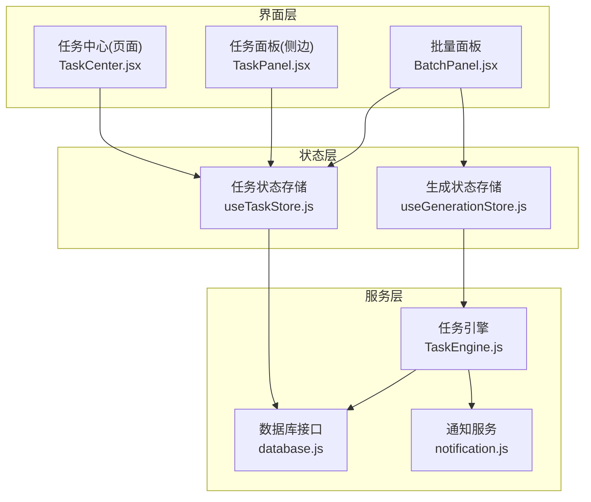
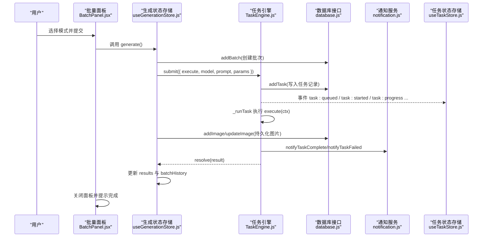
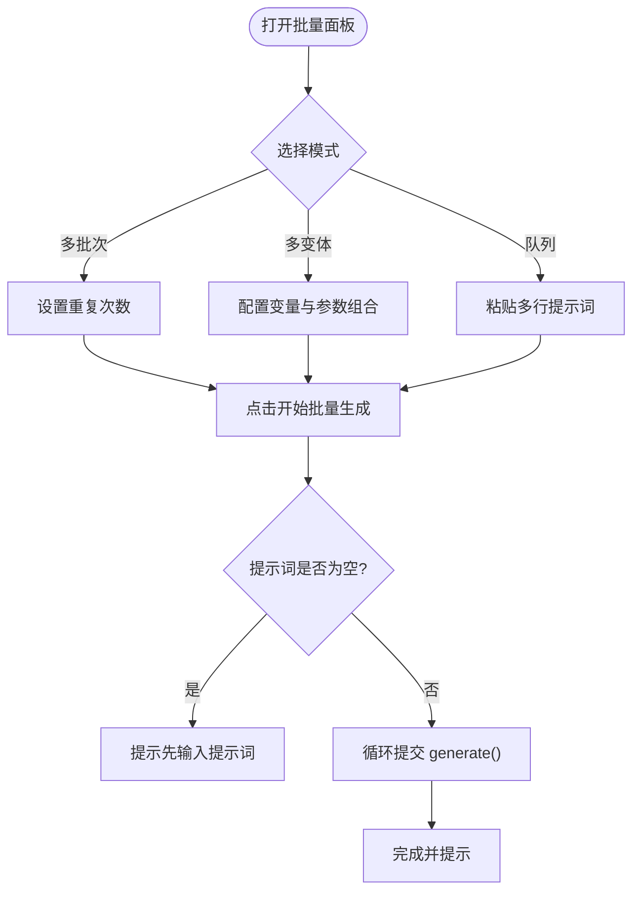
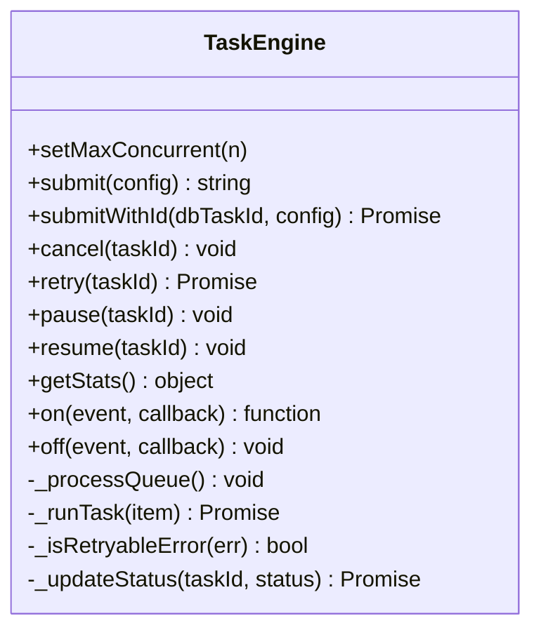
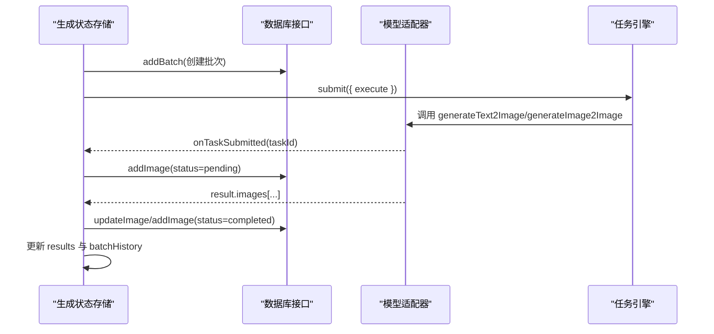
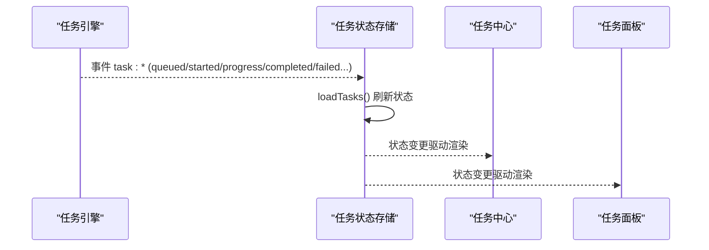
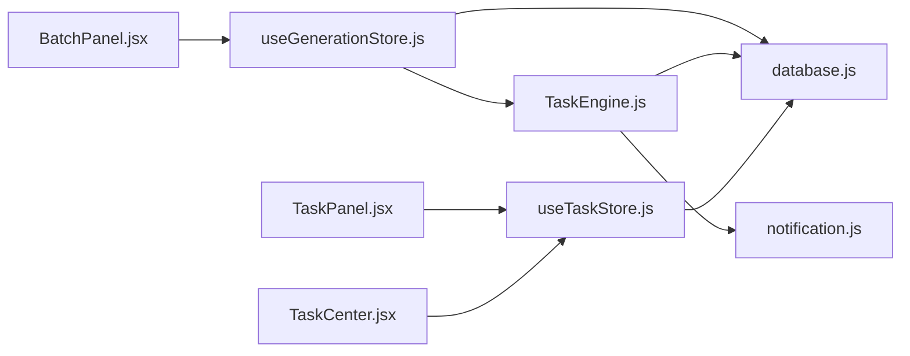

# 批量生成功能

<cite>
**本文引用的文件**   
- [BatchPanel.jsx](file://app/src/components/BatchPanel.jsx)
- [TaskEngine.js](file://app/src/services/task-engine.js)
- [useGenerationStore.js](file://app/src/stores/useGenerationStore.js)
- [useTaskStore.js](file://app/src/stores/useTaskStore.js)
- [database.js](file://app/src/db/database.js)
- [notification.js](file://app/src/services/notification.js)
- [TaskCenter.jsx](file://app/src/pages/TaskCenter.jsx)
- [TaskPanel.jsx](file://app/src/components/TaskPanel.jsx)
</cite>

## 目录
1. [简介](#简介)
2. [项目结构](#项目结构)
3. [核心组件](#核心组件)
4. [架构总览](#架构总览)
5. [详细组件分析](#详细组件分析)
6. [依赖关系分析](#依赖关系分析)
7. [性能考虑](#性能考虑)
8. [故障排除指南](#故障排除指南)
9. [结论](#结论)

## 简介
本文件面向“批量生成”能力，系统性说明其交互设计、任务队列管理、并发控制、进度跟踪、错误处理与结果聚合机制；并解释批量历史记录的保存与恢复方式，以及性能优化建议与常见问题排查方法。读者无需深入源码即可理解整体流程与使用要点。

## 项目结构
围绕批量生成的关键代码分布在以下位置：
- 交互入口：批量面板（多批次、多变体、Prompt 队列）
- 任务调度：后台任务引擎（FIFO 队列、并发上限、重试、事件）
- 状态与持久化：Zustand Store、IndexedDB 表（batches、tasks、images）
- 通知与反馈：浏览器通知、Toast 提示
- 任务中心：任务列表、分组统计、操作入口

图表来源
- [BatchPanel.jsx:1-675](file://app/src/components/BatchPanel.jsx#L1-L675)
- [TaskEngine.js:1-319](file://app/src/services/task-engine.js#L1-L319)
- [useGenerationStore.js:1-360](file://app/src/stores/useGenerationStore.js#L1-L360)
- [useTaskStore.js:1-173](file://app/src/stores/useTaskStore.js#L1-L173)
- [database.js:1-339](file://app/src/db/database.js#L1-L339)
- [notification.js:1-113](file://app/src/services/notification.js#L1-L113)
- [TaskCenter.jsx:1-218](file://app/src/pages/TaskCenter.jsx#L1-L218)
- [TaskPanel.jsx:1-538](file://app/src/components/TaskPanel.jsx#L1-L538)

章节来源
- [BatchPanel.jsx:1-675](file://app/src/components/BatchPanel.jsx#L1-L675)
- [TaskEngine.js:1-319](file://app/src/services/task-engine.js#L1-L319)
- [useGenerationStore.js:1-360](file://app/src/stores/useGenerationStore.js#L1-L360)
- [useTaskStore.js:1-173](file://app/src/stores/useTaskStore.js#L1-L173)
- [database.js:1-339](file://app/src/db/database.js#L1-L339)
- [notification.js:1-113](file://app/src/services/notification.js#L1-L113)
- [TaskCenter.jsx:1-218](file://app/src/pages/TaskCenter.jsx#L1-L218)
- [TaskPanel.jsx:1-538](file://app/src/components/TaskPanel.jsx#L1-L538)

## 核心组件
- 批量面板（BatchPanel）
  - 提供三种模式：多批次、多变体、Prompt 队列
  - 支持参数变量组合、数量预览、提交按钮禁用态与加载动画
  - 通过调用生成状态存储的 generate 方法触发实际生成
- 任务引擎（TaskEngine）
  - 单例调度器，维护 FIFO 队列与最大并发数
  - 任务生命周期：queued → running → completed/failed/cancelled/paused
  - 指数退避重试、进度上报、事件广播、自动持久化
- 生成状态存储（useGenerationStore）
  - 封装一次“生成”的完整流程：创建批次、提交任务、持久化图片、更新本地结果与历史
  - 支持文本到图像与图像到图像两种适配器调用
- 任务状态存储（useTaskStore）
  - 桥接 TaskEngine 事件到 Zustand 状态，供 UI 实时刷新
  - 提供增删改查、重试、暂停/恢复等动作
- 数据库（database.js）
  - IndexedDB 表：batches、tasks、images 等
  - 提供批量记录、任务记录、图片记录的 CRUD 与统计
- 通知服务（notification.js）
  - 包装浏览器通知 API，在任务完成或失败时推送系统通知
- 任务中心与任务面板
  - 以分组视图展示任务状态，支持查看、重试、取消、清空等操作

章节来源
- [BatchPanel.jsx:1-675](file://app/src/components/BatchPanel.jsx#L1-L675)
- [TaskEngine.js:1-319](file://app/src/services/task-engine.js#L1-L319)
- [useGenerationStore.js:1-360](file://app/src/stores/useGenerationStore.js#L1-L360)
- [useTaskStore.js:1-173](file://app/src/stores/useTaskStore.js#L1-L173)
- [database.js:1-339](file://app/src/db/database.js#L1-L339)
- [notification.js:1-113](file://app/src/services/notification.js#L1-L113)
- [TaskCenter.jsx:1-218](file://app/src/pages/TaskCenter.jsx#L1-L218)
- [TaskPanel.jsx:1-538](file://app/src/components/TaskPanel.jsx#L1-L538)

## 架构总览
下图展示了从用户点击“开始批量生成”到结果落库与通知的全链路。

图表来源
- [BatchPanel.jsx:48-101](file://app/src/components/BatchPanel.jsx#L48-L101)
- [useGenerationStore.js:112-290](file://app/src/stores/useGenerationStore.js#L112-L290)
- [TaskEngine.js:57-297](file://app/src/services/task-engine.js#L57-L297)
- [database.js:144-274](file://app/src/db/database.js#L144-L274)
- [notification.js:78-103](file://app/src/services/notification.js#L78-L103)
- [useTaskStore.js:39-64](file://app/src/stores/useTaskStore.js#L39-L64)

## 详细组件分析

### 批量面板（BatchPanel）交互设计
- 三标签页
  - 多批次：同一提示词重复 N 次，每批固定产出数量，显示预计总数
  - 多变体：基于 Prompt 变量与参数变量（如尺寸）排列组合，计算总组合数与预估产出
  - Prompt 队列：逐行输入多个不同提示词，按顺序依次生成
- 交互细节
  - 提交前校验（如提示词为空则警告）
  - 提交中禁用按钮并显示加载动画
  - 完成后 Toast 提示并可选择关闭面板
- 数据流
  - 读取当前提示词与参数，循环调用生成状态存储的 generate 方法
  - 多变体模式下动态替换占位符并切换参数后逐个提交

图表来源
- [BatchPanel.jsx:48-101](file://app/src/components/BatchPanel.jsx#L48-L101)
- [BatchPanel.jsx:200-339](file://app/src/components/BatchPanel.jsx#L200-L339)
- [BatchPanel.jsx:341-564](file://app/src/components/BatchPanel.jsx#L341-L564)
- [BatchPanel.jsx:566-668](file://app/src/components/BatchPanel.jsx#L566-L668)

章节来源
- [BatchPanel.jsx:1-675](file://app/src/components/BatchPanel.jsx#L1-L675)

### 任务队列管理与并发控制（TaskEngine）
- 并发上限
  - 可配置最大并发数，默认值用于限制同时运行的任务数量
- 队列策略
  - FIFO 队列，空闲槽位自动拉取下一个任务
- 任务生命周期
  - 状态机：queued → running → completed/failed/cancelled/paused
  - failed 可通过 retry 重新入队；paused 可 resume 重新入队
- 重试与退避
  - 对网络错误、服务端 5xx 等错误进行指数退避重试，最多若干次
- 进度与事件
  - 通过 onProgress 回调上报进度，持久化并广播事件
  - 事件包括：task:queued、task:started、task:progress、task:completed、task:failed、task:cancelled、task:paused、task:retry
- 取消与暂停
  - 运行中任务通过 AbortController 中断；排队中任务直接移除

图表来源
- [TaskEngine.js:33-319](file://app/src/services/task-engine.js#L33-L319)

章节来源
- [TaskEngine.js:1-319](file://app/src/services/task-engine.js#L1-L319)

### 生成流程与结果聚合（useGenerationStore）
- 单次生成流程
  - 创建批次记录（batches），设置当前批次 ID
  - 构建 execute 函数：根据模型适配器类型选择 T2I 或 I2I 调用
  - 在适配器返回异步任务 ID 时，立即写入 pending 图片记录（status=pending），确保刷新不丢失
  - 适配器完成后，将图片结果持久化为 images 记录（status=completed），并更新本地 results
  - 成功后将本次结果追加至 batchHistory，便于回顾
- 错误处理
  - 若适配器抛出异常且已写入 pending 记录，尝试将其标记为 failed
  - 最终统一捕获并设置 generationError，UI 可据此提示
- 与任务引擎集成
  - 通过 TaskEngine.submit 提交任务，等待 resolve 后更新状态

图表来源
- [useGenerationStore.js:112-290](file://app/src/stores/useGenerationStore.js#L112-L290)
- [database.js:144-171](file://app/src/db/database.js#L144-L171)
- [database.js:43-96](file://app/src/db/database.js#L43-L96)

章节来源
- [useGenerationStore.js:1-360](file://app/src/stores/useGenerationStore.js#L1-L360)
- [database.js:1-339](file://app/src/db/database.js#L1-L339)

### 任务状态同步与 UI 展示（useTaskStore、TaskCenter、TaskPanel）
- 事件桥接
  - useTaskStore.initBridge 订阅 TaskEngine 所有事件，统一刷新任务列表
- 分组与统计
  - TaskCenter 将任务按状态分组，展示计数与时间信息，支持展开/折叠
- 操作入口
  - 支持取消、重试、暂停/恢复、删除、清空已完成等
- 侧边任务面板
  - 快速查看进行中/排队/已完成/失败的任务，并提供快捷操作

图表来源
- [useTaskStore.js:39-64](file://app/src/stores/useTaskStore.js#L39-L64)
- [TaskCenter.jsx:24-66](file://app/src/pages/TaskCenter.jsx#L24-L66)
- [TaskPanel.jsx:9-37](file://app/src/components/TaskPanel.jsx#L9-L37)

章节来源
- [useTaskStore.js:1-173](file://app/src/stores/useTaskStore.js#L1-L173)
- [TaskCenter.jsx:1-218](file://app/src/pages/TaskCenter.jsx#L1-L218)
- [TaskPanel.jsx:1-538](file://app/src/components/TaskPanel.jsx#L1-L538)

### 批量历史记录保存与恢复
- 保存
  - 每次生成成功后，将本次批次信息（包含 images 引用）插入 batchHistory 头部，便于最近优先查看
  - 批次与图片分别持久化到 batches 与 images 表，支持后续检索与筛选
- 恢复
  - 应用启动后可从数据库加载 batches 与 images，结合任务中心与图库进行回顾与管理
  - 任务中心提供“清空已完成”等清理能力，避免历史膨胀影响性能

章节来源
- [useGenerationStore.js:265-289](file://app/src/stores/useGenerationStore.js#L265-L289)
- [database.js:144-171](file://app/src/db/database.js#L144-L171)
- [database.js:235-274](file://app/src/db/database.js#L235-L274)
- [TaskCenter.jsx:166-189](file://app/src/pages/TaskCenter.jsx#L166-L189)

## 依赖关系分析
- 组件耦合
  - BatchPanel 仅依赖生成状态存储与 UI 通知，保持轻量
  - useGenerationStore 依赖模型适配器与数据库，负责业务编排
  - TaskEngine 作为独立单例，被生成流程与任务面板共同消费
- 外部依赖
  - Dexie（IndexedDB）、uuid、浏览器 Notification API
- 潜在风险
  - 大量并发可能导致前端内存压力与后端限流，需合理设置并发上限
  - 长时间运行的任务需关注页面刷新后的状态恢复（pending 记录已覆盖）

图表来源
- [BatchPanel.jsx:1-675](file://app/src/components/BatchPanel.jsx#L1-L675)
- [useGenerationStore.js:1-360](file://app/src/stores/useGenerationStore.js#L1-L360)
- [TaskEngine.js:1-319](file://app/src/services/task-engine.js#L1-L319)
- [useTaskStore.js:1-173](file://app/src/stores/useTaskStore.js#L1-L173)
- [database.js:1-339](file://app/src/db/database.js#L1-L339)
- [notification.js:1-113](file://app/src/services/notification.js#L1-L113)
- [TaskPanel.jsx:1-538](file://app/src/components/TaskPanel.jsx#L1-L538)
- [TaskCenter.jsx:1-218](file://app/src/pages/TaskCenter.jsx#L1-L218)

## 性能考虑
- 并发控制
  - 合理设置最大并发数，避免同时发起过多请求导致后端限流或前端卡顿
- 队列与批大小
  - 大批量场景下，建议分批提交，避免一次性压入过多任务
- 进度上报频率
  - 降低高频进度上报的开销，必要时合并上报
- 数据库写入
  - 批量写入尽量使用事务或批量接口（如 bulkUpdate/bulkDelete）减少 IO 次数
- 结果聚合
  - 大结果集渲染时采用虚拟滚动或分页加载，避免 DOM 过大
- 资源回收
  - 及时清理已完成任务与过期图片，释放存储空间

[本节为通用指导，不涉及具体文件分析]

## 故障排除指南
- 常见现象与定位
  - 无响应或一直“生成中”
    - 检查是否达到并发上限，队列是否堆积
    - 查看任务中心对应任务状态与错误信息
  - 频繁失败
    - 观察是否出现网络错误或 5xx 错误，确认重试策略是否生效
    - 检查模型适配器返回格式是否符合预期
  - 刷新后丢失进度
    - 确认 pending 记录是否写入成功（taskId 关联的图片记录）
    - 检查任务引擎是否在刷新后继续执行
- 操作建议
  - 使用任务中心的“重试”功能恢复失败任务
  - 使用“暂停/恢复”控制长任务节奏
  - 使用“清空已完成”定期清理历史
- 日志与调试
  - 关注控制台输出中的任务事件与错误堆栈
  - 使用浏览器开发者工具监控 IndexedDB 中 tasks/images/batches 表变化

章节来源
- [TaskEngine.js:259-305](file://app/src/services/task-engine.js#L259-L305)
- [useGenerationStore.js:283-290](file://app/src/stores/useGenerationStore.js#L283-L290)
- [TaskCenter.jsx:192-214](file://app/src/pages/TaskCenter.jsx#L192-L214)
- [TaskPanel.jsx:406-505](file://app/src/components/TaskPanel.jsx#L406-L505)

## 结论
批量生成功能以“批量面板 + 任务引擎 + 状态存储 + 持久化”为核心，实现了多模式批量提交、可控并发、可靠重试、实时进度与结果聚合。配合任务中心与通知服务，形成完整的端到端体验。通过合理的并发与批大小控制、数据库写入优化与历史清理策略，可在大规模批量场景下保持稳定与高效。