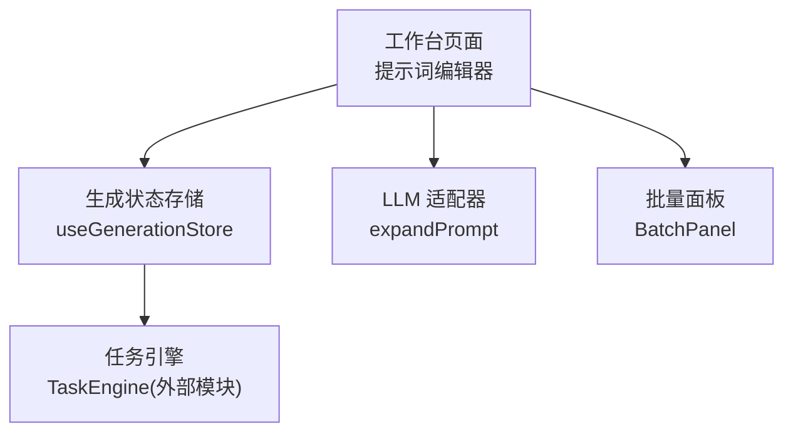
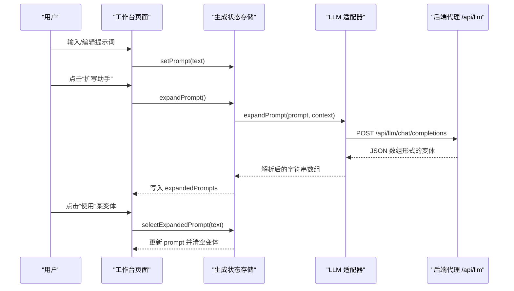
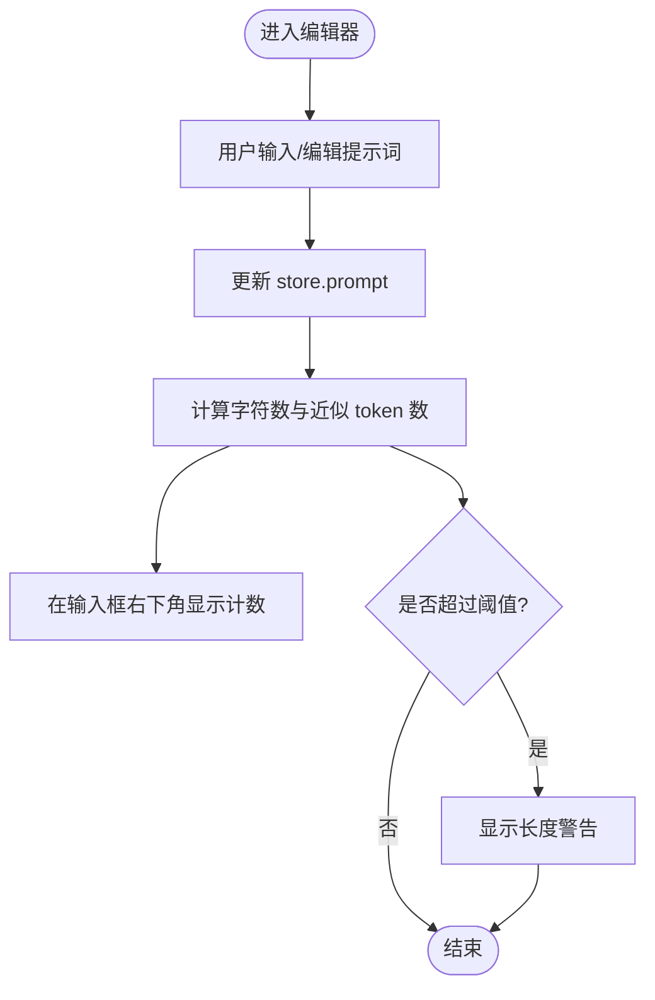
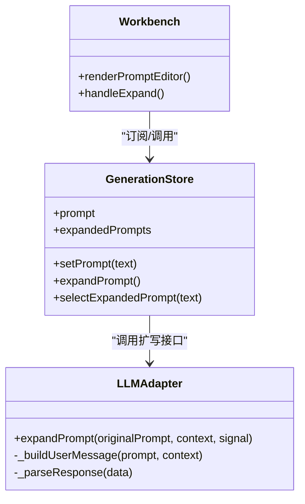
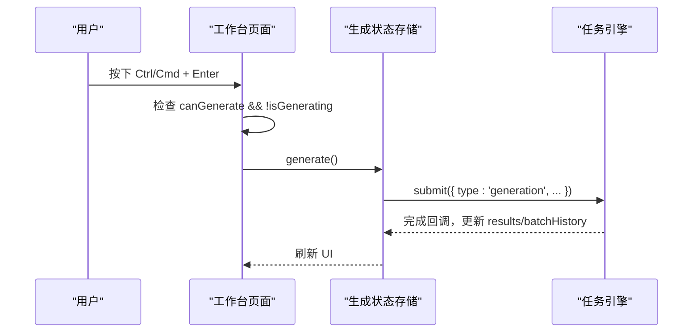
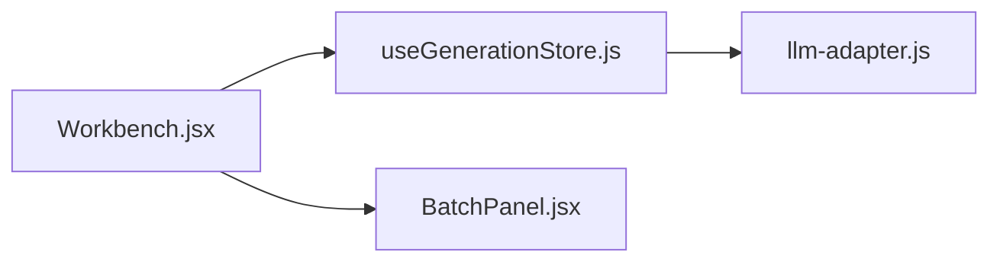

# 提示词编辑器

<cite>
**本文引用的文件列表**
- [Workbench.jsx](file://app/src/pages/Workbench.jsx)
- [useGenerationStore.js](file://app/src/stores/useGenerationStore.js)
- [llm-adapter.js](file://app/src/services/api/llm-adapter.js)
- [BatchPanel.jsx](file://app/src/components/BatchPanel.jsx)
</cite>

## 目录
1. [简介](#简介)
2. [项目结构](#项目结构)
3. [核心组件](#核心组件)
4. [架构总览](#架构总览)
5. [详细组件分析](#详细组件分析)
6. [依赖关系分析](#依赖关系分析)
7. [性能与体验优化建议](#性能与体验优化建议)
8. [故障排查指南](#故障排查指南)
9. [结论](#结论)
10. [附录：使用示例与最佳实践](#附录使用示例与最佳实践)

## 简介
本文件聚焦“提示词编辑器”功能，覆盖以下关键特性：
- 提示词输入区域与实时字符计数显示
- 长度警告机制（超长提示词提醒）
- 扩写助手：多版本生成、选择应用、状态管理
- 键盘快捷键支持（如 Ctrl/Cmd + Enter 快速生成）
- 错误处理与用户体验反馈
- 性能优化建议与最佳实践

该功能位于工作台的左侧面板，提供从输入到生成的完整交互闭环。

## 项目结构
与提示词编辑器直接相关的代码主要分布在以下位置：
- 页面与工作流入口：工作台页面
- 全局状态与业务逻辑：生成状态存储
- LLM 扩写能力：LLM 适配器
- 批量扩展能力（与提示词编辑联动）：批量面板

图表来源
- [Workbench.jsx:523-638](file://app/src/pages/Workbench.jsx#L523-L638)
- [useGenerationStore.js:295-313](file://app/src/stores/useGenerationStore.js#L295-L313)
- [llm-adapter.js:35-61](file://app/src/services/api/llm-adapter.js#L35-L61)
- [BatchPanel.jsx:355-422](file://app/src/components/BatchPanel.jsx#L355-L422)

章节来源
- [Workbench.jsx:523-638](file://app/src/pages/Workbench.jsx#L523-L638)
- [useGenerationStore.js:295-313](file://app/src/stores/useGenerationStore.js#L295-L313)
- [llm-adapter.js:35-61](file://app/src/services/api/llm-adapter.js#L35-L61)
- [BatchPanel.jsx:355-422](file://app/src/components/BatchPanel.jsx#L355-L422)

## 核心组件
- 提示词输入区：文本域，绑定全局 prompt 状态，实时更新字符数与 token 估算值
- 长度警告：当提示词超过阈值时展示警告信息
- 扩写助手按钮：触发 LLM 扩写流程，展示加载态与结果卡片
- 变体选择与应用：点击“使用”将选定变体回填至 prompt，并关闭展开面板
- 快捷操作：Ctrl/Cmd + Enter 触发生成

章节来源
- [Workbench.jsx:527-548](file://app/src/pages/Workbench.jsx#L527-L548)
- [Workbench.jsx:550-555](file://app/src/pages/Workbench.jsx#L550-L555)
- [Workbench.jsx:557-625](file://app/src/pages/Workbench.jsx#L557-L625)
- [Workbench.jsx:431-441](file://app/src/pages/Workbench.jsx#L431-L441)

## 架构总览
提示词编辑器的数据流与控制流如下：
- 用户在输入框修改 prompt → 更新 store.prompt
- 点击“扩写助手”→ 调用 store.expandPrompt() → 通过 LLMAdapter 发起请求 → 解析返回的多条变体 → 写入 expandedPrompts
- 用户点击某变体的“使用”→ selectExpandedPrompt(text) → 替换当前 prompt 并清空变体列表
- 快捷键 Ctrl/Cmd + Enter → 校验可生成条件后调用 generate()

图表来源
- [Workbench.jsx:557-625](file://app/src/pages/Workbench.jsx#L557-L625)
- [useGenerationStore.js:295-313](file://app/src/stores/useGenerationStore.js#L295-L313)
- [llm-adapter.js:35-61](file://app/src/services/api/llm-adapter.js#L35-L61)

## 详细组件分析

### 提示词输入与实时统计
- 输入区域为受控文本域，value 来自 store.prompt，onChange 调用 setPrompt 更新
- 右下角实时显示“字符数 · ~token 数”，采用简单换算公式估算 token
- 当字符数超过阈值时，显示黄色警告提示，提醒可能影响质量

图表来源
- [Workbench.jsx:527-548](file://app/src/pages/Workbench.jsx#L527-L548)
- [Workbench.jsx:550-555](file://app/src/pages/Workbench.jsx#L550-L555)

章节来源
- [Workbench.jsx:527-548](file://app/src/pages/Workbench.jsx#L527-L548)
- [Workbench.jsx:550-555](file://app/src/pages/Workbench.jsx#L550-L555)

### 扩写助手实现原理
- 触发入口：点击“扩写助手”按钮，设置展开面板可见与加载中状态
- 调用链路：handleExpand → store.expandPrompt → LLMAdapter.expandPrompt → apiPost 请求 → 解析响应
- 结果渲染：expandedPrompts 非空时，按序号渲染多条变体卡片，每条附带“使用”按钮
- 选择应用：点击“使用”后，selectExpandedPrompt 将对应文本设为当前 prompt，并清空 expandedPrompts

图表来源
- [Workbench.jsx:557-625](file://app/src/pages/Workbench.jsx#L557-L625)
- [useGenerationStore.js:295-313](file://app/src/stores/useGenerationStore.js#L295-L313)
- [llm-adapter.js:35-61](file://app/src/services/api/llm-adapter.js#L35-L61)

章节来源
- [Workbench.jsx:557-625](file://app/src/pages/Workbench.jsx#L557-L625)
- [useGenerationStore.js:295-313](file://app/src/stores/useGenerationStore.js#L295-L313)
- [llm-adapter.js:35-61](file://app/src/services/api/llm-adapter.js#L35-L61)

### 状态管理与数据流
- 状态字段
  - prompt：当前提示词
  - expandedPrompts：扩写结果数组
- 关键动作
  - setPrompt(text)：更新提示词
  - expandPrompt()：发起扩写并写入 expandedPrompts
  - selectExpandedPrompt(text)：选择变体并清空 expandedPrompts
- 副作用
  - 切换模型或清空时会重置 expandedPrompts

章节来源
- [useGenerationStore.js:22-52](file://app/src/stores/useGenerationStore.js#L22-L52)
- [useGenerationStore.js:295-313](file://app/src/stores/useGenerationStore.js#L295-L313)

### 键盘快捷键与生成流程
- 快捷键：监听 window keydown，当按下 Ctrl/Cmd + Enter 且满足可生成条件时，阻止默认行为并触发生成
- 可生成条件：提示词非空且参考图数量未超限
- 生成流程：handleGenerate → setParam 填充参数 → generate() → TaskEngine 提交任务 → 持久化结果

图表来源
- [Workbench.jsx:431-441](file://app/src/pages/Workbench.jsx#L431-L441)
- [useGenerationStore.js:112-290](file://app/src/stores/useGenerationStore.js#L112-L290)

章节来源
- [Workbench.jsx:431-441](file://app/src/pages/Workbench.jsx#L431-L441)
- [useGenerationStore.js:112-290](file://app/src/stores/useGenerationStore.js#L112-L290)

### 与批量面板的联动
- 批量面板支持 Prompt 变量与参数变量的组合生成，适合对同一提示词进行多维度的批量探索
- 与提示词编辑器的关系：先通过编辑器完善提示词，再进入批量面板进行批量策略配置

章节来源
- [BatchPanel.jsx:355-422](file://app/src/components/BatchPanel.jsx#L355-L422)

## 依赖关系分析
- 组件耦合
  - 工作台页面依赖 useGenerationStore 提供的 prompt、expandedPrompts 及相关 action
  - 扩写能力依赖 LLMAdapter 封装的后端通信与响应解析
- 外部依赖
  - 后端代理：/api/llm/chat/completions
  - 任务引擎：用于图片生成任务的调度与进度上报（与扩写无直接耦合）

图表来源
- [Workbench.jsx:523-638](file://app/src/pages/Workbench.jsx#L523-L638)
- [useGenerationStore.js:295-313](file://app/src/stores/useGenerationStore.js#L295-L313)
- [llm-adapter.js:35-61](file://app/src/services/api/llm-adapter.js#L35-L61)
- [BatchPanel.jsx:355-422](file://app/src/components/BatchPanel.jsx#L355-L422)

章节来源
- [Workbench.jsx:523-638](file://app/src/pages/Workbench.jsx#L523-L638)
- [useGenerationStore.js:295-313](file://app/src/stores/useGenerationStore.js#L295-L313)
- [llm-adapter.js:35-61](file://app/src/services/api/llm-adapter.js#L35-L61)
- [BatchPanel.jsx:355-422](file://app/src/components/BatchPanel.jsx#L355-L422)

## 性能与体验优化建议
- 输入防抖与节流
  - 对高频输入事件做防抖，减少不必要的重渲染与计算
- Token 估算优化
  - 当前使用固定系数估算，可在需要更精确估计时引入轻量分词器或缓存策略
- 网络请求优化
  - 为扩写请求增加 AbortSignal 支持，避免重复请求叠加
  - 对 LLM 响应做幂等与重试控制（指数退避），提升稳定性
- UI 渲染优化
  - 对变体列表使用稳定 key，必要时对长列表做虚拟滚动
- 错误边界与降级
  - 对 LLM 解析失败提供回退文案，保证界面可用
- 快捷键冲突处理
  - 确保在输入框内才触发快捷键，避免与其他全局快捷键冲突

[本节为通用建议，不直接分析具体文件]

## 故障排查指南
- 扩写失败
  - 现象：点击“扩写助手”后报错或无结果
  - 排查要点：
    - 确认后端代理 /api/llm/chat/completions 可达
    - 检查 LLMAdapter 的 _parseResponse 是否能正确提取 JSON 数组
    - 查看控制台日志中的请求与响应片段
- 提示词过长
  - 现象：出现长度警告
  - 建议：精简描述或使用扩写助手生成结构化提示词
- 快捷键无效
  - 现象：Ctrl/Cmd + Enter 无法触发生成
  - 排查要点：
    - 确认焦点在输入区域
    - 检查 isGenerating 是否为 true（生成中会禁用）
    - 核对 canGenerate 条件（提示词非空、参考图未超限）

章节来源
- [llm-adapter.js:85-122](file://app/src/services/api/llm-adapter.js#L85-L122)
- [Workbench.jsx:431-441](file://app/src/pages/Workbench.jsx#L431-L441)
- [Workbench.jsx:550-555](file://app/src/pages/Workbench.jsx#L550-L555)

## 结论
提示词编辑器围绕“输入—扩写—选择—生成”的主路径构建，具备实时统计、长度告警、多版本扩写与一键应用等能力。通过集中式状态管理与清晰的适配器分层，既保证了可扩展性，也便于后续接入更多 LLM 能力与批量策略。

[本节为总结性内容，不直接分析具体文件]

## 附录：使用示例与最佳实践
- 基本用法
  - 在输入框描述画面要素（主体、风格、光影、构图等）
  - 观察右下角字符数与近似 token 数，避免超长导致质量下降
- 扩写助手
  - 点击“扩写助手”，等待加载完成后浏览多个变体
  - 点击“使用”将选定的变体回填到提示词，随后点击“生成”
- 快捷键
  - 在输入框内按下 Ctrl/Cmd + Enter 快速生成
- 批量探索
  - 在提示词稳定后，进入批量面板定义变量与尺寸组合，扩大候选池
- 最佳实践
  - 先用简短关键词定位方向，再用扩写助手丰富细节
  - 结合参考图与 prompt_extend 开关，获得更稳定的输出
  - 遇到网络波动时，适当降低并发与重试次数，优先保障可用性

[本节为使用指导，不直接分析具体文件]