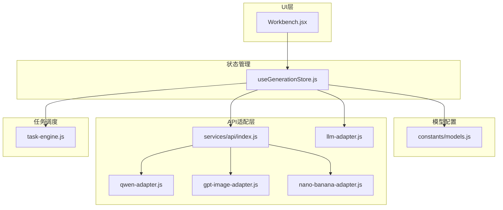
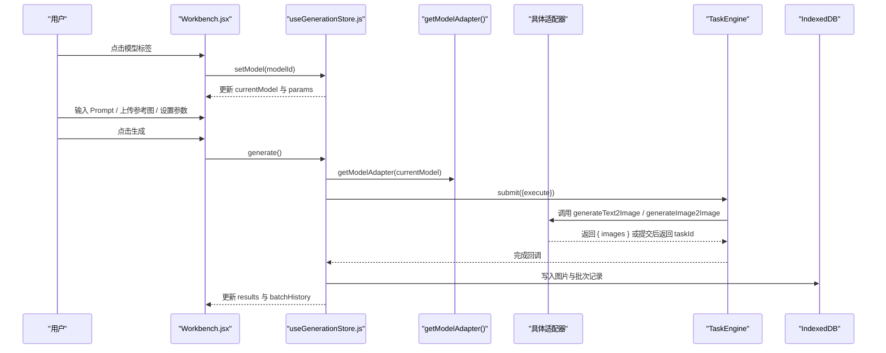
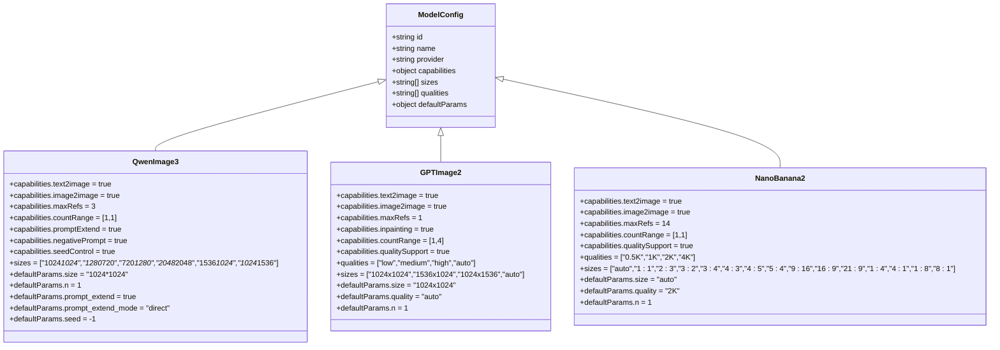
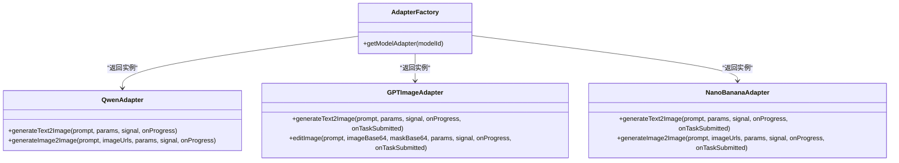
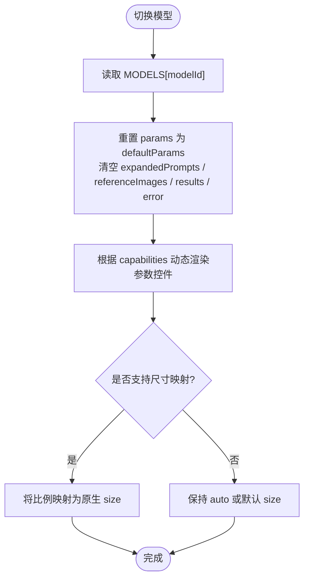
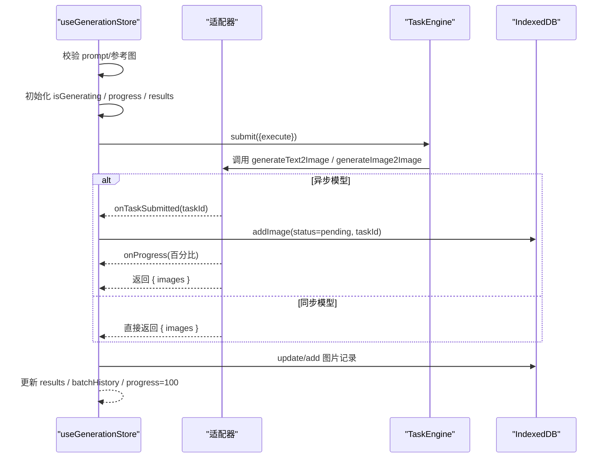
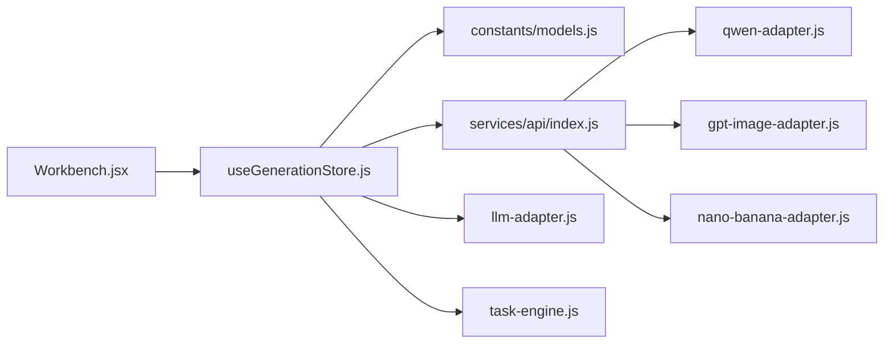

# 模型选择器

<cite>
**本文引用的文件**   
- [constants/models.js](file://app/src/constants/models.js)
- [services/api/index.js](file://app/src/services/api/index.js)
- [services/api/qwen-adapter.js](file://app/src/services/api/qwen-adapter.js)
- [services/api/gpt-image-adapter.js](file://app/src/services/api/gpt-image-adapter.js)
- [services/api/nano-banana-adapter.js](file://app/src/services/api/nano-banana-adapter.js)
- [stores/useGenerationStore.js](file://app/src/stores/useGenerationStore.js)
- [pages/Workbench.jsx](file://app/src/pages/Workbench.jsx)
- [services/task-engine.js](file://app/src/services/task-engine.js)
- [services/api/llm-adapter.js](file://app/src/services/api/llm-adapter.js)
- [qwen-image-3-api.md](file://docs/qwen-image-3-api.md)
</cite>

## 目录
1. [简介](#简介)
2. [项目结构](#项目结构)
3. [核心组件](#核心组件)
4. [架构总览](#架构总览)
5. [详细组件分析](#详细组件分析)
6. [依赖关系分析](#依赖关系分析)
7. [性能考虑](#性能考虑)
8. [故障排查指南](#故障排查指南)
9. [结论](#结论)
10. [附录](#附录)

## 简介
本文件围绕“模型选择器”功能，系统性梳理多模型切换界面、模型配置映射与动态参数适配机制。文档覆盖支持的 AI 图像模型（Qwen Image 3、GPT Image 2、Nano Banana 2），说明各模型的独特能力与限制；解释切换模型时的参数同步流程（生成数量范围、参考图上限、尺寸预设等）；并提供最佳实践与性能建议，帮助在不同模型间高效工作。

## 项目结构
模型选择器相关代码主要分布在以下位置：
- 模型常量与能力定义：constants/models.js
- 适配器工厂与统一导出：services/api/index.js
- 具体模型适配器：services/api/*-adapter.js
- 生成状态与流程编排：stores/useGenerationStore.js
- 工作区 UI 与模型切换交互：pages/Workbench.jsx
- 任务调度与进度上报：services/task-engine.js
- LLM 提示词扩写：services/api/llm-adapter.js
- Qwen API 规范参考：docs/qwen-image-3-api.md

图表来源
- [pages/Workbench.jsx:503-521](file://app/src/pages/Workbench.jsx#L503-L521)
- [stores/useGenerationStore.js:38-52](file://app/src/stores/useGenerationStore.js#L38-L52)
- [constants/models.js:8-92](file://app/src/constants/models.js#L8-L92)
- [services/api/index.js:20-31](file://app/src/services/api/index.js#L20-L31)
- [services/api/qwen-adapter.js:51-105](file://app/src/services/api/qwen-adapter.js#L51-L105)
- [services/api/gpt-image-adapter.js:156-190](file://app/src/services/api/gpt-image-adapter.js#L156-L190)
- [services/api/nano-banana-adapter.js:125-152](file://app/src/services/api/nano-banana-adapter.js#L125-L152)
- [services/api/llm-adapter.js:23-61](file://app/src/services/api/llm-adapter.js#L23-L61)
- [services/task-engine.js:57-81](file://app/src/services/task-engine.js#L57-L81)

章节来源
- [constants/models.js:1-106](file://app/src/constants/models.js#L1-L106)
- [services/api/index.js:1-39](file://app/src/services/api/index.js#L1-L39)
- [stores/useGenerationStore.js:1-360](file://app/src/stores/useGenerationStore.js#L1-L360)
- [pages/Workbench.jsx:1-800](file://app/src/pages/Workbench.jsx#L1-L800)
- [services/task-engine.js:1-319](file://app/src/services/task-engine.js#L1-L319)
- [services/api/llm-adapter.js:1-150](file://app/src/services/api/llm-adapter.js#L1-L150)
- [qwen-image-3-api.md:1-221](file://docs/qwen-image-3-api.md#L1-L221)

## 核心组件
- 模型配置中心：集中声明每个模型的 ID、名称、供应商、能力开关、支持尺寸、质量档位、默认参数以及 UI 展示顺序。
- 适配器工厂：根据模型 ID 返回对应适配器实例，屏蔽底层差异。
- 生成存储：维护当前模型、提示词、参考图、参数、结果、批次历史与生成状态；负责在切换模型时重置并同步参数。
- 工作区 UI：提供模型标签页切换、参数面板（数量、尺寸、质量、种子、提示词扩写）、参考图上传与角色标注、批量操作入口。
- 任务引擎：统一调度后台任务，支持并发控制、重试、取消、进度上报与持久化。
- LLM 扩写：基于 OpenAI 风格接口对提示词进行多风格变体扩写，辅助用户快速获得高质量 prompt。

章节来源
- [constants/models.js:8-92](file://app/src/constants/models.js#L8-L92)
- [services/api/index.js:20-31](file://app/src/services/api/index.js#L20-L31)
- [stores/useGenerationStore.js:38-52](file://app/src/stores/useGenerationStore.js#L38-L52)
- [pages/Workbench.jsx:503-521](file://app/src/pages/Workbench.jsx#L503-L521)
- [services/task-engine.js:57-81](file://app/src/services/task-engine.js#L57-L81)
- [services/api/llm-adapter.js:23-61](file://app/src/services/api/llm-adapter.js#L23-L61)

## 架构总览
模型选择器的数据流与控制流如下：
- 用户在 Workbench 中点击模型标签触发 setModel，store 将 currentModel 更新为所选模型，并将 params 重置为该模型的 defaultParams。
- 用户调整参数（如 n、size、quality、seed、prompt_extend）后，点击生成。
- store 调用 getModelAdapter 获取对应适配器，再交由 TaskEngine 执行 execute 函数。
- 适配器内部按模型特性发起请求（同步或异步），通过 onProgress 回调上报进度，必要时通过 onTaskSubmitted 回传 taskId 以便前端持久化待完成任务。
- 完成后，store 将结果写入 IndexedDB 并更新 results 与 batchHistory。

图表来源
- [pages/Workbench.jsx:503-521](file://app/src/pages/Workbench.jsx#L503-L521)
- [stores/useGenerationStore.js:112-290](file://app/src/stores/useGenerationStore.js#L112-L290)
- [services/api/index.js:20-31](file://app/src/services/api/index.js#L20-L31)
- [services/task-engine.js:222-297](file://app/src/services/task-engine.js#L222-L297)

## 详细组件分析

### 模型配置与能力矩阵
- 模型清单与顺序：MODEL_ORDER 定义了 UI 显示顺序。
- 能力字段：text2image、image2image、maxRefs、inpainting、countRange、qualitySupport、promptExtend、negativePrompt、seedControl。
- 尺寸与质量：sizes 与 qualities 分别描述原生尺寸与质量档位；部分模型使用比例作为 size（如 Nano Banana 2）。
- 默认参数：defaultParams 包含 size、n、seed、prompt_extend_mode、quality 等。

图表来源
- [constants/models.js:8-92](file://app/src/constants/models.js#L8-L92)

章节来源
- [constants/models.js:8-92](file://app/src/constants/models.js#L8-L92)

### 适配器工厂与统一接口
- 工厂方法 getModelAdapter 根据 modelId 返回对应适配器实例。
- 所有适配器对外暴露统一的文本到图像与图像到图像方法签名，便于上层以一致方式调用。

图表来源
- [services/api/index.js:20-31](file://app/src/services/api/index.js#L20-L31)
- [services/api/qwen-adapter.js:51-105](file://app/src/services/api/qwen-adapter.js#L51-L105)
- [services/api/gpt-image-adapter.js:156-190](file://app/src/services/api/gpt-image-adapter.js#L156-L190)
- [services/api/nano-banana-adapter.js:125-152](file://app/src/services/api/nano-banana-adapter.js#L125-L152)

章节来源
- [services/api/index.js:1-39](file://app/src/services/api/index.js#L1-L39)

### 模型切换与参数同步机制
- 切换模型时，store 会将 currentModel 设置为新模型，并把 params 重置为该模型的 defaultParams，同时清空扩展提示词、参考图、结果与错误信息。
- UI 侧会根据模型能力动态调整：
  - 固定生成数量：当 countRange[0] === countRange[1] 时，UI 锁定该值。
  - 参考图上限：根据 maxRefs 限制上传数量，超出时给出警告。
  - 尺寸预设映射：将常见比例映射到各模型原生 size 字符串；Nano Banana 2 直接使用比例作为 size。
  - 质量档位：仅当 qualitySupport 为真时显示。
  - 提示词扩写：仅当 promptExtend 为真时启用。
  - 掩码编辑：仅当 inpainting 为真时可用。

图表来源
- [stores/useGenerationStore.js:38-52](file://app/src/stores/useGenerationStore.js#L38-L52)
- [pages/Workbench.jsx:122-133](file://app/src/pages/Workbench.jsx#L122-L133)
- [pages/Workbench.jsx:158-162](file://app/src/pages/Workbench.jsx#L158-L162)
- [constants/models.js:8-92](file://app/src/constants/models.js#L8-L92)

章节来源
- [stores/useGenerationStore.js:38-52](file://app/src/stores/useGenerationStore.js#L38-L52)
- [pages/Workbench.jsx:122-133](file://app/src/pages/Workbench.jsx#L122-L133)
- [pages/Workbench.jsx:158-162](file://app/src/pages/Workbench.jsx#L158-L162)
- [constants/models.js:8-92](file://app/src/constants/models.js#L8-L92)

### 生成流程与进度上报
- Store 在 generate 中构建 execute 函数，依据是否存在参考图且适配器支持 I2I 来决定调用路径。
- 对于异步模型（GPT Image 2、Nano Banana 2），适配器先提交任务，再通过轮询获取结果；期间通过 onProgress 上报进度，并通过 onTaskSubmitted 通知前端保存 pending 记录。
- 同步模型（Qwen Image 3）直接返回结果，但整体耗时较长，适配器设置了较长的超时时间。

图表来源
- [stores/useGenerationStore.js:112-290](file://app/src/stores/useGenerationStore.js#L112-L290)
- [services/api/gpt-image-adapter.js:252-272](file://app/src/services/api/gpt-image-adapter.js#L252-L272)
- [services/api/nano-banana-adapter.js:199-217](file://app/src/services/api/nano-banana-adapter.js#L199-L217)
- [services/api/qwen-adapter.js:60-105](file://app/src/services/api/qwen-adapter.js#L60-L105)
- [services/task-engine.js:222-297](file://app/src/services/task-engine.js#L222-L297)

章节来源
- [stores/useGenerationStore.js:112-290](file://app/src/stores/useGenerationStore.js#L112-L290)
- [services/api/gpt-image-adapter.js:252-272](file://app/src/services/api/gpt-image-adapter.js#L252-L272)
- [services/api/nano-banana-adapter.js:199-217](file://app/src/services/api/nano-banana-adapter.js#L199-L217)
- [services/api/qwen-adapter.js:60-105](file://app/src/services/api/qwen-adapter.js#L60-L105)
- [services/task-engine.js:222-297](file://app/src/services/task-engine.js#L222-L297)

### 模型能力与限制速览
- Qwen Image 3
  - 能力：文生图、图生图、内置提示词扩写、负向提示词、随机种子控制。
  - 参考图上限：最多 3 张。
  - 生成数量：固定为 1。
  - 尺寸：原生尺寸列表，T2I 宽高需为 16 的倍数，I2I 需为 32 的倍数。
  - 质量：不支持质量档位。
  - 典型场景：需要精细控制与可复现性（seed）的工作流。
- GPT Image 2
  - 能力：文生图、图生图、局部重绘（mask）。
  - 参考图上限：1 张。
  - 生成数量：1–4。
  - 尺寸：支持 1024x1024、1536x1024、1024x1536、auto。
  - 质量：低/中/高/auto。
  - 典型场景：需要质量档位与局部重绘的快速出图。
- Nano Banana 2
  - 能力：文生图、图生图。
  - 参考图上限：最多 14 张。
  - 生成数量：固定为 1。
  - 尺寸：支持多种比例与 auto。
  - 质量：0.5K/1K/2K/4K。
  - 典型场景：需要大量参考图融合与高分辨率输出的场景。

章节来源
- [constants/models.js:8-92](file://app/src/constants/models.js#L8-L92)
- [qwen-image-3-api.md:136-144](file://docs/qwen-image-3-api.md#L136-L144)

### 提示词扩写与 LLM 集成
- 工作区提供“扩写助手”，调用 LLMAdapter 将简短描述扩展为多个高质量变体。
- 扩写结果以数组形式返回，用户可选择其中一条作为当前 prompt。
- 扩写过程支持传入目标模型上下文，使生成的变体更贴合所选模型特点。

章节来源
- [services/api/llm-adapter.js:23-61](file://app/src/services/api/llm-adapter.js#L23-L61)
- [stores/useGenerationStore.js:295-308](file://app/src/stores/useGenerationStore.js#L295-L308)
- [pages/Workbench.jsx:184-195](file://app/src/pages/Workbench.jsx#L184-L195)

## 依赖关系分析
- UI 与工作区：Workbench 订阅 useGenerationStore 的状态与方法，驱动模型切换与参数更新。
- 状态与配置：useGenerationStore 依赖 constants/models.js 的默认参数与能力定义。
- 适配层：useGenerationStore 通过 services/api/index.js 的工厂方法获取具体适配器实例。
- 任务调度：生成流程由 TaskEngine 统一管理，保证并发、重试与进度上报。
- 外部 API：各适配器封装了不同后端接口的差异，向上提供统一方法签名。

图表来源
- [pages/Workbench.jsx:503-521](file://app/src/pages/Workbench.jsx#L503-L521)
- [stores/useGenerationStore.js:112-290](file://app/src/stores/useGenerationStore.js#L112-L290)
- [services/api/index.js:20-31](file://app/src/services/api/index.js#L20-L31)
- [services/task-engine.js:57-81](file://app/src/services/task-engine.js#L57-L81)

章节来源
- [pages/Workbench.jsx:503-521](file://app/src/pages/Workbench.jsx#L503-L521)
- [stores/useGenerationStore.js:112-290](file://app/src/stores/useGenerationStore.js#L112-L290)
- [services/api/index.js:20-31](file://app/src/services/api/index.js#L20-L31)
- [services/task-engine.js:57-81](file://app/src/services/task-engine.js#L57-L81)

## 性能考虑
- 并发控制：TaskEngine 默认最大并发为 3，避免过多请求导致网络拥塞或后端限流。
- 重试与退避：适配器与任务引擎均实现指数退避重试，提升弱网环境下的成功率。
- 长耗时优化：Qwen 同步接口设置较长超时；异步模型采用轮询与进度上报，减少前端阻塞感。
- 资源清理：参考图 URL 与 Blob 在移除时及时释放，避免内存泄漏。
- 本地缓存：生成结果持久化至 IndexedDB，刷新后可恢复，提高用户体验。

章节来源
- [services/task-engine.js:33-48](file://app/src/services/task-engine.js#L33-L48)
- [services/api/gpt-image-adapter.js:33-54](file://app/src/services/api/gpt-image-adapter.js#L33-L54)
- [services/api/nano-banana-adapter.js:26-47](file://app/src/services/api/nano-banana-adapter.js#L26-L47)
- [services/api/qwen-adapter.js:20-21](file://app/src/services/api/qwen-adapter.js#L20-L21)
- [stores/useGenerationStore.js:260-272](file://app/src/stores/useGenerationStore.js#L260-L272)

## 故障排查指南
- 生成失败
  - 检查网络与代理状态，确认后端可达。
  - 查看控制台日志中的适配器错误信息（如 DashScope 错误码、EvoLink 错误消息）。
  - 若为异步任务，确认轮询是否超时或被取消。
- 参数不生效
  - 确认当前模型是否支持该参数（如 negativePrompt、seedControl、qualitySupport）。
  - 检查尺寸是否符合模型要求（Qwen T2I/I2I 的尺寸倍数规则）。
- 参考图被忽略
  - 确认参考图数量未超过当前模型的 maxRefs。
  - 检查上传的文件类型与大小是否符合要求。
- 进度条不动
  - 异步模型在未收到服务端 progress 时会按时间估算进度；若长时间无响应，可能是后端处理缓慢或网络问题。

章节来源
- [services/api/qwen-adapter.js:41-49](file://app/src/services/api/qwen-adapter.js#L41-L49)
- [services/api/gpt-image-adapter.js:115-154](file://app/src/services/api/gpt-image-adapter.js#L115-L154)
- [services/api/nano-banana-adapter.js:82-114](file://app/src/services/api/nano-banana-adapter.js#L82-L114)
- [stores/useGenerationStore.js:168-186](file://app/src/stores/useGenerationStore.js#L168-L186)
- [qwen-image-3-api.md:136-144](file://docs/qwen-image-3-api.md#L136-L144)

## 结论
模型选择器通过“配置中心 + 适配器工厂 + 统一状态管理 + 任务调度”的分层设计，实现了多模型无缝切换与参数动态适配。不同模型的能力与限制在配置层明确表达，UI 层据此呈现合适的控件与约束；运行时由适配器屏蔽差异，TaskEngine 保障稳定性与可观测性。遵循本文的最佳实践与性能建议，可在不同模型间高效协作，获得稳定、可控的生成体验。

## 附录

### 模型选择最佳实践
- 选择模型
  - 需要精细控制与可复现性：优先 Qwen Image 3（支持 seed、负向提示词、内置扩写）。
  - 需要质量档位与局部重绘：优先 GPT Image 2（支持 low/medium/high/auto，mask 编辑）。
  - 需要大量参考图融合与高分辨率：优先 Nano Banana 2（最多 14 张参考图，支持 0.5K–4K）。
- 参数设置
  - 合理设置生成数量：GPT Image 2 支持 1–4，其他模型多为固定 1。
  - 尺寸与比例：优先使用 UI 提供的比例预设，系统会自动映射为原生 size。
  - 质量档位：仅在模型支持时开启，避免无效参数。
  - 种子控制：仅在模型支持时使用，确保可复现实验。
- 参考图策略
  - 控制数量不超过 maxRefs，并按角色（通用/风格/构图/色彩/主体）组织，有助于提升生成一致性。
- 提示词扩写
  - 先用扩写助手产出多条变体，再结合模型能力微调，可获得更稳定的输出。

章节来源
- [constants/models.js:8-92](file://app/src/constants/models.js#L8-L92)
- [pages/Workbench.jsx:158-162](file://app/src/pages/Workbench.jsx#L158-L162)
- [services/api/llm-adapter.js:23-61](file://app/src/services/api/llm-adapter.js#L23-L61)