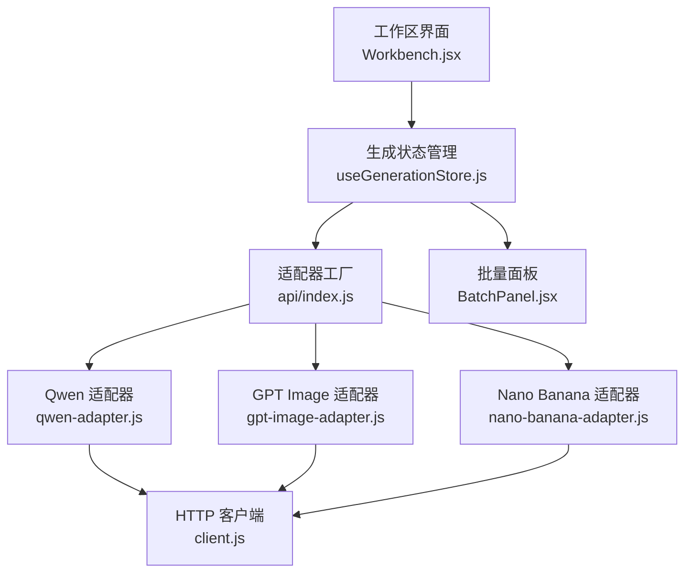
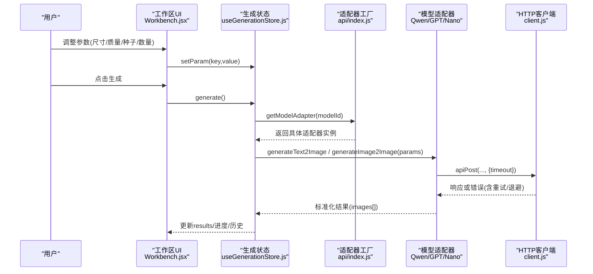
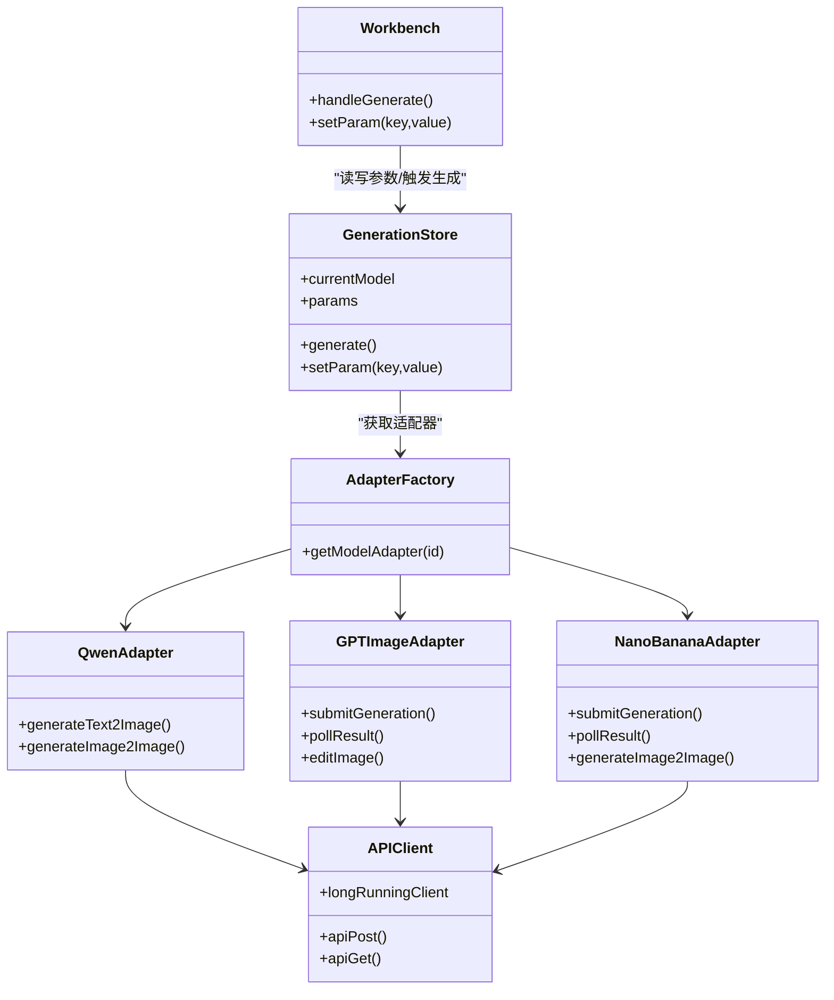

# 生成参数配置

<cite>
**本文引用的文件**   
- [useGenerationStore.js](file://app/src/stores/useGenerationStore.js)
- [models.js](file://app/src/constants/models.js)
- [client.js](file://app/src/services/api/client.js)
- [index.js](file://app/src/services/api/index.js)
- [qwen-adapter.js](file://app/src/services/api/qwen-adapter.js)
- [gpt-image-adapter.js](file://app/src/services/api/gpt-image-adapter.js)
- [nano-banana-adapter.js](file://app/src/services/api/nano-banana-adapter.js)
- [Workbench.jsx](file://app/src/pages/Workbench.jsx)
- [BatchPanel.jsx](file://app/src/components/BatchPanel.jsx)
</cite>

## 目录
1. [简介](#简介)
2. [项目结构](#项目结构)
3. [核心组件](#核心组件)
4. [架构总览](#架构总览)
5. [详细组件分析](#详细组件分析)
6. [依赖关系分析](#依赖关系分析)
7. [性能与稳定性](#性能与稳定性)
8. [故障排查指南](#故障排查指南)
9. [结论](#结论)
10. [附录：参数调优最佳实践与常用组合](#附录参数调优最佳实践与常用组合)

## 简介
本文件聚焦“生成参数配置”能力，系统梳理图像尺寸设置、质量等级选择、随机种子控制、批量生成数量等核心参数的作用机制与模型差异。文档同时解释高级参数（如 seed、quality）对输出结果的影响，并提供不同模型的兼容性说明（固定尺寸 vs 自由尺寸）、参数调优建议与常见配置组合示例，帮助读者高效产出高质量图像。

## 项目结构
与“生成参数配置”直接相关的代码主要分布在以下位置：
- 模型定义与默认参数：constants/models.js
- 工作区 UI 与参数绑定：pages/Workbench.jsx
- 批量任务面板：components/BatchPanel.jsx
- 状态管理与生成流程：stores/useGenerationStore.js
- API 客户端与重试/超时策略：services/api/client.js
- 适配器工厂与各模型实现：services/api/index.js, qwen-adapter.js, gpt-image-adapter.js, nano-banana-adapter.js

图表来源
- [Workbench.jsx:1-120](file://app/src/pages/Workbench.jsx#L1-L120)
- [useGenerationStore.js:1-120](file://app/src/stores/useGenerationStore.js#L1-L120)
- [index.js:15-31](file://app/src/services/api/index.js#L15-L31)
- [qwen-adapter.js:1-60](file://app/src/services/api/qwen-adapter.js#L1-L60)
- [gpt-image-adapter.js:1-60](file://app/src/services/api/gpt-image-adapter.js#L1-L60)
- [nano-banana-adapter.js:1-60](file://app/src/services/api/nano-banana-adapter.js#L1-L60)
- [client.js:1-40](file://app/src/services/api/client.js#L1-L40)

章节来源
- [models.js:1-106](file://app/src/constants/models.js#L1-L106)
- [Workbench.jsx:1-120](file://app/src/pages/Workbench.jsx#L1-L120)
- [BatchPanel.jsx:1-120](file://app/src/components/BatchPanel.jsx#L1-L120)
- [useGenerationStore.js:1-120](file://app/src/stores/useGenerationStore.js#L1-L120)
- [client.js:1-40](file://app/src/services/api/client.js#L1-L40)
- [index.js:15-31](file://app/src/services/api/index.js#L15-L31)

## 核心组件
- 模型常量与默认参数：集中定义各模型的可用尺寸、质量等级、能力开关与默认参数值。
- 工作区 UI：将用户选择的参数映射到 store.params，并在提交前根据当前模型进行校验与补齐。
- 生成状态管理：封装 generate() 流程，负责调用对应适配器、持久化批次与图片、更新进度与错误。
- HTTP 客户端：统一请求封装，支持自动重试、指数退避、长耗时请求专用实例与取消信号。
- 适配器层：按模型隔离具体 API 调用细节，包括参数归一化、异步轮询、错误解析等。

章节来源
- [models.js:8-92](file://app/src/constants/models.js#L8-L92)
- [Workbench.jsx:120-182](file://app/src/pages/Workbench.jsx#L120-L182)
- [useGenerationStore.js:112-290](file://app/src/stores/useGenerationStore.js#L112-L290)
- [client.js:18-88](file://app/src/services/api/client.js#L18-L88)
- [index.js:20-31](file://app/src/services/api/index.js#L20-L31)

## 架构总览
下图展示从用户操作到最终结果的端到端数据流，重点标注参数在各层的流转与转换。

图表来源
- [Workbench.jsx:164-182](file://app/src/pages/Workbench.jsx#L164-L182)
- [useGenerationStore.js:112-290](file://app/src/stores/useGenerationStore.js#L112-L290)
- [index.js:20-31](file://app/src/services/api/index.js#L20-L31)
- [qwen-adapter.js:60-105](file://app/src/services/api/qwen-adapter.js#L60-L105)
- [gpt-image-adapter.js:164-190](file://app/src/services/api/gpt-image-adapter.js#L164-L190)
- [nano-banana-adapter.js:129-152](file://app/src/services/api/nano-banana-adapter.js#L129-L152)
- [client.js:112-116](file://app/src/services/api/client.js#L112-L116)

## 详细组件分析

### 模型定义与默认参数
- 支持的模型与能力：
  - Qwen Image 3：支持文生图、图生图、提示词扩写、负向提示、种子控制；提供固定尺寸列表；不支持 quality 字段。
  - GPT Image 2：支持文生图、图编辑（掩码），支持 quality（low/medium/high/auto），不支持 seed；尺寸包含 auto。
  - Nano Banana 2：支持文生图、图生图，支持 quality（0.5K/1K/2K/4K），不支持 seed；尺寸以比例为主，也支持 auto。
- 默认参数：
  - size：各模型默认尺寸不同，Qwen 为 1024*1024，GPT 为 1024x1024，Nano 为 auto。
  - n：默认 1。
  - prompt_extend/prompt_extend_mode：仅 Qwen 使用。
  - quality：GPT 与 Nano 使用，GPT 默认 auto，Nano 默认 2K。
  - seed：仅 Qwen 支持，默认 -1（表示随机）。

章节来源
- [models.js:8-92](file://app/src/constants/models.js#L8-L92)

### 工作区参数绑定与校验
- 尺寸映射：
  - 对于 Qwen，UI 的预设比例会映射到其 native sizes（如 1:1 → 1024*1024）。
  - 对于 Nano Banana 2，size 直接使用比例字符串（如 '1:1'）。
  - 对于 GPT Image 2，size 使用像素串（如 '1024x1024'）。
- 质量等级：
  - 当模型支持 qualitySupport 时，UI 渲染 quality 控件并写入 params.quality。
- 种子控制：
  - 当模型支持 seedControl 时，UI 渲染 seed 输入框；若为空则设为 -1（随机）。
- 批量数量：
  - 通过 generationCount 控制每次生成的图片数 n，受模型 countRange 限制。
- 提示词扩写：
  - 仅 Qwen 在生成前将 promptExtend 写入 params.prompt_extend。

章节来源
- [Workbench.jsx:49-58](file://app/src/pages/Workbench.jsx#L49-L58)
- [Workbench.jsx:120-182](file://app/src/pages/Workbench.jsx#L120-L182)
- [models.js:8-92](file://app/src/constants/models.js#L8-L92)

### 生成流程与参数传递
- 入口：generate() 获取当前 model、prompt、referenceImages、params，构造执行函数并提交至 TaskEngine。
- 适配：根据 currentModel 选择适配器，分别调用 text2image 或 image2image。
- 参数归一化：
  - Qwen：size 会被规范化为 16 的倍数（T2I）或 32 的倍数（I2I）；seed 仅在非负整数时传入。
  - GPT/Nano：遵循各自 API 规范，quality 仅在非 auto 时传入。
- 结果处理：将 images[] 持久化到数据库，更新 results 与 batchHistory。

章节来源
- [useGenerationStore.js:112-290](file://app/src/stores/useGenerationStore.js#L112-L290)
- [qwen-adapter.js:28-35](file://app/src/services/api/qwen-adapter.js#L28-L35)
- [qwen-adapter.js:60-105](file://app/src/services/api/qwen-adapter.js#L60-L105)
- [gpt-image-adapter.js:164-190](file://app/src/services/api/gpt-image-adapter.js#L164-L190)
- [nano-banana-adapter.js:129-152](file://app/src/services/api/nano-banana-adapter.js#L129-L152)

### 网络与重试策略
- 普通请求：默认 60s 超时，自动重试最多 3 次，指数退避。
- 同步长耗时请求（如 Qwen T2I/I2I）：使用 longRunningClient，5 分钟超时。
- 异步任务（GPT/Nano）：提交后轮询任务状态，指数增长间隔，最长 5 分钟。

章节来源
- [client.js:18-33](file://app/src/services/api/client.js#L18-L33)
- [client.js:38-88](file://app/src/services/api/client.js#L38-L88)
- [gpt-image-adapter.js:19-91](file://app/src/services/api/gpt-image-adapter.js#L19-L91)
- [nano-banana-adapter.js:16-76](file://app/src/services/api/nano-banana-adapter.js#L16-L76)

### 批量生成与多变体
- 多批次：同一 prompt + 参数重复生成 N 批，扩大候选池。
- 多变体：基于变量（风格、尺寸等）排列组合生成，每组合固定张数。
- Prompt 队列：逐行读取多个 prompt 依次生成。

章节来源
- [BatchPanel.jsx:48-101](file://app/src/components/BatchPanel.jsx#L48-L101)

## 依赖关系分析
- 耦合与内聚：
  - Workbench 与 useGenerationStore 高内聚，负责 UI 与状态同步。
  - useGenerationStore 与适配器工厂解耦，通过工厂方法获取具体适配器。
  - 适配器与 client 解耦，client 提供统一的 HTTP 能力。
- 外部依赖：
  - axios 作为底层 HTTP 库。
  - IndexedDB 用于持久化批次与图片记录。
- 潜在循环依赖：
  - 无直接循环导入；通过模块导出与工厂模式避免耦合。

图表来源
- [Workbench.jsx:120-182](file://app/src/pages/Workbench.jsx#L120-L182)
- [useGenerationStore.js:112-290](file://app/src/stores/useGenerationStore.js#L112-L290)
- [index.js:20-31](file://app/src/services/api/index.js#L20-L31)
- [qwen-adapter.js:60-105](file://app/src/services/api/qwen-adapter.js#L60-L105)
- [gpt-image-adapter.js:164-190](file://app/src/services/api/gpt-image-adapter.js#L164-L190)
- [nano-banana-adapter.js:129-152](file://app/src/services/api/nano-banana-adapter.js#L129-L152)
- [client.js:112-116](file://app/src/services/api/client.js#L112-L116)

## 性能与稳定性
- 超时与重试：
  - 短请求默认 60s，失败自动重试 3 次，指数退避。
  - 同步长耗时接口（Qwen）使用 5 分钟超时，避免误判超时。
  - 异步任务（GPT/Nano）采用指数增长轮询，最大 5 分钟，降低服务器压力。
- 资源占用：
  - 批量生成需考虑并发与排队，建议分批次执行，避免长时间阻塞 UI。
- 可取消性：
  - 所有请求均支持 AbortSignal，可在用户主动取消时及时中断。

[本节为通用指导，不直接分析具体文件]

## 故障排查指南
- 常见问题定位：
  - 尺寸不合法：Qwen 要求宽高为 16/32 的倍数，UI 已做映射，但自定义尺寸仍可能被归一化。
  - 质量参数无效：GPT/Nano 的 quality 仅在非 auto 时生效；传入未识别值会导致上游报错。
  - 种子无效：仅 Qwen 支持 seed；其他模型忽略该参数。
  - 参考图数量超限：各模型 maxRefs 不同，超出将被忽略或报错。
- 日志与调试：
  - 适配器层打印请求体与响应键，便于快速定位格式问题。
  - 客户端拦截器统一规范化错误信息，包含 status 与原始错误。

章节来源
- [qwen-adapter.js:28-35](file://app/src/services/api/qwen-adapter.js#L28-L35)
- [gpt-image-adapter.js:115-154](file://app/src/services/api/gpt-image-adapter.js#L115-L154)
- [nano-banana-adapter.js:82-114](file://app/src/services/api/nano-banana-adapter.js#L82-L114)
- [client.js:38-88](file://app/src/services/api/client.js#L38-L88)

## 结论
本项目的参数配置体系围绕“模型能力声明 + UI 绑定 + 适配器归一化”三层展开，既保证了跨模型的一致性体验，又保留了各模型特有的灵活度。通过合理的参数组合与批量策略，可以在保证稳定性的前提下提升产出效率与质量。

[本节为总结，不直接分析具体文件]

## 附录：参数调优最佳实践与常用组合

### 关键参数说明
- 图像尺寸 size
  - Qwen：固定尺寸列表，UI 会将比例映射到原生尺寸；自定义尺寸会被归一化为 16/32 的倍数。
  - GPT：支持像素尺寸与 auto；auto 由服务端决定。
  - Nano：支持比例与 auto；比例即 size 值。
- 质量等级 quality
  - GPT：low/medium/high/auto；auto 由服务端自适应。
  - Nano：0.5K/1K/2K/4K；越高越清晰但耗时更长。
- 随机种子 seed
  - 仅 Qwen 支持；-1 表示随机；固定正整数可实现可复现生成。
- 批量数量 n
  - 受模型 countRange 限制；Qwen 固定 1，GPT 支持 1-4，Nano 固定 1。
- 提示词扩写 prompt_extend
  - 仅 Qwen 支持；开启后可增强语义表达，提高成功率。

### 模型差异与兼容性
- 固定尺寸模型 vs 自由尺寸模型
  - 固定尺寸：Qwen（严格尺寸列表与归一化规则）。
  - 自由尺寸：GPT（像素或 auto）、Nano（比例或 auto）。
- 能力对比
  - 参考图上限：Qwen 最多 3 张，GPT/Nano 最多 1 张。
  - 局部重绘：仅 GPT 支持 mask 编辑。
  - 种子控制：仅 Qwen 支持。
  - 质量等级：GPT/Nano 支持，Qwen 不支持。

### 高级参数机制
- seed 的作用
  - 固定 seed 可复现实验结果，适合 A/B 对比与回归测试。
  - 未设置或 -1 时，服务端随机采样，多样性更高。
- quality 的控制
  - 低质量更快更省资源，适合预览与大量筛选。
  - 高质量适合最终交付，但耗时显著增加。

### 推荐配置组合
- 快速探索
  - Qwen：size=1024*1024，n=1，prompt_extend=true，seed=-1
  - GPT：size=auto，quality=low，n=1
  - Nano：size=1:1，quality=1K，n=1
- 精细打磨
  - Qwen：size=2048*2048，n=1，prompt_extend=true，seed=固定值
  - GPT：size=1024x1024，quality=high，n=1
  - Nano：size=16:9，quality=4K，n=1
- 批量筛选
  - 使用“多批次”模式，N=5~10，配合 low/1K 质量，先筛再精修。
- 多变体实验
  - 多变体模式：风格×尺寸组合，每组合固定张数，快速覆盖多种构图与风格。

### 常见问题与对策
- 生成缓慢
  - 降低 quality 或缩小 size；分批执行；避免过多参考图。
- 结果不稳定
  - 固定 seed（Qwen）；减少 prompt 长度；启用 prompt_extend（Qwen）。
- 上传参考图被忽略
  - 检查模型 maxRefs 限制；确保图片格式与大小符合约束。

章节来源
- [models.js:8-92](file://app/src/constants/models.js#L8-L92)
- [Workbench.jsx:49-58](file://app/src/pages/Workbench.jsx#L49-L58)
- [Workbench.jsx:120-182](file://app/src/pages/Workbench.jsx#L120-L182)
- [BatchPanel.jsx:48-101](file://app/src/components/BatchPanel.jsx#L48-L101)
- [qwen-adapter.js:60-105](file://app/src/services/api/qwen-adapter.js#L60-L105)
- [gpt-image-adapter.js:164-190](file://app/src/services/api/gpt-image-adapter.js#L164-L190)
- [nano-banana-adapter.js:129-152](file://app/src/services/api/nano-banana-adapter.js#L129-L152)