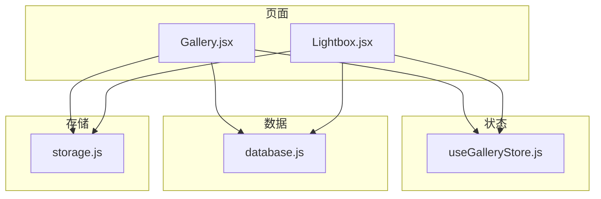
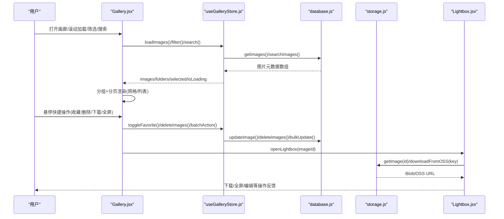
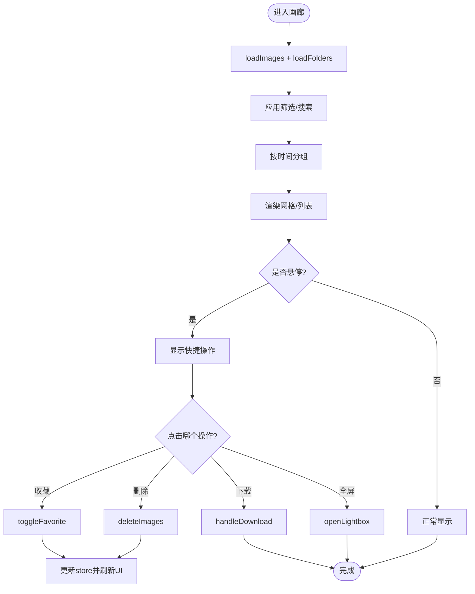
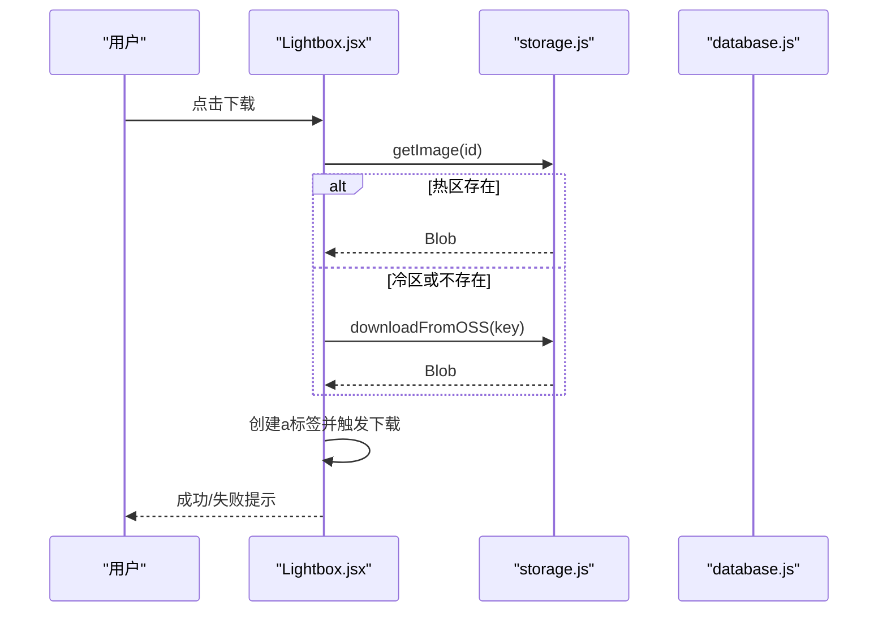
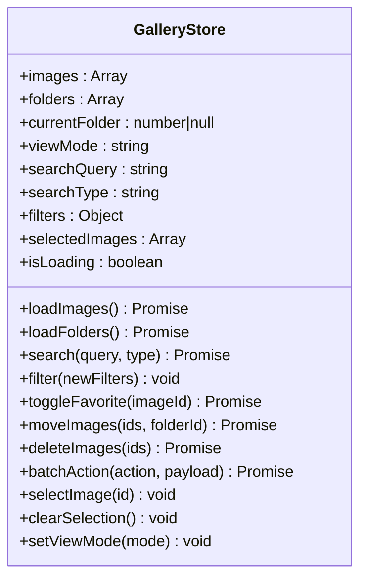
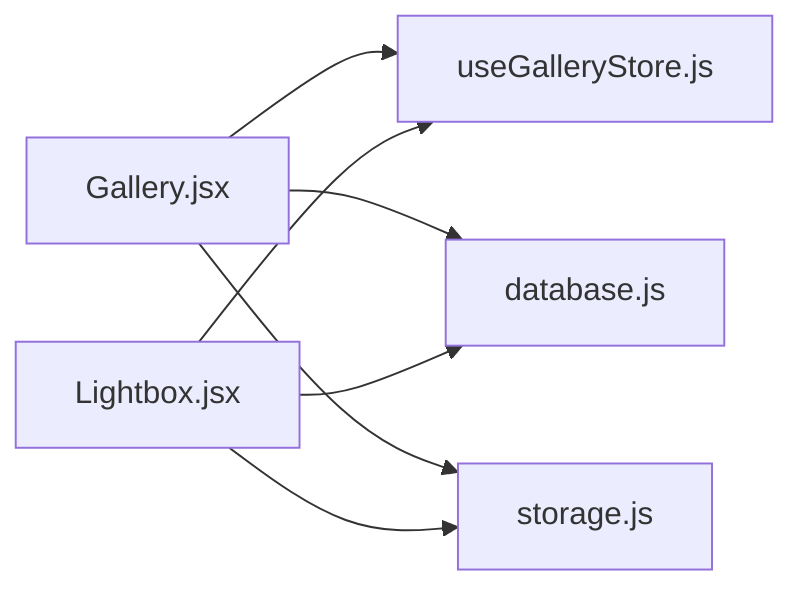

# 结果展示区

<cite>
**本文引用的文件**   
- [Gallery.jsx](file://app/src/pages/Gallery.jsx)
- [useGalleryStore.js](file://app/src/stores/useGalleryStore.js)
- [Lightbox.jsx](file://app/src/components/Lightbox.jsx)
- [database.js](file://app/src/db/database.js)
- [storage.js](file://app/src/services/storage.js)
- [styles.css](file://app/src/styles.css)
</cite>

## 目录
1. [简介](#简介)
2. [项目结构](#项目结构)
3. [核心组件](#核心组件)
4. [架构总览](#架构总览)
5. [详细组件分析](#详细组件分析)
6. [依赖关系分析](#依赖关系分析)
7. [性能考量](#性能考量)
8. [故障排查指南](#故障排查指南)
9. [结论](#结论)
10. [附录](#附录)

## 简介
本章节聚焦“结果展示区”的功能与实现，涵盖：
- 网格布局、列表视图、分组显示与无限滚动
- 悬停快捷操作（收藏、全屏查看、删除、下载）
- 图片预览与全屏查看器（Lightbox）
- 批量操作（多选、批量收藏/移动/导出/删除）
- 状态管理（加载、错误、筛选、搜索）
- 最佳实践（批量下载、分类整理、性能优化建议）

## 项目结构
结果展示区由页面组件、全局状态、数据层与存储服务共同构成：
- 页面层：画廊页负责渲染网格/列表、交互与批量操作
- 状态层：Zustand Store 维护图片集合、文件夹、选择态、筛选条件等
- 数据层：IndexedDB（Dexie）持久化图片元数据与缩略图 URL
- 存储层：本地热区（IndexedDB Blob）与云端冷区（OSS）的冷热分层存储
- 样式层：设计令牌与主题变量控制视觉表现

图表来源
- [Gallery.jsx:1-120](file://app/src/pages/Gallery.jsx#L1-L120)
- [Lightbox.jsx:1-120](file://app/src/components/Lightbox.jsx#L1-L120)
- [useGalleryStore.js:1-120](file://app/src/stores/useGalleryStore.js#L1-L120)
- [database.js:1-120](file://app/src/db/database.js#L1-L120)
- [storage.js:1-120](file://app/src/services/storage.js#L1-L120)

章节来源
- [Gallery.jsx:1-120](file://app/src/pages/Gallery.jsx#L1-L120)
- [useGalleryStore.js:1-120](file://app/src/stores/useGalleryStore.js#L1-L120)
- [database.js:1-120](file://app/src/db/database.js#L1-L120)
- [storage.js:1-120](file://app/src/services/storage.js#L1-L120)

## 核心组件
- Gallery 页面：提供搜索、筛选、分组、网格/列表切换、导入、批量操作、右键菜单、详情侧边栏。
- Lightbox 全屏查看器：支持缩放、左右切换、复制提示词、收藏、淘汰、重新生成、设为参考、局部重绘、移动到文件夹、加入知识库、下载。
- useGalleryStore：集中管理图片列表、文件夹树、当前文件夹、视图模式、搜索与筛选、选中项、批量动作。
- database：基于 Dexie 的 IndexedDB 封装，提供增删改查、批量更新、统计等能力。
- storage：冷热分区存储策略，缩略图生成、OSS 上传/下载、容量迁移与统计。

章节来源
- [Gallery.jsx:120-527](file://app/src/pages/Gallery.jsx#L120-L527)
- [Lightbox.jsx:120-702](file://app/src/components/Lightbox.jsx#L120-L702)
- [useGalleryStore.js:120-204](file://app/src/stores/useGalleryStore.js#L120-L204)
- [database.js:120-339](file://app/src/db/database.js#L120-L339)
- [storage.js:120-393](file://app/src/services/storage.js#L120-L393)

## 架构总览
结果展示区的整体数据流与控制流如下：

图表来源
- [Gallery.jsx:120-220](file://app/src/pages/Gallery.jsx#L120-L220)
- [useGalleryStore.js:28-120](file://app/src/stores/useGalleryStore.js#L28-L120)
- [database.js:56-127](file://app/src/db/database.js#L56-L127)
- [storage.js:87-174](file://app/src/services/storage.js#L87-L174)
- [Lightbox.jsx:59-120](file://app/src/components/Lightbox.jsx#L59-L120)

## 详细组件分析

### 画廊页面（Gallery）
- 网格布局与分组
  - 按时间分组：今天、昨天、本周、本月、更早；每组可折叠展开。
  - 网格列数自适应：gridTemplateColumns 使用 minmax 自动填充，保持卡片比例一致。
  - 列表视图：单行条目，左侧缩略图，右侧提示词与收藏按钮。
- 悬停效果与快捷操作
  - 网格模式下，鼠标悬停显示半透明遮罩，出现收藏、全屏查看、删除、下载四个快捷按钮。
  - 右上角收藏星标实时反映 favorite 状态。
- 搜索与筛选
  - 关键词搜索：延迟触发，调用 store.search() 后从 IndexedDB 检索匹配 prompt/model/tags。
  - 筛选器：模型、日期范围、纵横比、仅收藏；日期范围在客户端过滤。
- 批量操作
  - 顶部工具条：移动、收藏、导出、淘汰；支持多选后统一执行。
  - 右键菜单：用相同参数再来一批、以此图为参考图、微调 prompt 再生成、局部重绘、移动到文件夹、收藏/取消收藏、淘汰、导出。
- 导入与批量导出
  - 导入：限制 JPG/PNG/WebP，Canvas 生成缩略图，记录尺寸与创建时间，写入 IndexedDB。
  - 批量导出：逐个创建 a 标签触发下载，间隔节流避免浏览器拦截。
- 详情侧边栏
  - 展示图片、提示词、模型、参数、操作按钮（下载、收藏、全屏、删除）。

图表来源
- [Gallery.jsx:128-170](file://app/src/pages/Gallery.jsx#L128-L170)
- [Gallery.jsx:428-470](file://app/src/pages/Gallery.jsx#L428-L470)
- [useGalleryStore.js:90-123](file://app/src/stores/useGalleryStore.js#L90-L123)

章节来源
- [Gallery.jsx:128-527](file://app/src/pages/Gallery.jsx#L128-L527)
- [useGalleryStore.js:120-204](file://app/src/stores/useGalleryStore.js#L120-L204)

### 全屏查看器（Lightbox）
- 导航与缩放
  - 左右箭头切换，键盘 Esc/←/→ 支持；缩放级别 0.25~3，支持适应窗口与 1:1 原始大小。
- 信息面板
  - 提示词、模型、参数、用户备注（可保存至数据库）。
- 快捷操作
  - 收藏、淘汰、重新生成、设为参考、局部重绘、移动到文件夹、加入知识库、下载。
- 下载逻辑
  - 优先从热区获取 Blob，若为冷区则通过 OSS 下载；失败时给出错误提示。
- 移动到文件夹
  - 弹出文件夹选择器，确认后更新图片 folderId。

图表来源
- [Lightbox.jsx:59-92](file://app/src/components/Lightbox.jsx#L59-L92)
- [storage.js:87-174](file://app/src/services/storage.js#L87-L174)

章节来源
- [Lightbox.jsx:120-702](file://app/src/components/Lightbox.jsx#L120-L702)
- [storage.js:120-393](file://app/src/services/storage.js#L120-L393)

### 状态管理（useGalleryStore）
- 关键状态
  - images、folders、currentFolder、viewMode、searchQuery、searchType、filters、selectedImages、isLoading。
- 主要动作
  - loadImages：根据当前文件夹、筛选、搜索条件加载图片；客户端再按日期范围过滤。
  - filter：合并新筛选条件并重新加载。
  - search：设置搜索词与类型后触发加载。
  - toggleFavorite：切换收藏并即时更新 UI。
  - moveImages/deleteImages/batchAction：批量移动、删除、收藏等。
  - selectImage/clearSelection：多选与清空。
  - setViewMode：切换网格/列表。
- 错误处理
  - 异步异常捕获并置 isLoading=false，便于 UI 恢复。

图表来源
- [useGalleryStore.js:11-204](file://app/src/stores/useGalleryStore.js#L11-L204)

章节来源
- [useGalleryStore.js:1-204](file://app/src/stores/useGalleryStore.js#L1-L204)

### 数据层（database）
- 表结构
  - images：主键 id，索引包含 batchId、folderId、model、favorite、createdAt、storageZone、复合索引 [folderId+createdAt]。
  - folders：id、name、parentId、createdAt。
  - batches/sessions/tasks/settings/casePackages：辅助表。
- 常用接口
  - addImage/getImages/getImage/updateImage/deleteImage/deleteImages/searchImages/toggleImageFavorite/moveImages/getImageStats。
- 查询与排序
  - 默认按 createdAt 倒序；支持 folderId、model、favorite 过滤；支持 limit/offset 分页。

章节来源
- [database.js:22-138](file://app/src/db/database.js#L22-L138)

### 存储服务（storage）
- 冷热分区
  - 热区：IndexedDB 中保存 Blob 与缩略图 URL，快速访问。
  - 冷区：阿里云 OSS 长期存储，适合大体积与归档。
- 缩略图生成
  - Canvas 绘制，最大维度 200px，质量 0.8，返回 Blob。
- 迁移策略
  - checkAndMigrate：当热区使用超过阈值，按创建时间升序将旧图迁移到冷区，释放本地空间。
- 下载与上传
  - uploadToOSS/downloadFromOSS：封装 ali-oss SDK，浏览器端直接传 Blob/File。

章节来源
- [storage.js:1-120](file://app/src/services/storage.js#L1-L120)
- [storage.js:200-314](file://app/src/services/storage.js#L200-L314)

## 依赖关系分析
- Gallery 依赖 useGalleryStore 进行状态读写，依赖 database 做数据持久化，依赖 storage 做下载与缩略图。
- Lightbox 同样依赖 store 与 database，并通过 storage 获取 Blob 或从 OSS 下载。
- 状态层与数据层解耦，便于扩展更多筛选与批量操作。

图表来源
- [Gallery.jsx:1-120](file://app/src/pages/Gallery.jsx#L1-L120)
- [Lightbox.jsx:1-120](file://app/src/components/Lightbox.jsx#L1-L120)
- [useGalleryStore.js:1-120](file://app/src/stores/useGalleryStore.js#L1-L120)
- [database.js:1-120](file://app/src/db/database.js#L1-L120)
- [storage.js:1-120](file://app/src/services/storage.js#L1-L120)

章节来源
- [Gallery.jsx:1-120](file://app/src/pages/Gallery.jsx#L1-L120)
- [Lightbox.jsx:1-120](file://app/src/components/Lightbox.jsx#L1-L120)
- [useGalleryStore.js:1-120](file://app/src/stores/useGalleryStore.js#L1-L120)
- [database.js:1-120](file://app/src/db/database.js#L1-L120)
- [storage.js:1-120](file://app/src/services/storage.js#L1-L120)

## 性能考量
- 虚拟滚动与分页
  - 当前采用“加载更多”分页（每次追加 50 张），结合分组减少首屏渲染压力。
- 缩略图与懒加载
  - 导入与存储均生成缩略图，网格以缩略图 URL 作为背景图，降低大图渲染开销。
- 批量下载节流
  - 批量导出对每个下载请求间隔 200ms，避免浏览器拦截连续下载。
- 冷热分区迁移
  - 当热区容量超限时，自动将旧图迁移到 OSS，释放本地空间，提升浏览性能。
- 样式与过渡
  - 使用 CSS 变量与 transition-fast/base/slow 控制动画时长，保证交互流畅。

[本节为通用性能建议，不直接分析具体文件]

## 故障排查指南
- 图片无法显示
  - 检查热区 blobUrl 是否存在，必要时从冷区 ossUrl 回源下载。
  - 确认缩略图生成是否成功，必要时降级为原图 URL。
- 下载失败
  - 热区 Blob 不可用时，尝试通过 StorageService.getImage 或 downloadFromOSS 获取。
  - 检查浏览器权限与跨域策略（OSS 配置是否正确）。
- 批量操作无响应
  - 确认 selectedImages 是否为空；检查 store.batchAction 分支是否覆盖所需动作。
- 筛选/搜索无效
  - 检查 filters.dateRange 是否在客户端正确计算；确认 searchType 是否为 keyword。
- 存储空间不足
  - 运行 checkAndMigrate 将旧图迁移到冷区；调整 hotCapacity 阈值。

章节来源
- [storage.js:87-174](file://app/src/services/storage.js#L87-L174)
- [useGalleryStore.js:178-204](file://app/src/stores/useGalleryStore.js#L178-L204)
- [Gallery.jsx:231-255](file://app/src/pages/Gallery.jsx#L231-L255)

## 结论
结果展示区通过清晰的组件分层与状态管理，实现了高效的网格/列表展示、丰富的悬停与批量操作、完善的图片预览与下载流程，并结合冷热分区存储保障性能与可扩展性。建议在后续迭代中引入虚拟滚动与更细粒度的缓存策略，进一步提升大数据量下的体验。

[本节为总结性内容，不直接分析具体文件]

## 附录

### 网格布局与悬停效果要点
- 网格列宽自适应：minmax(180px, 1fr)，确保在不同屏幕下保持良好密度。
- 悬停遮罩：opacity 与 pointerEvents 控制显隐，避免误触。
- 收藏星标：实时反映 favorite 状态，点击即更新。

章节来源
- [Gallery.jsx:428-470](file://app/src/pages/Gallery.jsx#L428-L470)
- [styles.css:1-200](file://app/src/styles.css#L1-L200)

### 批量操作最佳实践
- 批量下载
  - 使用间隔节流，避免浏览器拦截；对失败项单独提示。
- 分类整理
  - 使用文件夹树组织图片，支持移动到未分类或指定文件夹；删除文件夹时自动将子文件夹图片移至根目录。
- 性能优化
  - 优先使用缩略图；对冷区图片按需回源；定期执行冷热迁移。

章节来源
- [Gallery.jsx:231-255](file://app/src/pages/Gallery.jsx#L231-L255)
- [database.js:219-229](file://app/src/db/database.js#L219-L229)
- [storage.js:252-298](file://app/src/services/storage.js#L252-L298)