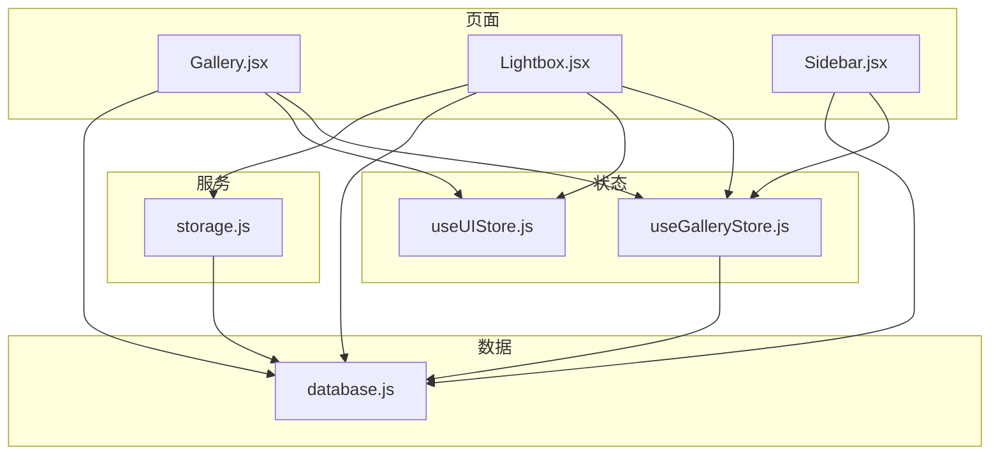
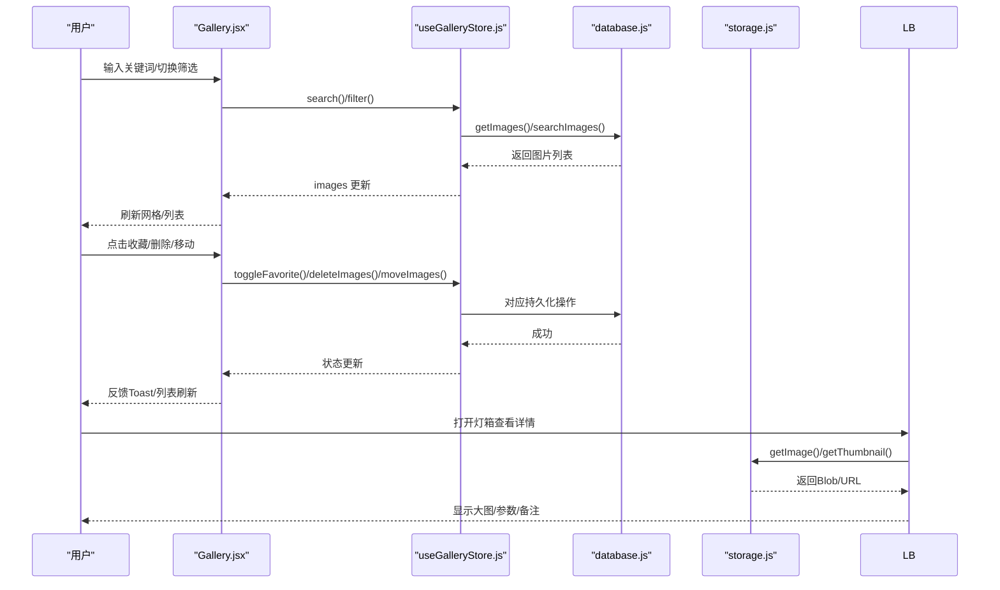
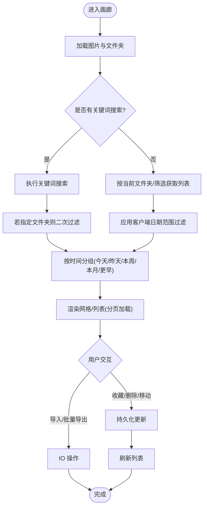
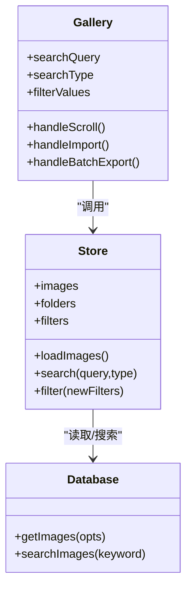
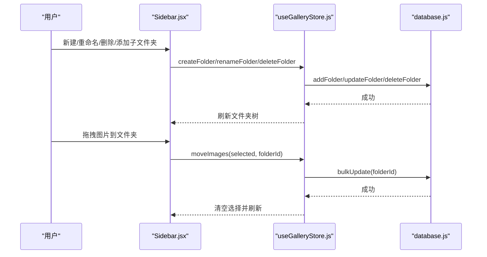
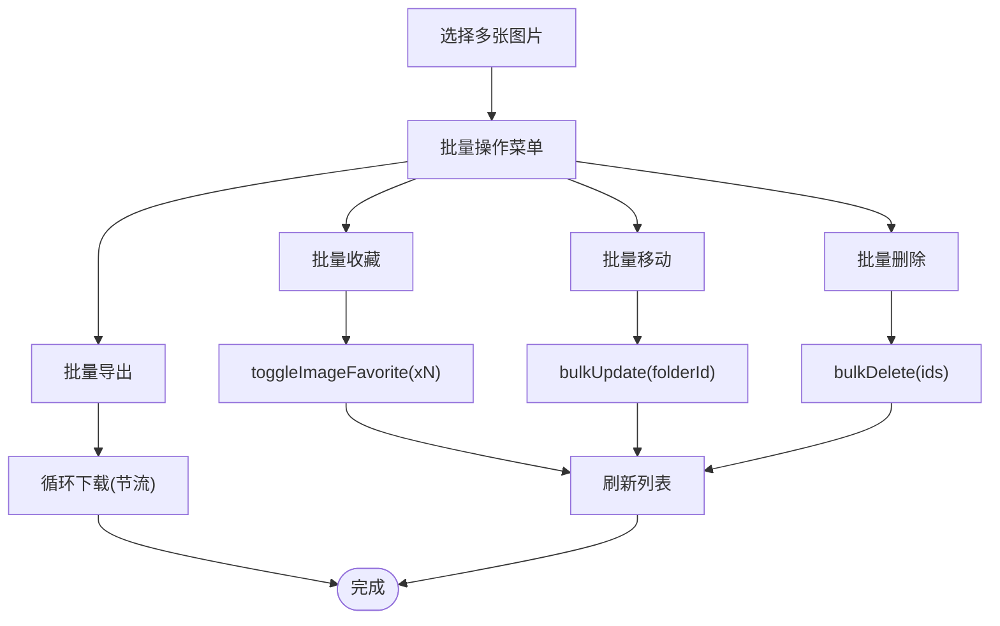
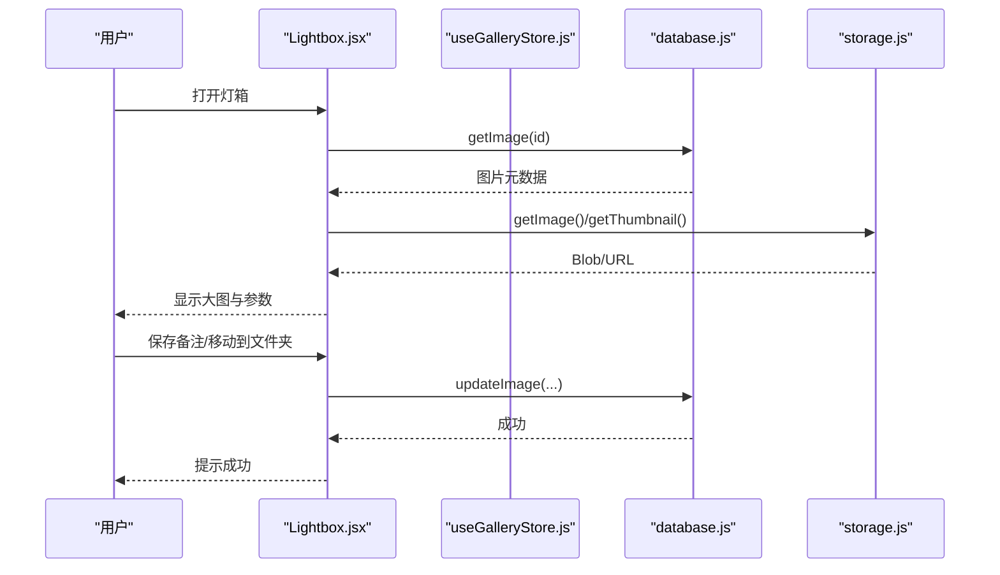
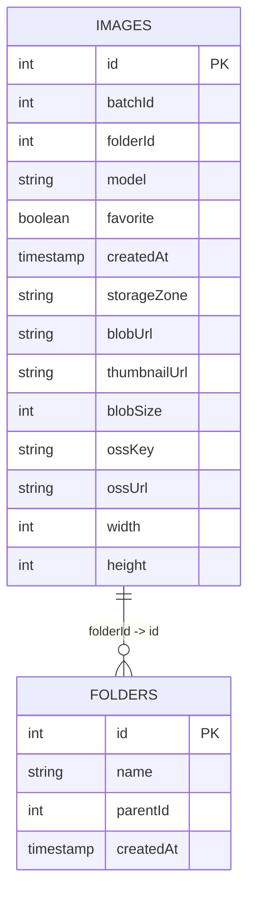
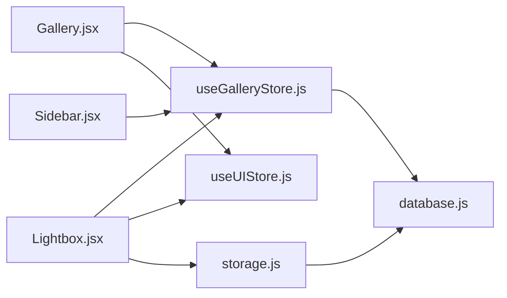

# 图库管理

<cite>
**本文引用的文件**   
- [README.md](file://README.md)
- [Gallery.jsx](file://app/src/pages/Gallery.jsx)
- [useGalleryStore.js](file://app/src/stores/useGalleryStore.js)
- [database.js](file://app/src/db/database.js)
- [storage.js](file://app/src/services/storage.js)
- [Lightbox.jsx](file://app/src/components/Lightbox.jsx)
- [Sidebar.jsx](file://app/src/components/Sidebar.jsx)
- [useUIStore.js](file://app/src/stores/useUIStore.js)
- [BatchPanel.jsx](file://app/src/components/BatchPanel.jsx)
</cite>

## 目录
1. [简介](#简介)
2. [项目结构](#项目结构)
3. [核心组件](#核心组件)
4. [架构总览](#架构总览)
5. [详细组件分析](#详细组件分析)
6. [依赖关系分析](#依赖关系分析)
7. [性能与优化](#性能与优化)
8. [故障排查指南](#故障排查指南)
9. [结论](#结论)
10. [附录：最佳实践与检索技巧](#附录最佳实践与检索技巧)

## 简介
本文件面向“AI Image Studio”的图库管理功能，系统性说明图片浏览界面、搜索过滤系统、文件夹分类管理、收藏与批量操作等特性；并解释图片存储结构、索引机制与查询优化策略。同时提供用户组织与管理大量生成图片资产的操作指引，以及高效检索和资产管理最佳实践。

## 项目结构
图库相关代码主要分布在页面、状态管理、数据库层与服务层：
- 页面层：画廊主视图（Grid/List）、灯箱查看器、侧边栏（文件夹树）
- 状态层：图库状态（图片/文件夹/筛选/选择/批量）
- 数据层：IndexedDB 表结构与增删改查封装
- 服务层：冷热分层存储（本地 IndexedDB + 云端 OSS），缩略图生成与迁移策略

图表来源
- [Gallery.jsx:1-120](file://app/src/pages/Gallery.jsx#L1-L120)
- [Lightbox.jsx:1-120](file://app/src/components/Lightbox.jsx#L1-L120)
- [Sidebar.jsx:1-120](file://app/src/components/Sidebar.jsx#L1-L120)
- [useGalleryStore.js:1-120](file://app/src/stores/useGalleryStore.js#L1-L120)
- [useUIStore.js:1-80](file://app/src/stores/useUIStore.js#L1-L80)
- [database.js:1-120](file://app/src/db/database.js#L1-L120)
- [storage.js:1-120](file://app/src/services/storage.js#L1-L120)

章节来源
- [README.md:1-10](file://README.md#L1-L10)

## 核心组件
- 画廊页面（Gallery）：负责图片列表渲染、分组展示、搜索与过滤、导入导出、批量操作、上下文菜单、详情面板与移动至文件夹。
- 灯箱（Lightbox）：全屏查看、缩放、复制提示词、收藏/淘汰、重新生成、参考图、局部重绘、移动到文件夹、加入知识库、下载。
- 侧边栏（Sidebar）：导航、文件夹树（创建/重命名/删除/子文件夹）、拖拽移动图片到文件夹。
- 图库状态（useGalleryStore）：集中管理图片集合、文件夹、当前文件夹、筛选条件、搜索、选中项与批量动作。
- 数据库层（database）：基于 Dexie 的 IndexedDB 表定义与 CRUD 接口，包含 images/batches/sessions/folders/tasks/settings/casePackages。
- 存储服务（storage）：冷热分层存储（hot=IndexedDB，cold=OSS），缩略图生成、上传/下载、迁移与统计。

章节来源
- [Gallery.jsx:1-120](file://app/src/pages/Gallery.jsx#L1-L120)
- [Lightbox.jsx:1-120](file://app/src/components/Lightbox.jsx#L1-L120)
- [Sidebar.jsx:1-120](file://app/src/components/Sidebar.jsx#L1-L120)
- [useGalleryStore.js:1-120](file://app/src/stores/useGalleryStore.js#L1-L120)
- [database.js:1-120](file://app/src/db/database.js#L1-L120)
- [storage.js:1-120](file://app/src/services/storage.js#L1-L120)

## 架构总览
图库管理采用“页面-状态-数据-服务”的分层架构：
- 页面通过 Zustand store 订阅状态变化，触发 UI 更新
- Store 调用 database 层进行持久化读写
- 存储服务处理 Blob 与 OSS 的冷热迁移与缩略图生成
- UI 全局状态（如灯箱开关、通知）由 useUIStore 统一管理

图表来源
- [Gallery.jsx:100-140](file://app/src/pages/Gallery.jsx#L100-L140)
- [useGalleryStore.js:30-120](file://app/src/stores/useGalleryStore.js#L30-L120)
- [database.js:56-120](file://app/src/db/database.js#L56-L120)
- [storage.js:80-120](file://app/src/services/storage.js#L80-L120)
- [Lightbox.jsx:50-120](file://app/src/components/Lightbox.jsx#L50-L120)

## 详细组件分析

### 图片浏览界面（Gallery）
- 视图模式：支持网格与列表两种布局，网格下悬停显示快捷操作（收藏、全屏、删除、下载）。
- 分组展示：按时间维度将图片分为今天/昨天/本周/本月/更早，支持折叠展开。
- 分页加载：滚动到底部自动加载更多，默认每次加载 50 张。
- 导入图片：支持 JPG/PNG/WebP，自动生成缩略图并记录尺寸、模型为 imported。
- 批量操作：顶部已选工具栏支持批量收藏、移动、导出、删除。
- 上下文菜单：右键图片可“用相同参数再来一批”“设为参考图”“微调 prompt 再生成”“局部重绘”“移动到文件夹”“收藏/取消收藏”“删除”“导出”。
- 右侧详情面板：展示图片预览、提示词、模型、日期、关键参数与常用操作。

图表来源
- [Gallery.jsx:98-140](file://app/src/pages/Gallery.jsx#L98-L140)
- [Gallery.jsx:147-228](file://app/src/pages/Gallery.jsx#L147-L228)
- [Gallery.jsx:231-255](file://app/src/pages/Gallery.jsx#L231-L255)
- [Gallery.jsx:259-338](file://app/src/pages/Gallery.jsx#L259-L338)
- [Gallery.jsx:340-527](file://app/src/pages/Gallery.jsx#L340-L527)

章节来源
- [Gallery.jsx:1-527](file://app/src/pages/Gallery.jsx#L1-L527)

### 搜索与过滤系统
- 搜索类型：关键词（当前可用）、语义（即将推出）、以图搜图（即将推出）。
- 关键词搜索：在提示词、模型名与标签数组中进行子串匹配，结果按时间倒序。
- 过滤条件：模型、日期（今天/最近7天/最近30天）、比例（横版/竖版/方形）、收藏（仅收藏）。
- 组合过滤：服务端/客户端混合过滤，日期范围在客户端过滤，其余优先走数据库查询或前端过滤。

图表来源
- [Gallery.jsx:78-132](file://app/src/pages/Gallery.jsx#L78-L132)
- [useGalleryStore.js:30-88](file://app/src/stores/useGalleryStore.js#L30-L88)
- [database.js:56-110](file://app/src/db/database.js#L56-L110)

章节来源
- [Gallery.jsx:14-132](file://app/src/pages/Gallery.jsx#L14-L132)
- [useGalleryStore.js:30-88](file://app/src/stores/useGalleryStore.js#L30-L88)
- [database.js:98-110](file://app/src/db/database.js#L98-L110)

### 文件夹分类管理
- 侧边栏文件夹树：支持根文件夹与多级子文件夹，双击重命名、右键菜单删除、新增子文件夹。
- 拖拽移动：从图库选中图片后，拖拽到目标文件夹即可移动。
- 路由联动：点击文件夹跳转 /gallery?folder={id}，并在画廊中根据 URL 参数设置当前文件夹。
- 删除文件夹：递归删除子文件夹，并将该文件夹内所有图片移至“未分类”。

图表来源
- [Sidebar.jsx:154-244](file://app/src/components/Sidebar.jsx#L154-L244)
- [useGalleryStore.js:125-152](file://app/src/stores/useGalleryStore.js#L125-L152)
- [database.js:196-229](file://app/src/db/database.js#L196-L229)

章节来源
- [Sidebar.jsx:1-371](file://app/src/components/Sidebar.jsx#L1-L371)
- [useGalleryStore.js:125-152](file://app/src/stores/useGalleryStore.js#L125-L152)
- [database.js:196-229](file://app/src/db/database.js#L196-L229)

### 收藏与批量操作
- 收藏：单图收藏/取消收藏，批量收藏统一调用 batchAction('favorite')。
- 删除：单图删除与批量删除，删除后同步清理选中项。
- 移动：单图/批量移动到指定文件夹，支持“未分类”。
- 导出：批量导出时逐条触发浏览器下载，间隔节流避免被浏览器拦截。

图表来源
- [Gallery.jsx:141-145](file://app/src/pages/Gallery.jsx#L141-L145)
- [Gallery.jsx:231-255](file://app/src/pages/Gallery.jsx#L231-L255)
- [useGalleryStore.js:178-202](file://app/src/stores/useGalleryStore.js#L178-L202)
- [database.js:94-127](file://app/src/db/database.js#L94-L127)

章节来源
- [Gallery.jsx:141-145](file://app/src/pages/Gallery.jsx#L141-L145)
- [useGalleryStore.js:178-202](file://app/src/stores/useGalleryStore.js#L178-L202)
- [database.js:94-127](file://app/src/db/database.js#L94-L127)

### 灯箱查看器（Lightbox）
- 查看与导航：左右箭头切换、键盘快捷键（Esc 关闭、← → 切换）。
- 缩放控制：放大/缩小/适应窗口/1:1 原始大小。
- 信息编辑：复制提示词、保存用户备注、查看模型与参数。
- 工作流集成：收藏/淘汰、重新生成、设为参考图、局部重绘、移动到文件夹、加入知识库、下载。
- 冷热区兼容：冷区图片通过 OSS URL 直接用于局部重绘。

图表来源
- [Lightbox.jsx:32-120](file://app/src/components/Lightbox.jsx#L32-L120)
- [database.js:79-86](file://app/src/db/database.js#L79-L86)
- [storage.js:87-114](file://app/src/services/storage.js#L87-L114)

章节来源
- [Lightbox.jsx:1-702](file://app/src/components/Lightbox.jsx#L1-L702)

### 存储结构与索引机制
- 表结构（Dexie）：
  - images：主键自增 id，索引包括 folderId、createdAt、[folderId+createdAt] 复合索引，便于按文件夹和时间排序
  - folders：主键自增 id，name、parentId、createdAt
  - batches/sessions/tasks/settings/casePackages：其他业务表
- 查询优化：
  - 使用 orderBy('createdAt').reverse() 实现最新优先
  - 使用 where('folderId').equals(...) 精准定位文件夹
  - 复合索引 [folderId+createdAt] 提升按文件夹+时间的查询效率
  - 客户端 dateRange 过滤减少不必要的数据传输
- 冷热分层：
  - hot zone：IndexedDB 存储 Blob 与缩略图，适合快速预览与编辑
  - cold zone：OSS 长期存储，节省本地空间
  - 自动迁移：当 hot zone 使用量超过阈值，按 createdAt 升序将旧图迁移到冷区

图表来源
- [database.js:22-31](file://app/src/db/database.js#L22-L31)
- [database.js:56-76](file://app/src/db/database.js#L56-L76)
- [storage.js:204-298](file://app/src/services/storage.js#L204-L298)

章节来源
- [database.js:22-31](file://app/src/db/database.js#L22-L31)
- [database.js:56-76](file://app/src/db/database.js#L56-L76)
- [storage.js:204-298](file://app/src/services/storage.js#L204-L298)

## 依赖关系分析
- 页面依赖状态：Gallery.jsx 依赖 useGalleryStore 与 useUIStore，负责 UI 交互与状态驱动
- 状态依赖数据：useGalleryStore 调用 database.js 进行持久化
- 服务依赖数据：storage.js 通过 database.js 读写元数据，并与 OSS 交互
- 组件间协作：Lightbox.jsx 与 Sidebar.jsx 均与 useGalleryStore 协作，完成查看与组织

图表来源
- [Gallery.jsx:1-120](file://app/src/pages/Gallery.jsx#L1-L120)
- [Lightbox.jsx:1-120](file://app/src/components/Lightbox.jsx#L1-L120)
- [Sidebar.jsx:1-120](file://app/src/components/Sidebar.jsx#L1-L120)
- [useGalleryStore.js:1-120](file://app/src/stores/useGalleryStore.js#L1-L120)
- [useUIStore.js:1-80](file://app/src/stores/useUIStore.js#L1-L80)
- [database.js:1-120](file://app/src/db/database.js#L1-L120)
- [storage.js:1-120](file://app/src/services/storage.js#L1-L120)

章节来源
- [Gallery.jsx:1-120](file://app/src/pages/Gallery.jsx#L1-L120)
- [Lightbox.jsx:1-120](file://app/src/components/Lightbox.jsx#L1-L120)
- [Sidebar.jsx:1-120](file://app/src/components/Sidebar.jsx#L1-L120)
- [useGalleryStore.js:1-120](file://app/src/stores/useGalleryStore.js#L1-L120)
- [useUIStore.js:1-80](file://app/src/stores/useUIStore.js#L1-L80)
- [database.js:1-120](file://app/src/db/database.js#L1-L120)
- [storage.js:1-120](file://app/src/services/storage.js#L1-L120)

## 性能与优化
- 列表渲染优化：
  - 分页加载：默认 50 张，滚动触底追加，降低首屏压力
  - 分组展示：按时间分组减少一次性渲染数量
  - 计算缓存：使用 useMemo 对过滤与分组结果进行缓存
- 查询优化：
  - 利用 Dexie 索引：folderId、createdAt、[folderId+createdAt] 复合索引
  - 客户端过滤：dateRange 在客户端过滤，减少网络与内存占用
- 存储优化：
  - 缩略图：Canvas 生成最大 200px 缩略图，提升预览速度
  - 冷热迁移：超出阈值自动迁移旧图至 OSS，释放本地空间
- 下载节流：批量导出时每条下载间隔 200ms，避免浏览器拦截

章节来源
- [Gallery.jsx:128-140](file://app/src/pages/Gallery.jsx#L128-L140)
- [database.js:56-76](file://app/src/db/database.js#L56-L76)
- [storage.js:318-388](file://app/src/services/storage.js#L318-L388)
- [storage.js:252-298](file://app/src/services/storage.js#L252-L298)
- [Gallery.jsx:231-255](file://app/src/pages/Gallery.jsx#L231-L255)

## 故障排查指南
- 导入失败：
  - 检查文件格式是否为 JPG/PNG/WebP
  - 确认 Canvas 缩略图生成是否报错（跨域或损坏图片）
- 移动失败：
  - 确认目标文件夹存在且未被删除
  - 检查 IndexedDB 写入权限与存储空间
- OSS 连接异常：
  - 校验 Bucket/Region/AccessKey 配置
  - 检查 CORS 与权限策略
- 灯箱无法显示：
  - 检查图片是否在热区（blobUrl）或冷区（ossUrl）
  - 确认 StorageService 下载逻辑正常

章节来源
- [Gallery.jsx:147-228](file://app/src/pages/Gallery.jsx#L147-L228)
- [storage.js:181-197](file://app/src/services/storage.js#L181-L197)
- [Lightbox.jsx:102-120](file://app/src/components/Lightbox.jsx#L102-L120)

## 结论
图库管理模块通过清晰的页面-状态-数据-服务分层，实现了高效的图片浏览、搜索过滤、文件夹组织与批量操作。结合 IndexedDB 索引与冷热分层存储，兼顾了性能与容量扩展。建议在生产环境中完善语义搜索与以图搜图能力，并引入更完善的错误恢复与进度反馈。

## 附录：最佳实践与检索技巧
- 组织与归档
  - 按项目/主题建立文件夹树，定期将不常用图片迁移至冷区
  - 善用收藏标记重要产出，配合“仅收藏”过滤快速定位
- 检索技巧
  - 关键词尽量包含模型名与风格词，提高命中概率
  - 使用日期与比例过滤缩小范围，再辅以收藏筛选
- 批量操作
  - 先多选再批量移动/收藏/删除，减少重复操作
  - 批量导出时注意浏览器限制，必要时分批进行
- 工作流整合
  - 使用“用相同参数再来一批”快速迭代
  - 将优质图片加入知识库，形成可复用的案例包

章节来源
- [Gallery.jsx:259-338](file://app/src/pages/Gallery.jsx#L259-L338)
- [Lightbox.jsx:141-165](file://app/src/components/Lightbox.jsx#L141-L165)
- [Sidebar.jsx:236-244](file://app/src/components/Sidebar.jsx#L236-L244)