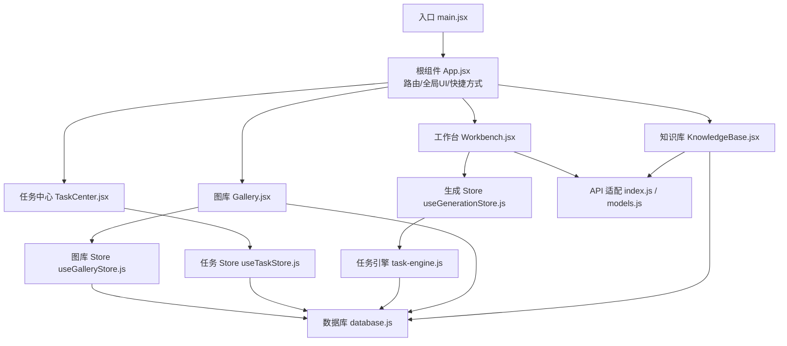
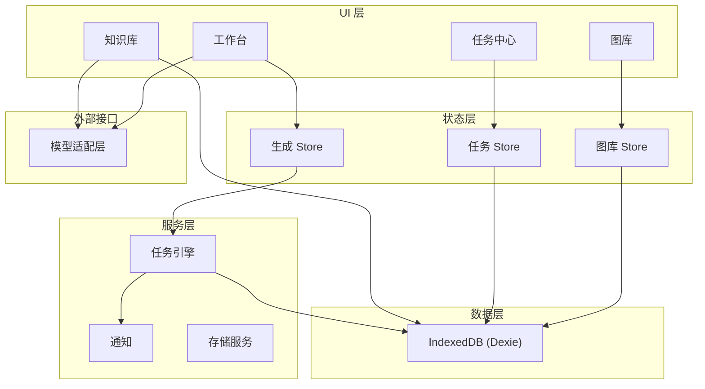
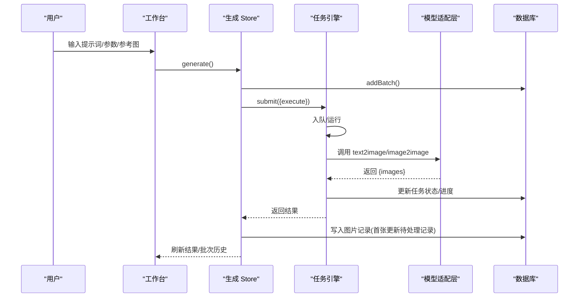
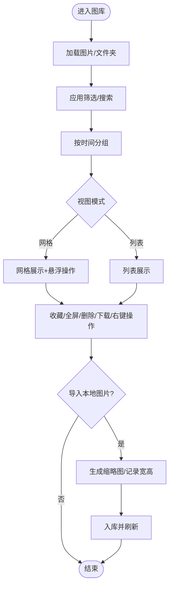
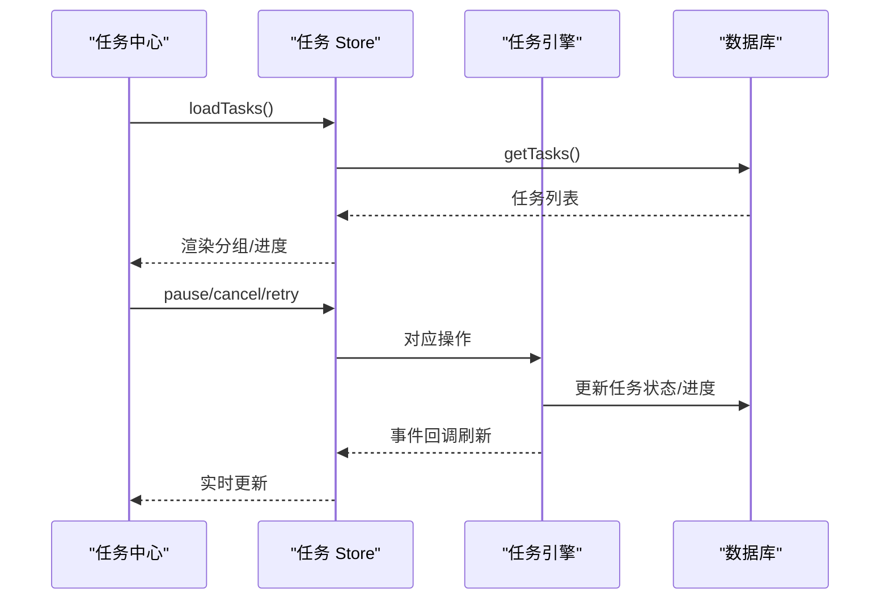
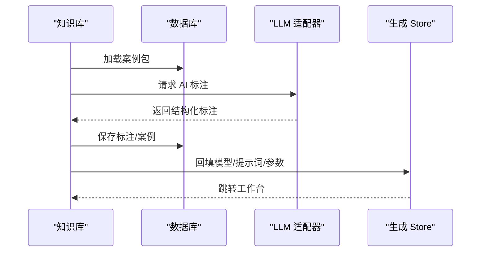
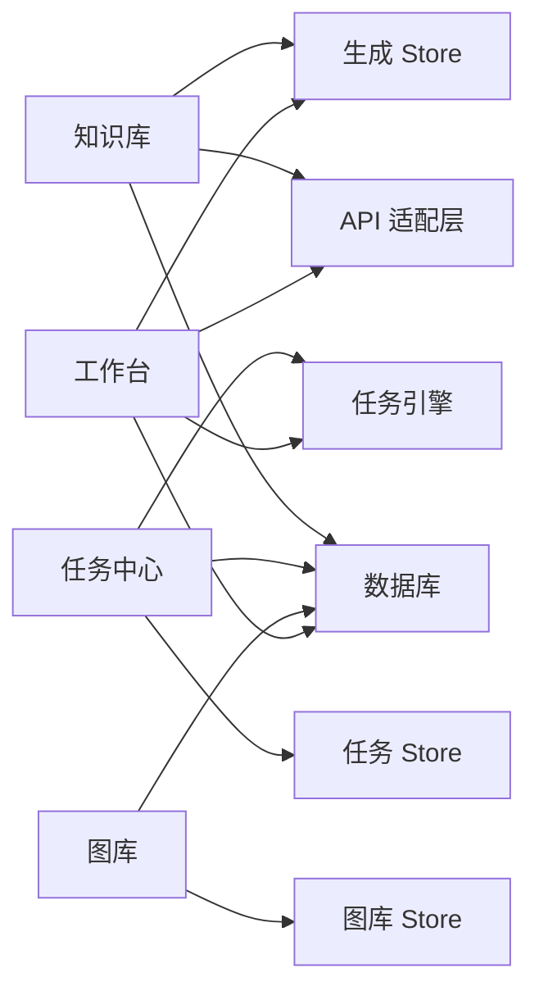

# 核心功能

<cite>
**本文引用的文件**   
- [README.md](file://README.md)
- [package.json](file://app/package.json)
- [main.jsx](file://app/src/main.jsx)
- [App.jsx](file://app/src/App.jsx)
- [Workbench.jsx](file://app/src/pages/Workbench.jsx)
- [Gallery.jsx](file://app/src/pages/Gallery.jsx)
- [TaskCenter.jsx](file://app/src/pages/TaskCenter.jsx)
- [KnowledgeBase.jsx](file://app/src/pages/KnowledgeBase.jsx)
- [useGenerationStore.js](file://app/src/stores/useGenerationStore.js)
- [useGalleryStore.js](file://app/src/stores/useGalleryStore.js)
- [useTaskStore.js](file://app/src/stores/useTaskStore.js)
- [task-engine.js](file://app/src/services/task-engine.js)
- [database.js](file://app/src/db/database.js)
- [models.js](file://app/src/constants/models.js)
- [api/index.js](file://app/src/services/api/index.js)
- [TaskPanel.jsx](file://app/src/components/TaskPanel.jsx)
</cite>

## 目录
1. [简介](#简介)
2. [项目结构](#项目结构)
3. [核心组件](#核心组件)
4. [架构总览](#架构总览)
5. [详细组件分析](#详细组件分析)
6. [依赖关系分析](#依赖关系分析)
7. [性能与体验优化](#性能与体验优化)
8. [故障排查指南](#故障排查指南)
9. [结论](#结论)
10. [附录：使用示例与最佳实践](#附录使用示例与最佳实践)

## 简介
AI Image Studio 是一款面向专业用户的 AI 图像生成工作台，提供多模型统一接入、提示词扩写、批量生成、知识库 RAG 与完整资产管理能力。应用采用 React + Vite 前端架构，通过 Zustand 管理状态，Dexie（IndexedDB）实现本地持久化，任务引擎负责后台并发调度与重试，API 适配层屏蔽不同模型的差异。

本文件聚焦四大核心模块：图像生成工作台、图库管理、任务中心、知识库，并说明其使用场景、操作流程、界面设计、协作关系与数据流转，同时给出最佳实践与常见问题解决方案。

章节来源
- [README.md:1-10](file://README.md#L1-L10)

## 项目结构
- 入口与路由
  - 应用启动时初始化数据库与设置，挂载根组件，配置全局快捷键、错误边界、懒加载页面与全局弹窗（灯箱、遮罩编辑器、任务面板）。
- 主要页面
  - 工作台：提示词编辑、参考图上传、参数控制、生成结果展示、局部重绘入口。
  - 图库：图片浏览、筛选、搜索、导入导出、批量操作、文件夹组织。
  - 任务中心：任务队列、进度、暂停/恢复、取消、重试、完成/失败统计。
  - 知识库：案例包管理、AI 标注、检索与复用至工作台。
- 状态与服务
  - 生成状态、图库状态、任务状态分别由独立 Store 管理；任务引擎为单例，事件驱动更新 UI。
- 数据与 API
  - IndexedDB 表包括 images、batches、tasks、folders、settings、casePackages；API 适配层按模型选择具体适配器。

图表来源
- [main.jsx:1-32](file://app/src/main.jsx#L1-L32)
- [App.jsx:1-364](file://app/src/App.jsx#L1-L364)
- [Workbench.jsx:1-800](file://app/src/pages/Workbench.jsx#L1-L800)
- [Gallery.jsx:1-527](file://app/src/pages/Gallery.jsx#L1-L527)
- [TaskCenter.jsx:1-218](file://app/src/pages/TaskCenter.jsx#L1-L218)
- [KnowledgeBase.jsx:1-574](file://app/src/pages/KnowledgeBase.jsx#L1-L574)
- [useGenerationStore.js:1-360](file://app/src/stores/useGenerationStore.js#L1-L360)
- [useGalleryStore.js:1-204](file://app/src/stores/useGalleryStore.js#L1-L204)
- [useTaskStore.js:1-173](file://app/src/stores/useTaskStore.js#L1-L173)
- [task-engine.js:1-319](file://app/src/services/task-engine.js#L1-L319)
- [database.js:1-339](file://app/src/db/database.js#L1-L339)
- [models.js:1-106](file://app/src/constants/models.js#L1-L106)
- [api/index.js:1-39](file://app/src/services/api/index.js#L1-L39)

章节来源
- [main.jsx:1-32](file://app/src/main.jsx#L1-L32)
- [App.jsx:1-364](file://app/src/App.jsx#L1-L364)
- [package.json:1-30](file://app/package.json#L1-L30)

## 核心组件
- 图像生成工作台
  - 支持多模型切换、提示词输入与扩写、参考图角色标注、尺寸/质量/数量等参数控制、结果网格展示、下载/收藏/重新生成、局部重绘（遮罩编辑）。
- 图库管理
  - 关键词/语义/以图搜图（预留）、按模型/日期/比例/收藏筛选、网格/列表视图、导入本地图片、批量收藏/移动/删除/导出、右键快捷操作。
- 任务中心
  - 任务分组（进行中/排队中/已完成/失败/已暂停）、实时进度条、暂停/恢复/取消/重试、清空已完成、点击跳转图库查看结果。
- 知识库
  - 案例包增删改查、AI 自动生成结构化标注、按模型/时间/标签/内容检索、一键将案例参数回填至工作台继续生成。

章节来源
- [Workbench.jsx:1-800](file://app/src/pages/Workbench.jsx#L1-L800)
- [Gallery.jsx:1-527](file://app/src/pages/Gallery.jsx#L1-L527)
- [TaskCenter.jsx:1-218](file://app/src/pages/TaskCenter.jsx#L1-L218)
- [KnowledgeBase.jsx:1-574](file://app/src/pages/KnowledgeBase.jsx#L1-L574)

## 架构总览
系统分层清晰：UI 层（页面与组件）→ 状态层（Zustand Stores）→ 服务层（任务引擎、通知、存储）→ 数据层（IndexedDB）→ 外部接口（模型 API 适配）。

图表来源
- [useGenerationStore.js:1-360](file://app/src/stores/useGenerationStore.js#L1-L360)
- [useGalleryStore.js:1-204](file://app/src/stores/useGalleryStore.js#L1-L204)
- [useTaskStore.js:1-173](file://app/src/stores/useTaskStore.js#L1-L173)
- [task-engine.js:1-319](file://app/src/services/task-engine.js#L1-L319)
- [database.js:1-339](file://app/src/db/database.js#L1-L339)
- [api/index.js:1-39](file://app/src/services/api/index.js#L1-L39)

## 详细组件分析

### 图像生成工作台（Workbench）
- 使用场景
  - 快速构思与迭代：输入提示词，借助扩写助手获得多种变体；上传参考图进行风格/构图/色彩/主体引导；调整尺寸、质量、数量、Seed 等参数后一键生成。
- 操作流程
  - 选择模型 → 编写/扩写提示词 → 添加参考图（可设角色）→ 设置参数 → 点击生成或快捷键触发 → 查看结果 → 下载/收藏/重新生成/作为参考图/打开局部重绘。
- 界面设计要点
  - 左侧参数区（模型、Prompt、参考图、高级参数），右侧结果区（网格展示、悬浮操作、上下文菜单）；顶部有批量历史与模式切换；全局遮罩编辑器用于局部重绘。
- 关键交互与逻辑
  - 模型能力映射：根据常量配置动态渲染可用参数与限制（如最大参考图数、是否支持 inpainting）。
  - 生成流程：提交任务到任务引擎，执行函数内调用对应模型适配器；首次异步任务提交即写入“待处理”记录，完成后更新为“已完成”。
  - 局部重绘：从结果图获取原图数据，打开遮罩编辑器绘制蒙版，提交给支持 inpainting 的适配器执行。
- 最佳实践
  - 合理控制参考图数量与角色，避免超出模型上限导致被忽略。
  - 长 Prompt 可能影响质量，建议先扩写再精简。
  - 使用 Seed 固定随机性便于对比实验。

图表来源
- [Workbench.jsx:1-800](file://app/src/pages/Workbench.jsx#L1-L800)
- [useGenerationStore.js:1-360](file://app/src/stores/useGenerationStore.js#L1-L360)
- [task-engine.js:1-319](file://app/src/services/task-engine.js#L1-L319)
- [database.js:1-339](file://app/src/db/database.js#L1-L339)
- [api/index.js:1-39](file://app/src/services/api/index.js#L1-L39)

章节来源
- [Workbench.jsx:1-800](file://app/src/pages/Workbench.jsx#L1-L800)
- [useGenerationStore.js:1-360](file://app/src/stores/useGenerationStore.js#L1-L360)
- [models.js:1-106](file://app/src/constants/models.js#L1-L106)
- [api/index.js:1-39](file://app/src/services/api/index.js#L1-L39)

### 图库管理（Gallery）
- 使用场景
  - 集中浏览与管理所有生成与导入的图片；按模型、日期、比例、收藏等多维度筛选；批量操作提升效率。
- 操作流程
  - 打开图库 → 关键词/语义/以图搜图（预留）→ 筛选条件 → 网格/列表切换 → 选中图片进行收藏/移动/删除/导出 → 右键快捷操作（用相同参数再生成、设为参考图、微调 prompt 再生成、局部重绘）。
- 界面设计要点
  - 顶部工具栏含搜索、视图切换、导入按钮；中部筛选栏；主体区域按时间分组展示；右侧详情面板显示提示词、参数与操作。
- 关键交互与逻辑
  - 客户端过滤：在内存中对比例等属性做二次过滤；服务端侧仅做基础查询。
  - 导入流程：读取本地图片，Canvas 生成缩略图，记录宽高与元信息入库。
  - 批量导出：逐个创建下载链接，间隔以避免浏览器拦截。

图表来源
- [Gallery.jsx:1-527](file://app/src/pages/Gallery.jsx#L1-L527)
- [useGalleryStore.js:1-204](file://app/src/stores/useGalleryStore.js#L1-L204)
- [database.js:1-339](file://app/src/db/database.js#L1-L339)

章节来源
- [Gallery.jsx:1-527](file://app/src/pages/Gallery.jsx#L1-L527)
- [useGalleryStore.js:1-204](file://app/src/stores/useGalleryStore.js#L1-L204)
- [database.js:1-339](file://app/src/db/database.js#L1-L339)

### 任务中心（TaskCenter）
- 使用场景
  - 监控后台任务的执行状态与进度，对异常任务进行重试或移除，清理已完成任务释放空间。
- 操作流程
  - 打开任务中心 → 查看各分组任务 → 暂停/恢复/取消/重试 → 点击“查看”跳转到图库查看结果。
- 界面设计要点
  - 统计栏显示进行中/排队中/已完成/失败数量；分组折叠展开；失败项高亮显示错误信息。
- 关键交互与逻辑
  - 与任务引擎事件桥接：监听任务状态变更，自动刷新列表。
  - 重试策略：基于指数退避与可重试错误判定，最多重试 3 次。

图表来源
- [TaskCenter.jsx:1-218](file://app/src/pages/TaskCenter.jsx#L1-L218)
- [useTaskStore.js:1-173](file://app/src/stores/useTaskStore.js#L1-L173)
- [task-engine.js:1-319](file://app/src/services/task-engine.js#L1-L319)
- [database.js:1-339](file://app/src/db/database.js#L1-L339)

章节来源
- [TaskCenter.jsx:1-218](file://app/src/pages/TaskCenter.jsx#L1-L218)
- [useTaskStore.js:1-173](file://app/src/stores/useTaskStore.js#L1-L173)
- [task-engine.js:1-319](file://app/src/services/task-engine.js#L1-L319)

### 知识库（KnowledgeBase）
- 使用场景
  - 沉淀高质量案例包（包含提示词、扩写提示词、模型与参数、标签、用户/AI 标注），用于后续检索与复用，提升提示词工程效率。
- 操作流程
  - 新增案例包（手动或 AI 生成标注）→ 检索/筛选 → 查看详情（可编辑原始/扩写提示词与标注）→ “使用此案例”回填工作台继续生成。
- 界面设计要点
  - 网格/列表双视图；卡片展示缩略图、提示词摘要、模型与日期、标签；右侧详情面板支持编辑与保存。
- 关键交互与逻辑
  - AI 标注：调用 LLM 适配器生成结构化标注，用户可编辑后保存。
  - 回填工作台：将案例的模型、提示词与参数注入生成 Store，导航至工作台。

图表来源
- [KnowledgeBase.jsx:1-574](file://app/src/pages/KnowledgeBase.jsx#L1-L574)
- [database.js:1-339](file://app/src/db/database.js#L1-L339)
- [api/index.js:1-39](file://app/src/services/api/index.js#L1-L39)
- [useGenerationStore.js:1-360](file://app/src/stores/useGenerationStore.js#L1-L360)

章节来源
- [KnowledgeBase.jsx:1-574](file://app/src/pages/KnowledgeBase.jsx#L1-L574)
- [database.js:1-339](file://app/src/db/database.js#L1-L339)
- [api/index.js:1-39](file://app/src/services/api/index.js#L1-L39)

## 依赖关系分析
- 组件耦合与职责
  - 页面组件专注交互与展示，业务逻辑下沉至 Store；Store 负责与任务引擎和数据库交互；任务引擎统一管理并发与重试；API 适配层屏蔽模型差异。
- 直接/间接依赖
  - 工作台依赖生成 Store、任务引擎、数据库、API 适配层；图库依赖图库 Store、数据库；任务中心依赖任务 Store、任务引擎、数据库；知识库依赖数据库、LLM 适配器、生成 Store。
- 外部依赖
  - Dexie（IndexedDB）、axios（HTTP 客户端）、react-router-dom（路由）、zustand（状态）、immer（不可变更新）、uuid（ID 生成）、lucide-react（图标）。

图表来源
- [Workbench.jsx:1-800](file://app/src/pages/Workbench.jsx#L1-L800)
- [useGenerationStore.js:1-360](file://app/src/stores/useGenerationStore.js#L1-L360)
- [useGalleryStore.js:1-204](file://app/src/stores/useGalleryStore.js#L1-L204)
- [useTaskStore.js:1-173](file://app/src/stores/useTaskStore.js#L1-L173)
- [task-engine.js:1-319](file://app/src/services/task-engine.js#L1-L319)
- [database.js:1-339](file://app/src/db/database.js#L1-L339)
- [api/index.js:1-39](file://app/src/services/api/index.js#L1-L39)

章节来源
- [package.json:1-30](file://app/package.json#L1-L30)

## 性能与体验优化
- 并发与吞吐
  - 任务引擎默认最大并发 3，FIFO 队列，指数退避重试，避免瞬时风暴与网络抖动导致的失败。
- 持久化与断点续跑
  - 任务与图片在异步阶段即落库，刷新后可恢复状态；首张图片优先更新“待处理”记录，减少重复插入。
- 渲染与交互
  - 懒加载页面、骨架屏过渡、滚动分页加载、节流批量导出，降低主线程压力。
- 资源管理
  - 参考图 URL 对象生命周期管理，避免内存泄漏；缩略图 Canvas 压缩减小体积。

[本节为通用指导，不直接分析具体文件]

## 故障排查指南
- 生成失败
  - 检查任务中心失败项的错误信息；确认模型适配器配置与网络连通；必要时重试任务。
- 任务卡住
  - 查看任务状态是否为 paused；尝试恢复或取消后重新提交；检查任务引擎并发上限。
- 图片未显示
  - 确认图片 URL 有效或本地 Blob 存在；检查缩略图生成是否成功；核对数据库记录是否存在。
- 知识库无法保存
  - 检查 IndexedDB 是否初始化成功；确认案例包字段完整性；查看控制台错误日志。

章节来源
- [task-engine.js:1-319](file://app/src/services/task-engine.js#L1-L319)
- [useTaskStore.js:1-173](file://app/src/stores/useTaskStore.js#L1-L173)
- [database.js:1-339](file://app/src/db/database.js#L1-L339)

## 结论
AI Image Studio 通过清晰的层次化架构与稳健的任务引擎，实现了高效、可靠的 AI 图像生成工作流。工作台、图库、任务中心与知识库形成闭环：从创意到产出、从管理到复用，显著提升创作效率与质量。建议在团队中推广知识库建设，持续积累优质案例，结合任务中心的稳定性保障，打造可持续优化的图像生产流水线。

[本节为总结，不直接分析具体文件]

## 附录：使用示例与最佳实践
- 工作台
  - 先用扩写助手丰富提示词，再选择合适模型与尺寸；参考图角色明确（风格/构图/色彩/主体），避免过多干扰。
  - 使用 Seed 固定随机性，便于对比不同参数的效果。
- 图库
  - 利用筛选与分组快速定位目标图片；批量收藏与移动提高整理效率；导入图片时注意格式与大小。
- 任务中心
  - 关注失败项并尽快重试；清理已完成任务保持界面清爽；必要时调整并发上限。
- 知识库
  - 定期补充案例包，完善标签与标注；使用 AI 标注辅助结构化描述；将成功案例参数回填工作台快速复现。

[本节为通用指导，不直接分析具体文件]