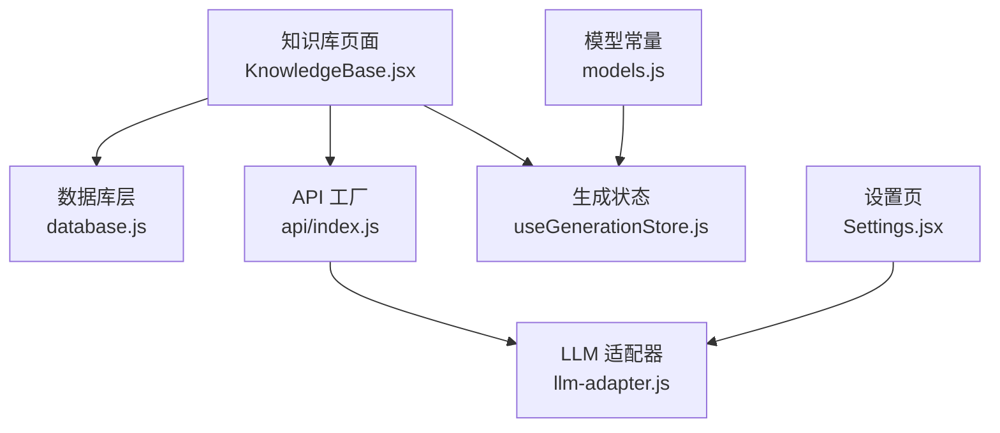
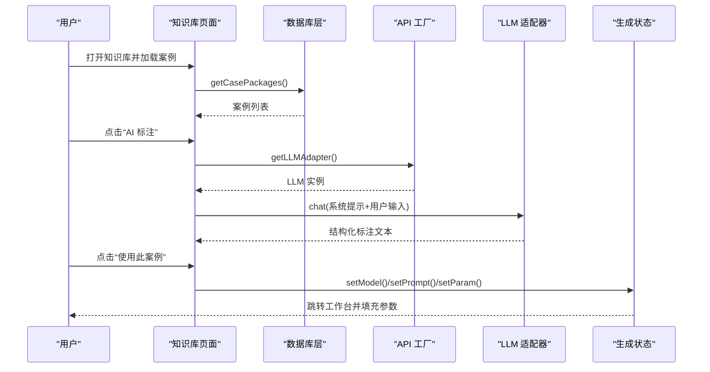
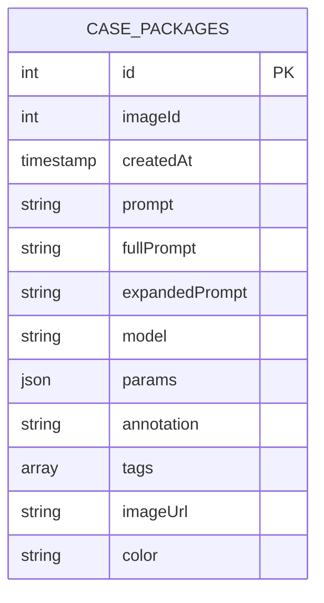
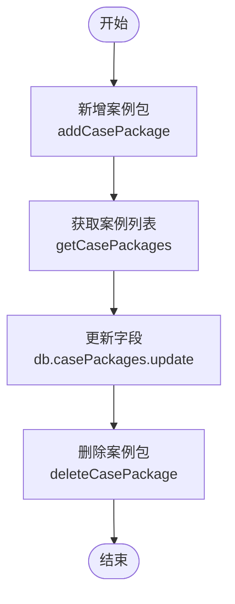
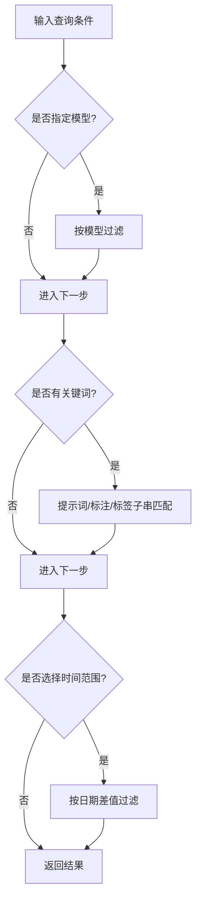
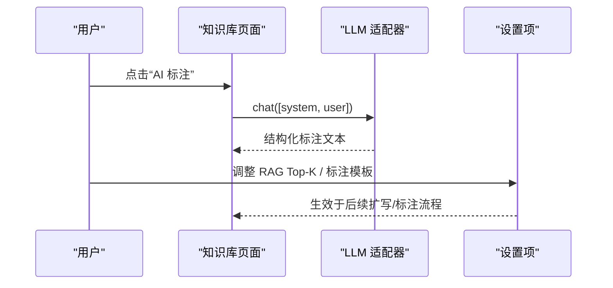
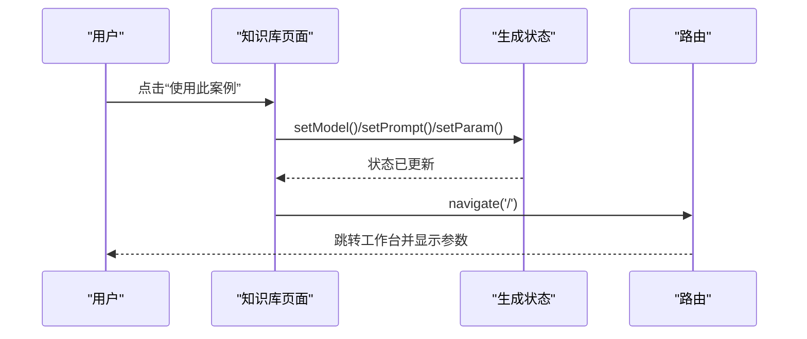
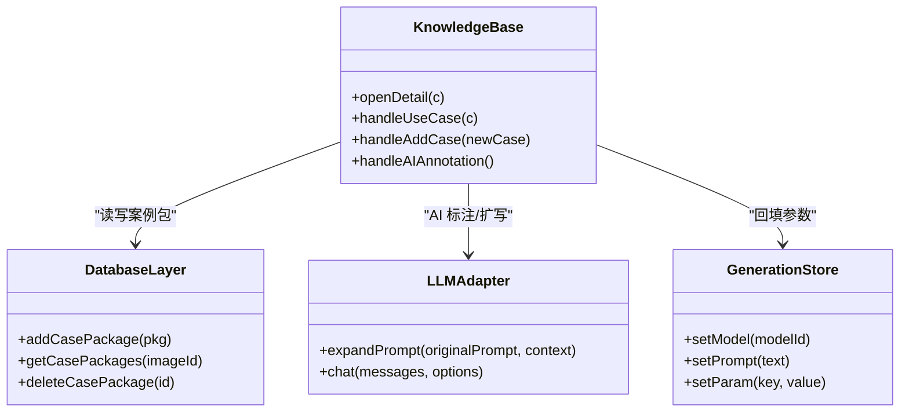
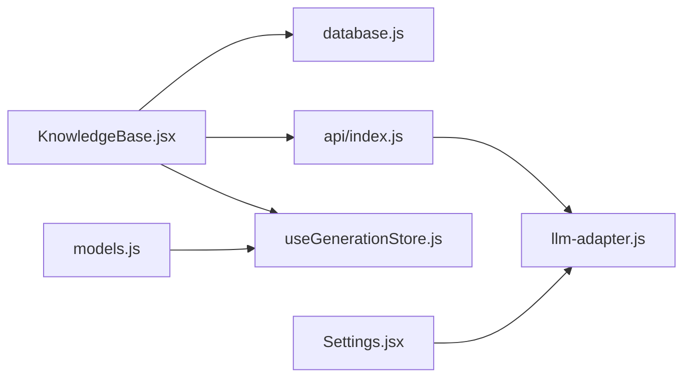

# 知识库管理

<cite>
**本文引用的文件列表**
- [KnowledgeBase.jsx](file://app/src/pages/KnowledgeBase.jsx)
- [database.js](file://app/src/db/database.js)
- [llm-adapter.js](file://app/src/services/api/llm-adapter.js)
- [api/index.js](file://app/src/services/api/index.js)
- [useGenerationStore.js](file://app/src/stores/useGenerationStore.js)
- [Settings.jsx](file://app/src/pages/Settings.jsx)
- [models.js](file://app/src/constants/models.js)
</cite>

## 目录
1. [简介](#简介)
2. [项目结构](#项目结构)
3. [核心组件](#核心组件)
4. [架构总览](#架构总览)
5. [详细组件分析](#详细组件分析)
6. [依赖关系分析](#依赖关系分析)
7. [性能与检索策略](#性能与检索策略)
8. [故障排查指南](#故障排查指南)
9. [结论](#结论)
10. [附录：最佳实践与个性化定制](#附录最佳实践与个性化定制)

## 简介
本文件围绕“基于 RAG（检索增强生成）的智能提示词优化系统”的知识库管理功能，提供从数据模型、检索匹配、到用户交互与扩展流程的完整说明。该系统通过案例包管理、知识库构建、智能推荐与提示词扩写等能力，帮助用户将历史高质量案例沉淀为可检索知识，并在需要时结合 LLM 进行提示词扩写与标注辅助，从而提升生成质量与效率。

## 项目结构
知识库相关代码主要分布在以下位置：
- 页面层：知识库界面与交互逻辑
- 数据层：IndexedDB 表结构与 CRUD 操作
- 服务层：LLM 适配器（用于扩写与标注）
- 状态层：工作台生成状态（用于“使用此案例”回填参数）
- 配置层：RAG Top-K、标注模板等设置项

图表来源
- [KnowledgeBase.jsx:1-120](file://app/src/pages/KnowledgeBase.jsx#L1-L120)
- [database.js:298-317](file://app/src/db/database.js#L298-L317)
- [api/index.js:15-39](file://app/src/services/api/index.js#L15-L39)
- [llm-adapter.js:1-150](file://app/src/services/api/llm-adapter.js#L1-L150)
- [useGenerationStore.js:1-120](file://app/src/stores/useGenerationStore.js#L1-L120)
- [Settings.jsx:264-276](file://app/src/pages/Settings.jsx#L264-L276)
- [models.js:1-106](file://app/src/constants/models.js#L1-L106)

章节来源
- [KnowledgeBase.jsx:1-120](file://app/src/pages/KnowledgeBase.jsx#L1-L120)
- [database.js:298-317](file://app/src/db/database.js#L298-L317)
- [api/index.js:15-39](file://app/src/services/api/index.js#L15-L39)
- [llm-adapter.js:1-150](file://app/src/services/api/llm-adapter.js#L1-L150)
- [useGenerationStore.js:1-120](file://app/src/stores/useGenerationStore.js#L1-L120)
- [Settings.jsx:264-276](file://app/src/pages/Settings.jsx#L264-L276)
- [models.js:1-106](file://app/src/constants/models.js#L1-L106)

## 核心组件
- 知识库页面：负责案例包的增删改查、筛选搜索、详情编辑、AI 标注生成、以及“使用此案例”回填工作台参数。
- 数据库层：定义 casePackages 表及对应 CRUD 接口，支持按 imageId 查询与按创建时间倒序返回。
- LLM 适配器：提供 chat 与 expandPrompt 能力，用于 AI 标注与提示词扩写。
- 生成状态：维护当前模型、提示词、参数等，供“使用此案例”回填。
- 设置页：提供 RAG Top-K 与标注辅助模板等配置入口。

章节来源
- [KnowledgeBase.jsx:1-120](file://app/src/pages/KnowledgeBase.jsx#L1-L120)
- [database.js:298-317](file://app/src/db/database.js#L298-L317)
- [llm-adapter.js:1-150](file://app/src/services/api/llm-adapter.js#L1-L150)
- [useGenerationStore.js:1-120](file://app/src/stores/useGenerationStore.js#L1-L120)
- [Settings.jsx:264-276](file://app/src/pages/Settings.jsx#L264-L276)

## 架构总览
知识库作为 RAG 的数据源，承载“图像 + 提示词 + 参数 + 标注”的结构化案例。用户在知识库中积累案例后，可在提示词扩写或标注环节调用 LLM，并结合检索到的相关案例上下文，生成更高质量的提示词变体或结构化标注。

图表来源
- [KnowledgeBase.jsx:114-154](file://app/src/pages/KnowledgeBase.jsx#L114-L154)
- [api/index.js:33-39](file://app/src/services/api/index.js#L33-L39)
- [llm-adapter.js:125-149](file://app/src/services/api/llm-adapter.js#L125-L149)
- [useGenerationStore.js:38-106](file://app/src/stores/useGenerationStore.js#L38-L106)

## 详细组件分析

### 数据模型与结构设计
- 表名：casePackages
- 索引字段：自增 id、imageId、createdAt
- 典型记录字段（由页面映射与入库）：
  - imageId、imageUrl：关联图片标识与预览图
  - prompt/fullPrompt：原始与完整提示词
  - expandedPrompt：扩写后的提示词
  - model：目标模型名称
  - tags：标签数组
  - color：卡片背景色
  - annotation：用户/AI 标注
  - params：参数对象（包含 model 等）
  - createdAt：创建时间

图表来源
- [database.js:22-31](file://app/src/db/database.js#L22-L31)
- [KnowledgeBase.jsx:44-57](file://app/src/pages/KnowledgeBase.jsx#L44-L57)

章节来源
- [database.js:298-317](file://app/src/db/database.js#L298-L317)
- [KnowledgeBase.jsx:44-57](file://app/src/pages/KnowledgeBase.jsx#L44-L57)

### 案例包管理（CRUD）
- 新增：addCasePackage，写入默认 createdAt
- 查询：getCasePackages，可按 imageId 过滤，否则按 createdAt 倒序
- 删除：deleteCasePackage
- 更新：通过 db.casePackages.update 直接更新单条记录

图表来源
- [database.js:301-317](file://app/src/db/database.js#L301-L317)
- [KnowledgeBase.jsx:83-104](file://app/src/pages/KnowledgeBase.jsx#L83-L104)

章节来源
- [database.js:301-317](file://app/src/db/database.js#L301-L317)
- [KnowledgeBase.jsx:83-104](file://app/src/pages/KnowledgeBase.jsx#L83-L104)

### 检索与筛选策略
- 前端筛选：按模型、时间范围（最近7天/30天）、关键词（提示词、标注、标签）进行客户端过滤
- 数据库检索：支持按 imageId 精确匹配；通用列表按 createdAt 倒序
- 语义/以图搜图：在图库模块预留入口，当前仅关键词可用

图表来源
- [KnowledgeBase.jsx:205-222](file://app/src/pages/KnowledgeBase.jsx#L205-L222)
- [database.js:308-313](file://app/src/db/database.js#L308-L313)

章节来源
- [KnowledgeBase.jsx:205-222](file://app/src/pages/KnowledgeBase.jsx#L205-L222)
- [database.js:308-313](file://app/src/db/database.js#L308-L313)

### 智能标注与提示词扩写（RAG 集成点）
- 智能标注：调用 LLM chat，传入系统提示与用户输入（含提示词、扩写提示词、模型、参数），输出结构化标注草稿，用户可编辑保存
- 提示词扩写：通过 LLMAdapter.expandPrompt 生成多个变体，便于后续入库或在工作台直接使用
- 设置项：RAG Top-K 控制检索返回的相关文档数量；标注辅助模板支持占位符 {{user_prompt}} 与 {{rag_context}}

图表来源
- [KnowledgeBase.jsx:114-136](file://app/src/pages/KnowledgeBase.jsx#L114-L136)
- [llm-adapter.js:125-149](file://app/src/services/api/llm-adapter.js#L125-L149)
- [Settings.jsx:270-272](file://app/src/pages/Settings.jsx#L270-L272)

章节来源
- [KnowledgeBase.jsx:114-136](file://app/src/pages/KnowledgeBase.jsx#L114-L136)
- [llm-adapter.js:125-149](file://app/src/services/api/llm-adapter.js#L125-L149)
- [Settings.jsx:270-272](file://app/src/pages/Settings.jsx#L270-L272)

### “使用此案例”回填工作台
- 根据案例的 model/prompt/params，调用 useGenerationStore 的 setModel/setPrompt/setParam，然后导航至工作台，实现一键复用

图表来源
- [KnowledgeBase.jsx:139-154](file://app/src/pages/KnowledgeBase.jsx#L139-L154)
- [useGenerationStore.js:38-106](file://app/src/stores/useGenerationStore.js#L38-L106)

章节来源
- [KnowledgeBase.jsx:139-154](file://app/src/pages/KnowledgeBase.jsx#L139-L154)
- [useGenerationStore.js:38-106](file://app/src/stores/useGenerationStore.js#L38-L106)

### 类与模块关系

图表来源
- [KnowledgeBase.jsx:1-154](file://app/src/pages/KnowledgeBase.jsx#L1-L154)
- [database.js:298-317](file://app/src/db/database.js#L298-L317)
- [llm-adapter.js:1-150](file://app/src/services/api/llm-adapter.js#L1-L150)
- [useGenerationStore.js:1-120](file://app/src/stores/useGenerationStore.js#L1-L120)

## 依赖关系分析
- 页面层依赖：
  - 数据库层：案例包 CRUD
  - API 工厂：获取 LLM 适配器
  - 生成状态：回填工作台参数
- 服务层依赖：
  - LLM 适配器：统一通过 apiPost 调用后端 /llm/chat/completions
- 配置层：
  - 设置页暴露 RAG Top-K 与标注模板，影响扩写/标注体验

图表来源
- [KnowledgeBase.jsx:1-120](file://app/src/pages/KnowledgeBase.jsx#L1-L120)
- [database.js:298-317](file://app/src/db/database.js#L298-L317)
- [api/index.js:15-39](file://app/src/services/api/index.js#L15-L39)
- [llm-adapter.js:1-150](file://app/src/services/api/llm-adapter.js#L1-L150)
- [useGenerationStore.js:1-120](file://app/src/stores/useGenerationStore.js#L1-L120)
- [Settings.jsx:264-276](file://app/src/pages/Settings.jsx#L264-L276)
- [models.js:1-106](file://app/src/constants/models.js#L1-L106)

章节来源
- [KnowledgeBase.jsx:1-120](file://app/src/pages/KnowledgeBase.jsx#L1-L120)
- [database.js:298-317](file://app/src/db/database.js#L298-L317)
- [api/index.js:15-39](file://app/src/services/api/index.js#L15-L39)
- [llm-adapter.js:1-150](file://app/src/services/api/llm-adapter.js#L1-L150)
- [useGenerationStore.js:1-120](file://app/src/stores/useGenerationStore.js#L1-L120)
- [Settings.jsx:264-276](file://app/src/pages/Settings.jsx#L264-L276)
- [models.js:1-106](file://app/src/constants/models.js#L1-L106)

## 性能与检索策略
- 当前检索策略
  - 客户端过滤：按模型、时间、关键词（提示词/标注/标签）子串匹配，适合中小规模数据
  - 数据库侧：按 imageId 精确匹配与按 createdAt 倒序排序
- 可扩展方向
  - 引入向量检索：对提示词与标注进行向量化，计算相似度，提高语义匹配精度
  - 增加权重策略：对标签、模型、时间衰减等进行加权评分
  - 分页与懒加载：大数据量下按需加载，降低首屏压力
  - 缓存热点案例：对高频访问案例做本地缓存，减少重复渲染与请求

[本节为通用建议，不直接分析具体文件]

## 故障排查指南
- 添加失败/移除失败
  - 现象：Toast 提示失败
  - 排查：检查 IndexedDB 是否成功初始化；确认 addCasePackage/deleteCasePackage 返回值与异常日志
  - 参考路径
    - [KnowledgeBase.jsx:94-104](file://app/src/pages/KnowledgeBase.jsx#L94-L104)
    - [database.js:301-317](file://app/src/db/database.js#L301-L317)
- AI 标注失败
  - 现象：提示“AI 标注失败”
  - 排查：确认 LLM 适配器可用；检查后端 /llm/chat/completions 连通性与鉴权；查看 chat 方法抛出的错误
  - 参考路径
    - [KnowledgeBase.jsx:114-136](file://app/src/pages/KnowledgeBase.jsx#L114-L136)
    - [llm-adapter.js:125-149](file://app/src/services/api/llm-adapter.js#L125-L149)
- 使用此案例未回填
  - 现象：跳转工作台但参数未生效
  - 排查：确认 setModel/setPrompt/setParam 执行顺序；检查 store 中 currentModel 与 params 是否被覆盖
  - 参考路径
    - [KnowledgeBase.jsx:139-154](file://app/src/pages/KnowledgeBase.jsx#L139-L154)
    - [useGenerationStore.js:38-106](file://app/src/stores/useGenerationStore.js#L38-L106)

章节来源
- [KnowledgeBase.jsx:94-154](file://app/src/pages/KnowledgeBase.jsx#L94-L154)
- [database.js:301-317](file://app/src/db/database.js#L301-L317)
- [llm-adapter.js:125-149](file://app/src/services/api/llm-adapter.js#L125-L149)
- [useGenerationStore.js:38-106](file://app/src/stores/useGenerationStore.js#L38-L106)

## 结论
知识库以“案例包”为核心载体，结合 LLM 的扩写与标注能力，形成“沉淀—检索—增强—复用”的闭环。当前实现采用客户端筛选与 IndexedDB 存储，具备快速上手与低门槛部署的优势。未来可通过向量检索、权重评分与缓存机制进一步提升检索质量与性能。

[本节为总结性内容，不直接分析具体文件]

## 附录：最佳实践与个性化定制

- 如何创建与管理知识案例
  - 在知识库页面点击“加入知识库”，填写提示词、选择模型，可使用“AI 生成标注”快速产出结构化标注，随后保存入库
  - 在详情页可编辑原始提示词、扩写提示词与用户标注，并随时“使用此案例”回填工作台
  - 参考路径
    - [KnowledgeBase.jsx:157-178](file://app/src/pages/KnowledgeBase.jsx#L157-L178)
    - [KnowledgeBase.jsx:376-440](file://app/src/pages/KnowledgeBase.jsx#L376-L440)
    - [KnowledgeBase.jsx:485-496](file://app/src/pages/KnowledgeBase.jsx#L485-L496)

- 如何利用知识库提升提示词质量
  - 先积累高质量案例，确保提示词与参数完整；在扩写前，利用“使用此案例”快速获得基线提示词与参数
  - 结合“AI 标注”产出结构化描述，丰富检索维度（场景、风格、技巧）
  - 参考路径
    - [KnowledgeBase.jsx:114-136](file://app/src/pages/KnowledgeBase.jsx#L114-L136)
    - [useGenerationStore.js:295-308](file://app/src/stores/useGenerationStore.js#L295-L308)

- 如何进行个性化定制
  - 在设置页调整“扩写模型”、“API Endpoint/Key”、“RAG Top-K”与“标注辅助模板”，使扩写与标注更符合个人偏好
  - 参考路径
    - [Settings.jsx:264-276](file://app/src/pages/Settings.jsx#L264-L276)

- 最佳实践
  - 保持案例一致性：固定命名规范与标签体系，便于检索
  - 定期清理与归档：删除无效案例，保留高价值样本
  - 分阶段扩充：先聚焦热门模型与常用风格，逐步扩展覆盖面
  - 关注 Top-K 与模板：Top-K 过大可能引入噪声，过小则信息不足；模板应明确期望的结构与要点

[本节为通用指导，不直接分析具体文件]