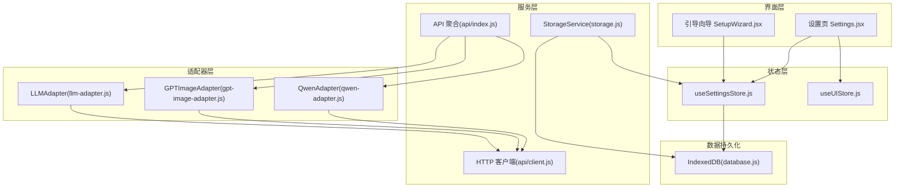
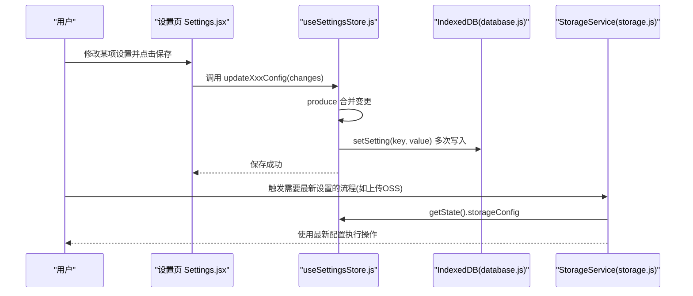
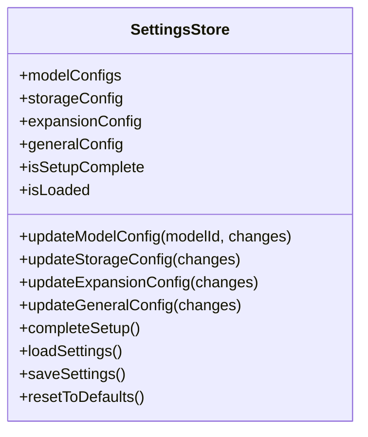
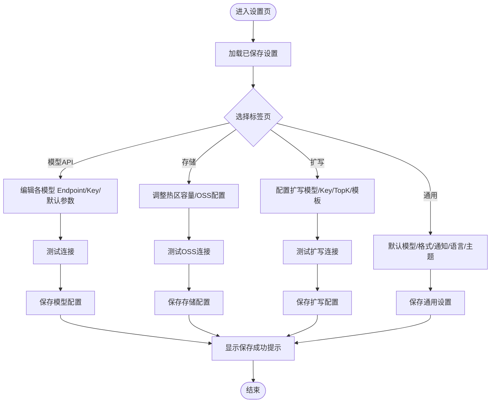
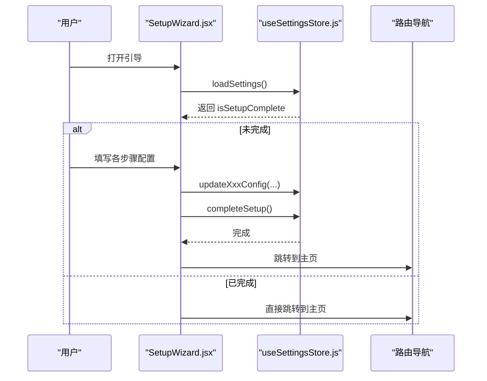
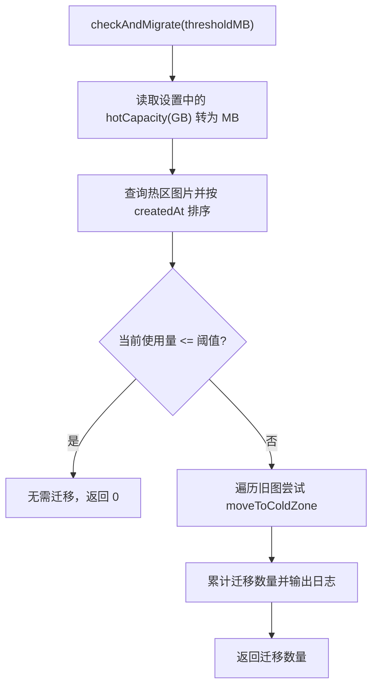
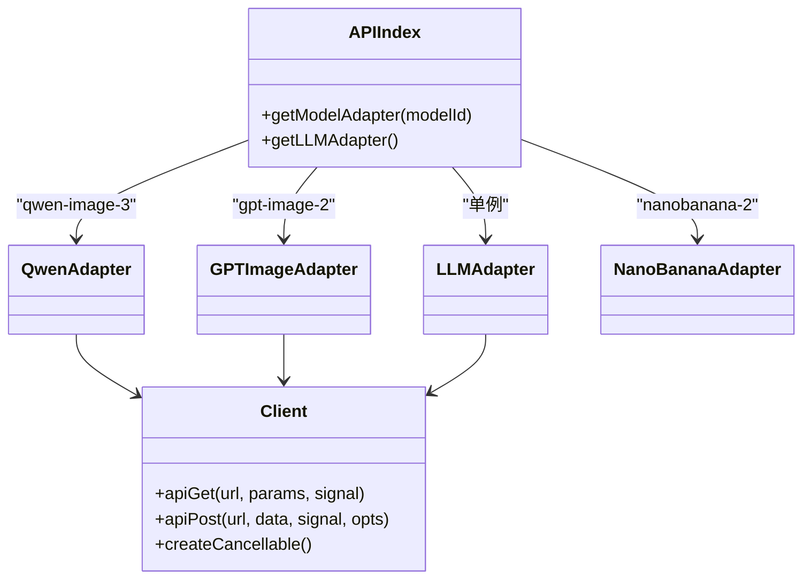
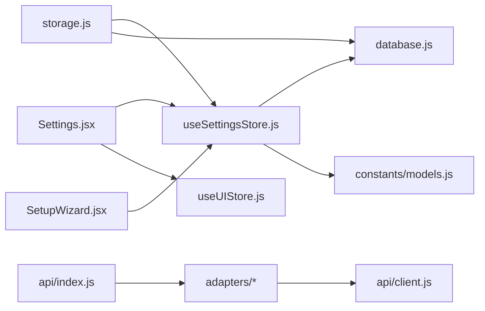

# 设置管理

<cite>
**本文引用的文件**   
- [useSettingsStore.js](file://app/src/stores/useSettingsStore.js)
- [Settings.jsx](file://app/src/pages/Settings.jsx)
- [SetupWizard.jsx](file://app/src/pages/SetupWizard.jsx)
- [database.js](file://app/src/db/database.js)
- [storage.js](file://app/src/services/storage.js)
- [models.js](file://app/src/constants/models.js)
- [api/index.js](file://app/src/services/api/index.js)
- [api/client.js](file://app/src/services/api/client.js)
- [api/qwen-adapter.js](file://app/src/services/api/qwen-adapter.js)
- [api/gpt-image-adapter.js](file://app/src/services/api/gpt-image-adapter.js)
- [api/llm-adapter.js](file://app/src/services/api/llm-adapter.js)
- [useUIStore.js](file://app/src/stores/useUIStore.js)
</cite>

## 目录
1. [简介](#简介)
2. [项目结构](#项目结构)
3. [核心组件](#核心组件)
4. [架构总览](#架构总览)
5. [详细组件分析](#详细组件分析)
6. [依赖关系分析](#依赖关系分析)
7. [性能与容量规划](#性能与容量规划)
8. [故障排除指南](#故障排除指南)
9. [结论](#结论)
10. [附录：配置项清单与默认值](#附录配置项清单与默认值)

## 简介
本文件面向“设置管理”功能，系统性阐述应用配置系统的架构与用户界面设计，覆盖模型 API 配置、存储设置、扩展选项和个性化偏好设置。文档详细说明各项配置的作用与影响（如 API 密钥管理、存储路径与冷热分层、性能调优参数等），解释配置的持久化机制与验证规则，并提供常见配置场景示例与故障排除建议。

## 项目结构
设置相关代码主要分布在以下位置：
- 状态与持久化：stores/useSettingsStore.js、db/database.js
- 用户界面：pages/Settings.jsx、pages/SetupWizard.jsx
- 存储服务：services/storage.js
- 模型常量与适配器：constants/models.js、services/api/*
- UI 全局状态：stores/useUIStore.js

图表来源
- [Settings.jsx:1-301](file://app/src/pages/Settings.jsx#L1-L301)
- [SetupWizard.jsx:1-486](file://app/src/pages/SetupWizard.jsx#L1-L486)
- [useSettingsStore.js:1-162](file://app/src/stores/useSettingsStore.js#L1-L162)
- [database.js:1-339](file://app/src/db/database.js#L1-L339)
- [storage.js:1-393](file://app/src/services/storage.js#L1-L393)
- [api/index.js:1-39](file://app/src/services/api/index.js#L1-L39)
- [api/client.js:1-146](file://app/src/services/api/client.js#L1-L146)
- [api/qwen-adapter.js:1-209](file://app/src/services/api/qwen-adapter.js#L1-L209)
- [api/gpt-image-adapter.js:1-336](file://app/src/services/api/gpt-image-adapter.js#L1-L336)
- [api/llm-adapter.js:1-150](file://app/src/services/api/llm-adapter.js#L1-L150)

章节来源
- [useSettingsStore.js:1-162](file://app/src/stores/useSettingsStore.js#L1-L162)
- [Settings.jsx:1-301](file://app/src/pages/Settings.jsx#L1-L301)
- [SetupWizard.jsx:1-486](file://app/src/pages/SetupWizard.jsx#L1-L486)
- [database.js:1-339](file://app/src/db/database.js#L1-L339)
- [storage.js:1-393](file://app/src/services/storage.js#L1-L393)
- [models.js:1-106](file://app/src/constants/models.js#L1-L106)
- [api/index.js:1-39](file://app/src/services/api/index.js#L1-L39)
- [api/client.js:1-146](file://app/src/services/api/client.js#L1-L146)
- [useUIStore.js:1-159](file://app/src/stores/useUIStore.js#L1-L159)

## 核心组件
- 设置状态中心 useSettingsStore
  - 维护四类配置：模型配置、存储配置、扩写配置、通用配置；以及初始化完成标记与加载状态。
  - 提供更新动作并自动持久化到 IndexedDB。
  - 支持重置为默认值。
- 设置页面 Settings.jsx
  - 以标签页组织：模型 API、存储、提示词扩写、通用。
  - 提供连接测试、保存、主题切换、通知开关等交互。
- 引导向导 SetupWizard.jsx
  - 分步引导完成首次配置，完成后写入设置并跳转主界面。
- 存储服务 StorageService
  - 热区（IndexedDB）与冷区（阿里云 OSS）的读写、缩略图生成、迁移策略、统计信息。
- 数据库层 database.js
  - 基于 Dexie 的 IndexedDB 封装，包含 settings 表 key/value 存取。
- API 适配层
  - 统一导出与工厂方法，按模型 id 返回对应适配器实例。
  - HTTP 客户端具备重试、超时、取消信号等能力。
- UI 全局状态 useUIStore
  - 主题、通知、面板等 UI 状态，供设置页联动。

章节来源
- [useSettingsStore.js:1-162](file://app/src/stores/useSettingsStore.js#L1-L162)
- [Settings.jsx:1-301](file://app/src/pages/Settings.jsx#L1-L301)
- [SetupWizard.jsx:1-486](file://app/src/pages/SetupWizard.jsx#L1-L486)
- [storage.js:1-393](file://app/src/services/storage.js#L1-L393)
- [database.js:1-339](file://app/src/db/database.js#L1-L339)
- [api/index.js:1-39](file://app/src/services/api/index.js#L1-L39)
- [api/client.js:1-146](file://app/src/services/api/client.js#L1-L146)
- [useUIStore.js:1-159](file://app/src/stores/useUIStore.js#L1-L159)

## 架构总览
设置系统采用“状态中心 + 持久化 + 多端入口”的架构：
- 状态中心集中管理所有配置，变更即触发持久化。
- 设置页与引导向导均通过同一状态中心读写配置。
- 存储服务在运行时动态读取最新设置，确保配置即时生效。
- API 适配器通过统一客户端发起请求，错误处理与重试由客户端拦截器负责。

图表来源
- [Settings.jsx:205-208](file://app/src/pages/Settings.jsx#L205-L208)
- [useSettingsStore.js:58-99](file://app/src/stores/useSettingsStore.js#L58-L99)
- [database.js:280-295](file://app/src/db/database.js#L280-L295)
- [storage.js:20-42](file://app/src/services/storage.js#L20-L42)

## 详细组件分析

### 设置状态中心 useSettingsStore
- 数据结构
  - modelConfigs：按模型 id 映射的配置对象，含 enabled、defaultParams、apiKey、endpoint 等。
  - storageConfig：热区容量、OSS 区域与凭据、缩略图尺寸等。
  - expansionConfig：扩写模型、Endpoint、Key、RAG Top-K、模板等。
  - generalConfig：主题、语言、通知、声音、默认模型、图片格式等。
  - isSetupComplete/isLoaded：引导完成与加载状态。
- 关键行为
  - 更新动作：updateModelConfig/updateStorageConfig/updateExpansionConfig/updateGeneralConfig，内部使用不可变更新并立即持久化。
  - 加载与保存：loadSettings 从 IndexedDB 合并回状态；saveSettings 将当前状态落盘。
  - 重置：resetToDefaults 恢复默认并持久化。
- 复杂度与性能
  - 每次更新都会触发一次 saveSettings，涉及多次 IndexedDB 写入。若批量更新较多，可考虑合并写入或节流策略。
- 错误处理
  - loadSettings/saveSettings 捕获异常并记录日志，保证 UI 可用性与可观测性。

图表来源
- [useSettingsStore.js:47-161](file://app/src/stores/useSettingsStore.js#L47-L161)

章节来源
- [useSettingsStore.js:1-162](file://app/src/stores/useSettingsStore.js#L1-L162)

### 设置页面 Settings.jsx
- 界面组织
  - 四个标签页：模型 API、存储、提示词扩写、通用。
  - 每个标签页内提供输入控件、测试连接按钮、保存按钮与结果反馈。
- 模型 API 配置
  - 支持为不同模型分别配置 Endpoint 与 API Key，并提供连接测试。
  - 针对特定模型暴露额外参数（如默认尺寸、质量）。
- 存储配置
  - 本地热区容量滑块与数值输入同步。
  - 阿里云 OSS 配置（Bucket、Region、AccessKey ID/Secret）与连接测试。
- 提示词扩写
  - 选择扩写模型、配置 Endpoint 与 Key、RAG Top-K、标注辅助模板。
- 通用设置
  - 默认生成模型、图片默认格式、浏览器通知、声音提示、界面语言、主题切换。
- 交互细节
  - 使用 MaskedInput 保护敏感字段显示。
  - 保存后通过 useUIStore.addToast 给出成功提示。

图表来源
- [Settings.jsx:88-208](file://app/src/pages/Settings.jsx#L88-L208)

章节来源
- [Settings.jsx:1-301](file://app/src/pages/Settings.jsx#L1-L301)
- [useUIStore.js:80-103](file://app/src/stores/useUIStore.js#L80-L103)

### 引导向导 SetupWizard.jsx
- 步骤划分：欢迎 → 模型 → 存储 → 扩写 → 偏好 → 完成。
- 首次启动时检查 isSetupComplete，若已完成则直接跳转主界面。
- 每步收集相应配置，最后统一保存到状态中心并标记完成。

图表来源
- [SetupWizard.jsx:114-138](file://app/src/pages/SetupWizard.jsx#L114-L138)
- [SetupWizard.jsx:259-279](file://app/src/pages/SetupWizard.jsx#L259-L279)
- [useSettingsStore.js:102-106](file://app/src/stores/useSettingsStore.js#L102-L106)

章节来源
- [SetupWizard.jsx:1-486](file://app/src/pages/SetupWizard.jsx#L1-L486)
- [useSettingsStore.js:102-106](file://app/src/stores/useSettingsStore.js#L102-L106)

### 存储服务 StorageService
- 冷热分层
  - 热区：IndexedDB 中存储 Blob 与缩略图 URL，适合快速预览。
  - 冷区：阿里云 OSS，用于长期归档。
- 关键能力
  - 保存图像到热区、获取原图/缩略图、删除图像。
  - 上传/下载至 OSS、检测连接、冷热迁移、统计信息。
  - 缩略图生成：Canvas 缩放，最大维度固定。
- 配置读取
  - getOSSClient 从 useSettingsStore 动态读取最新 storageConfig，支持覆盖传入。
- 容量迁移
  - checkAndMigrate 根据 hotCapacity 阈值，按创建时间升序将旧图迁移到冷区。

图表来源
- [storage.js:252-298](file://app/src/services/storage.js#L252-L298)

章节来源
- [storage.js:1-393](file://app/src/services/storage.js#L1-L393)
- [useSettingsStore.js:25-31](file://app/src/stores/useSettingsStore.js#L25-L31)

### 数据库层 database.js
- settings 表：key/value 形式存储各类配置。
- 提供 getSetting/setSetting/getAllSettings 等便捷方法。
- 其他业务表（images/batches/sessions/folders/tasks/casePackages）与设置无关，此处不展开。

章节来源
- [database.js:277-295](file://app/src/db/database.js#L277-L295)

### API 适配层与客户端
- 聚合导出与工厂
  - api/index.js 提供 getModelAdapter 与 getLLMAdapter，按模型 id 返回具体适配器。
- HTTP 客户端
  - api/client.js 基于 axios，统一 baseURL、超时、重试与取消信号。
  - 长耗时任务使用 longRunningClient（例如 Qwen 同步生成）。
- 适配器
  - QwenAdapter：同步 T2I/I2I，5 分钟超时，响应解析与错误提取。
  - GPTImageAdapter：异步提交+轮询，指数退避，支持取消与进度回调。
  - LLMAdapter：提示词扩写，OpenAI 风格 chat/completions。

图表来源
- [api/index.js:20-31](file://app/src/services/api/index.js#L20-L31)
- [api/client.js:18-33](file://app/src/services/api/client.js#L18-L33)
- [api/qwen-adapter.js:51-105](file://app/src/services/api/qwen-adapter.js#L51-L105)
- [api/gpt-image-adapter.js:156-190](file://app/src/services/api/gpt-image-adapter.js#L156-L190)
- [api/llm-adapter.js:23-61](file://app/src/services/api/llm-adapter.js#L23-L61)

章节来源
- [api/index.js:1-39](file://app/src/services/api/index.js#L1-L39)
- [api/client.js:1-146](file://app/src/services/api/client.js#L1-L146)
- [api/qwen-adapter.js:1-209](file://app/src/services/api/qwen-adapter.js#L1-L209)
- [api/gpt-image-adapter.js:1-336](file://app/src/services/api/gpt-image-adapter.js#L1-L336)
- [api/llm-adapter.js:1-150](file://app/src/services/api/llm-adapter.js#L1-L150)

## 依赖关系分析
- 低耦合高内聚
  - 设置中心独立于 UI 与服务实现，仅依赖 IndexedDB 与模型常量。
  - 存储服务按需读取设置，避免强耦合。
- 外部依赖
  - IndexedDB（Dexie）、axios、ali-oss、uuid 等。
- 潜在循环依赖
  - 当前未见循环引用；设置中心不反向依赖服务层。

图表来源
- [useSettingsStore.js:1-162](file://app/src/stores/useSettingsStore.js#L1-L162)
- [storage.js:1-393](file://app/src/services/storage.js#L1-L393)
- [Settings.jsx:1-301](file://app/src/pages/Settings.jsx#L1-L301)
- [SetupWizard.jsx:1-486](file://app/src/pages/SetupWizard.jsx#L1-L486)
- [api/index.js:1-39](file://app/src/services/api/index.js#L1-L39)
- [api/client.js:1-146](file://app/src/services/api/client.js#L1-L146)

章节来源
- [useSettingsStore.js:1-162](file://app/src/stores/useSettingsStore.js#L1-L162)
- [storage.js:1-393](file://app/src/services/storage.js#L1-L393)
- [Settings.jsx:1-301](file://app/src/pages/Settings.jsx#L1-L301)
- [SetupWizard.jsx:1-486](file://app/src/pages/SetupWizard.jsx#L1-L486)
- [api/index.js:1-39](file://app/src/services/api/index.js#L1-L39)
- [api/client.js:1-146](file://app/src/services/api/client.js#L1-L146)

## 性能与容量规划
- 热区容量
  - hotCapacity 单位为 GB，checkAndMigrate 会将其转换为 MB 并与实际使用量比较，超过阈值后将旧图迁移到冷区。
- 缩略图
  - 固定最大维度，降低内存与带宽消耗。
- 网络请求
  - 客户端内置重试与指数退避，长耗时任务使用更长超时。
- 建议
  - 合理设置 hotCapacity，结合用户画像与设备磁盘空间。
  - 对频繁更新的设置项进行批量化保存，减少 IndexedDB 写入次数。

[本节为通用指导，不直接分析具体文件]

## 故障排除指南
- 模型 API 连接失败
  - 现象：测试连接返回“未配置 Endpoint 和 API Key”或“API Key 无效”。
  - 排查：确认 Endpoint 与 Key 是否填写；检查代理路由是否正常；查看服务端返回码与错误码。
  - 参考：设置页的连接测试逻辑。
- OSS 连接失败
  - 现象：headBucket 报错，可能为权限不足或 Bucket 不存在。
  - 排查：核对 Region、Bucket、AccessKey 是否正确；确认跨域与白名单策略。
  - 参考：StorageService.checkOSSConnection。
- 扩写连接失败
  - 现象：chat/completions 返回 401/403 或 InvalidApiKey。
  - 排查：校验扩写模型的 Endpoint 与 Key；确认后端代理转发正常。
  - 参考：设置页扩写测试逻辑。
- 设置未持久化
  - 现象：重启后设置丢失。
  - 排查：检查 IndexedDB 是否可用；查看控制台错误日志；确认 saveSettings 是否被调用。
  - 参考：useSettingsStore.saveSettings 与 database.js 的 settings 表。
- 热区溢出未迁移
  - 现象：本地占用持续增长。
  - 排查：确认 hotCapacity 设置；检查 checkAndMigrate 是否被触发；观察迁移日志。
  - 参考：storage.js 的迁移逻辑。

章节来源
- [Settings.jsx:88-208](file://app/src/pages/Settings.jsx#L88-L208)
- [storage.js:181-197](file://app/src/services/storage.js#L181-L197)
- [useSettingsStore.js:137-149](file://app/src/stores/useSettingsStore.js#L137-L149)
- [database.js:280-295](file://app/src/db/database.js#L280-L295)
- [storage.js:252-298](file://app/src/services/storage.js#L252-L298)

## 结论
设置管理系统以 useSettingsStore 为核心，配合 IndexedDB 实现可靠持久化；通过 Settings 与 SetupWizard 双入口满足初次配置与日常调整；存储服务与 API 适配层按需读取最新配置，保障运行期一致性。整体架构清晰、职责分明，具备良好的可扩展性与可维护性。

[本节为总结性内容，不直接分析具体文件]

## 附录：配置项清单与默认值
- 模型配置 modelConfigs
  - apiKey：模型 API 密钥
  - endpoint：模型 API 地址
  - defaultParams：模型默认参数（如 size、quality、n 等）
  - enabled：是否启用该模型
- 存储配置 storageConfig
  - hotCapacity：热区容量（GB）
  - ossBucket / ossRegion / ossAccessKeyId / ossAccessKeySecret：阿里云 OSS 凭据
  - thumbnailMaxDimension：缩略图最大边长（像素）
- 扩写配置 expansionConfig
  - model：扩写模型名称
  - apiKey / endpoint / apiBase：扩写服务凭据与地址
  - ragTopK：检索返回的相关文档数量
  - promptTemplate：标注辅助模板
- 通用配置 generalConfig
  - theme：深色/浅色
  - language：界面语言
  - notifyEnabled / soundEnabled：通知与声音开关
  - defaultModel：新建任务默认模型
  - imageFormat：默认图片格式

章节来源
- [useSettingsStore.js:14-45](file://app/src/stores/useSettingsStore.js#L14-L45)
- [models.js:8-92](file://app/src/constants/models.js#L8-L92)
- [Settings.jsx:215-295](file://app/src/pages/Settings.jsx#L215-L295)