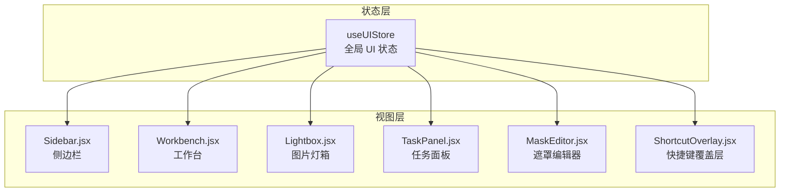
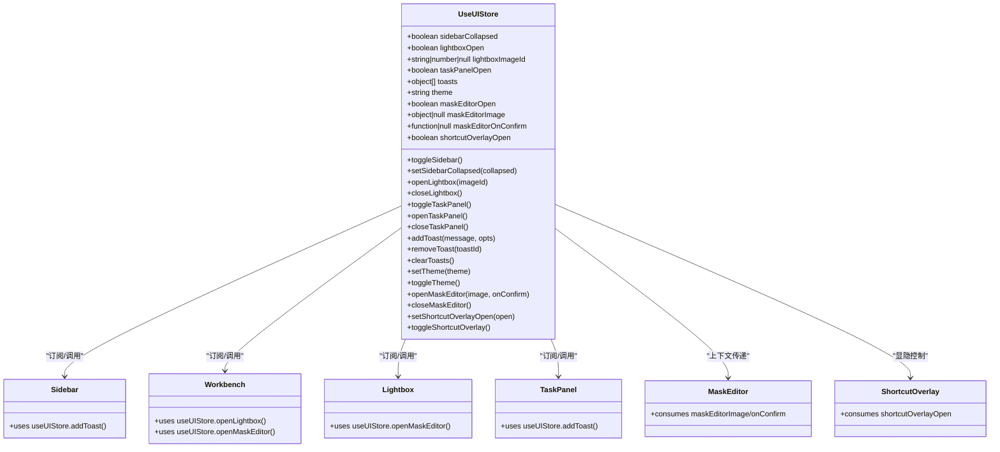
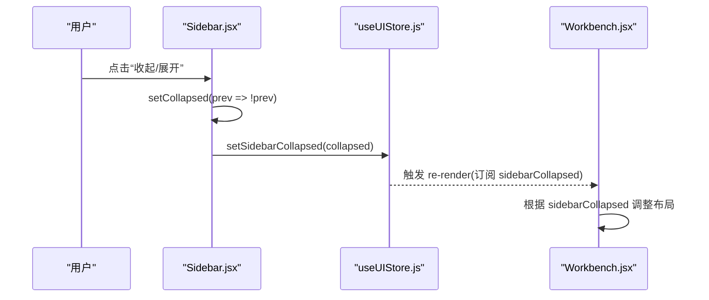
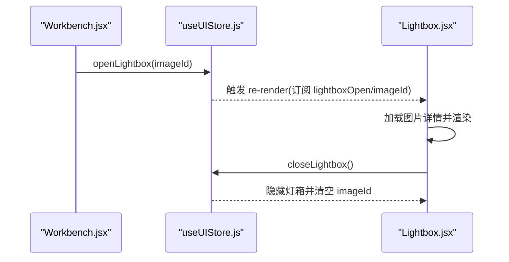
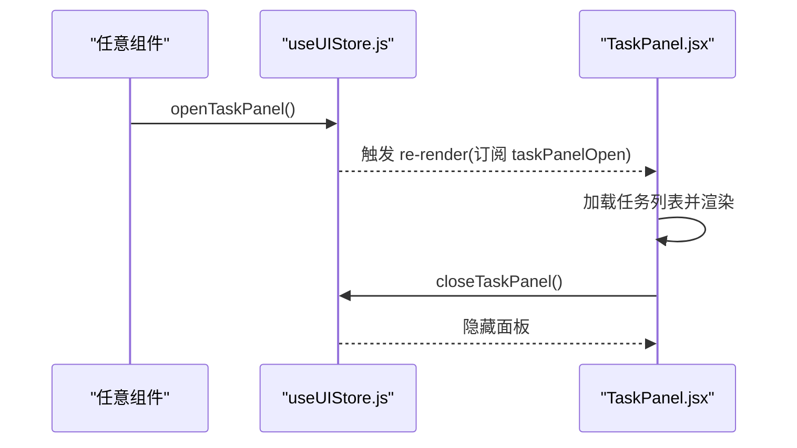
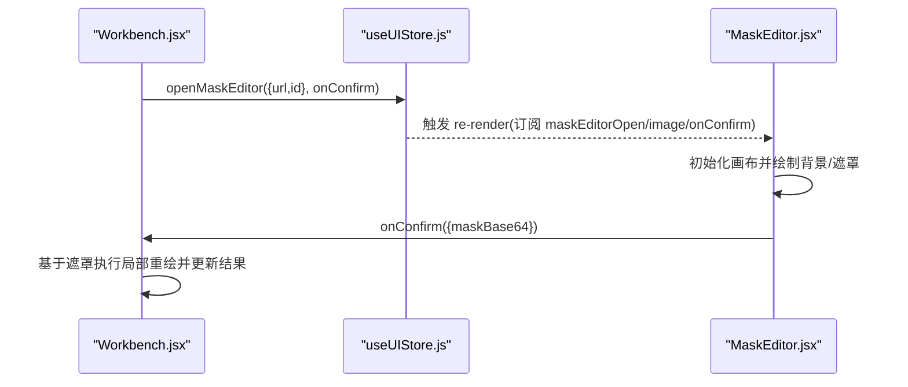
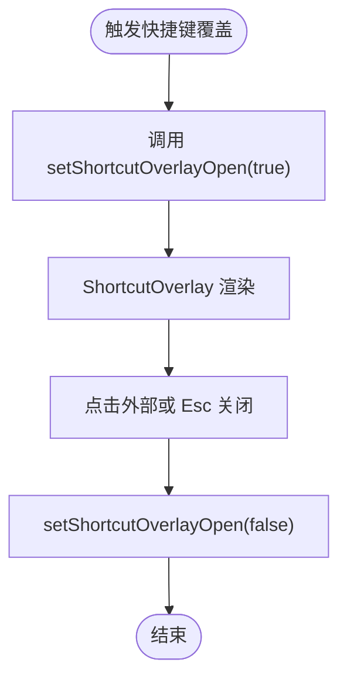
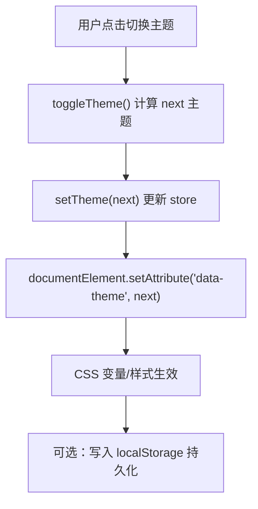
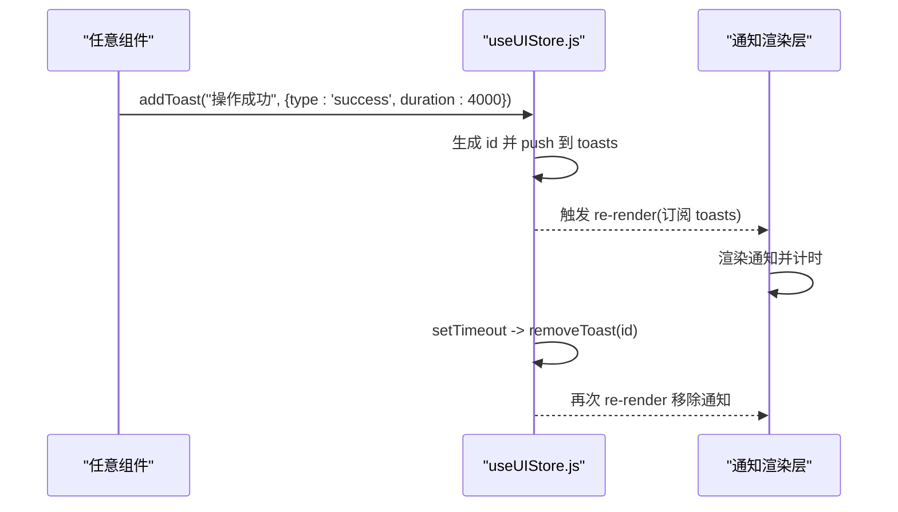
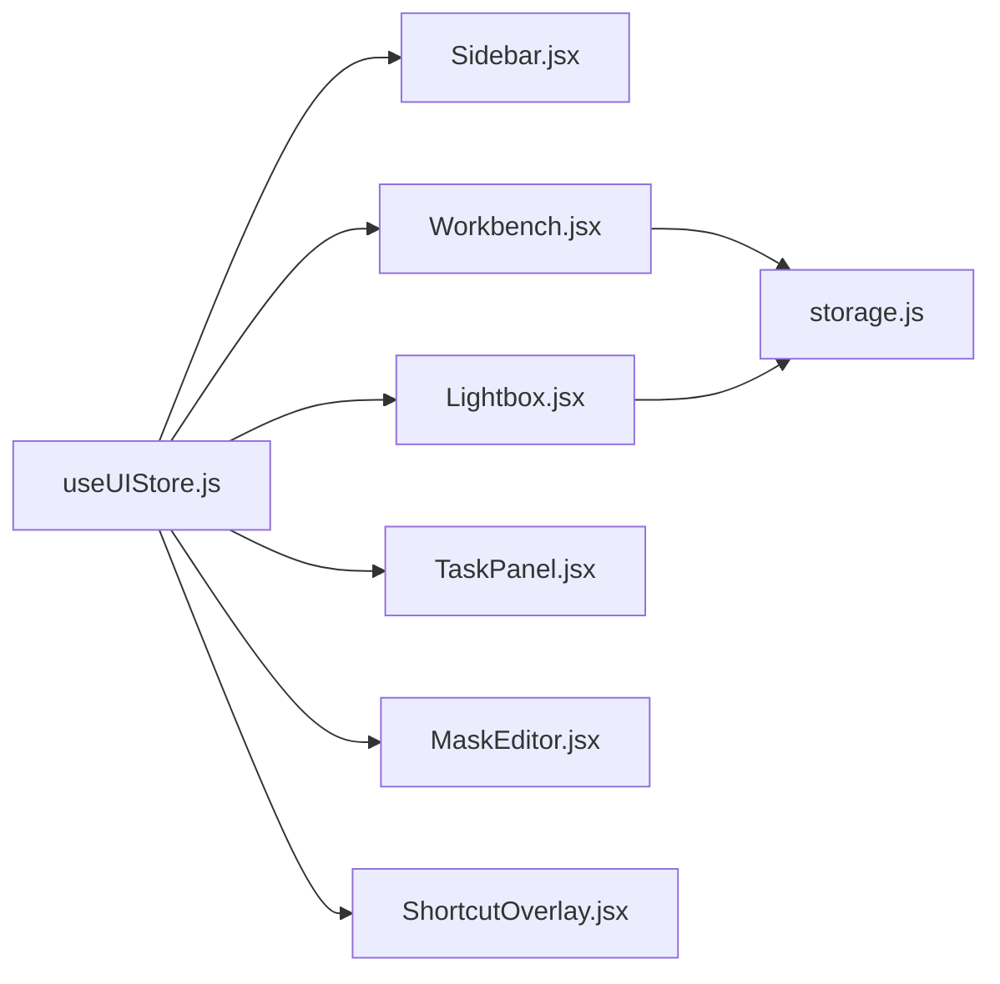

# UI 状态管理

<cite>
**本文引用的文件**   
- [useUIStore.js](file://app/src/stores/useUIStore.js)
- [Sidebar.jsx](file://app/src/components/Sidebar.jsx)
- [Workbench.jsx](file://app/src/pages/Workbench.jsx)
- [Lightbox.jsx](file://app/src/components/Lightbox.jsx)
- [TaskPanel.jsx](file://app/src/components/TaskPanel.jsx)
- [MaskEditor.jsx](file://app/src/components/MaskEditor.jsx)
- [ShortcutOverlay.jsx](file://app/src/components/ShortcutOverlay.jsx)
- [storage.js](file://app/src/services/storage.js)
</cite>

## 目录
1. [简介](#简介)
2. [项目结构](#项目结构)
3. [核心组件](#核心组件)
4. [架构总览](#架构总览)
5. [详细组件分析](#详细组件分析)
6. [依赖关系分析](#依赖关系分析)
7. [性能与体验优化](#性能与体验优化)
8. [故障排查指南](#故障排查指南)
9. [结论](#结论)
10. [附录：使用示例与最佳实践](#附录使用示例与最佳实践)

## 简介
本文件围绕 useUIStore 构建的 UI 状态管理体系，系统性说明全局界面布局、面板显示控制、模态框管理、主题切换与用户偏好等能力。文档重点解释响应式状态管理、跨组件状态共享与全局协调机制，并给出侧边栏展开/折叠、工作区布局调整、工具面板显示控制、遮罩编辑器与快捷键覆盖层等典型场景的使用方式与最佳实践。同时提供状态持久化策略建议与浏览器存储集成方案，帮助开发者在现有代码基础上实现更完善的用户体验。

## 项目结构
- 全局 UI 状态由 useUIStore 集中管理，采用 Zustand + Immer 实现不可变更新与细粒度订阅。
- 各页面与组件通过订阅 store 中的字段（如 sidebarCollapsed、lightboxOpen、taskPanelOpen、toasts、theme、maskEditorOpen 等）驱动渲染与交互。
- 相关 UI 组件包括 Sidebar、Workbench、Lightbox、TaskPanel、MaskEditor、ShortcutOverlay；它们通过调用 store 暴露的动作方法完成状态变更。

图表来源
- [useUIStore.js:12-158](file://app/src/stores/useUIStore.js#L12-L158)
- [Sidebar.jsx:154-167](file://app/src/components/Sidebar.jsx#L154-L167)
- [Workbench.jsx:86-92](file://app/src/pages/Workbench.jsx#L86-L92)
- [Lightbox.jsx:23-24](file://app/src/components/Lightbox.jsx#L23-L24)
- [TaskPanel.jsx:17](file://app/src/components/TaskPanel.jsx#L17)
- [MaskEditor.jsx:20](file://app/src/components/MaskEditor.jsx#L20)
- [ShortcutOverlay.jsx:9](file://app/src/components/ShortcutOverlay.jsx#L9)

章节来源
- [useUIStore.js:12-158](file://app/src/stores/useUIStore.js#L12-L158)
- [Sidebar.jsx:154-167](file://app/src/components/Sidebar.jsx#L154-L167)
- [Workbench.jsx:86-92](file://app/src/pages/Workbench.jsx#L86-L92)
- [Lightbox.jsx:23-24](file://app/src/components/Lightbox.jsx#L23-L24)
- [TaskPanel.jsx:17](file://app/src/components/TaskPanel.jsx#L17)
- [MaskEditor.jsx:20](file://app/src/components/MaskEditor.jsx#L20)
- [ShortcutOverlay.jsx:9](file://app/src/components/ShortcutOverlay.jsx#L9)

## 核心组件
- useUIStore 职责
  - 管理全局 UI 状态：侧边栏折叠、灯箱开关与选中图、任务面板开关、通知消息队列、主题、遮罩编辑器开关与上下文、快捷键覆盖层开关。
  - 提供动作方法：toggle/set 类操作、打开/关闭弹窗、添加/移除通知、设置主题等。
  - 副作用处理：设置主题时同步到 DOM 根节点属性，以驱动 CSS 变量或样式切换。

- 关键状态字段
  - sidebarCollapsed：布尔值，控制侧边栏是否收起。
  - lightboxOpen / lightboxImageId：控制灯箱显示及当前查看的图片标识。
  - taskPanelOpen：控制右侧任务面板显隐。
  - toasts：数组，包含 { id, type, message, duration }，用于全局提示。
  - theme：'dark' | 'light'，当前主题。
  - maskEditorOpen / maskEditorImage / maskEditorOnConfirm：遮罩编辑器上下文与回调。
  - shortcutOverlayOpen：快捷键覆盖层开关。

- 关键动作方法
  - toggleSidebar / setSidebarCollapsed：切换或设置侧边栏折叠状态。
  - openLightbox / closeLightbox：打开/关闭灯箱并携带图片 ID。
  - toggleTaskPanel / openTaskPanel / closeTaskPanel：任务面板显隐控制。
  - addToast / removeToast / clearToasts：通知入队、按 ID 移除、清空全部。
  - setTheme / toggleTheme：设置主题并同步到 DOM。
  - openMaskEditor / closeMaskEditor：打开/关闭遮罩编辑器并传递源图与确认回调。
  - setShortcutOverlayOpen / toggleShortcutOverlay：快捷键覆盖层显隐控制。

章节来源
- [useUIStore.js:12-158](file://app/src/stores/useUIStore.js#L12-L158)

## 架构总览
useUIStore 作为单一事实来源，被多个组件订阅与调用。组件通过 zustand 选择器仅订阅所需字段，避免不必要的重渲染。store 内部使用 immer produce 进行不可变更新，保证状态变更可追踪且高效。

图表来源
- [useUIStore.js:12-158](file://app/src/stores/useUIStore.js#L12-L158)
- [Sidebar.jsx:167](file://app/src/components/Sidebar.jsx#L167)
- [Workbench.jsx:86-92](file://app/src/pages/Workbench.jsx#L86-L92)
- [Lightbox.jsx:23-24](file://app/src/components/Lightbox.jsx#L23-L24)
- [TaskPanel.jsx:17](file://app/src/components/TaskPanel.jsx#L17)
- [MaskEditor.jsx:20](file://app/src/components/MaskEditor.jsx#L20)
- [ShortcutOverlay.jsx:9](file://app/src/components/ShortcutOverlay.jsx#L9)

## 详细组件分析

### 侧边栏展开/折叠与工作区布局
- 状态来源
  - 侧边栏折叠状态由 useUIStore.sidebarCollapsed 控制。
  - 组件内也维护本地 collapsed 状态用于交互反馈，但全局状态可用于跨页面统一行为。
- 交互流程
  - 点击“收起/展开”按钮触发 setCollapsed(!collapsed)，并可结合 useUIStore.setSidebarCollapsed 将状态同步到全局。
  - 侧边栏宽度根据 collapsed 动态变化，影响主内容区域布局。
- 与全局状态协同
  - 其他页面可通过 useUIStore.toggleSidebar / setSidebarCollapsed 统一控制侧边栏，确保多入口一致体验。

图表来源
- [Sidebar.jsx:325-333](file://app/src/components/Sidebar.jsx#L325-L333)
- [useUIStore.js:41-43](file://app/src/stores/useUIStore.js#L41-L43)
- [Workbench.jsx:458-488](file://app/src/pages/Workbench.jsx#L458-L488)

章节来源
- [Sidebar.jsx:154-167](file://app/src/components/Sidebar.jsx#L154-L167)
- [Sidebar.jsx:325-333](file://app/src/components/Sidebar.jsx#L325-L333)
- [useUIStore.js:41-43](file://app/src/stores/useUIStore.js#L41-L43)
- [Workbench.jsx:458-488](file://app/src/pages/Workbench.jsx#L458-L488)

### 灯箱（Lightbox）显示控制与图片浏览
- 状态来源
  - lightboxOpen 与 lightboxImageId 控制灯箱显隐与当前图片。
- 交互流程
  - 在工作台或图库中点击某张图片，调用 openLightbox(imageId)。
  - 灯箱组件负责加载对应图片数据并展示，支持缩放、复制提示词、收藏、淘汰、重新生成、移动到文件夹、加入知识库等操作。
  - 关闭灯箱时调用 closeLightbox 重置状态。

图表来源
- [Workbench.jsx:87](file://app/src/pages/Workbench.jsx#L87)
- [useUIStore.js:46-53](file://app/src/stores/useUIStore.js#L46-L53)
- [Lightbox.jsx:13-29](file://app/src/components/Lightbox.jsx#L13-L29)

章节来源
- [Workbench.jsx:87](file://app/src/pages/Workbench.jsx#L87)
- [useUIStore.js:46-53](file://app/src/stores/useUIStore.js#L46-L53)
- [Lightbox.jsx:13-29](file://app/src/components/Lightbox.jsx#L13-L29)

### 任务面板显示控制
- 状态来源
  - taskPanelOpen 控制右侧任务面板显隐。
- 交互流程
  - 任意入口调用 openTaskPanel / closeTaskPanel / toggleTaskPanel 控制面板。
  - 任务面板从 useTaskStore 拉取任务列表并按状态分组展示，支持暂停、继续、取消、重试、移除等操作。

图表来源
- [useUIStore.js:55-72](file://app/src/stores/useUIStore.js#L55-L72)
- [TaskPanel.jsx:9-28](file://app/src/components/TaskPanel.jsx#L9-L28)

章节来源
- [useUIStore.js:55-72](file://app/src/stores/useUIStore.js#L55-L72)
- [TaskPanel.jsx:9-28](file://app/src/components/TaskPanel.jsx#L9-L28)

### 遮罩编辑器（局部重绘）上下文管理
- 状态来源
  - maskEditorOpen 控制遮罩编辑器显隐。
  - maskEditorImage 保存源图信息（url/id）。
  - maskEditorOnConfirm 保存确认回调，用于接收遮罩结果并执行后续生成逻辑。
- 交互流程
  - 在工作台或灯箱中触发“局部重绘”，调用 openMaskEditor(sourceImage, onConfirm)。
  - 遮罩编辑器渲染双画布（背景图与遮罩层），支持画笔、橡皮擦、撤销/重做、上传外部遮罩、导出黑白 PNG 遮罩。
  - 用户确认后，onConfirm 回调返回遮罩 base64，上层组件据此发起 API 调用并更新结果。

图表来源
- [Workbench.jsx:345-429](file://app/src/pages/Workbench.jsx#L345-L429)
- [useUIStore.js:135-143](file://app/src/stores/useUIStore.js#L135-L143)
- [MaskEditor.jsx:20-46](file://app/src/components/MaskEditor.jsx#L20-L46)

章节来源
- [Workbench.jsx:345-429](file://app/src/pages/Workbench.jsx#L345-L429)
- [useUIStore.js:135-143](file://app/src/stores/useUIStore.js#L135-L143)
- [MaskEditor.jsx:20-46](file://app/src/components/MaskEditor.jsx#L20-L46)

### 快捷键覆盖层
- 状态来源
  - shortcutOverlayOpen 控制快捷键覆盖层显隐。
- 交互流程
  - 通过 setShortcutOverlayOpen(true/false) 或 toggleShortcutOverlay() 控制。
  - 覆盖层展示快捷键分组与按键组合，帮助用户快速上手。

图表来源
- [useUIStore.js:147-157](file://app/src/stores/useUIStore.js#L147-L157)
- [ShortcutOverlay.jsx:9-11](file://app/src/components/ShortcutOverlay.jsx#L9-L11)

章节来源
- [useUIStore.js:147-157](file://app/src/stores/useUIStore.js#L147-L157)
- [ShortcutOverlay.jsx:9-11](file://app/src/components/ShortcutOverlay.jsx#L9-L11)

### 主题切换与用户偏好
- 状态来源
  - theme 字段记录当前主题。
- 交互流程
  - setTheme(theme) 会同步设置 document.documentElement 的 data-theme 属性，从而驱动 CSS 变量或样式切换。
  - toggleTheme() 在 dark/light 之间切换。
- 用户偏好持久化建议
  - 可在应用启动时读取浏览器存储（localStorage/sessionStorage）恢复 theme。
  - 在每次主题变更时写入浏览器存储，确保刷新后保持一致。

图表来源
- [useUIStore.js:119-131](file://app/src/stores/useUIStore.js#L119-L131)

章节来源
- [useUIStore.js:119-131](file://app/src/stores/useUIStore.js#L119-L131)

### 通知系统（Toast）
- 状态来源
  - toasts 数组承载所有待显示的通知项。
- 交互流程
  - addToast(message, {type, duration}) 生成唯一 ID 并推入队列，若 duration > 0 则自动定时移除。
  - removeToast(id) 按 ID 移除；clearToasts() 清空全部。
  - 组件通过 useUIStore(s => s.addToast) 获取方法并在业务成功/失败时调用。

图表来源
- [useUIStore.js:80-117](file://app/src/stores/useUIStore.js#L80-L117)

章节来源
- [useUIStore.js:80-117](file://app/src/stores/useUIStore.js#L80-L117)

## 依赖关系分析
- 组件对 useUIStore 的依赖
  - Sidebar：使用 addToast 反馈操作结果。
  - Workbench：使用 openLightbox、openMaskEditor、addToast 等。
  - Lightbox：使用 openMaskEditor、addToast。
  - TaskPanel：使用 addToast。
  - MaskEditor：消费 maskEditorImage 与 maskEditorOnConfirm。
  - ShortcutOverlay：消费 shortcutOverlayOpen。
- 外部服务依赖
  - storage.js 提供图片热/冷区存储、缩略图生成、OSS 上传下载等功能，与 UI 状态无直接耦合，但在灯箱下载、遮罩编辑等场景中会被间接调用。

图表来源
- [useUIStore.js:12-158](file://app/src/stores/useUIStore.js#L12-L158)
- [storage.js:44-151](file://app/src/services/storage.js#L44-L151)

章节来源
- [useUIStore.js:12-158](file://app/src/stores/useUIStore.js#L12-L158)
- [storage.js:44-151](file://app/src/services/storage.js#L44-L151)

## 性能与体验优化
- 细粒度订阅
  - 使用 zustand 选择器只订阅必要字段，减少无关组件重渲染。
- 不可变更新
  - 使用 immer produce 进行状态更新，避免手动深拷贝，提升可维护性与性能。
- 通知自动清理
  - addToast 内部使用 setTimeout 自动移除，避免内存泄漏与 UI 堆积。
- 主题切换即时生效
  - 通过设置 DOM 根节点属性，配合 CSS 变量实现零额外开销的主题切换。
- 遮罩编辑器性能
  - 双画布分离背景与遮罩，仅在必要时重绘；采样像素计算遮罩比例，降低大图处理成本。

[本节为通用指导，不直接分析具体文件]

## 故障排查指南
- 主题未生效
  - 检查 setTheme 是否正确设置 document.documentElement 的 data-theme。
  - 确认 CSS 变量或样式规则是否监听该属性。
- 灯箱无法打开
  - 确认 openLightbox 是否传入有效 imageId。
  - 检查 Lightbox 组件是否正确订阅 lightboxOpen 与 lightboxImageId。
- 任务面板不显示
  - 确认 taskPanelOpen 状态是否被正确设置为 true。
  - 检查 TaskPanel 组件是否在合适位置挂载并监听状态。
- 遮罩编辑器无图像
  - 确认 openMaskEditor 传入的 sourceImage.url 是否可用。
  - 检查 MaskEditor 初始化逻辑是否正确加载图片并绘制背景。
- 通知未消失
  - 检查 addToast 的 duration 是否为正数。
  - 确认 removeToast 是否被正确调用。

章节来源
- [useUIStore.js:119-131](file://app/src/stores/useUIStore.js#L119-L131)
- [useUIStore.js:46-53](file://app/src/stores/useUIStore.js#L46-L53)
- [useUIStore.js:55-72](file://app/src/stores/useUIStore.js#L55-L72)
- [useUIStore.js:135-143](file://app/src/stores/useUIStore.js#L135-L143)
- [useUIStore.js:80-117](file://app/src/stores/useUIStore.js#L80-L117)

## 结论
useUIStore 提供了清晰、可扩展的全局 UI 状态管理能力，涵盖布局、面板、模态框、主题与通知等关键领域。通过 zustand + immer 的组合，实现了高效的响应式更新与简洁的状态变更语义。配合各组件的合理订阅与调用，能够形成一致的跨页面体验。建议在现有基础上引入浏览器存储持久化策略，进一步提升用户偏好的一致性。

[本节为总结性内容，不直接分析具体文件]

## 附录：使用示例与最佳实践

- 控制侧边栏展开/折叠
  - 在任意组件中调用 useUIStore(s => s.toggleSidebar()) 或 useUIStore(s => s.setSidebarCollapsed(true/false))。
  - 在 Sidebar 组件中结合本地状态与全局状态，确保交互流畅与一致性。

- 打开/关闭灯箱
  - 在工作台或图库中点击图片时调用 useUIStore(s => s.openLightbox(imageId))。
  - 在灯箱组件关闭时调用 useUIStore(s => s.closeLightbox())。

- 打开/关闭任务面板
  - 使用 useUIStore(s => s.openTaskPanel()) 或 useUIStore(s => s.closeTaskPanel())。
  - 在面板内通过 useTaskStore 的方法管理任务生命周期。

- 打开遮罩编辑器
  - 在工作台或灯箱中调用 useUIStore(s => s.openMaskEditor({url,id}, onConfirm))。
  - 在 onConfirm 回调中接收遮罩 base64 并执行局部重绘流程。

- 主题切换与持久化建议
  - 在应用启动时从 localStorage 读取 theme 并调用 setTheme 恢复。
  - 在 setTheme 成功后写入 localStorage，确保刷新后保持一致。

- 通知使用
  - 在成功/失败路径中调用 useUIStore(s => s.addToast(message, {type, duration}))。
  - 需要手动控制时可保存返回的 toast id 并调用 removeToast。

章节来源
- [useUIStore.js:31-43](file://app/src/stores/useUIStore.js#L31-L43)
- [useUIStore.js:46-53](file://app/src/stores/useUIStore.js#L46-L53)
- [useUIStore.js:55-72](file://app/src/stores/useUIStore.js#L55-L72)
- [useUIStore.js:80-117](file://app/src/stores/useUIStore.js#L80-L117)
- [useUIStore.js:119-131](file://app/src/stores/useUIStore.js#L119-L131)
- [useUIStore.js:135-143](file://app/src/stores/useUIStore.js#L135-L143)