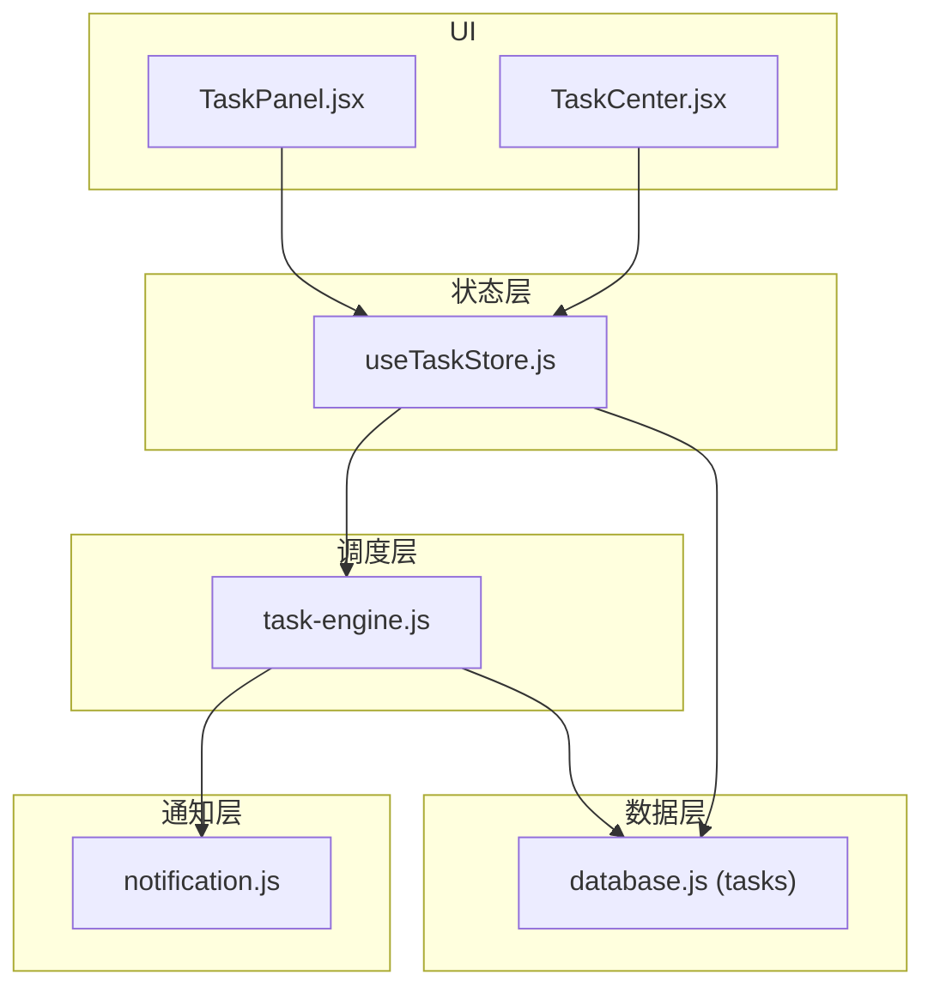
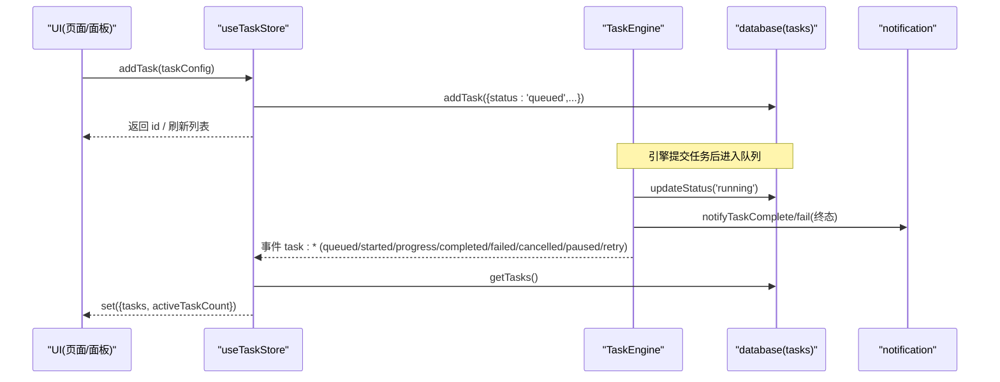
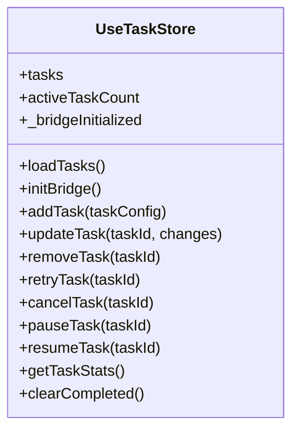
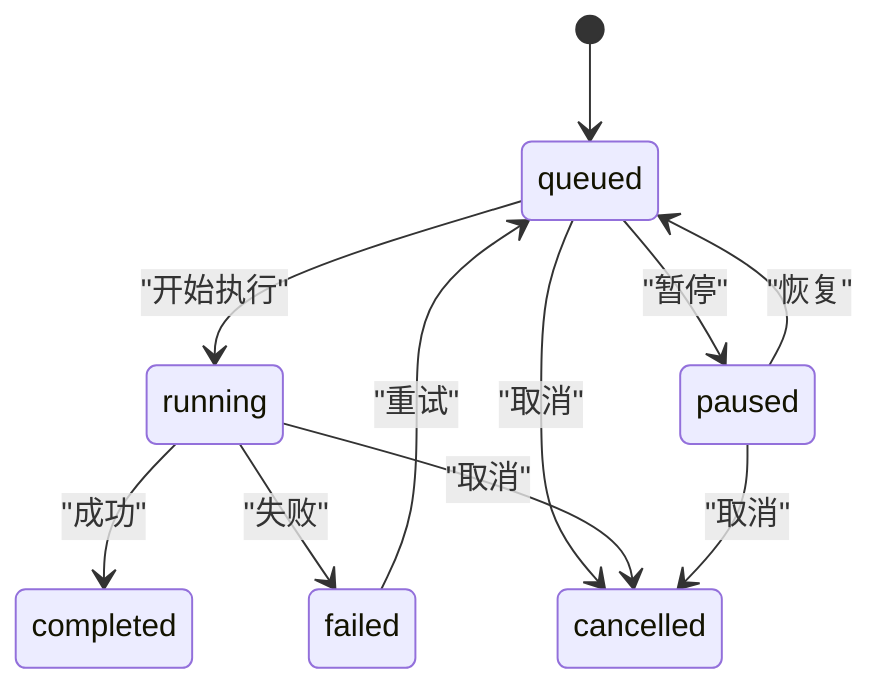
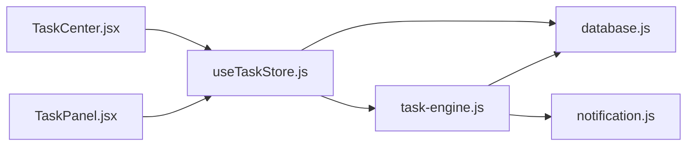

# 任务状态管理

<cite>
**本文引用的文件**
- [useTaskStore.js](file://app/src/stores/useTaskStore.js)
- [task-engine.js](file://app/src/services/task-engine.js)
- [database.js](file://app/src/db/database.js)
- [notification.js](file://app/src/services/notification.js)
- [TaskCenter.jsx](file://app/src/pages/TaskCenter.jsx)
- [TaskPanel.jsx](file://app/src/components/TaskPanel.jsx)
</cite>

## 目录
1. [简介](#简介)
2. [项目结构](#项目结构)
3. [核心组件](#核心组件)
4. [架构总览](#架构总览)
5. [详细组件分析](#详细组件分析)
6. [依赖关系分析](#依赖关系分析)
7. [性能考虑](#性能考虑)
8. [故障排查指南](#故障排查指南)
9. [结论](#结论)
10. [附录：使用示例与最佳实践](#附录使用示例与最佳实践)

## 简介
本文件围绕 useTaskStore 的任务状态管理能力，系统化阐述任务队列、状态跟踪、进度监控、错误处理与统计展示等核心功能；并完整解释任务生命周期（创建、排队、运行、完成/失败/取消/暂停/恢复），以及优先级控制、并发限制、重试机制和取消操作。同时说明与 TaskEngine 的实时通信机制、事件监听与状态同步，并提供具体代码路径示例，帮助读者快速上手与排障。

## 项目结构
与任务状态管理相关的核心模块分布如下：
- 状态层：Zustand store（useTaskStore）负责 UI 状态与持久化桥接
- 调度层：TaskEngine 单例负责任务调度、并发控制、重试与事件广播
- 数据层：IndexedDB（Dexie）封装 tasks 表读写与统计
- 通知层：浏览器通知 API 包装，用于任务完成/失败提醒
- 视图层：任务中心页面与侧边任务面板，消费 store 进行展示与交互

图表来源
- [useTaskStore.js:1-172](file://app/src/stores/useTaskStore.js#L1-L172)
- [task-engine.js:1-319](file://app/src/services/task-engine.js#L1-L319)
- [database.js:232-274](file://app/src/db/database.js#L232-L274)
- [notification.js:78-103](file://app/src/services/notification.js#L78-L103)
- [TaskCenter.jsx:24-65](file://app/src/pages/TaskCenter.jsx#L24-L65)
- [TaskPanel.jsx:9-37](file://app/src/components/TaskPanel.jsx#L9-L37)

章节来源
- [useTaskStore.js:1-172](file://app/src/stores/useTaskStore.js#L1-L172)
- [task-engine.js:1-319](file://app/src/services/task-engine.js#L1-L319)
- [database.js:232-274](file://app/src/db/database.js#L232-L274)
- [notification.js:78-103](file://app/src/services/notification.js#L78-L103)
- [TaskCenter.jsx:24-65](file://app/src/pages/TaskCenter.jsx#L24-L65)
- [TaskPanel.jsx:9-37](file://app/src/components/TaskPanel.jsx#L9-L37)

## 核心组件
- useTaskStore（Zustand）
  - 职责：维护任务列表与活跃计数；提供加载、新增、更新、删除、重试、取消、暂停/恢复、清理已完成、统计查询等操作；订阅 TaskEngine 事件以刷新本地状态。
  - 关键状态：tasks、activeTaskCount、_bridgeInitialized
  - 关键动作：loadTasks、initBridge、addTask、updateTask、removeTask、retryTask、cancelTask、pauseTask、resumeTask、getTaskStats、clearCompleted
- TaskEngine（调度器）
  - 职责：任务入队/出队、并发控制、执行上下文注入（AbortController、onProgress）、状态机流转、指数退避重试、事件广播、持久化状态更新、浏览器通知。
  - 关键能力：setMaxConcurrent、submit/submitWithId、cancel、retry、pause/resume、on/off/_emit、_processQueue/_runTask
- database（IndexedDB 封装）
  - 职责：tasks 表的增删改查与聚合统计；为 Store 与 Engine 提供统一数据访问。
- notification（通知服务）
  - 职责：请求权限、发送完成/失败通知。

章节来源
- [useTaskStore.js:14-172](file://app/src/stores/useTaskStore.js#L14-L172)
- [task-engine.js:33-319](file://app/src/services/task-engine.js#L33-L319)
- [database.js:232-274](file://app/src/db/database.js#L232-L274)
- [notification.js:19-103](file://app/src/services/notification.js#L19-L103)

## 架构总览
useTaskStore 作为“UI 状态 + 事件桥”的中枢，将 TaskEngine 的事件转换为 Zustand 状态变更，驱动 UI 实时更新；TaskEngine 负责实际的任务编排与执行；数据库层保证状态持久化；通知层在任务终态时触发系统通知。

图表来源
- [useTaskStore.js:39-64](file://app/src/stores/useTaskStore.js#L39-L64)
- [useTaskStore.js:67-87](file://app/src/stores/useTaskStore.js#L67-L87)
- [task-engine.js:57-92](file://app/src/services/task-engine.js#L57-L92)
- [task-engine.js:222-297](file://app/src/services/task-engine.js#L222-L297)
- [database.js:235-274](file://app/src/db/database.js#L235-L274)
- [notification.js:78-103](file://app/src/services/notification.js#L78-L103)

## 详细组件分析

### useTaskStore 状态与行为
- 状态
  - tasks：任务记录数组（来自 IndexedDB）
  - activeTaskCount：当前处于 running/queued 的任务数
  - _bridgeInitialized：事件桥初始化标记
- 行为
  - loadTasks：从数据库拉取任务并计算活跃数量
  - initBridge：一次性订阅 TaskEngine 的多类事件，收到事件后刷新任务列表
  - addTask/updateTask/removeTask：对任务的 CRUD 操作，均会刷新本地列表
  - retryTask/cancelTask/pauseTask/resumeTask：通过 TaskEngine 执行控制，失败时回退到本地状态修正
  - getTaskStats：获取聚合统计
  - clearCompleted：批量删除已完成任务并刷新

图表来源
- [useTaskStore.js:14-172](file://app/src/stores/useTaskStore.js#L14-L172)

章节来源
- [useTaskStore.js:23-33](file://app/src/stores/useTaskStore.js#L23-L33)
- [useTaskStore.js:39-64](file://app/src/stores/useTaskStore.js#L39-L64)
- [useTaskStore.js:67-87](file://app/src/stores/useTaskStore.js#L67-L87)
- [useTaskStore.js:90-97](file://app/src/stores/useTaskStore.js#L90-L97)
- [useTaskStore.js:100-107](file://app/src/stores/useTaskStore.js#L100-L107)
- [useTaskStore.js:110-124](file://app/src/stores/useTaskStore.js#L110-L124)
- [useTaskStore.js:127-135](file://app/src/stores/useTaskStore.js#L127-L135)
- [useTaskStore.js:138-146](file://app/src/stores/useTaskStore.js#L138-L146)
- [useTaskStore.js:149-157](file://app/src/stores/useTaskStore.js#L149-L157)
- [useTaskStore.js:160-162](file://app/src/stores/useTaskStore.js#L160-L162)
- [useTaskStore.js:165-171](file://app/src/stores/useTaskStore.js#L165-L171)

### TaskEngine 调度与状态机
- 并发控制
  - 默认最大并发 3，可通过 setMaxConcurrent 调整
  - 内部使用队列与活动集合，按 FIFO 出队执行
- 任务提交
  - submit：生成 taskId，持久化为 queued，入队并触发事件
  - submitWithId：复用已创建的 DB 任务 ID 入队
- 执行上下文
  - 注入 AbortController.signal 支持取消
  - onProgress(percent) 回调可被业务 execute 调用以推进进度
- 状态机
  - 允许转换：queued→running|cancelled|paused；running→completed|failed|cancelled；paused→queued|cancelled；failed→queued（重试）
- 重试机制
  - 指数退避（基于重试次数），最大重试次数 3
  - 仅对可重试错误（如 5xx、网络错误）生效
- 事件
  - 对外暴露 on/off/_emit，事件包括：task:queued、task:started、task:progress、task:completed、task:failed、task:cancelled、task:paused、task:retry
- 通知
  - 任务完成/失败时调用通知服务

图表来源
- [task-engine.js:18-31](file://app/src/services/task-engine.js#L18-L31)
- [task-engine.js:215-220](file://app/src/services/task-engine.js#L215-L220)
- [task-engine.js:222-297](file://app/src/services/task-engine.js#L222-L297)

章节来源
- [task-engine.js:44-48](file://app/src/services/task-engine.js#L44-L48)
- [task-engine.js:57-92](file://app/src/services/task-engine.js#L57-L92)
- [task-engine.js:95-116](file://app/src/services/task-engine.js#L95-L116)
- [task-engine.js:118-146](file://app/src/services/task-engine.js#L118-L146)
- [task-engine.js:148-178](file://app/src/services/task-engine.js#L148-L178)
- [task-engine.js:181-187](file://app/src/services/task-engine.js#L181-L187)
- [task-engine.js:191-211](file://app/src/services/task-engine.js#L191-L211)
- [task-engine.js:215-297](file://app/src/services/task-engine.js#L215-L297)
- [task-engine.js:299-305](file://app/src/services/task-engine.js#L299-L305)

### 数据库与统计
- tasks 表字段与索引
  - 主键自增 id，包含 type、status、model、createdAt 等字段
  - 复合索引 [status+createdAt] 便于按状态和时间排序
- 常用接口
  - addTask/getTasks/getTask/updateTask/deleteTask
  - getTaskStats：返回 total/active/queued/completed/failed 聚合
- 注意
  - 任务记录由 Store 或 Engine 写入，确保状态一致性与时间戳更新

章节来源
- [database.js:22-31](file://app/src/db/database.js#L22-L31)
- [database.js:235-274](file://app/src/db/database.js#L235-L274)

### 通知服务
- 能力
  - requestPermission：请求浏览器通知权限
  - notifyTaskComplete/notifyTaskFailed：根据任务信息推送系统通知
- 集成点
  - TaskEngine 在任务完成/失败时调用通知函数

章节来源
- [notification.js:19-43](file://app/src/services/notification.js#L19-L43)
- [notification.js:78-103](file://app/src/services/notification.js#L78-L103)
- [task-engine.js:254-291](file://app/src/services/task-engine.js#L254-L291)

### 视图层使用
- TaskCenter 页面
  - 分组显示：进行中、排队中、已完成、失败、已暂停
  - 提供取消、重试、暂停/恢复、移除、清空已完成等操作
- TaskPanel 侧边面板
  - 轻量任务列表，支持暂停/继续、取消、移除、重试等快捷操作

章节来源
- [TaskCenter.jsx:24-65](file://app/src/pages/TaskCenter.jsx#L24-L65)
- [TaskPanel.jsx:9-37](file://app/src/components/TaskPanel.jsx#L9-L37)

## 依赖关系分析
- useTaskStore 依赖
  - database：读写 tasks 表
  - TaskEngine：事件订阅与任务控制
- TaskEngine 依赖
  - database：持久化任务状态
  - notification：终态通知
- 视图层依赖
  - useTaskStore：读取任务与调用动作

图表来源
- [useTaskStore.js:10-12](file://app/src/stores/useTaskStore.js#L10-L12)
- [task-engine.js:14-16](file://app/src/services/task-engine.js#L14-L16)
- [TaskCenter.jsx:7-8](file://app/src/pages/TaskCenter.jsx#L7-L8)
- [TaskPanel.jsx:6-7](file://app/src/components/TaskPanel.jsx#L6-L7)

章节来源
- [useTaskStore.js:10-12](file://app/src/stores/useTaskStore.js#L10-L12)
- [task-engine.js:14-16](file://app/src/services/task-engine.js#L14-L16)
- [TaskCenter.jsx:7-8](file://app/src/pages/TaskCenter.jsx#L7-L8)
- [TaskPanel.jsx:6-7](file://app/src/components/TaskPanel.jsx#L6-L7)

## 性能考虑
- 事件刷新策略
  - 当前实现每次事件都触发 loadTasks 全量刷新，简单可靠但可能带来一定开销。建议：
    - 合并高频事件（如 progress）的刷新频率
    - 增量更新：在 store 内根据事件类型局部更新 tasks，减少全量拉取
- 并发与队列
  - 合理设置最大并发（setMaxConcurrent），避免过多并发导致后端限流或前端卡顿
- 数据库索引
  - 利用 [status+createdAt] 索引提升按状态筛选与排序的性能
- 通知节流
  - 大量任务完成时，通知可考虑去重或节流，避免频繁弹窗

[本节为通用优化建议，不直接分析具体文件]

## 故障排查指南
- 常见问题定位
  - 任务未出现在 UI：检查 initBridge 是否调用；确认 TaskEngine 事件是否发出；查看 loadTasks 是否报错
  - 任务无法取消/暂停：确认任务是否在 active 或 queue 中；检查 cancel/pause 返回值与状态更新
  - 重试未生效：确认错误是否属于可重试类型（5xx/网络错误）；检查 retryCount 是否超过上限
  - 进度不更新：确认 execute 是否正确调用 onProgress；检查 progress 事件是否发出
- 日志与断点
  - 关注控制台输出中的 [TaskStore] 与 [TaskEngine] 前缀日志
  - 在 _runTask、_processQueue、initBridge 处设置断点观察流程
- 数据库一致性
  - 对比 IndexedDB 中 tasks 表状态与 UI 显示是否一致
  - 检查 updatedAt 是否随状态变更更新

章节来源
- [useTaskStore.js:39-64](file://app/src/stores/useTaskStore.js#L39-L64)
- [task-engine.js:215-297](file://app/src/services/task-engine.js#L215-L297)
- [database.js:235-274](file://app/src/db/database.js#L235-L274)

## 结论
useTaskStore 提供了简洁而强大的任务状态管理能力，结合 TaskEngine 的并发控制、重试与事件机制，实现了端到端的任务生命周期管理与实时 UI 同步。配合 IndexedDB 持久化与浏览器通知，形成稳定可用的后台任务体验。通过合理的刷新策略与并发配置，可在大规模任务场景下保持良好性能与用户体验。

[本节为总结性内容，不直接分析具体文件]

## 附录：使用示例与最佳实践

### 初始化与事件桥
- 应用启动时初始化数据库与通知权限
- 调用 useTaskStore.initBridge 建立事件桥，确保 UI 能实时响应任务变化

参考路径
- [useTaskStore.js:39-64](file://app/src/stores/useTaskStore.js#L39-L64)
- [notification.js:19-43](file://app/src/services/notification.js#L19-L43)

### 创建并提交任务
- 方式一：通过 Store 添加任务记录（适合先入库再交由外部引擎执行）
  - 使用 addTask 插入一条 queued 任务，随后由外部逻辑提交至 TaskEngine
- 方式二：通过 TaskEngine.submit 直接提交任务（含 execute 函数）
  - 自动持久化为 queued，入队并执行

参考路径
- [useTaskStore.js:67-87](file://app/src/stores/useTaskStore.js#L67-L87)
- [task-engine.js:57-92](file://app/src/services/task-engine.js#L57-L92)

### 监控进度与结果
- 在 execute 中调用 ctx.onProgress(percent) 上报进度
- 监听 TaskEngine 的 task:progress 事件或通过 store 的 tasks 列表获取最新进度
- 任务完成后，result 字段包含执行结果

参考路径
- [task-engine.js:230-257](file://app/src/services/task-engine.js#L230-L257)
- [useTaskStore.js:45-56](file://app/src/stores/useTaskStore.js#L45-L56)

### 错误处理与重试
- 非可重试错误（如参数错误）将直接进入 failed 状态
- 可重试错误（5xx/网络错误）将按指数退避重试，最多 3 次
- 用户可手动重试失败任务

参考路径
- [task-engine.js:259-297](file://app/src/services/task-engine.js#L259-L297)
- [useTaskStore.js:110-124](file://app/src/stores/useTaskStore.js#L110-L124)

### 取消与暂停/恢复
- 取消：立即中止正在执行的任务或从队列移除
- 暂停：中断运行中任务或将队列任务置为 paused
- 恢复：将 paused 任务重新入队

参考路径
- [task-engine.js:95-116](file://app/src/services/task-engine.js#L95-L116)
- [task-engine.js:148-178](file://app/src/services/task-engine.js#L148-L178)
- [useTaskStore.js:127-157](file://app/src/stores/useTaskStore.js#L127-L157)

### 统计与清理
- 使用 getTaskStats 获取聚合统计
- 使用 clearCompleted 清理已完成任务，释放存储

参考路径
- [useTaskStore.js:160-171](file://app/src/stores/useTaskStore.js#L160-L171)
- [database.js:265-274](file://app/src/db/database.js#L265-L274)

### 界面集成要点
- 在 TaskCenter/TaskPanel 中按需渲染不同状态的任务组
- 按钮操作绑定到 store 的动作方法，统一处理成功/失败提示

参考路径
- [TaskCenter.jsx:24-65](file://app/src/pages/TaskCenter.jsx#L24-L65)
- [TaskPanel.jsx:9-37](file://app/src/components/TaskPanel.jsx#L9-L37)