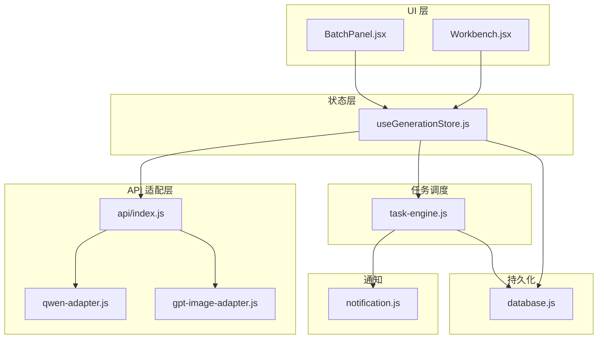
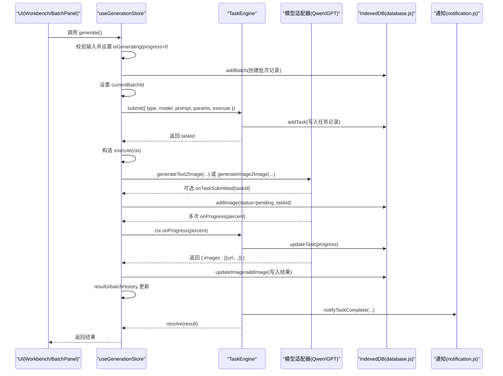
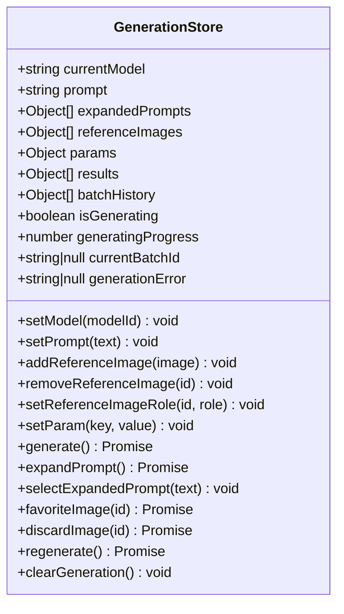
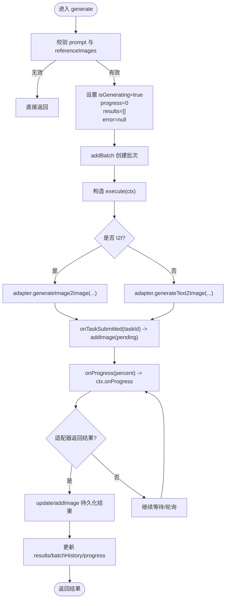
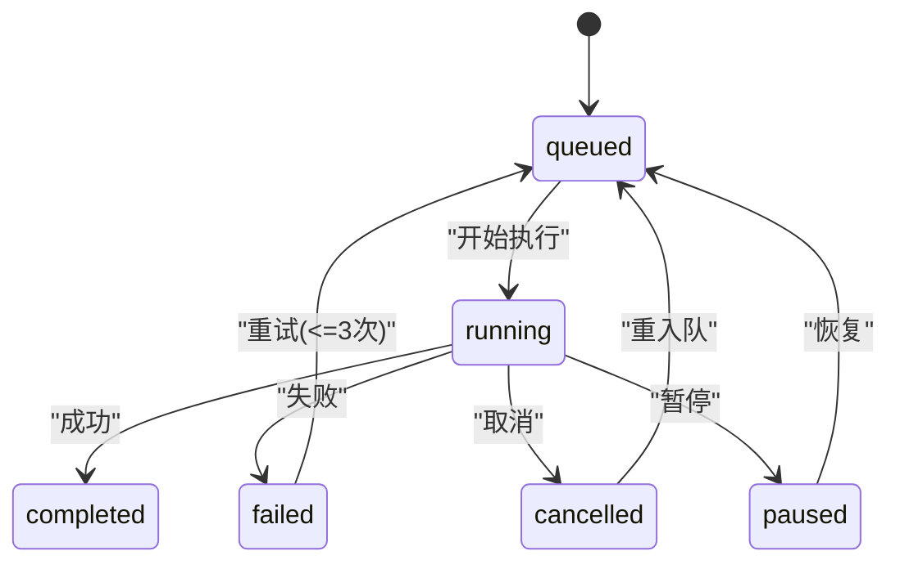
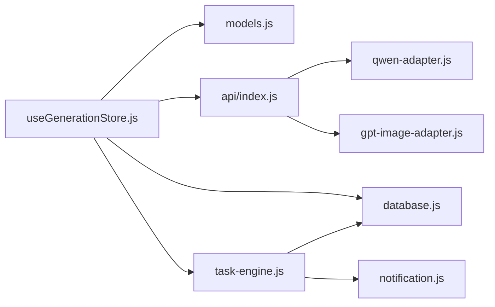

# 图像生成状态管理

<cite>
**本文引用的文件**
- [useGenerationStore.js](file://app/src/stores/useGenerationStore.js)
- [task-engine.js](file://app/src/services/task-engine.js)
- [database.js](file://app/src/db/database.js)
- [models.js](file://app/src/constants/models.js)
- [api/index.js](file://app/src/services/api/index.js)
- [qwen-adapter.js](file://app/src/services/api/qwen-adapter.js)
- [gpt-image-adapter.js](file://app/src/services/api/gpt-image-adapter.js)
- [notification.js](file://app/src/services/notification.js)
- [Workbench.jsx](file://app/src/pages/Workbench.jsx)
- [BatchPanel.jsx](file://app/src/components/BatchPanel.jsx)
</cite>

## 目录
1. [简介](#简介)
2. [项目结构](#项目结构)
3. [核心组件](#核心组件)
4. [架构总览](#架构总览)
5. [详细组件分析](#详细组件分析)
6. [依赖关系分析](#依赖关系分析)
7. [性能考虑](#性能考虑)
8. [故障排查指南](#故障排查指南)
9. [结论](#结论)
10. [附录：方法使用示例与最佳实践](#附录方法使用示例与最佳实践)

## 简介
本文件围绕 useGenerationStore 展开，系统化阐述图像生成状态管理的核心能力与实现细节。内容涵盖：
- 当前模型选择、提示词管理、参考图片处理、生成参数配置、结果管理与批量历史记录
- generate() 的完整工作流：从用户触发到任务提交、适配器调用、进度跟踪、结果持久化
- 状态更新模式、错误处理机制、与 TaskEngine 的集成方式、IndexedDB 数据持久化策略
- 具体方法的使用路径（如 setModel、addReferenceImage、generate、expandPrompt 等）
- 性能优化技巧与调试方法

## 项目结构
useGenerationStore 位于 stores 层，负责“工作区”的生成态；TaskEngine 提供后台任务调度；database.js 基于 Dexie 封装 IndexedDB；services/api 提供多模型适配器；constants/models.js 定义模型能力与默认参数；UI 页面与组件通过 Zustand 订阅 store 进行交互。

图表来源
- [useGenerationStore.js:1-360](file://app/src/stores/useGenerationStore.js#L1-L360)
- [task-engine.js:1-319](file://app/src/services/task-engine.js#L1-L319)
- [database.js:1-339](file://app/src/db/database.js#L1-L339)
- [api/index.js:1-39](file://app/src/services/api/index.js#L1-L39)
- [qwen-adapter.js:1-200](file://app/src/services/api/qwen-adapter.js#L1-L200)
- [gpt-image-adapter.js:1-336](file://app/src/services/api/gpt-image-adapter.js#L1-L336)
- [notification.js:1-113](file://app/src/services/notification.js#L1-L113)
- [Workbench.jsx:64-182](file://app/src/pages/Workbench.jsx#L64-L182)
- [BatchPanel.jsx:18-101](file://app/src/components/BatchPanel.jsx#L18-L101)

章节来源
- [useGenerationStore.js:1-360](file://app/src/stores/useGenerationStore.js#L1-L360)
- [task-engine.js:1-319](file://app/src/services/task-engine.js#L1-L319)
- [database.js:1-339](file://app/src/db/database.js#L1-L339)
- [api/index.js:1-39](file://app/src/services/api/index.js#L1-L39)
- [models.js:1-106](file://app/src/constants/models.js#L1-L106)
- [Workbench.jsx:64-182](file://app/src/pages/Workbench.jsx#L64-L182)
- [BatchPanel.jsx:18-101](file://app/src/components/BatchPanel.jsx#L18-L101)

## 核心组件
- useGenerationStore：集中管理当前模型、提示词、扩写结果、参考图、参数、结果集、批次历史、生成标志与进度、错误信息。提供 setModel、setPrompt、addReferenceImage、removeReferenceImage、setReferenceImageRole、setParam、generate、expandPrompt、selectExpandedPrompt、favoriteImage、discardImage、regenerate、clearGeneration 等方法。
- TaskEngine：后台任务队列与执行器，支持并发控制、FIFO 队列、指数退避重试、状态机（queued/running/completed/failed/cancelled/paused）、事件广播、进度上报、自动持久化。
- database.js：基于 Dexie 的 IndexedDB 封装，提供 images、batches、tasks、settings 等表的增删改查。
- api/index.js：统一导出各模型适配器工厂 getModelAdapter 与 LLM 适配器 getLLMAdapter。
- qwen-adapter.js / gpt-image-adapter.js：分别实现同步长耗时与异步轮询两种生成流程，均支持 onProgress 与 onTaskSubmitted 回调。
- notification.js：浏览器通知封装，用于任务完成/失败提醒。

章节来源
- [useGenerationStore.js:22-359](file://app/src/stores/useGenerationStore.js#L22-L359)
- [task-engine.js:33-319](file://app/src/services/task-engine.js#L33-L319)
- [database.js:22-339](file://app/src/db/database.js#L22-L339)
- [api/index.js:15-39](file://app/src/services/api/index.js#L15-L39)
- [qwen-adapter.js:51-200](file://app/src/services/api/qwen-adapter.js#L51-L200)
- [gpt-image-adapter.js:156-336](file://app/src/services/api/gpt-image-adapter.js#L156-L336)
- [notification.js:78-113](file://app/src/services/notification.js#L78-L113)

## 架构总览
下图展示一次文本到图像的生成请求在系统内的流转过程，包括状态更新、任务调度、适配器调用、进度与持久化。

图表来源
- [useGenerationStore.js:112-290](file://app/src/stores/useGenerationStore.js#L112-L290)
- [task-engine.js:57-297](file://app/src/services/task-engine.js#L57-L297)
- [database.js:144-274](file://app/src/db/database.js#L144-L274)
- [qwen-adapter.js:60-105](file://app/src/services/api/qwen-adapter.js#L60-L105)
- [gpt-image-adapter.js:252-272](file://app/src/services/api/gpt-image-adapter.js#L252-L272)
- [notification.js:78-88](file://app/src/services/notification.js#L78-L88)

## 详细组件分析

### useGenerationStore 状态与方法
- 状态字段
  - currentModel：当前选中的模型 id
  - prompt：当前提示词
  - expandedPrompts：LLM 扩写后的候选列表
  - referenceImages：参考图数组，含 id/url/name/blob/role
  - params：按模型 defaultParams 初始化并可动态更新
  - results：本次生成的结果集合
  - batchHistory：历史批次快照
  - isGenerating、generatingProgress、currentBatchId、generationError：生成生命周期状态
- 关键方法
  - setModel(modelId)：切换模型并重置相关状态为默认值
  - setPrompt(text)：更新提示词
  - addReferenceImage(image)：添加参考图，受模型 maxRefs 限制
  - removeReferenceImage(imageId)、setReferenceImageRole(imageId, role)：删除与角色调整
  - setParam(key, value)：更新单个参数
  - generate()：核心流程，详见下文
  - expandPrompt()：调用 LLM 扩写提示词
  - selectExpandedPrompt(text)：选择扩写结果作为当前提示词
  - favoriteImage(imageId)、discardImage(imageId)：收藏/删除单张结果
  - regenerate()：以相同参数重新生成
  - clearGeneration()：清空所有生成态

图表来源
- [useGenerationStore.js:22-359](file://app/src/stores/useGenerationStore.js#L22-L359)

章节来源
- [useGenerationStore.js:22-359](file://app/src/stores/useGenerationStore.js#L22-L359)

### generate() 完整工作流程
- 前置校验：若提示词为空且无参考图则直接返回
- 初始化状态：isGenerating=true、progress=0、results=[]、error=null
- 创建批次：addBatch 写入 batches 表，得到 batchId
- 构建 execute：
  - 根据是否有参考图及适配器是否支持 image2image 决定调用 generateImage2Image 或 generateText2Image
  - onTaskSubmitted：当适配器返回 task_id 时，立即写入 pending 图像记录（status=pending），确保刷新可恢复
  - 进度上报：适配器调用 ctx.onProgress(percent)，TaskEngine 持久化并广播
  - 结果落库：对每个返回的图片，优先更新 pending 记录（第一张），其余新增；记录 width/height、params、prompt 等
  - 返回 { images:[...], batchId }
- 提交至 TaskEngine：submit 后等待 resolve
- 成功分支：更新 results、progress=100、将结果推入 batchHistory 头部
- 异常分支：记录 generationError 并抛出
- finally：重置 isGenerating=false

图表来源
- [useGenerationStore.js:112-290](file://app/src/stores/useGenerationStore.js#L112-L290)
- [database.js:144-274](file://app/src/db/database.js#L144-L274)

章节来源
- [useGenerationStore.js:112-290](file://app/src/stores/useGenerationStore.js#L112-L290)

### 与 TaskEngine 的集成
- 提交任务：store 调用 TaskEngine.submit，传入 type/model/prompt/params/execute
- 任务状态机：queued → running → completed/failed/cancelled/paused；失败可重试（最多 3 次，指数退避）
- 进度上报：ctx.onProgress 会持久化 progress 并触发事件
- 取消/暂停：支持 AbortController 中断适配器调用
- 通知：完成后调用 notifyTaskComplete，失败调用 notifyTaskFailed

图表来源
- [task-engine.js:24-31](file://app/src/services/task-engine.js#L24-L31)
- [task-engine.js:222-297](file://app/src/services/task-engine.js#L222-L297)

章节来源
- [task-engine.js:57-297](file://app/src/services/task-engine.js#L57-L297)

### IndexedDB 数据持久化策略
- 表结构
  - images：存储生成图片元数据（batchId/folderId/model/favorite/createdAt/storageZone/width/height 等）
  - batches：批次聚合（sessionId/model/prompt/createdAt）
  - tasks：任务记录（type/status/model/progress/error/result/retryCount/createdAt）
  - settings：键值设置
- 关键操作
  - addBatch/getBatches/deleteBatch
  - addImage/updateImage/deleteImage/searchImages/toggleImageFavorite/moveImages/getImageStats
  - addTask/getTasks/getTask/updateTask/deleteTask/getTaskStats
- 设计要点
  - 首次提交即写入 pending 记录，保证刷新后可恢复
  - 结果返回后优先更新第一条 pending 记录，避免重复插入
  - 任务状态变更与进度实时更新，便于 UI 与后台监控

章节来源
- [database.js:22-339](file://app/src/db/database.js#L22-L339)

### 模型与适配器
- 模型常量 models.js：定义各模型的 capabilities、sizes、defaultParams 等
- 适配器工厂 api/index.js：getModelAdapter 根据 modelId 返回对应适配器实例
- QwenAdapter：同步长耗时接口，支持 T2I/I2I，内置 onProgress 节点
- GPTImageAdapter：异步任务提交+轮询，支持 onTaskSubmitted 回调，指数退避与超时控制

章节来源
- [models.js:1-106](file://app/src/constants/models.js#L1-L106)
- [api/index.js:15-39](file://app/src/services/api/index.js#L15-L39)
- [qwen-adapter.js:51-200](file://app/src/services/api/qwen-adapter.js#L51-L200)
- [gpt-image-adapter.js:156-336](file://app/src/services/api/gpt-image-adapter.js#L156-L336)

### UI 集成与使用场景
- Workbench.jsx：订阅 store 的状态与方法，组装参数并调用 generate/expandPrompt 等
- BatchPanel.jsx：演示批量/多变体/队列三种模式的连续调用 generate

章节来源
- [Workbench.jsx:64-182](file://app/src/pages/Workbench.jsx#L64-L182)
- [BatchPanel.jsx:18-101](file://app/src/components/BatchPanel.jsx#L18-L101)

## 依赖关系分析
- useGenerationStore 依赖
  - constants/models.js：获取模型能力与默认参数
  - services/api/index.js：获取模型适配器与 LLM 适配器
  - services/task-engine.js：提交与调度任务
  - db/database.js：持久化批次、任务、图片
- TaskEngine 依赖
  - db/database.js：任务状态持久化
  - services/notification.js：完成/失败通知
- 适配器依赖
  - services/api/client.js：HTTP 客户端（由适配器内部使用）

图表来源
- [useGenerationStore.js:14-21](file://app/src/stores/useGenerationStore.js#L14-L21)
- [task-engine.js:14-16](file://app/src/services/task-engine.js#L14-L16)
- [api/index.js:5-13](file://app/src/services/api/index.js#L5-L13)

章节来源
- [useGenerationStore.js:14-21](file://app/src/stores/useGenerationStore.js#L14-L21)
- [task-engine.js:14-16](file://app/src/services/task-engine.js#L14-L16)
- [api/index.js:5-13](file://app/src/services/api/index.js#L5-L13)

## 性能考虑
- 并发控制：TaskEngine 默认最大并发 3，可通过 setMaxConcurrent 调整，避免同时发起过多网络请求导致阻塞
- 指数退避重试：TaskEngine 与 GPTImageAdapter 均实现指数退避，降低瞬时失败率
- 进度上报节流：适配器仅在必要时上报进度，避免频繁 IO
- 首条结果复用 pending 记录：减少数据库写入与主键竞争
- 批量生成：BatchPanel 串行调用 generate，结合 TaskEngine 队列，避免 UI 卡顿
- 大尺寸与数量：合理设置 n 与 size，避免单次请求过大

[本节为通用指导，不直接分析具体文件]

## 故障排查指南
- 常见问题定位
  - 未触发生成：检查 prompt 是否为空且无参考图
  - 进度不更新：确认适配器是否正确调用 onProgress，TaskEngine 是否收到并持久化
  - 刷新后丢失：确认 onTaskSubmitted 是否被调用并写入 pending 记录
  - 失败重试：查看 TaskEngine 的 retryCount 与 _isRetryableError 判断逻辑
  - 通知未弹出：检查 Notification 权限与 notifyTaskComplete/notifyTaskFailed 调用
- 日志与断点
  - 关注控制台输出中带前缀的日志，如 “[GenerationStore]”、“[TaskEngine]”、“[QwenAdapter]”、“[GPTImageAdapter]”
  - 在 adapter 的 submit/poll 与 parse 函数处打断点，核对请求体与响应结构
- 数据库验证
  - 打开浏览器 DevTools → Application → IndexedDB，查看 AIImageStudio 下的 images/batches/tasks 表
  - 确认 pending→completed 状态迁移与字段填充

章节来源
- [useGenerationStore.js:141-161](file://app/src/stores/useGenerationStore.js#L141-L161)
- [task-engine.js:259-297](file://app/src/services/task-engine.js#L259-L297)
- [gpt-image-adapter.js:115-154](file://app/src/services/api/gpt-image-adapter.js#L115-L154)
- [notification.js:78-113](file://app/src/services/notification.js#L78-L113)

## 结论
useGenerationStore 将“模型选择—提示词—参考图—参数—生成—结果—历史”全链路整合，并通过 TaskEngine 与 IndexedDB 实现可靠的任务调度与持久化。配合多模型适配器与通知服务，形成高可用、可扩展的图像生成状态管理体系。

[本节为总结性内容，不直接分析具体文件]

## 附录：方法使用示例与最佳实践
以下给出常用方法的典型用法路径与注意事项（不直接粘贴代码，仅标注源码位置以便查阅）。

- 设置当前模型
  - 入口：setModel(modelId)
  - 行为：重置 params、清空扩写与参考图、清空结果与错误
  - 参考路径：[useGenerationStore.js:39-52](file://app/src/stores/useGenerationStore.js#L39-L52)
- 更新提示词
  - 入口：setPrompt(text)
  - 参考路径：[useGenerationStore.js:55-57](file://app/src/stores/useGenerationStore.js#L55-L57)
- 添加参考图
  - 入口：addReferenceImage(image)
  - 约束：受模型 maxRefs 限制
  - 参考路径：[useGenerationStore.js:60-76](file://app/src/stores/useGenerationStore.js#L60-L76)
- 删除/修改参考图角色
  - 入口：removeReferenceImage(imageId)、setReferenceImageRole(imageId, role)
  - 参考路径：[useGenerationStore.js:79-97](file://app/src/stores/useGenerationStore.js#L79-L97)
- 更新单个参数
  - 入口：setParam(key, value)
  - 参考路径：[useGenerationStore.js:100-106](file://app/src/stores/useGenerationStore.js#L100-L106)
- 触发生成
  - 入口：generate()
  - 关键点：创建批次、提交任务、onTaskSubmitted 写入 pending、onProgress 上报、结果持久化与历史追加
  - 参考路径：[useGenerationStore.js:112-290](file://app/src/stores/useGenerationStore.js#L112-L290)
- 扩写提示词
  - 入口：expandPrompt()
  - 行为：调用 LLM 适配器，返回扩写结果并存入 expandedPrompts
  - 参考路径：[useGenerationStore.js:295-308](file://app/src/stores/useGenerationStore.js#L295-L308)
- 选择扩写结果
  - 入口：selectExpandedPrompt(text)
  - 参考路径：[useGenerationStore.js:311-313](file://app/src/stores/useGenerationStore.js#L311-L313)
- 收藏/删除结果图
  - 入口：favoriteImage(imageId)、discardImage(imageId)
  - 参考路径：[useGenerationStore.js:316-339](file://app/src/stores/useGenerationStore.js#L316-L339)
- 重新生成
  - 入口：regenerate()
  - 参考路径：[useGenerationStore.js:342-344](file://app/src/stores/useGenerationStore.js#L342-L344)
- 清空生成状态
  - 入口：clearGeneration()
  - 参考路径：[useGenerationStore.js:347-358](file://app/src/stores/useGenerationStore.js#L347-L358)

最佳实践
- 在切换模型后，务必同步 UI 的参数控件（如 size/n/quality/seed），参见 Workbench 的 useEffect 与 handleSizeChange 逻辑
- 批量生成建议使用 BatchPanel 的模式，避免一次性提交过多任务
- 对于需要长时间等待的模型，开启 onTaskSubmitted 以保证刷新恢复
- 利用 TaskEngine 的事件监听（task:progress/task:completed/task:failed）增强 UI 反馈

章节来源
- [useGenerationStore.js:39-358](file://app/src/stores/useGenerationStore.js#L39-L358)
- [Workbench.jsx:122-182](file://app/src/pages/Workbench.jsx#L122-L182)
- [BatchPanel.jsx:48-101](file://app/src/components/BatchPanel.jsx#L48-L101)