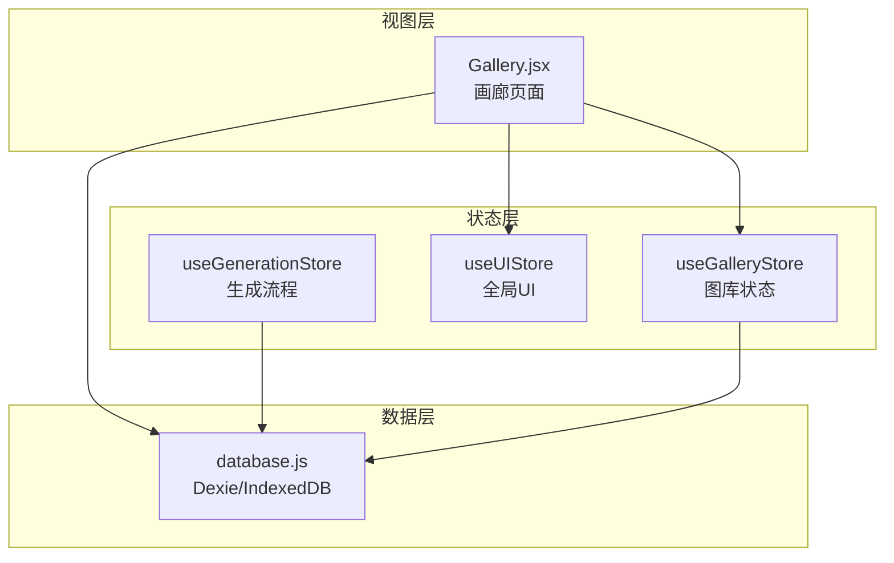
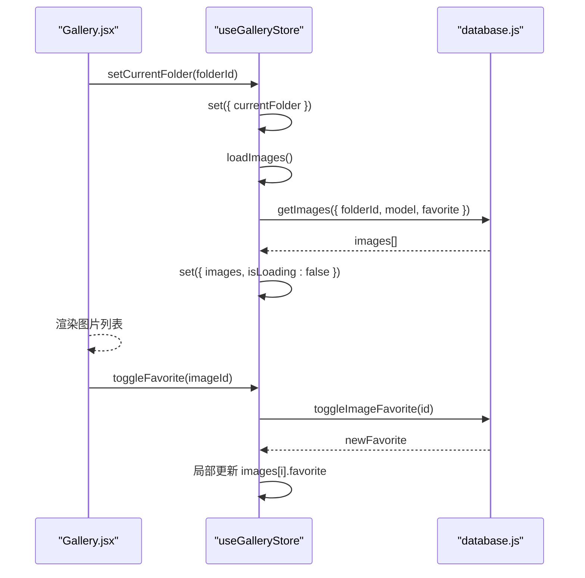
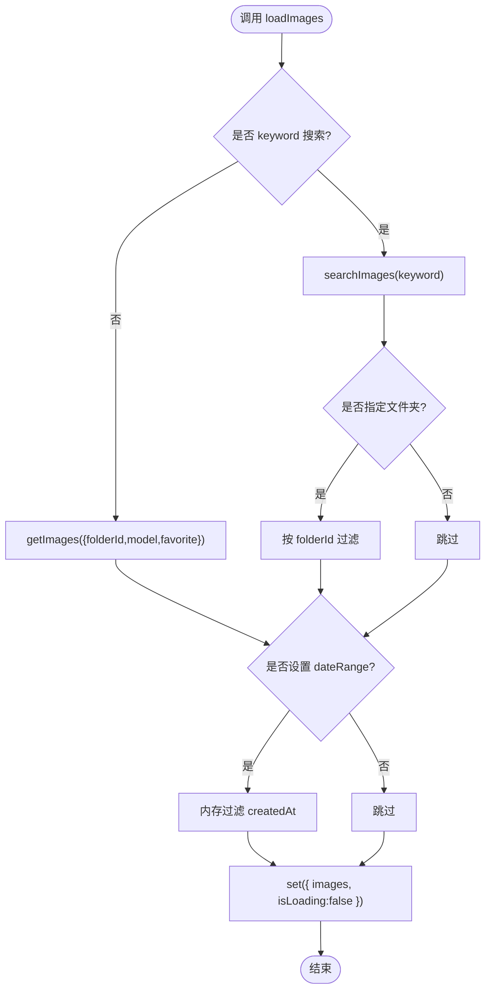
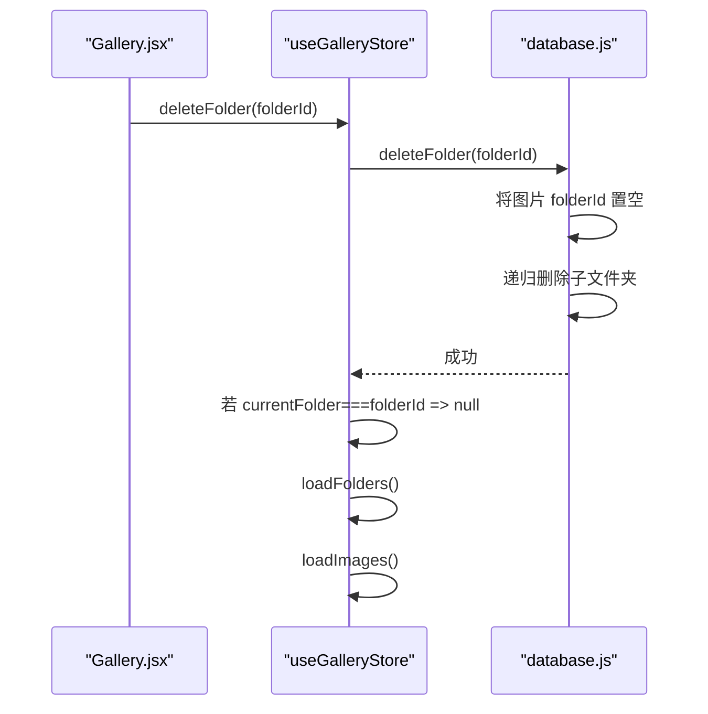
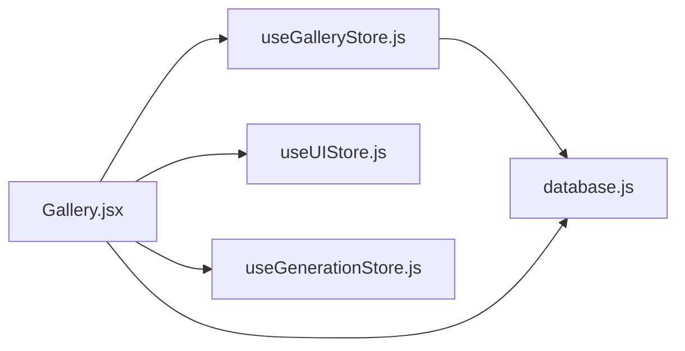

# 图库状态管理

<cite>
**本文引用的文件**   
- [useGalleryStore.js](file://app/src/stores/useGalleryStore.js)
- [database.js](file://app/src/db/database.js)
- [Gallery.jsx](file://app/src/pages/Gallery.jsx)
- [useUIStore.js](file://app/src/stores/useUIStore.js)
- [useGenerationStore.js](file://app/src/stores/useGenerationStore.js)
</cite>

## 目录
1. [简介](#简介)
2. [项目结构](#项目结构)
3. [核心组件](#核心组件)
4. [架构总览](#架构总览)
5. [详细组件分析](#详细组件分析)
6. [依赖关系分析](#依赖关系分析)
7. [性能与优化](#性能与优化)
8. [故障排查指南](#故障排查指南)
9. [结论](#结论)
10. [附录：使用示例](#附录使用示例)

## 简介
本文件围绕 useGalleryStore 的图库状态管理能力进行系统化文档化，覆盖图片列表、文件夹分类、收藏、搜索过滤、批量操作、元数据管理、加载策略、分页机制、缓存策略、与数据库层交互、状态同步与实时更新策略，并提供具体使用示例。该模块基于 Zustand + Immer 实现响应式状态，通过 Dexie（IndexedDB）持久化数据，配合 Gallery 页面完成用户交互与展示。

## 项目结构
- 状态层：useGalleryStore 负责图库领域状态与业务动作；useUIStore 提供全局 UI 能力（如 Lightbox、Toast）；useGenerationStore 负责生成流程并写入数据库。
- 数据层：database.js 封装 IndexedDB 表结构与 CRUD/查询方法。
- 视图层：Gallery.jsx 消费 useGalleryStore 暴露的状态与方法，组织搜索、筛选、分组、分页、批量操作等交互。

图表来源
- [useGalleryStore.js:1-204](file://app/src/stores/useGalleryStore.js#L1-L204)
- [database.js:1-339](file://app/src/db/database.js#L1-L339)
- [Gallery.jsx:1-527](file://app/src/pages/Gallery.jsx#L1-L527)
- [useUIStore.js:1-159](file://app/src/stores/useUIStore.js#L1-L159)
- [useGenerationStore.js:1-360](file://app/src/stores/useGenerationStore.js#L1-L360)

章节来源
- [useGalleryStore.js:1-204](file://app/src/stores/useGalleryStore.js#L1-L204)
- [database.js:1-339](file://app/src/db/database.js#L1-L339)
- [Gallery.jsx:1-527](file://app/src/pages/Gallery.jsx#L1-L527)
- [useUIStore.js:1-159](file://app/src/stores/useUIStore.js#L1-L159)
- [useGenerationStore.js:1-360](file://app/src/stores/useGenerationStore.js#L1-L360)

## 核心组件
- useGalleryStore
  - 状态字段：images、folders、currentFolder、viewMode、searchQuery、searchType、filters、selectedImages、isLoading。
  - 关键动作：loadImages、loadFolders、search、filter、toggleFavorite、moveImages、deleteImages、createFolder、renameFolder、deleteFolder、setCurrentFolder、setViewMode、selectImage、clearSelection、batchAction。
- database.js
  - 表结构：images、batches、sessions、folders、tasks、settings、casePackages。
  - 图像相关：addImage、getImages、getImage、updateImage、deleteImage、deleteImages、searchImages、toggleImageFavorite、moveImages、getImageStats。
  - 文件夹相关：addFolder、getFolders、getFolder、updateFolder、deleteFolder。
- Gallery.jsx
  - 组合 useGalleryStore 与 useUIStore，实现搜索、筛选、分组、分页、导入、导出、批量操作、上下文菜单、移动至文件夹等。

章节来源
- [useGalleryStore.js:1-204](file://app/src/stores/useGalleryStore.js#L1-L204)
- [database.js:1-339](file://app/src/db/database.js#L1-L339)
- [Gallery.jsx:1-527](file://app/src/pages/Gallery.jsx#L1-L527)

## 架构总览
useGalleryStore 作为图库领域的单一事实源，统一对外暴露状态与动作。Gallery 页面订阅状态变化并驱动 UI 更新；所有写操作最终落盘到 IndexedDB，读操作优先从 store 内存中读取，必要时触发 loadImages/loadFolders 刷新。

图表来源
- [useGalleryStore.js:148-152](file://app/src/stores/useGalleryStore.js#L148-L152)
- [useGalleryStore.js:30-62](file://app/src/stores/useGalleryStore.js#L30-L62)
- [useGalleryStore.js:91-99](file://app/src/stores/useGalleryStore.js#L91-L99)
- [database.js:56-76](file://app/src/db/database.js#L56-L76)
- [database.js:113-120](file://app/src/db/database.js#L113-L120)

## 详细组件分析

### 图片列表管理与加载策略
- 加载入口：loadImages
  - 根据 searchType 分支：keyword 走关键词搜索；否则按 filters 与 currentFolder 查询。
  - 客户端二次过滤：dateRange 在内存中过滤 createdAt。
  - 设置 isLoading 控制加载态。
- 数据来源：
  - keyword：searchImages 对 prompt/model/tags 做子串匹配。
  - 非 keyword：getImages 支持 folderId、model、favorite 过滤，默认按 createdAt 倒序。
- 分页机制：
  - 当前 store 未内置 offset/limit 参数；分页由 Gallery 侧通过 displayCount 切片实现“加载更多”。
- 缓存策略：
  - 首次加载后结果驻留在 images 数组中，后续切换筛选/搜索会重新请求或本地过滤。
  - 无显式去抖/节流，但 Gallery 对搜索输入做了 300ms 延时触发。

图表来源
- [useGalleryStore.js:30-62](file://app/src/stores/useGalleryStore.js#L30-L62)
- [database.js:99-110](file://app/src/db/database.js#L99-L110)
- [database.js:56-76](file://app/src/db/database.js#L56-L76)

章节来源
- [useGalleryStore.js:30-62](file://app/src/stores/useGalleryStore.js#L30-L62)
- [database.js:56-76](file://app/src/db/database.js#L56-L76)
- [database.js:99-110](file://app/src/db/database.js#L99-L110)
- [Gallery.jsx:109-126](file://app/src/pages/Gallery.jsx#L109-L126)

### 文件夹分类系统（CRUD）
- 创建：createFolder(name, parentId) -> addFolder -> loadFolders
- 重命名：renameFolder(folderId, newName) -> updateFolder -> loadFolders
- 删除：deleteFolder(folderId)
  - 将属于该文件夹的图片移动到根（folderId=null）
  - 递归删除子文件夹
  - 若当前正在浏览该文件夹，则切回 root
  - 刷新 folders 与 images
- 导航：setCurrentFolder(folderId)
  - 清空选择集，触发 loadImages

图表来源
- [useGalleryStore.js:138-146](file://app/src/stores/useGalleryStore.js#L138-L146)
- [database.js:219-229](file://app/src/db/database.js#L219-L229)

章节来源
- [useGalleryStore.js:125-152](file://app/src/stores/useGalleryStore.js#L125-L152)
- [database.js:196-229](file://app/src/db/database.js#L196-L229)

### 收藏功能
- 单图收藏：toggleFavorite(imageId)
  - 调用 DB.toggleImageFavorite 取反
  - 局部更新 images 对应项的 favorite 字段
- 批量收藏：batchAction('favorite')
  - 遍历 selectedImages 逐个调用 DB.toggleImageFavorite
  - 完成后清空选择并刷新 images

章节来源
- [useGalleryStore.js:91-99](file://app/src/stores/useGalleryStore.js#L91-L99)
- [useGalleryStore.js:179-202](file://app/src/stores/useGalleryStore.js#L179-L202)
- [database.js:113-120](file://app/src/db/database.js#L113-L120)

### 搜索与过滤
- 搜索类型：keyword | semantic | visual
  - 当前仅 keyword 可用；semantic/visual 为预留入口
- 关键词搜索：search(query, type)
  - 设置 searchQuery/searchType
  - 触发 loadImages
- 过滤条件：filter(newFilters)
  - 合并 filters（model、favorite、dateRange）
  - 触发 loadImages
- 客户端过滤：ratio（宽高比）在 Gallery 侧基于 width/height 计算并过滤

章节来源
- [useGalleryStore.js:74-88](file://app/src/stores/useGalleryStore.js#L74-L88)
- [useGalleryStore.js:30-62](file://app/src/stores/useGalleryStore.js#L30-L62)
- [database.js:99-110](file://app/src/db/database.js#L99-L110)
- [Gallery.jsx:128-132](file://app/src/pages/Gallery.jsx#L128-L132)

### 批量操作
- 支持的批量动作：favorite、move、delete
- 执行流程：
  - 读取 selectedImages
  - 针对 action 分发到 DB 的批量接口
  - 清空选择并刷新 images
- 移动：moveImages(imageIds, folderId)
  - 支持传入 ids 或使用当前 selectedImages
  - 成功后清空选择并刷新
- 删除：deleteImages(imageIds)
  - 直接调用 DB.deleteImages
  - 立即从 images 与 selectedImages 移除被删项

章节来源
- [useGalleryStore.js:101-123](file://app/src/stores/useGalleryStore.js#L101-L123)
- [useGalleryStore.js:179-202](file://app/src/stores/useGalleryStore.js#L179-L202)
- [database.js:94-96](file://app/src/db/database.js#L94-L96)
- [database.js:123-127](file://app/src/db/database.js#L123-L127)

### 图片元数据管理
- 字段说明（部分）：
  - 基础：id、batchId、folderId、model、prompt、url、thumbnailUrl、params、favorite、storageZone、createdAt、width、height、status、taskId
  - 标签：tags（数组，用于关键词搜索）
- 更新：updateImage(id, changes)
- 统计：getImageStats（总数、热/冷区数量、收藏数）

章节来源
- [database.js:43-50](file://app/src/db/database.js#L43-L50)
- [database.js:84-86](file://app/src/db/database.js#L84-L86)
- [database.js:129-138](file://app/src/db/database.js#L129-L138)
- [database.js:99-110](file://app/src/db/database.js#L99-L110)

### 与数据库层的交互模式
- 读写分离：
  - 读：getImages/searchImages 返回数组；store 将其设为 images
  - 写：各动作调用 DB 的增删改接口，随后选择性刷新 images/folders
- 事务性：
  - 删除文件夹时，先迁移图片再递归删除子文件夹，最后删除自身
- 索引与排序：
  - images 表定义复合索引 [folderId+createdAt]，便于按文件夹和时间范围查询
  - 默认按 createdAt 倒序

章节来源
- [database.js:22-31](file://app/src/db/database.js#L22-L31)
- [database.js:56-76](file://app/src/db/database.js#L56-L76)
- [database.js:219-229](file://app/src/db/database.js#L219-L229)

### 状态同步与实时更新策略
- 即时反馈：
  - 删除图片：立即从 images 与 selectedImages 剔除，无需等待 DB 响应
  - 收藏：调用 DB 后立即局部更新 images 对应项
- 延迟刷新：
  - 移动/批量操作：完成后调用 loadImages 以保持一致性
- 跨模块联动：
  - Gallery 通过 useUIStore.openLightbox 打开大图查看
  - 生成流程由 useGenerationStore 写入 DB，Gallery 可通过 loadImages 拉取最新结果

章节来源
- [useGalleryStore.js:110-123](file://app/src/stores/useGalleryStore.js#L110-L123)
- [useGalleryStore.js:91-99](file://app/src/stores/useGalleryStore.js#L91-L99)
- [useGalleryStore.js:179-202](file://app/src/stores/useGalleryStore.js#L179-L202)
- [useUIStore.js:45-53](file://app/src/stores/useUIStore.js#L45-L53)
- [useGenerationStore.js:112-290](file://app/src/stores/useGenerationStore.js#L112-L290)

## 依赖关系分析
- useGalleryStore 依赖：
  - database.js：所有持久化读写
  - immer：不可变更新
  - zustand：状态容器
- Gallery.jsx 依赖：
  - useGalleryStore：图库状态与动作
  - useUIStore：通知、灯箱、遮罩编辑器开关
  - useGenerationStore：复用图片参数再生成、参考图添加
  - database.js：导入图片、单图移动等直写场景

图表来源
- [useGalleryStore.js:1-204](file://app/src/stores/useGalleryStore.js#L1-L204)
- [database.js:1-339](file://app/src/db/database.js#L1-L339)
- [Gallery.jsx:1-527](file://app/src/pages/Gallery.jsx#L1-L527)
- [useUIStore.js:1-159](file://app/src/stores/useUIStore.js#L1-L159)
- [useGenerationStore.js:1-360](file://app/src/stores/useGenerationStore.js#L1-L360)

章节来源
- [useGalleryStore.js:1-204](file://app/src/stores/useGalleryStore.js#L1-L204)
- [database.js:1-339](file://app/src/db/database.js#L1-L339)
- [Gallery.jsx:1-527](file://app/src/pages/Gallery.jsx#L1-L527)
- [useUIStore.js:1-159](file://app/src/stores/useUIStore.js#L1-L159)
- [useGenerationStore.js:1-360](file://app/src/stores/useGenerationStore.js#L1-L360)

## 性能与优化
- 当前实现要点
  - 列表默认按 createdAt 倒序，避免前端排序开销
  - 关键词搜索在内存 filter 中进行，适合中小规模数据
  - 分页采用前端 displayCount 切片，减少首屏渲染压力
- 可优化方向
  - 服务端/DB 分页：在 getImages 中启用 limit/offset 参数，结合滚动加载
  - 搜索索引：为 prompt/model/tags 建立全文索引或引入轻量搜索引擎
  - 懒加载与虚拟列表：当图片量较大时使用虚拟滚动降低 DOM 节点数量
  - 缩略图缓存：对 thumbnailUrl 增加浏览器缓存策略或本地缓存
  - 批量操作并发控制：对大批量 move/delete 进行分片与重试
  - 增量更新：利用 IndexedDB 监听器或事件总线实现实时同步，减少全量刷新

[本节为通用建议，不直接分析具体文件]

## 故障排查指南
- 常见问题定位
  - 图片未显示：检查 url/thumbnailUrl/blobUrl 是否存在；确认导入流程是否正确写入 DB
  - 收藏无效：确认 toggleImageFavorite 返回值与 images 局部更新逻辑
  - 移动失败：检查目标 folderId 是否有效，以及 moveImages 是否成功
  - 搜索无结果：确认关键词是否在 prompt/model/tags 中
- 日志与错误处理
  - loadImages/loadFolders 捕获异常并记录日志
  - 批量操作未知 action 会输出警告
  - 导入/导出过程有 try/catch 包裹并提示 Toast

章节来源
- [useGalleryStore.js:58-62](file://app/src/stores/useGalleryStore.js#L58-L62)
- [useGalleryStore.js:69-72](file://app/src/stores/useGalleryStore.js#L69-L72)
- [useGalleryStore.js:195-198](file://app/src/stores/useGalleryStore.js#L195-L198)
- [Gallery.jsx:141-145](file://app/src/pages/Gallery.jsx#L141-L145)
- [Gallery.jsx:231-255](file://app/src/pages/Gallery.jsx#L231-L255)

## 结论
useGalleryStore 提供了完整的图库状态管理能力，涵盖图片与文件夹的核心 CRUD、收藏、搜索过滤与批量操作。其设计清晰、职责明确，与 database.js 的 Dexie 抽象形成良好的分层。当前实现已满足中等规模数据的体验需求，未来可在分页、搜索索引、虚拟列表与实时同步方面进一步优化。

[本节为总结性内容，不直接分析具体文件]

## 附录：使用示例

- 初始化与加载
  - 在页面挂载时调用 loadImages 与 loadFolders
  - 通过 URL 参数 folder 切换到指定文件夹
- 搜索与筛选
  - 输入关键词并选择搜索类型，自动触发 search
  - 设置模型、日期范围、收藏等过滤器，自动触发 filter
- 收藏与批量操作
  - 点击收藏图标调用 toggleFavorite
  - 多选后执行 batchAction('favorite'/'move'/'delete')
- 文件夹管理
  - createFolder/renameFolder/deleteFolder 维护文件夹树
  - setCurrentFolder 切换当前文件夹
- 导入与导出
  - 导入：选择本地图片，生成缩略图并写入 DB，然后刷新列表
  - 导出：遍历选中图片，逐个触发下载链接

章节来源
- [Gallery.jsx:98-126](file://app/src/pages/Gallery.jsx#L98-L126)
- [Gallery.jsx:147-228](file://app/src/pages/Gallery.jsx#L147-L228)
- [Gallery.jsx:231-255](file://app/src/pages/Gallery.jsx#L231-L255)
- [useGalleryStore.js:125-152](file://app/src/stores/useGalleryStore.js#L125-L152)
- [useGalleryStore.js:179-202](file://app/src/stores/useGalleryStore.js#L179-L202)