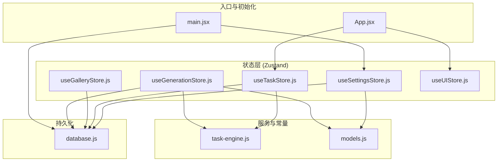
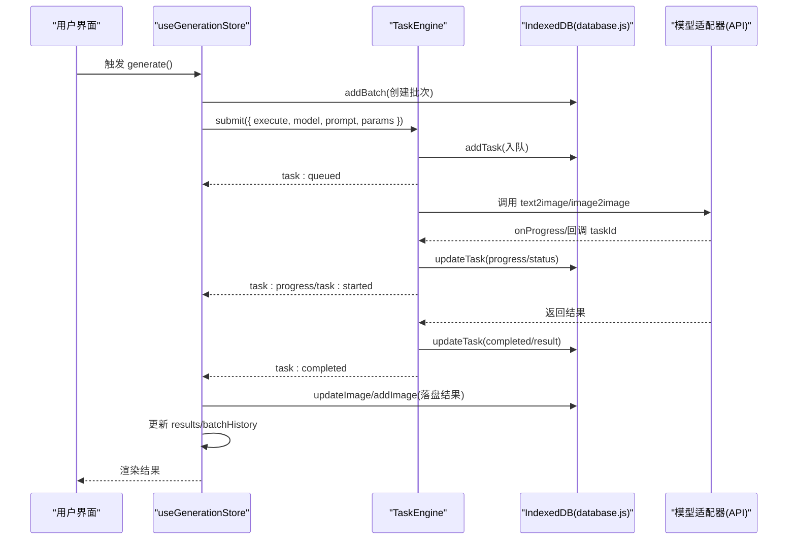
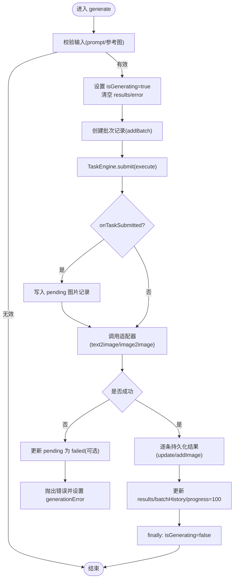
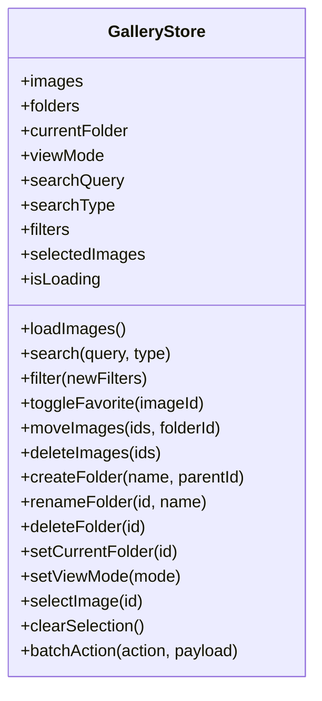
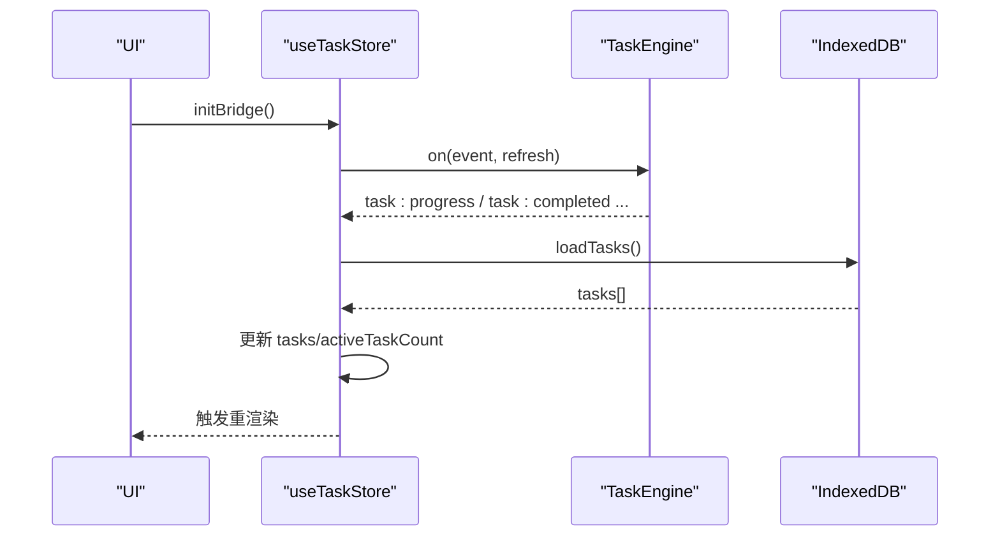
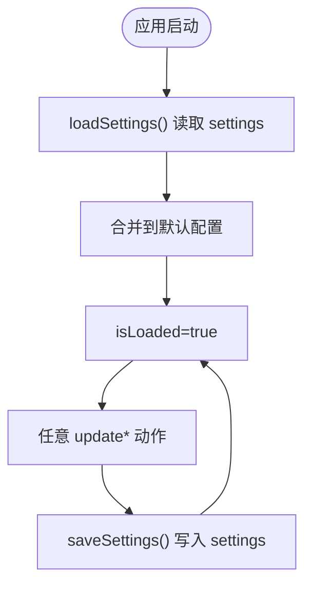
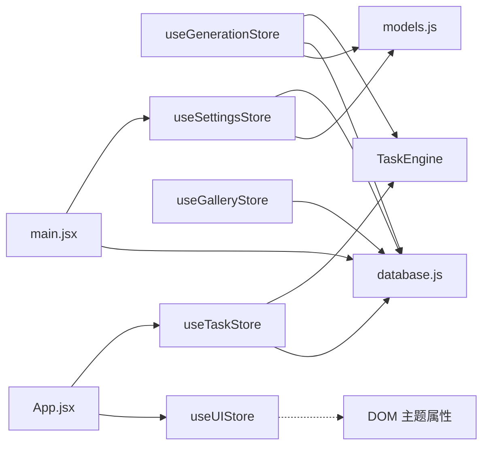

# 状态管理

<cite>
**本文引用的文件**   
- [useGenerationStore.js](file://app/src/stores/useGenerationStore.js)
- [useGalleryStore.js](file://app/src/stores/useGalleryStore.js)
- [useTaskStore.js](file://app/src/stores/useTaskStore.js)
- [useSettingsStore.js](file://app/src/stores/useSettingsStore.js)
- [useUIStore.js](file://app/src/stores/useUIStore.js)
- [database.js](file://app/src/db/database.js)
- [task-engine.js](file://app/src/services/task-engine.js)
- [models.js](file://app/src/constants/models.js)
- [App.jsx](file://app/src/App.jsx)
- [main.jsx](file://app/src/main.jsx)
</cite>

## 目录
1. [简介](#简介)
2. [项目结构](#项目结构)
3. [核心组件](#核心组件)
4. [架构总览](#架构总览)
5. [详细组件分析](#详细组件分析)
6. [依赖关系分析](#依赖关系分析)
7. [性能考虑](#性能考虑)
8. [故障排查指南](#故障排查指南)
9. [结论](#结论)
10. [附录](#附录)

## 简介
本文件为 AI Image Studio 的状态管理系统提供系统化文档。系统基于 Zustand 构建，围绕以下核心 Store 展开：
- useGenerationStore：工作区图像生成状态（模型、提示词、参数、结果、批处理历史、进度与错误）
- useGalleryStore：图库与文件夹管理（图片列表、筛选、搜索、选择、批量操作）
- useTaskStore：后台任务状态（任务队列、事件桥接、重试/取消/暂停/恢复）
- useSettingsStore：应用设置与模型配置持久化
- useUIStore：全局 UI 状态（侧边栏、灯箱、任务面板、通知、主题、遮罩编辑器、快捷键覆盖层）

重点涵盖：
- 各 Store 的职责边界与设计模式
- 状态更新模式与数据流
- IndexedDB 持久化策略
- 性能优化技巧与调试方法
- 最佳实践与扩展指南

## 项目结构
状态管理位于 app/src/stores 下，每个 Store 对应一个职责清晰的模块；数据库访问集中在 app/src/db/database.js；后台任务调度由 app/src/services/task-engine.js 提供；模型能力与默认参数在 app/src/constants/models.js 中定义；应用启动与初始化在 main.jsx 和 App.jsx 中完成。

图表来源
- [main.jsx:12-29](file://app/src/main.jsx#L12-L29)
- [App.jsx:245-279](file://app/src/App.jsx#L245-L279)
- [useGenerationStore.js:112-290](file://app/src/stores/useGenerationStore.js#L112-L290)
- [useGalleryStore.js:30-108](file://app/src/stores/useGalleryStore.js#L30-L108)
- [useTaskStore.js:39-64](file://app/src/stores/useTaskStore.js#L39-L64)
- [useSettingsStore.js:108-149](file://app/src/stores/useSettingsStore.js#L108-L149)
- [task-engine.js:57-81](file://app/src/services/task-engine.js#L57-L81)
- [database.js:20-31](file://app/src/db/database.js#L20-L31)
- [models.js:8-92](file://app/src/constants/models.js#L8-L92)

章节来源
- [main.jsx:12-29](file://app/src/main.jsx#L12-L29)
- [App.jsx:245-279](file://app/src/App.jsx#L245-L279)

## 核心组件
本节概述各 Store 的职责与关键能力，并给出典型调用路径与持久化点。

- useGenerationStore
  - 职责：维护当前模型、提示词、参考图、生成参数、结果集、批处理历史、生成进度与错误信息；协调 TaskEngine 执行生成流程；将中间态与最终结果写入 IndexedDB。
  - 关键动作：setModel、addReferenceImage、setParam、generate、expandPrompt、favoriteImage、discardImage、regenerate、clearGeneration。
  - 持久化：批次记录、图片记录（含 pending 占位）、失败回退更新。
  - 外部依赖：TaskEngine、数据库、模型常量、API 适配器。

- useGalleryStore
  - 职责：图库浏览与组织（图片列表、文件夹树、视图模式、搜索、筛选、多选与批量操作）。
  - 关键动作：loadImages、search、filter、toggleFavorite、moveImages、deleteImages、createFolder、renameFolder、deleteFolder、setCurrentFolder、batchAction。
  - 持久化：通过 database.js 的 images/folders 表进行读写。

- useTaskStore
  - 职责：后台任务生命周期管理与 UI 同步；桥接 TaskEngine 事件到 Zustand 状态；提供增删改查、重试/取消/暂停/恢复等控制。
  - 关键动作：initBridge、loadTasks、addTask、updateTask、removeTask、retryTask、cancelTask、pauseTask、resumeTask、getTaskStats、clearCompleted。
  - 持久化：tasks 表；事件驱动刷新。

- useSettingsStore
  - 职责：应用设置与模型配置的加载、合并、保存与重置；包含存储策略、LLM 扩写配置、通用设置与引导完成标记。
  - 关键动作：updateModelConfig、updateStorageConfig、updateExpansionConfig、updateGeneralConfig、completeSetup、loadSettings、saveSettings、resetToDefaults。
  - 持久化：settings key/value 表。

- useUIStore
  - 职责：全局 UI 状态（侧边栏折叠、灯箱、任务面板、通知、主题、遮罩编辑器、快捷键覆盖层）。
  - 关键动作：toggleSidebar、openLightbox/closeLightbox、toggleTaskPanel/openTaskPanel/closeTaskPanel、addToast/removeToast/clearToasts、setTheme/toggleTheme、openMaskEditor/closeMaskEditor、setShortcutOverlayOpen/toggleShortcutOverlay。
  - 持久化：无直接持久化（主题可通过 DOM 属性生效）。

章节来源
- [useGenerationStore.js:22-359](file://app/src/stores/useGenerationStore.js#L22-L359)
- [useGalleryStore.js:11-203](file://app/src/stores/useGalleryStore.js#L11-L203)
- [useTaskStore.js:14-172](file://app/src/stores/useTaskStore.js#L14-L172)
- [useSettingsStore.js:47-161](file://app/src/stores/useSettingsStore.js#L47-L161)
- [useUIStore.js:12-158](file://app/src/stores/useUIStore.js#L12-L158)

## 架构总览
整体采用“Store + Service + DB”的分层架构：
- Store 层：Zustand 单例 store，暴露状态与 actions，使用 immer produce 做不可变更新。
- Service 层：TaskEngine 负责并发控制、状态机、重试与事件广播；API 适配层由其他模块提供。
- 持久化层：Dexie 封装 IndexedDB，提供统一 CRUD 接口。
- 常量层：MODELS 定义模型能力与默认参数。

图表来源
- [useGenerationStore.js:112-290](file://app/src/stores/useGenerationStore.js#L112-L290)
- [task-engine.js:57-81](file://app/src/services/task-engine.js#L57-L81)
- [task-engine.js:222-297](file://app/src/services/task-engine.js#L222-L297)
- [database.js:43-96](file://app/src/db/database.js#L43-L96)

## 详细组件分析

### useGenerationStore 分析
- 设计要点
  - 以 immer produce 进行局部更新，避免不必要的重渲染。
  - 生成流程通过 TaskEngine 异步执行，支持中断信号与进度回调。
  - 对长耗时任务采用“先占位后更新”的策略：提交任务后立即写入 pending 记录，完成后更新或插入真实结果。
  - 支持文本到图像与图像到图像两种模式，依据模型能力动态选择。
- 关键数据流
  - 输入：prompt、referenceImages、params、currentModel
  - 输出：results、batchHistory、generatingProgress、generationError
- 错误处理
  - 捕获适配器异常，必要时将 pending 记录置为 failed。
  - 统一在 finally 中重置 isGenerating。
- 性能考量
  - 仅对必要字段使用 produce 更新。
  - 批量结果按序持久化，优先更新已有记录减少重复写入。

图表来源
- [useGenerationStore.js:112-290](file://app/src/stores/useGenerationStore.js#L112-L290)
- [database.js:144-171](file://app/src/db/database.js#L144-L171)
- [database.js:43-96](file://app/src/db/database.js#L43-L96)

章节来源
- [useGenerationStore.js:22-359](file://app/src/stores/useGenerationStore.js#L22-L359)
- [database.js:43-96](file://app/src/db/database.js#L43-L96)
- [database.js:144-171](file://app/src/db/database.js#L144-L171)

### useGalleryStore 分析
- 设计要点
  - 集中管理图片集合与文件夹树，支持关键词/语义/视觉三种搜索类型。
  - 客户端过滤（日期范围）与服务端查询结合，提高灵活性。
  - 批量操作（收藏、移动、删除）统一走 database.js 的批量接口。
- 关键数据流
  - 输入：filters、searchQuery、searchType、currentFolder
  - 输出：images、folders、selectedImages、isLoading
- 性能考量
  - 使用 produce 仅变更 selectedImages 等小对象。
  - 批量更新使用 bulkUpdate/bulkDelete 降低 IO 次数。

图表来源
- [useGalleryStore.js:11-203](file://app/src/stores/useGalleryStore.js#L11-L203)
- [database.js:56-127](file://app/src/db/database.js#L56-L127)

章节来源
- [useGalleryStore.js:11-203](file://app/src/stores/useGalleryStore.js#L11-L203)
- [database.js:56-127](file://app/src/db/database.js#L56-L127)

### useTaskStore 分析
- 设计要点
  - 作为 TaskEngine 与 UI 的桥梁：监听引擎事件，统一刷新任务列表。
  - 提供完整的任务生命周期 API（增删改查、重试/取消/暂停/恢复）。
  - 计算 activeTaskCount 用于 UI 指示器。
- 关键数据流
  - 输入：engine events(task:queued/started/progress/completed/failed/cancelled/paused/retry)
  - 输出：tasks、activeTaskCount
- 健壮性
  - 所有对外 API 均带 try/catch，并在失败时尝试本地降级更新。

图表来源
- [useTaskStore.js:39-64](file://app/src/stores/useTaskStore.js#L39-L64)
- [task-engine.js:191-211](file://app/src/services/task-engine.js#L191-L211)
- [database.js:243-274](file://app/src/db/database.js#L243-L274)

章节来源
- [useTaskStore.js:14-172](file://app/src/stores/useTaskStore.js#L14-L172)
- [task-engine.js:191-211](file://app/src/services/task-engine.js#L191-L211)
- [database.js:243-274](file://app/src/db/database.js#L243-L274)

### useSettingsStore 分析
- 设计要点
  - 从 MODELS 常量构建默认模型配置，确保新增模型自动具备默认项。
  - 分块更新（modelConfigs/storageConfig/expansionConfig/generalConfig），每次变更后立即持久化。
  - 提供 completeSetup 与 resetToDefaults 等运维级能力。
- 关键数据流
  - 输入：用户设置变更
  - 输出：isLoaded、isSetupComplete、各配置对象
- 持久化
  - settings 表 key/value 形式，支持 getAllSettings 一次性加载。

图表来源
- [useSettingsStore.js:14-23](file://app/src/stores/useSettingsStore.js#L14-L23)
- [useSettingsStore.js:108-149](file://app/src/stores/useSettingsStore.js#L108-L149)
- [database.js:280-295](file://app/src/db/database.js#L280-L295)

章节来源
- [useSettingsStore.js:47-161](file://app/src/stores/useSettingsStore.js#L47-L161)
- [models.js:8-92](file://app/src/constants/models.js#L8-L92)
- [database.js:280-295](file://app/src/db/database.js#L280-L295)

### useUIStore 分析
- 设计要点
  - 纯 UI 状态，不直接持久化；主题通过 DOM 属性生效。
  - 通知 toasts 支持自动消失与手动移除。
  - 遮罩编辑器与快捷键覆盖层状态集中管理。
- 关键数据流
  - 输入：用户交互（开关、点击、键盘）
  - 输出：UI 可见状态变化

章节来源
- [useUIStore.js:12-158](file://app/src/stores/useUIStore.js#L12-L158)

## 依赖关系分析
- Store 间耦合
  - useGenerationStore 依赖 TaskEngine 与 database.js，间接依赖 models.js。
  - useTaskStore 依赖 TaskEngine 与 database.js。
  - useGalleryStore 依赖 database.js。
  - useSettingsStore 依赖 database.js 与 models.js。
  - useUIStore 无外部依赖。
- 事件驱动
  - TaskEngine 作为事件源，useTaskStore 订阅事件并刷新状态。
- 初始化顺序
  - main.jsx 先初始化数据库与设置，再挂载 React 应用。
  - App.jsx 在内部初始化任务桥接与通知权限。

图表来源
- [useGenerationStore.js:112-290](file://app/src/stores/useGenerationStore.js#L112-L290)
- [useTaskStore.js:39-64](file://app/src/stores/useTaskStore.js#L39-L64)
- [useGalleryStore.js:30-108](file://app/src/stores/useGalleryStore.js#L30-L108)
- [useSettingsStore.js:108-149](file://app/src/stores/useSettingsStore.js#L108-L149)
- [main.jsx:12-29](file://app/src/main.jsx#L12-L29)
- [App.jsx:245-279](file://app/src/App.jsx#L245-L279)

章节来源
- [useGenerationStore.js:112-290](file://app/src/stores/useGenerationStore.js#L112-L290)
- [useTaskStore.js:39-64](file://app/src/stores/useTaskStore.js#L39-L64)
- [useGalleryStore.js:30-108](file://app/src/stores/useGalleryStore.js#L30-L108)
- [useSettingsStore.js:108-149](file://app/src/stores/useSettingsStore.js#L108-L149)
- [main.jsx:12-29](file://app/src/main.jsx#L12-L29)
- [App.jsx:245-279](file://app/src/App.jsx#L245-L279)

## 性能考虑
- 最小化重渲染
  - 使用 produce 仅更新变更字段，避免整树重建。
  - 在 UI 层按需订阅 store 切片（例如只订阅 activeTaskCount）。
- 批量 IO 优化
  - 图库批量操作使用 bulkUpdate/bulkDelete。
  - 生成结果优先更新已有 pending 记录，减少重复写入。
- 并发与重试
  - TaskEngine 限制最大并发数，避免浏览器资源耗尽。
  - 指数退避重试适用于网络抖动与 5xx 错误。
- 前端过滤与分页
  - 图库支持 limit/offset 与 orderBy，建议在大图库场景启用分页。
- 内存与引用
  - referenceImages 中的 blob/url 注意及时释放，避免大对象常驻内存。

[本节为通用指导，无需源码引用]

## 故障排查指南
- 常见问题定位
  - 生成失败：检查 GenerationStore 的 generationError 与 TaskEngine 的 task:failed 事件日志。
  - 任务未推进：确认 TaskEngine 的 _maxConcurrent 与队列长度，查看 task:progress 事件。
  - 设置未持久化：检查 SettingsStore 的 saveSettings 是否被调用及 IndexedDB 写入是否成功。
  - 图库为空：确认 loadImages 是否正确传入 filters/currentFolder，以及 search 分支逻辑。
- 调试建议
  - 在关键 action 前后添加 console.log，或使用浏览器 DevTools 的断点。
  - 打开 IndexedDB 面板，核对 images/tasks/settings 表的数据一致性。
  - 使用 TaskEngine.getStats 观察活跃/排队任务数量。

章节来源
- [useGenerationStore.js:283-290](file://app/src/stores/useGenerationStore.js#L283-L290)
- [useTaskStore.js:109-157](file://app/src/stores/useTaskStore.js#L109-L157)
- [useSettingsStore.js:137-149](file://app/src/stores/useSettingsStore.js#L137-L149)
- [useGalleryStore.js:30-62](file://app/src/stores/useGalleryStore.js#L30-L62)
- [task-engine.js:259-297](file://app/src/services/task-engine.js#L259-L297)

## 结论
AI Image Studio 的状态管理以 Zustand 为核心，配合 TaskEngine 的事件驱动与 Dexie 的持久化能力，形成了清晰、可扩展且健壮的架构。各 Store 职责明确、更新模式一致（immer produce + 异步持久化），并通过统一的数据库层保证数据一致性。建议在后续扩展中遵循现有模式：单一职责、事件解耦、批量 IO 与最小化重渲染。

[本节为总结，无需源码引用]

## 附录

### 状态更新模式与最佳实践
- 使用 produce 进行不可变更新，避免浅比较失效。
- 异步操作与持久化分离：先更新 UI 反馈，再落盘；失败时回滚或降级。
- 事件驱动更新：通过 TaskEngine 事件统一刷新任务相关状态。
- 配置分层：模型能力与默认参数集中管理，便于新增模型。

### 数据持久化策略
- 主数据：images、batches、folders、tasks、settings、casePackages。
- 索引策略：按 createdAt、status+createdAt、folderId+createdAt 等组合索引提升查询性能。
- 迁移与初始化：应用启动时 open 数据库并加载设置。

### 扩展指南
- 新增模型
  - 在 models.js 中添加模型能力与默认参数。
  - 在 SettingsStore 的 buildDefaultModelConfigs 中自动继承默认配置。
- 新增 Store
  - 遵循现有命名与结构，使用 create 创建单例 store。
  - 如需持久化，复用 database.js 的函数；如需后台任务，集成 TaskEngine。
- 新增事件
  - 在 TaskEngine 中定义新事件，并在 useTaskStore 中订阅刷新。

章节来源
- [models.js:8-92](file://app/src/constants/models.js#L8-L92)
- [useSettingsStore.js:14-23](file://app/src/stores/useSettingsStore.js#L14-L23)
- [database.js:20-31](file://app/src/db/database.js#L20-L31)
- [task-engine.js:191-211](file://app/src/services/task-engine.js#L191-L211)