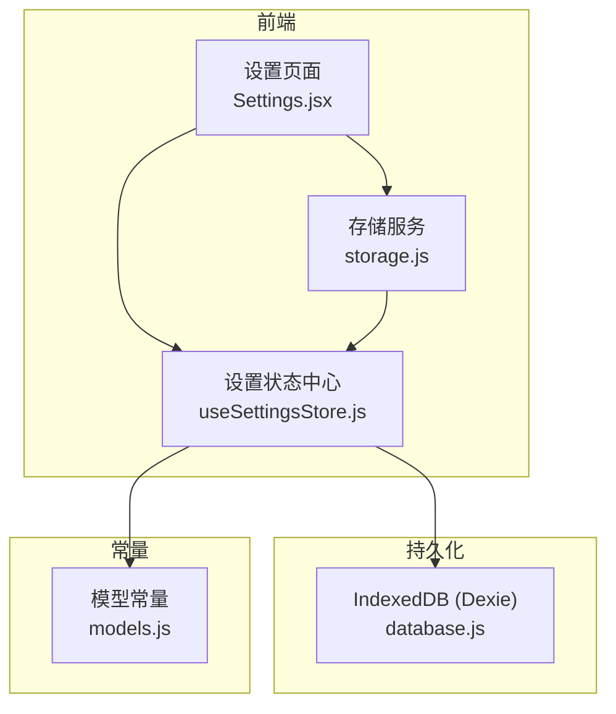
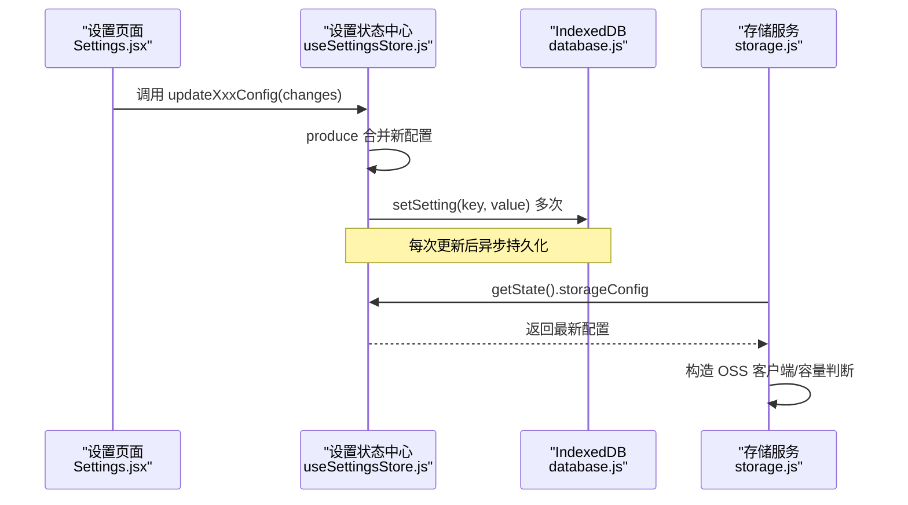
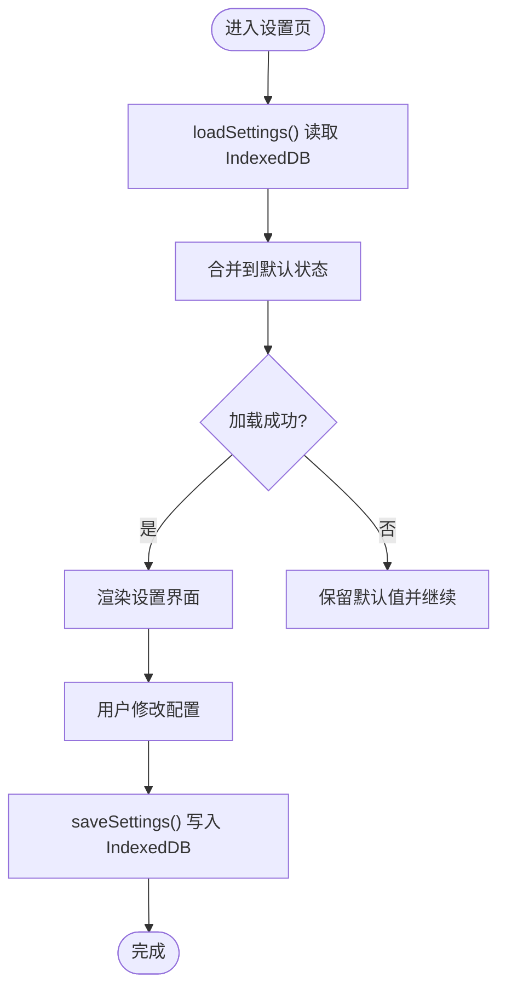
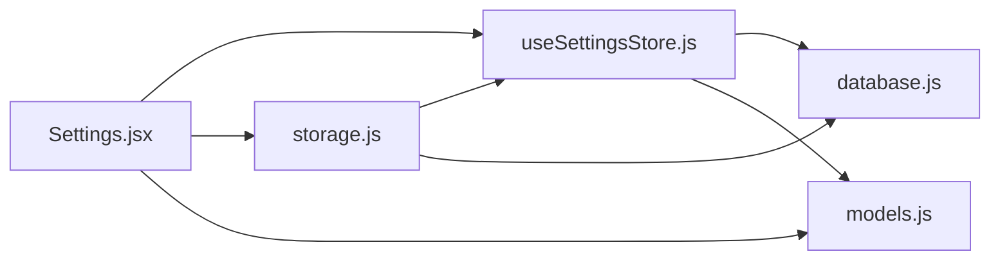

# 设置状态管理

<cite>
**本文引用的文件**
- [useSettingsStore.js](file://app/src/stores/useSettingsStore.js)
- [database.js](file://app/src/db/database.js)
- [storage.js](file://app/src/services/storage.js)
- [models.js](file://app/src/constants/models.js)
- [Settings.jsx](file://app/src/pages/Settings.jsx)
</cite>

## 目录
1. [简介](#简介)
2. [项目结构](#项目结构)
3. [核心组件](#核心组件)
4. [架构总览](#架构总览)
5. [详细组件分析](#详细组件分析)
6. [依赖关系分析](#依赖关系分析)
7. [性能考虑](#性能考虑)
8. [故障排查指南](#故障排查指南)
9. [结论](#结论)
10. [附录](#附录)

## 简介
本文件围绕 useSettingsStore 展开，系统化说明应用设置状态管理的核心能力与实现细节。内容覆盖模型配置、存储配置、扩展（提示词扩写）配置与通用设置；阐述配置的加载、持久化、热重载机制；并给出 API 密钥管理、存储路径与容量、性能调优参数的设置与验证方法。同时提供配置文件格式规范、版本兼容性与迁移策略建议，以及安全注意事项与最佳实践。

## 项目结构
与设置状态管理直接相关的代码分布在以下模块：
- 设置状态中心：stores/useSettingsStore.js
- 本地持久化层：db/database.js（IndexedDB，Dexie）
- 存储服务（读取设置以构建 OSS 客户端等）：services/storage.js
- 模型常量（用于生成默认模型配置）：constants/models.js
- 设置页面（UI 读写设置、测试连接）：pages/Settings.jsx

图表来源
- [useSettingsStore.js:47-161](file://app/src/stores/useSettingsStore.js#L47-L161)
- [database.js:277-295](file://app/src/db/database.js#L277-L295)
- [storage.js:20-42](file://app/src/services/storage.js#L20-L42)
- [models.js:8-92](file://app/src/constants/models.js#L8-L92)
- [Settings.jsx:38-86](file://app/src/pages/Settings.jsx#L38-L86)

章节来源
- [useSettingsStore.js:1-162](file://app/src/stores/useSettingsStore.js#L1-L162)
- [database.js:1-339](file://app/src/db/database.js#L1-L339)
- [storage.js:1-393](file://app/src/services/storage.js#L1-L393)
- [models.js:1-106](file://app/src/constants/models.js#L1-L106)
- [Settings.jsx:1-301](file://app/src/pages/Settings.jsx#L1-L301)

## 核心组件
- 设置状态中心（useSettingsStore）
  - 职责：维护模型配置、存储配置、扩展配置、通用设置、初始化向导完成标记与加载状态；提供更新、保存、重置、加载等方法；变更自动持久化到 IndexedDB。
  - 关键状态字段：modelConfigs、storageConfig、expansionConfig、generalConfig、isSetupComplete、isLoaded。
  - 默认值来源：从 constants/models.js 推导模型默认配置；其余默认值在 store 内定义。
- 数据库层（database.js）
  - 职责：基于 Dexie 的 IndexedDB 封装，提供 settings 表的 key/value 存取接口 getAllSettings、setSetting 等。
- 存储服务（storage.js）
  - 职责：图片冷热区管理与 OSS 上传下载；通过 useSettingsStore.getState() 动态读取 storageConfig 构造 OSS 客户端，并在容量检查时读取 hotCapacity。
- 模型常量（models.js）
  - 职责：声明各模型的名称、能力、尺寸、质量等级与默认参数；store 据此生成 modelConfigs 初始值。
- 设置页面（Settings.jsx）
  - 职责：渲染设置界面，调用 store 的 update* 系列方法写入配置，触发 saveSettings 持久化；提供连接测试与结果展示。

章节来源
- [useSettingsStore.js:47-161](file://app/src/stores/useSettingsStore.js#L47-L161)
- [database.js:277-295](file://app/src/db/database.js#L277-L295)
- [storage.js:20-42](file://app/src/services/storage.js#L20-L42)
- [models.js:8-92](file://app/src/constants/models.js#L8-L92)
- [Settings.jsx:38-86](file://app/src/pages/Settings.jsx#L38-L86)

## 架构总览
设置状态管理采用“状态中心 + 持久化层”的解耦设计：
- 所有设置变更统一通过 useSettingsStore 的 action 进行，内部使用 immer produce 做不可变更新，随后立即调用 saveSettings 将当前状态落盘。
- 持久化层 database.js 提供 settings 表 key/value 存取，避免业务逻辑耦合具体存储实现。
- 其他服务（如 storage.js）按需通过 getState() 读取最新配置，保证运行时配置一致性。
- UI 层 Settings.jsx 负责用户交互与校验反馈，并通过 store 暴露的方法驱动数据流。

图表来源
- [useSettingsStore.js:58-99](file://app/src/stores/useSettingsStore.js#L58-L99)
- [useSettingsStore.js:137-149](file://app/src/stores/useSettingsStore.js#L137-L149)
- [database.js:285-295](file://app/src/db/database.js#L285-L295)
- [storage.js:20-42](file://app/src/services/storage.js#L20-L42)

## 详细组件分析

### 设置状态中心（useSettingsStore）
- 状态结构
  - modelConfigs：按模型 ID 组织，包含 enabled、defaultParams 等；由 constants/models.js 推导默认值。
  - storageConfig：热/冷存储策略、缩略图尺寸、OSS 相关参数（bucket、region、AccessKey 等）。
  - expansionConfig：LLM 扩写模型、端点、API Key、RAG Top-K、提示模板等。
  - generalConfig：主题、语言、通知、声音、并发任务数等。
  - isSetupComplete/isLoaded：控制引导流程与加载态。
- 关键动作
  - updateModelConfig/updateStorageConfig/updateExpansionConfig/updateGeneralConfig：局部合并变更并持久化。
  - loadSettings：从 IndexedDB 拉取已保存配置，合并到默认状态，完成后置 isLoaded=true。
  - saveSettings：将当前状态分块写入 settings 表。
  - resetToDefaults：重建默认配置并持久化。
  - completeSetup：标记引导完成并持久化。
- 错误处理
  - loadSettings/saveSettings 均捕获异常并记录日志，loadSettings 失败仍会置 isLoaded=true 以避免阻塞 UI。

图表来源
- [useSettingsStore.js:108-149](file://app/src/stores/useSettingsStore.js#L108-L149)

章节来源
- [useSettingsStore.js:13-54](file://app/src/stores/useSettingsStore.js#L13-L54)
- [useSettingsStore.js:58-161](file://app/src/stores/useSettingsStore.js#L58-L161)

### 持久化层（database.js）
- settings 表为 key/value 结构，支持 getSetting/setSetting/getAllSettings。
- useSettingsStore 将不同类别的配置分别以独立 key 落盘，便于增量更新与回滚。
- 初始化入口 initDatabase 用于打开数据库并执行迁移（Dexie 版本管理）。

章节来源
- [database.js:277-295](file://app/src/db/database.js#L277-L295)
- [database.js:327-336](file://app/src/db/database.js#L327-L336)

### 存储服务（storage.js）
- 通过 useSettingsStore.getState() 动态读取 storageConfig，构造 OSS 客户端；若缺少必要字段则抛出错误，提示用户在设置中补齐。
- checkAndMigrate 根据 hotCapacity（GB）计算阈值，将热区最旧图片迁移至冷区，释放本地空间。
- 缩略图生成使用 Canvas，最大边长受 THUMBNAIL_MAX_DIMENSION 限制。

章节来源
- [storage.js:20-42](file://app/src/services/storage.js#L20-L42)
- [storage.js:252-298](file://app/src/services/storage.js#L252-L298)
- [storage.js:323-347](file://app/src/services/storage.js#L323-L347)

### 模型常量（models.js）
- 定义模型能力、尺寸、质量等级与默认参数。
- useSettingsStore 据此生成 modelConfigs 的默认值，确保新增模型时默认配置一致。

章节来源
- [models.js:8-92](file://app/src/constants/models.js#L8-L92)
- [useSettingsStore.js:13-23](file://app/src/stores/useSettingsStore.js#L13-L23)

### 设置页面（Settings.jsx）
- 初始化时调用 loadSettings，并将 store 中的配置映射到本地表单状态。
- 提供“测试连接”功能：对模型 API、OSS、扩写 LLM 发起最小请求，解析响应或错误码，反馈连接状态。
- 保存按钮调用对应 updateXxxConfig 方法，触发持久化。

章节来源
- [Settings.jsx:38-86](file://app/src/pages/Settings.jsx#L38-L86)
- [Settings.jsx:88-208](file://app/src/pages/Settings.jsx#L88-L208)

## 依赖关系分析
- useSettingsStore 依赖：
  - zustand（create）、immer（produce）
  - constants/models.js（默认模型配置）
  - db/database.js（settings 表读写）
- storage.js 依赖：
  - ali-oss（OSS 客户端）
  - db/database.js（图片元数据）
  - stores/useSettingsStore.js（读取 storageConfig）
- Settings.jsx 依赖：
  - stores/useSettingsStore.js（读写设置）
  - services/storage.js（OSS 连通性测试）
  - constants/models.js（模型列表与顺序）

图表来源
- [useSettingsStore.js:8-11](file://app/src/stores/useSettingsStore.js#L8-L11)
- [storage.js:10-12](file://app/src/services/storage.js#L10-L12)
- [Settings.jsx:4-7](file://app/src/pages/Settings.jsx#L4-L7)

章节来源
- [useSettingsStore.js:1-162](file://app/src/stores/useSettingsStore.js#L1-L162)
- [storage.js:1-393](file://app/src/services/storage.js#L1-L393)
- [Settings.jsx:1-301](file://app/src/pages/Settings.jsx#L1-L301)

## 性能考虑
- 即时持久化：每次配置更新都会调用 saveSettings，频繁写入可能带来 I/O 开销。建议在批量更新场景下合并变更或使用防抖策略。
- 热区容量迁移：checkAndMigrate 会遍历热区图片并按创建时间排序，逐条迁移至冷区。当图片数量较大时，应考虑分页或后台任务队列。
- 缩略图生成：Canvas 生成缩略图涉及解码与重绘，建议在 Worker 中执行或限制并发。
- 懒加载配置：storage.js 通过 getState() 动态读取配置，避免全局单例持有过期配置，但需避免在高频路径中重复读取。

[本节为通用性能建议，不直接分析具体文件]

## 故障排查指南
- 加载失败
  - 现象：设置页无法显示已保存配置。
  - 排查：检查 loadSettings 是否抛出异常；确认 database.js 的 settings 表是否存在且可访问。
  - 参考位置：[useSettingsStore.js:108-135](file://app/src/stores/useSettingsStore.js#L108-L135)、[database.js:289-295](file://app/src/db/database.js#L289-L295)
- 保存失败
  - 现象：修改配置后未生效或重启丢失。
  - 排查：检查 saveSettings 异常日志；确认 IndexedDB 权限与配额。
  - 参考位置：[useSettingsStore.js:137-149](file://app/src/stores/useSettingsStore.js#L137-L149)
- OSS 配置不完整
  - 现象：上传/下载报错提示配置缺失。
  - 排查：在设置页补全 Bucket/Region/AccessKey；检查 getOSSClient 校验逻辑。
  - 参考位置：[storage.js:20-42](file://app/src/services/storage.js#L20-L42)
- 连接测试失败
  - 现象：模型 API/OSS/扩写 LLM 测试返回失败。
  - 排查：确认 Endpoint 与 API Key；查看网络代理与跨域；检查服务端返回的错误码。
  - 参考位置：[Settings.jsx:88-208](file://app/src/pages/Settings.jsx#L88-L208)

章节来源
- [useSettingsStore.js:108-149](file://app/src/stores/useSettingsStore.js#L108-L149)
- [storage.js:20-42](file://app/src/services/storage.js#L20-L42)
- [Settings.jsx:88-208](file://app/src/pages/Settings.jsx#L88-L208)

## 结论
useSettingsStore 提供了统一的设置状态管理能力，结合 IndexedDB 实现可靠持久化，并通过 UI 与服务的联动形成完整的配置生命周期。建议在生产环境中引入配置校验与迁移机制，优化批量更新与热区迁移的性能，并加强敏感信息的安全防护。

[本节为总结性内容，不直接分析具体文件]

## 附录

### 配置项清单与用途
- 模型配置（modelConfigs）
  - 字段示例：enabled、apiKey、endpoint、defaultParams（含 size、quality、n 等）
  - 用途：控制模型启用、鉴权与默认生成参数
  - 参考：[useSettingsStore.js:58-69](file://app/src/stores/useSettingsStore.js#L58-L69)、[models.js:8-92](file://app/src/constants/models.js#L8-L92)
- 存储配置（storageConfig）
  - 字段示例：zone、autoCleanupDays、thumbnailMaxDimension、ossBucket、ossRegion、hotCapacity、ossAccessKeyId、ossAccessKeySecret
  - 用途：热/冷存储策略、缩略图尺寸、OSS 连接参数、热区容量阈值
  - 参考：[useSettingsStore.js:25-31](file://app/src/stores/useSettingsStore.js#L25-L31)、[storage.js:252-298](file://app/src/services/storage.js#L252-L298)
- 扩展配置（expansionConfig）
  - 字段示例：apiKey、endpoint/apiBase、model、ragTopK、promptTemplate
  - 用途：提示词扩写模型与检索参数、自定义模板
  - 参考：[useSettingsStore.js:33-38](file://app/src/stores/useSettingsStore.js#L33-L38)、[Settings.jsx:172-203](file://app/src/pages/Settings.jsx#L172-L203)
- 通用配置（generalConfig）
  - 字段示例：theme、language、notifyEnabled、soundEnabled、defaultModel、imageFormat、maxConcurrentTasks
  - 用途：界面与行为偏好、默认模型与输出格式、并发度
  - 参考：[useSettingsStore.js:40-45](file://app/src/stores/useSettingsStore.js#L40-L45)、[Settings.jsx:278-295](file://app/src/pages/Settings.jsx#L278-L295)

### 配置文件格式规范（IndexedDB settings 表）
- 存储方式：key/value 键值对
- 键名约定：
  - modelConfigs：对象，键为模型 ID，值为该模型配置
  - storageConfig：对象，存储相关配置
  - expansionConfig：对象，扩写相关配置
  - generalConfig：对象，通用设置
  - isSetupComplete：布尔，引导完成标记
- 示例键值（概念性描述）：
  - key="modelConfigs", value={...}
  - key="storageConfig", value={...}
  - key="expansionConfig", value={...}
  - key="generalConfig", value={...}
  - key="isSetupComplete", value=true/false
- 参考：[database.js:277-295](file://app/src/db/database.js#L277-L295)、[useSettingsStore.js:137-149](file://app/src/stores/useSettingsStore.js#L137-L149)

### 版本兼容性与迁移策略
- 现状：store 在加载时使用 Object.assign 合并已保存配置，具备向后兼容基础（新增字段有默认值，旧字段可忽略）。
- 建议：
  - 在 database.js 的 initDatabase 中增加 schema 版本与迁移脚本，检测旧版 key 并转换为新版结构。
  - 在 loadSettings 中增加字段级校验与降级策略，遇到未知字段可记录告警并忽略。
  - 对敏感字段（如 AccessKey）提供加密存储选项与迁移工具。
- 参考：[database.js:327-336](file://app/src/db/database.js#L327-L336)、[useSettingsStore.js:108-135](file://app/src/stores/useSettingsStore.js#L108-L135)

### 热重载机制与实时同步
- 机制：
  - UI 通过 store 订阅状态变化，updateXxxConfig 后立即触发 saveSettings，其他组件与服务通过 getState() 获取最新配置。
  - storage.js 在需要时动态读取 storageConfig，无需重启即可生效。
- 建议：
  - 对于影响全局行为的配置（如并发度），可在变更后广播事件，驱动相关服务重新初始化。
  - 对频繁更新的配置（如临时调试开关）可采用内存缓存+定时刷新策略。
- 参考：[useSettingsStore.js:58-99](file://app/src/stores/useSettingsStore.js#L58-L99)、[storage.js:20-42](file://app/src/services/storage.js#L20-L42)

### 安全考虑与最佳实践
- 敏感信息
  - API Key、AccessKey 应仅存储在 IndexedDB，避免明文日志输出；UI 输入框建议使用掩码显示。
  - 建议未来引入浏览器安全存储方案（如 Web Crypto）进行加密。
- 权限与最小化
  - OSS 客户端仅在必要时构造，避免泄露凭据；严格校验必填字段。
- 输入校验
  - 在 updateXxxConfig 前增加字段类型与范围校验，防止非法值导致运行期错误。
- 审计与回滚
  - 为重要配置变更添加操作日志；提供一键恢复默认配置能力。
- 参考：
  - [storage.js:20-42](file://app/src/services/storage.js#L20-L42)
  - [Settings.jsx:16-24](file://app/src/pages/Settings.jsx#L16-L24)

### 使用示例（以路径引用代替代码片段）
- 读取与更新模型配置
  - 读取：在组件中订阅 modelConfigs[modelId]
  - 更新：调用 updateModelConfig(modelId, { apiKey, endpoint, defaultParams })
  - 参考：[useSettingsStore.js:58-69](file://app/src/stores/useSettingsStore.js#L58-L69)、[Settings.jsx:205-208](file://app/src/pages/Settings.jsx#L205-L208)
- 验证配置有效性
  - 模型 API：点击“测试连接”，根据响应码与消息体判定
  - OSS：调用 StorageService.checkOSSConnection(ossConfig)
  - 扩写 LLM：发送最小 chat completion 请求
  - 参考：[Settings.jsx:88-208](file://app/src/pages/Settings.jsx#L88-L208)
- 处理配置变更与热更新
  - 更新后自动持久化；其他模块通过 getState() 获取最新值
  - 参考：[useSettingsStore.js:58-99](file://app/src/stores/useSettingsStore.js#L58-L99)、[storage.js:20-42](file://app/src/services/storage.js#L20-L42)
- 重置与恢复
  - 调用 resetToDefaults 恢复默认配置并持久化
  - 参考：[useSettingsStore.js:151-160](file://app/src/stores/useSettingsStore.js#L151-L160)