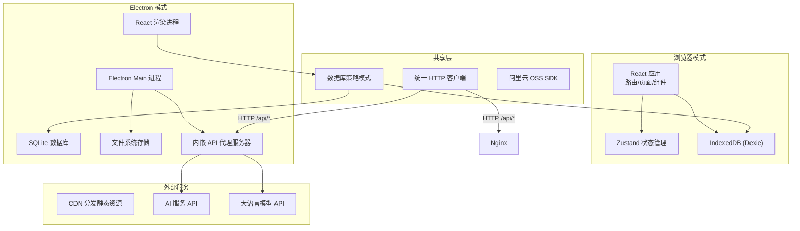
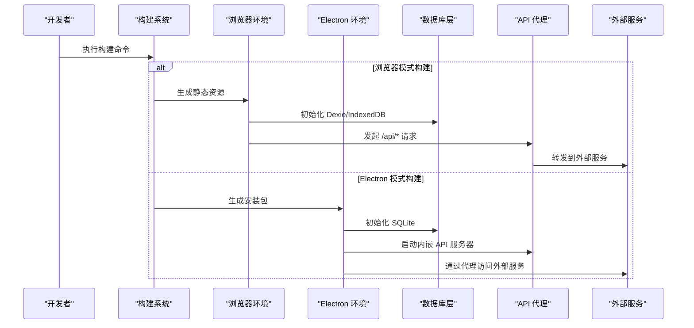
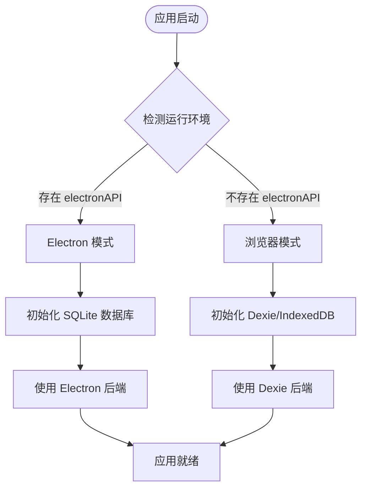
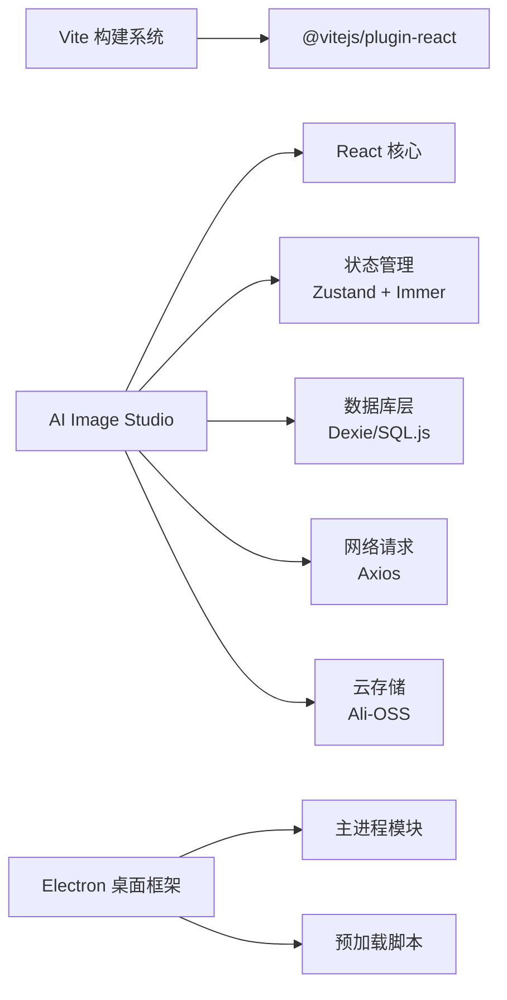

# 部署指南

<cite>
**本文引用的文件**   
- [app/vite.config.js](file://app/vite.config.js)
- [app/package.json](file://app/package.json)
- [app/electron-builder.yml](file://app/electron-builder.yml)
- [app/electron/main.cjs](file://app/electron/main.cjs)
- [app/electron/preload.cjs](file://app/electron/preload.cjs)
- [app/electron/api-server.cjs](file://app/electron/api-server.cjs)
- [app/src/db/database.js](file://app/src/db/database.js)
- [app/src/db/dexie-backend.js](file://app/src/db/dexie-backend.js)
- [app/src/db/electron-backend.js](file://app/src/db/electron-backend.js)
- [app/src/services/api/client.js](file://app/src/services/api/client.js)
- [app/src/main.jsx](file://app/src/main.jsx)
</cite>

## 更新摘要
**变更内容**   
- 新增双模式开发工作流支持（浏览器模式和 Electron 桌面模式）
- 添加 Electron 桌面应用打包配置和构建流程
- 扩展 API 客户端以支持动态端口检测
- 新增数据库后端策略模式实现
- 完善生产环境部署方案，包含 Electron 安装包发布

## 目录
1. [简介](#简介)
2. [项目结构](#项目结构)
3. [核心组件](#核心组件)
4. [架构总览](#架构总览)
5. [详细组件分析](#详细组件分析)
6. [依赖分析](#依赖分析)
7. [性能考虑](#性能考虑)
8. [故障排除指南](#故障排除指南)
9. [结论](#结论)
10. [附录](#附录)

## 简介
本指南面向生产环境，覆盖 AI Image Studio 的双模式部署方案：浏览器静态站点部署和 Electron 桌面应用打包。详细说明 Vite 构建优化、环境变量配置与 CDN 部署；解释 Electron 打包配置、资源压缩策略与缓存优化；提供 Docker 容器化部署、Nginx 反向代理与 SSL 证书设置；并给出监控日志、错误追踪集成与性能监控方案。最后包含部署检查清单与常见问题排查路径。

## 项目结构
本项目采用双模式架构，支持浏览器模式和 Electron 桌面模式运行。浏览器模式使用 IndexedDB 存储数据，Electron 模式使用 SQLite + 文件系统存储。对外部 AI 服务与 LLM 扩展接口采用内嵌 API 服务器进行代理转发，生产环境建议由 Nginx 或独立网关统一处理鉴权与代理。



**图表来源**
- [app/src/db/database.js:22-30](file://app/src/db/database.js#L22-L30)
- [app/electron/main.cjs:46-97](file://app/electron/main.cjs#L46-L97)
- [app/electron/api-server.cjs:236-247](file://app/electron/api-server.cjs#L236-L247)
- [app/src/services/api/client.js:22-37](file://app/src/services/api/client.js#L22-L37)

**章节来源**
- [app/package.json:1-41](file://app/package.json#L1-L41)
- [app/vite.config.js:1-14](file://app/vite.config.js#L1-L14)
- [app/electron-builder.yml:1-19](file://app/electron-builder.yml#L1-L19)

## 核心组件
- **双模式构建系统**：基于 Vite 的 React 应用，支持浏览器开发和 Electron 桌面开发两种模式。
- **策略模式数据库层**：自动检测运行环境，在浏览器模式下使用 IndexedDB，在 Electron 模式下使用 SQLite。
- **内嵌 API 代理服务器**：Electron 主进程内置 HTTP 服务器，处理所有外部 API 请求代理。
- **统一 HTTP 客户端**：支持动态端口检测和自动重试机制，适配不同运行环境。
- **桌面应用打包**：使用 electron-builder 生成 Windows NSIS 安装包。

**章节来源**
- [app/package.json:9-16](file://app/package.json#L9-L16)
- [app/src/db/database.js:18-30](file://app/src/db/database.js#L18-L30)
- [app/electron/api-server.cjs:145-228](file://app/electron/api-server.cjs#L145-L228)
- [app/src/services/api/client.js:42-48](file://app/src/services/api/client.js#L42-L48)
- [app/electron-builder.yml:12-19](file://app/electron-builder.yml#L12-L19)

## 架构总览
下图展示了双模式应用的完整架构，包括运行时环境检测、数据库策略选择和 API 代理流程。



**图表来源**
- [app/package.json:9-16](file://app/package.json#L9-L16)
- [app/src/db/database.js:22-30](file://app/src/db/database.js#L22-L30)
- [app/electron/main.cjs:72-78](file://app/electron/main.cjs#L72-L78)

## 详细组件分析

### 双模式开发工作流
项目支持两种开发模式：
- **Electron 桌面模式**：`npm run dev` 或 `npm run electron:dev`，同时启动 Vite 开发服务器和 Electron 窗口
- **浏览器模式**：`npm run browser:dev`，仅启动 Vite 开发服务器，数据存储在 IndexedDB

开发时，Electron 模式连接本地 Vite 服务器（http://127.0.0.1:5173），浏览器模式直接访问该地址。

**章节来源**
- [app/package.json:9-16](file://app/package.json#L9-L16)
- [app/electron/main.cjs:34-39](file://app/electron/main.cjs#L34-L39)

### 数据库策略模式
数据库层采用策略模式实现环境自适应：
- **Electron 后端**：通过 IPC 调用主进程的 SQLite 数据库，图片文件存储在文件系统
- **浏览器后端**：使用 Dexie.js 操作 IndexedDB，所有数据存储在浏览器缓存中
- **自动检测**：启动时根据 `window.electronAPI` 是否存在自动选择后端



**图表来源**
- [app/src/db/database.js:22-30](file://app/src/db/database.js#L22-L30)
- [app/src/db/electron-backend.js:41-44](file://app/src/db/electron-backend.js#L41-L44)
- [app/src/db/dexie-backend.js:25-28](file://app/src/db/dexie-backend.js#L25-L28)

**章节来源**
- [app/src/db/database.js:18-30](file://app/src/db/database.js#L18-L30)
- [app/src/db/electron-backend.js:8-44](file://app/src/db/electron-backend.js#L8-L44)
- [app/src/db/dexie-backend.js:10-28](file://app/src/db/dexie-backend.js#L10-L28)

### Electron 桌面应用架构
Electron 主进程负责：
- 创建和管理浏览器窗口
- 启动内嵌 API 代理服务器
- 初始化 SQLite 数据库和文件系统
- 注册 IPC 处理器和安全协议
- 处理应用生命周期事件

预加载脚本通过 contextBridge 暴露安全的 IPC 接口给渲染进程，包括数据库操作、文件系统操作和应用信息获取。

**章节来源**
- [app/electron/main.cjs:46-97](file://app/electron/main.cjs#L46-L97)
- [app/electron/preload.cjs:4-81](file://app/electron/preload.cjs#L4-L81)

### 内嵌 API 代理服务器
Electron 主进程内置 HTTP 服务器，处理以下路由：
- `/api/qwen/*` → 通义千问 DashScope API
- `/api/evolink/*` → EvoLink API（GPT-image-2, Nano Banana 2）
- `/api/oss/*` → 阿里云 OSS 对象存储
- `/api/llm/*` → 扩展大语言模型
- `/api/proxy-image` → 外部图片 CORS 代理

服务器从 `.env` 文件加载环境变量，自动注入鉴权头并转发请求。

**章节来源**
- [app/electron/api-server.cjs:145-228](file://app/electron/api-server.cjs#L145-L228)
- [app/electron/api-server.cjs:236-247](file://app/electron/api-server.cjs#L236-L247)

### 动态 API 客户端
HTTP 客户端支持环境自适应：
- **Electron 环境**：通过 IPC 获取主进程 API 服务器端口，动态设置 baseURL
- **浏览器环境**：使用相对路径 `/api`，由 Vite 代理或 Nginx 处理
- **统一接口**：无论运行环境如何，上层代码无需修改

**章节来源**
- [app/src/services/api/client.js:22-37](file://app/src/services/api/client.js#L22-L37)
- [app/src/services/api/client.js:42-48](file://app/src/services/api/client.js#L42-L48)

### 生产构建与打包
项目支持多种构建目标：
- **浏览器版本**：`npm run build`，输出到 `dist/` 目录
- **Electron 安装包**：`npm run electron:build`，生成 Windows NSIS 安装包
- **预览模式**：`npm run preview`，预览生产构建结果

electron-builder 配置指定了打包目标为 Windows NSIS，包含必要的资源和图标。

**章节来源**
- [app/package.json:13-15](file://app/package.json#L13-L15)
- [app/electron-builder.yml:1-19](file://app/electron-builder.yml#L1-L19)

## 依赖分析
项目依赖分为运行时依赖和开发依赖两大类：

**运行时依赖**：
- React 生态系统：react、react-dom、react-router-dom
- 状态管理：zustand、immer
- 数据库：dexie（浏览器模式）、sql.js（Electron 模式）
- 网络请求：axios
- 云存储：ali-oss
- 工具库：uuid、lucide-react、react-hotkeys-hook、dotenv

**开发依赖**：
- 构建工具：vite、@vitejs/plugin-react
- Electron 生态：electron、electron-builder
- 开发辅助：concurrently、wait-on



**图表来源**
- [app/package.json:17-39](file://app/package.json#L17-L39)

**章节来源**
- [app/package.json:17-39](file://app/package.json#L17-L39)

## 性能考虑
- **构建产物优化**
  - 使用 Vite 生产构建，开启默认压缩与代码分割
  - Electron 模式使用 asar 归档减少包体积
  - 将 dist 目录托管至 CDN，利用浏览器缓存与边缘节点加速
- **数据库性能**
  - Electron 模式使用 SQLite，适合大量数据存储和复杂查询
  - 浏览器模式使用 IndexedDB，适合轻量级应用
  - 缩略图优先展示，减少首屏压力
- **网络优化**
  - 客户端已内置指数退避重试与超时控制
  - 内嵌 API 服务器避免跨域问题
  - 大文件上传/下载建议使用分片与断点续传
- **内存管理**
  - Electron 模式注意主进程内存占用
  - 及时清理不需要的数据库连接和文件句柄

## 故障排除指南
- **无法访问 /api\***
  - Electron 模式：确认内嵌 API 服务器是否启动成功
  - 浏览器模式：检查 Vite 代理配置或 Nginx 反向代理设置
  - 环境变量：确认 `.env` 文件中的 API 密钥配置正确
- **数据库连接失败**
  - Electron 模式：检查 SQLite 数据库文件权限和路径
  - 浏览器模式：确认浏览器支持 IndexedDB 且未被禁用
  - 迁移问题：查看首次启动时的迁移日志
- **打包失败**
  - 检查 node_modules 是否完整安装
  - 确认 electron-builder 配置文件语法正确
  - 验证图标文件和构建资源路径
- **运行时崩溃**
  - 查看 Electron 开发者工具控制台
  - 检查主进程和渲染进程的日志输出
  - 确认 IPC 通信是否正常

**章节来源**
- [app/electron/api-server.cjs:109-116](file://app/electron/api-server.cjs#L109-L116)
- [app/src/db/database.js:22-30](file://app/src/db/database.js#L22-L30)
- [app/electron/main.cjs:51-53](file://app/electron/main.cjs#L51-L53)

## 结论
AI Image Studio 采用灵活的双模式架构，既支持传统的 Web 部署，又提供功能完整的桌面应用体验。通过策略模式实现的数据库层确保了代码复用和环境自适应，内嵌 API 代理服务器简化了部署复杂度。生产环境推荐根据使用场景选择合适的部署方式：Web 部署适合团队协作和跨平台访问，Electron 部署适合单机高性能需求。结合客户端重试机制、数据库优化和缓存策略，可获得良好的用户体验与稳定性。

## 附录

### 环境变量清单
- **AI 服务配置**
  - `VITE_QWEN_API_KEY`：通义千问 API Key
  - `VITE_QWEN_API_BASE`：通义千问 API Base URL
  - `VITE_EVOLINK_API_KEY`：EvoLink API Key
  - `VITE_EVOLINK_API_BASE`：EvoLink API Base URL
  - `VITE_EXPANSION_LLM_KEY`：扩展 LLM Key
  - `VITE_EXPANSION_LLM_BASE`：扩展 LLM Base URL
- **云存储配置**
  - `VITE_OSS_BUCKET`：OSS Bucket 名称
  - `VITE_OSS_REGION`：OSS 区域
  - `VITE_OSS_ACCESS_KEY_ID`：OSS AccessKeyId
  - `VITE_OSS_ACCESS_KEY_SECRET`：OSS AccessKeySecret

**章节来源**
- [app/electron/api-server.cjs:24-33](file://app/electron/api-server.cjs#L24-L33)

### 双模式构建与部署步骤

#### 浏览器模式部署
1. **安装依赖并构建**
   ```bash
   cd app
   npm install
   npm run build
   ```
2. **静态资源发布**
   - 将 `dist/` 目录上传至 CDN 或 Nginx 静态目录
3. **反向代理配置**
   - 配置 Nginx 将 `/api/*` 转发到后端或外部服务
   - 注入必要鉴权头和超时限制
4. **HTTPS 与安全**
   - 在 Nginx 上配置证书与加密套件
   - 启用 HSTS 和安全头部

#### Electron 桌面应用部署
1. **安装依赖并构建**
   ```bash
   cd app
   npm install
   npm run electron:build
   ```
2. **安装包分发**
   - 生成的 NSIS 安装包位于 `release/` 目录
   - 可直接分发给用户安装
3. **签名与认证**
   - 配置代码签名证书提升安全性
   - 设置应用程序标识符和版本信息

**章节来源**
- [app/package.json:9-16](file://app/package.json#L9-L16)
- [app/electron-builder.yml:12-19](file://app/electron-builder.yml#L12-L19)

### Docker 容器化部署（概念说明）
- **多阶段构建**
  - 第一阶段：Node 镜像安装依赖并执行构建
  - 第二阶段：使用轻量镜像（如 nginx:alpine）提供静态资源与反向代理
- **环境变量注入**
  - 通过容器环境变量注入 `VITE_*` 配置
  - 或使用构建时注入环境变量
- **卷与持久化**
  - 挂载只读卷用于静态资源
  - 避免写入容器文件系统
- **健康检查与优雅退出**
  - 配置健康检查端点
  - 处理 SIGTERM 信号实现优雅关闭

### Nginx 反向代理与缓存（概念说明）
- **静态资源配置**
  - 开启 gzip/brotli 压缩
  - 设置长期缓存策略与 ETag
  - 配置 MIME 类型映射
- **API 代理配置**
  - 将 `/api/*` 转发到上游服务
  - 添加必要的鉴权头和超时限制
  - 配置负载均衡和健康检查
- **安全加固**
  - 启用 HSTS 和安全响应头
  - 限制 HTTP 方法
  - 配置 IP 白名单和限流

### 监控、日志与错误追踪（概念说明）
- **前端错误上报**
  - 接入第三方错误追踪服务
  - 集中收集未捕获异常和 Promise 拒绝
  - 记录用户环境和操作步骤
- **性能监控**
  - 采集关键指标（FCP/LCP/CLS/TTFB）
  - 上报至 APM 平台进行分析
  - 设置性能阈值告警
- **日志规范**
  - 统一日志格式和级别
  - 区分 info/warn/error 级别
  - 避免打印敏感信息

### 部署检查清单
- **构建产物验证**
  - 已完成生产构建，dist 目录完整
  - Electron 安装包成功生成
  - 所有依赖正确打包
- **静态资源部署**
  - 已部署至 CDN，缓存策略生效
  - 资源文件哈希正确
  - 字体和图片资源正常加载
- **API 代理配置**
  - `/api/*` 路由正确转发
  - 鉴权头注入无误
  - 超时和重试配置合理
- **安全配置**
  - 已启用 HTTPS，证书有效
  - HSTS 和安全头部开启
  - 敏感信息未泄露到客户端
- **可用性测试**
  - 健康检查通过
  - 负载均衡就绪
  - 错误页面友好显示
- **监控集成**
  - 错误上报已接入
  - 性能监控已配置
  - 日志收集正常
- **回滚准备**
  - 具备快速回滚能力
  - 灰度发布流程就绪
  - 备份策略已实施