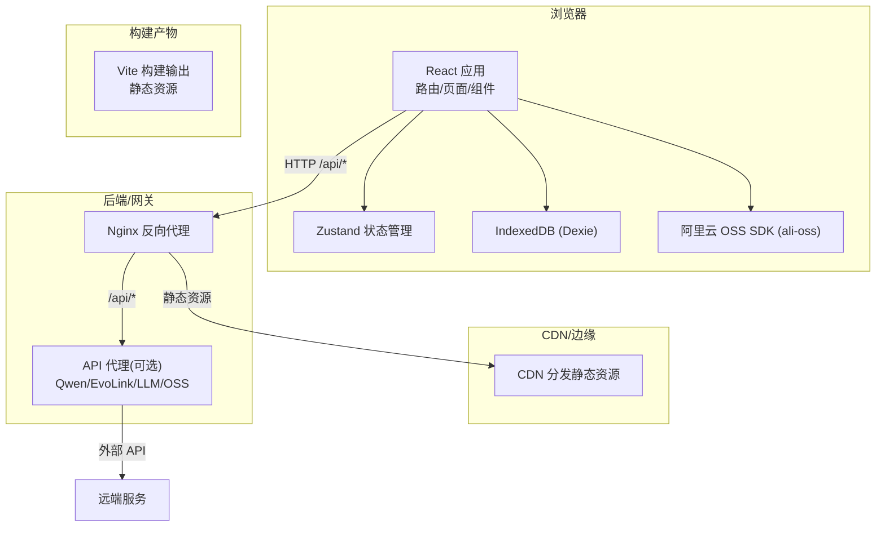
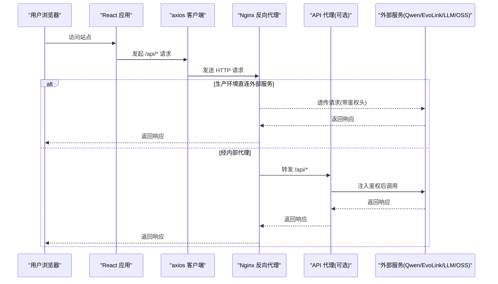
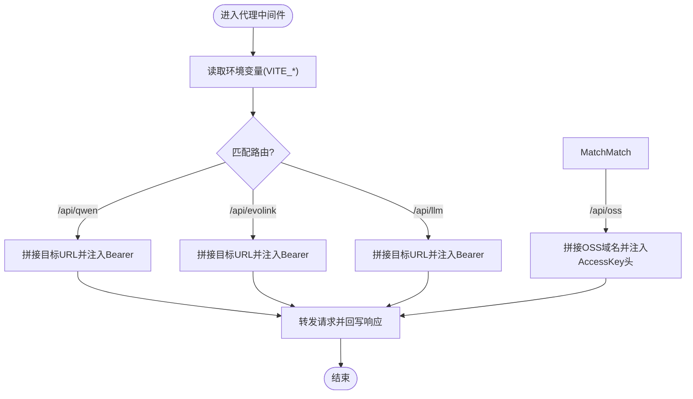
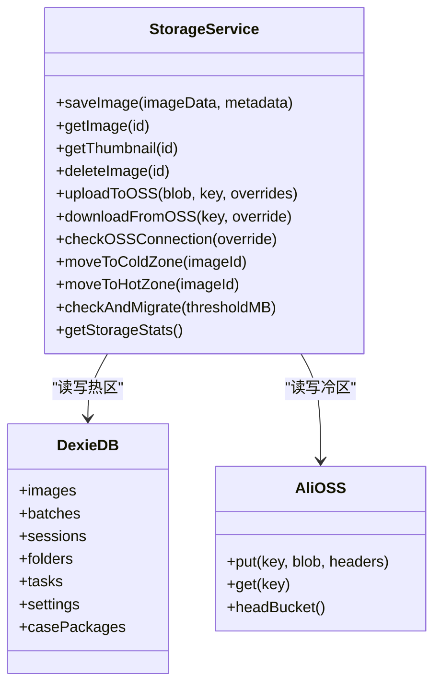
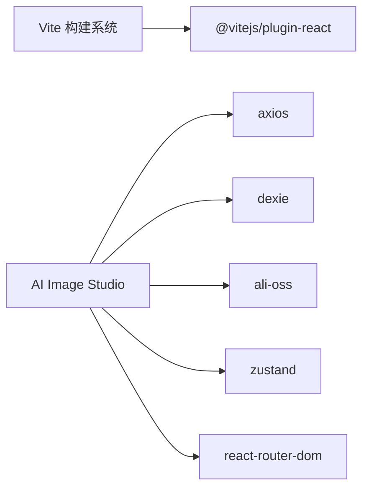

# 部署指南

<cite>
**本文引用的文件**   
- [app/vite.config.js](file://app/vite.config.js)
- [app/package.json](file://app/package.json)
- [app/src/server/api-proxy.js](file://app/src/server/api-proxy.js)
- [app/src/services/api/client.js](file://app/src/services/api/client.js)
- [app/src/services/storage.js](file://app/src/services/storage.js)
- [app/src/db/database.js](file://app/src/db/database.js)
- [app/src/stores/useSettingsStore.js](file://app/src/stores/useSettingsStore.js)
- [app/src/main.jsx](file://app/src/main.jsx)
- [app/index.html](file://app/index.html)
</cite>

## 目录
1. [简介](#简介)
2. [项目结构](#项目结构)
3. [核心组件](#核心组件)
4. [架构总览](#架构总览)
5. [详细组件分析](#详细组件分析)
6. [依赖分析](#依赖分析)
7. [性能考虑](#性能考虑)
8. [故障排除指南](#故障排除指南)
9. [结论](#结论)
10. [附录](#附录)

## 简介
本指南面向生产环境，覆盖 AI Image Studio 的构建优化、环境变量配置与 CDN 部署方案；解释 Vite 构建配置、资源压缩策略与缓存优化；提供 Docker 容器化部署、Nginx 反向代理与 SSL 证书设置；并给出监控日志、错误追踪集成与性能监控方案。最后包含部署检查清单与常见问题排查路径。

## 项目结构
本项目为纯前端应用（React + Vite），通过浏览器端 IndexedDB 存储热数据，并通过阿里云 OSS 进行冷数据持久化。对外部 AI 服务（如 Qwen、EvoLink）与 LLM 扩展接口采用 Vite 开发期插件进行代理转发，生产环境建议由 Nginx 或独立网关统一处理鉴权与代理。

图表来源
- [app/vite.config.js:1-12](file://app/vite.config.js#L1-L12)
- [app/src/server/api-proxy.js:121-189](file://app/src/server/api-proxy.js#L121-L189)
- [app/src/services/storage.js:1-42](file://app/src/services/storage.js#L1-L42)
- [app/src/db/database.js:20-31](file://app/src/db/database.js#L20-L31)
- [app/src/main.jsx:12-29](file://app/src/main.jsx#L12-L29)

章节来源
- [app/vite.config.js:1-12](file://app/vite.config.js#L1-L12)
- [app/package.json:1-30](file://app/package.json#L1-L30)
- [app/index.html:1-16](file://app/index.html#L1-L16)

## 核心组件
- 构建与脚本：基于 Vite 的 React 应用，提供 dev/build/preview 脚本。
- API 客户端：统一的 axios 实例，内置重试与超时控制，默认 baseURL 指向 /api。
- 存储层：热区使用 IndexedDB，冷区使用阿里云 OSS；支持缩略图生成与冷热迁移。
- 设置与初始化：启动时打开数据库并加载持久化设置。

章节来源
- [app/package.json:6-10](file://app/package.json#L6-L10)
- [app/src/services/api/client.js:18-33](file://app/src/services/api/client.js#L18-L33)
- [app/src/services/storage.js:44-151](file://app/src/services/storage.js#L44-L151)
- [app/src/db/database.js:20-31](file://app/src/db/database.js#L20-L31)
- [app/src/main.jsx:12-29](file://app/src/main.jsx#L12-L29)

## 架构总览
下图展示了从浏览器到外部服务的请求链路，以及静态资源的 CDN 分发路径。

图表来源
- [app/src/services/api/client.js:18-33](file://app/src/services/api/client.js#L18-L33)
- [app/src/server/api-proxy.js:121-189](file://app/src/server/api-proxy.js#L121-L189)

## 详细组件分析

### Vite 构建与开发服务器
- 插件：启用 @vitejs/plugin-react 与自定义 api-proxy 插件。
- 开发服务器：监听本地地址与端口，严格端口模式避免冲突。
- 生产构建：执行 vite build 产出静态资源，适合放置于 CDN/Nginx。

章节来源
- [app/vite.config.js:1-12](file://app/vite.config.js#L1-L12)
- [app/package.json:6-10](file://app/package.json#L6-L10)

### API 代理插件（开发期）
- 功能：在开发期将 /api/qwen、/api/evolink、/api/llm、/api/oss 等路径转发至对应外部服务，并在请求中注入鉴权头。
- 环境变量：从 Vite 环境加载 VITE_* 前缀的配置项，避免泄露到客户端。
- 注意：该插件仅用于开发期；生产环境应通过 Nginx 或独立网关实现代理与鉴权。

图表来源
- [app/src/server/api-proxy.js:121-189](file://app/src/server/api-proxy.js#L121-L189)

章节来源
- [app/src/server/api-proxy.js:121-189](file://app/src/server/api-proxy.js#L121-L189)

### HTTP 客户端与重试机制
- 基础配置：baseURL 指向 /api，默认超时 60s；针对同步图像生成提供长超时客户端。
- 拦截器：统一错误归一化，支持指数退避重试（最多 3 次），可被调用方禁用。
- 取消：支持 AbortController 信号，便于中断长时间任务。

章节来源
- [app/src/services/api/client.js:18-33](file://app/src/services/api/client.js#L18-L33)
- [app/src/services/api/client.js:49-85](file://app/src/services/api/client.js#L49-L85)
- [app/src/services/api/client.js:100-146](file://app/src/services/api/client.js#L100-L146)

### 存储层（热区/冷区）
- 热区：IndexedDB 存储图片 Blob 与元数据，提供快速预览与编辑能力。
- 冷区：阿里云 OSS 作为长期存储，支持上传/下载/连接测试与冷热迁移。
- 缩略图：Canvas 生成最大 200px 的缩略图，提升列表渲染性能。

图表来源
- [app/src/services/storage.js:44-151](file://app/src/services/storage.js#L44-L151)
- [app/src/db/database.js:20-31](file://app/src/db/database.js#L20-L31)

章节来源
- [app/src/services/storage.js:1-42](file://app/src/services/storage.js#L1-L42)
- [app/src/services/storage.js:138-197](file://app/src/services/storage.js#L138-L197)
- [app/src/services/storage.js:204-298](file://app/src/services/storage.js#L204-L298)
- [app/src/db/database.js:20-31](file://app/src/db/database.js#L20-L31)

### 应用初始化与设置
- 启动流程：先打开 IndexedDB，再加载持久化设置，最后挂载 React。
- 设置项：模型配置、存储配置、扩展配置、通用配置均持久化到 IndexedDB。
- 运行时环境变量：部分默认值来自 import.meta.env.VITE_*（例如 OSS 相关）。

章节来源
- [app/src/main.jsx:12-29](file://app/src/main.jsx#L12-L29)
- [app/src/stores/useSettingsStore.js:25-45](file://app/src/stores/useSettingsStore.js#L25-L45)
- [app/src/stores/useSettingsStore.js:108-149](file://app/src/stores/useSettingsStore.js#L108-L149)

## 依赖分析
- 构建与运行：Vite、@vitejs/plugin-react、React、ReactDOM。
- 网络与存储：axios、ali-oss、Dexie。
- 状态与工具：Zustand、immer、react-router-dom、uuid、lucide-react、react-hotkeys-hook。

图表来源
- [app/package.json:11-28](file://app/package.json#L11-L28)

章节来源
- [app/package.json:11-28](file://app/package.json#L11-L28)

## 性能考虑
- 构建产物
  - 使用 Vite 生产构建，开启默认压缩与代码分割。
  - 将 dist 目录托管至 CDN，利用浏览器缓存与边缘节点加速。
- 资源缓存
  - 静态资源文件名含哈希，利于强缓存；HTML 不缓存或短缓存。
  - 对字体等资源可使用 preconnect 预连接。
- 请求优化
  - 客户端已内置指数退避重试与超时控制，避免雪崩。
  - 大文件上传/下载建议使用分片与断点续传（可在上层封装）。
- 存储优化
  - 缩略图优先展示，减少首屏压力。
  - 自动冷热迁移，控制热区容量，降低 IndexedDB 膨胀风险。

[本节为通用指导，无需源码引用]

## 故障排除指南
- 无法访问 /api/*
  - 确认 Nginx 是否正确将 /api/* 转发到后端或外部服务。
  - 若使用开发期代理，确保环境变量以 VITE_ 前缀正确加载。
- 鉴权失败
  - 检查 Bearer Token 或 AccessKey 是否注入成功。
  - 确认外部服务域名与白名单配置。
- 上传/下载失败
  - 校验 Bucket、Region、AccessKey 配置。
  - 检查 CORS 与跨域签名规则。
- 页面空白或崩溃
  - 查看浏览器控制台与全局错误边界捕获信息。
  - 确认 IndexedDB 可用且版本兼容。

章节来源
- [app/src/server/api-proxy.js:109-116](file://app/src/server/api-proxy.js#L109-L116)
- [app/src/services/storage.js:147-151](file://app/src/services/storage.js#L147-L151)
- [app/src/services/storage.js:181-197](file://app/src/services/storage.js#L181-L197)
- [app/src/App.jsx:26-62](file://app/src/App.jsx#L26-L62)

## 结论
AI Image Studio 采用“前端静态资源 + 浏览器本地存储 + 云端对象存储”的轻量架构。生产环境推荐将构建产物置于 CDN，并通过 Nginx 统一处理 /api 路由与 TLS 终止；敏感密钥由服务端注入，避免泄露到客户端。结合客户端重试与缩略图/冷热分层策略，可获得良好的用户体验与稳定性。

[本节为总结性内容，无需源码引用]

## 附录

### 环境变量清单（示例）
- VITE_QWEN_API_KEY：通义千问 API Key
- VITE_QWEN_API_BASE：通义千问 API Base URL
- VITE_EVOLINK_API_KEY：EvoLink API Key
- VITE_EVOLINK_API_BASE：EvoLink API Base URL
- VITE_EXPANSION_LLM_KEY：扩展 LLM Key
- VITE_EXPANSION_LLM_BASE：扩展 LLM Base URL
- VITE_OSS_BUCKET：OSS Bucket
- VITE_OSS_REGION：OSS Region
- VITE_OSS_ACCESS_KEY_ID：OSS AccessKeyId
- VITE_OSS_ACCESS_KEY_SECRET：OSS AccessKeySecret

章节来源
- [app/src/server/api-proxy.js:126-137](file://app/src/server/api-proxy.js#L126-L137)
- [app/src/stores/useSettingsStore.js:25-38](file://app/src/stores/useSettingsStore.js#L25-L38)

### 生产构建与部署步骤
- 安装依赖并构建
  - 执行构建脚本生成 dist 目录。
- 静态资源发布
  - 将 dist 目录上传至 CDN 或 Nginx 静态目录。
- 反向代理
  - 配置 Nginx 将 /api/* 转发到后端或外部服务，并注入必要鉴权头。
- HTTPS 与证书
  - 在 Nginx 上配置证书与加密套件，强制 HTTPS。
- 健康检查
  - 暴露一个简单健康检查端点，供负载均衡与健康探针使用。

章节来源
- [app/package.json:6-10](file://app/package.json#L6-L10)
- [app/vite.config.js:5-12](file://app/vite.config.js#L5-L12)

### Docker 容器化部署（概念说明）
- 多阶段构建
  - 第一阶段：Node 镜像安装依赖并执行构建。
  - 第二阶段：使用轻量镜像（如 nginx:alpine）提供静态资源与反向代理。
- 环境变量注入
  - 通过容器环境变量注入 VITE_* 配置，或在构建阶段注入。
- 卷与持久化
  - 如需本地日志或调试，挂载只读卷；避免写入容器文件系统。
- 健康检查与优雅退出
  - 配置健康检查与 SIGTERM 处理，配合编排平台滚动更新。

[本节为概念性指导，无需源码引用]

### Nginx 反向代理与缓存（概念说明）
- 静态资源
  - 开启 gzip/brotli 压缩，设置 long cache 与 ETag。
- API 代理
  - 将 /api/* 转发到上游服务，必要时添加鉴权头与超时限制。
- 安全
  - 启用 HSTS、限制方法、隐藏版本号、限流与 IP 白名单。

[本节为概念性指导，无需源码引用]

### 监控、日志与错误追踪（概念说明）
- 前端错误上报
  - 接入第三方错误追踪服务，集中收集未捕获异常与 Promise 拒绝。
- 性能监控
  - 采集关键指标（FCP/LCP/CLS/TTFB），上报至 APM 平台。
- 日志规范
  - 统一日志格式与级别，区分 info/warn/error，避免打印敏感信息。

[本节为概念性指导，无需源码引用]

### 部署检查清单
- 构建产物
  - 已完成生产构建，dist 目录完整。
- 静态资源
  - 已部署至 CDN，缓存策略生效。
- 反向代理
  - /api/* 路由正确转发，鉴权头注入无误。
- 安全
  - 已启用 HTTPS，证书有效，HSTS 开启。
- 可用性
  - 健康检查通过，负载均衡就绪。
- 监控
  - 错误上报与性能监控已接入。
- 回滚
  - 具备快速回滚与灰度发布能力。

[本节为通用检查项，无需源码引用]