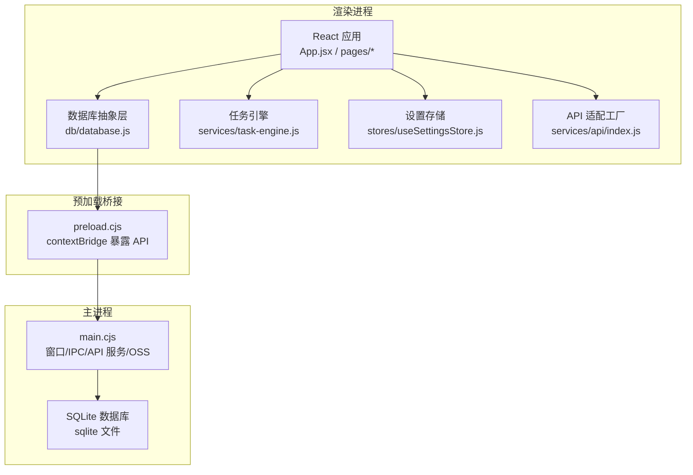
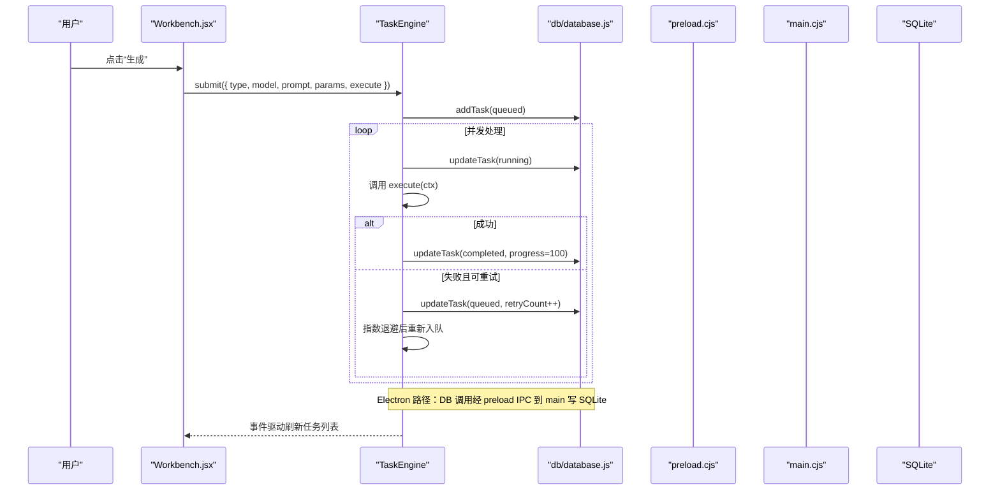
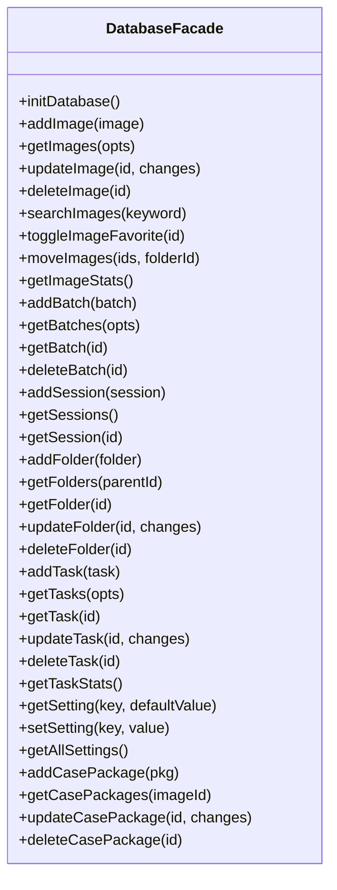
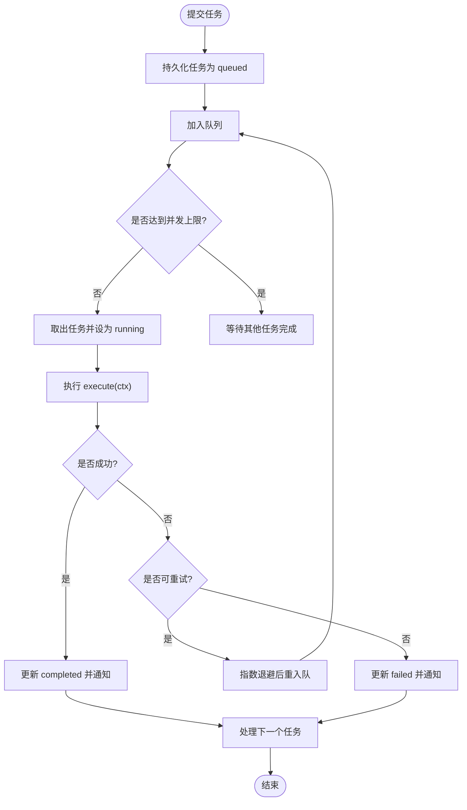
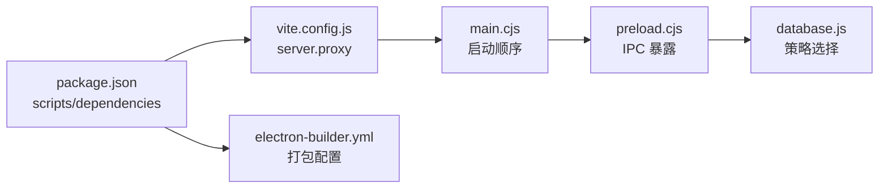

# 开发工作流配置

<cite>
**本文引用的文件**   
- [README.md](file://README.md)
- [package.json](file://app/package.json)
- [vite.config.js](file://app/vite.config.js)
- [electron-builder.yml](file://app/electron-builder.yml)
- [main.cjs](file://app/electron/main.cjs)
- [preload.cjs](file://app/electron/preload.cjs)
- [database.js](file://app/src/db/database.js)
- [task-engine.js](file://app/src/services/task-engine.js)
- [useTaskStore.js](file://app/src/stores/useTaskStore.js)
- [useSettingsStore.js](file://app/src/stores/useSettingsStore.js)
- [index.js](file://app/src/services/api/index.js)
- [App.jsx](file://app/src/App.jsx)
- [main.jsx](file://app/src/main.jsx)
- [Sidebar.jsx](file://app/src/components/Sidebar.jsx)
- [Workbench.jsx](file://app/src/pages/Workbench.jsx)
</cite>

## 目录
1. [简介](#简介)
2. [项目结构](#项目结构)
3. [核心组件](#核心组件)
4. [架构总览](#架构总览)
5. [详细组件分析](#详细组件分析)
6. [依赖关系分析](#依赖关系分析)
7. [性能考量](#性能考量)
8. [故障排查指南](#故障排查指南)
9. [结论](#结论)
10. [附录](#附录)

## 简介
本项目为 AI 图像生成桌面工作站，支持多模型统一调用、提示词工程、批量生成、知识库 RAG 与完整资产管理。前端基于 React + Vite，桌面端基于 Electron；数据库层采用策略模式，在 Electron 环境下通过 IPC 访问 SQLite，浏览器环境回退到 IndexedDB（Dexie），并支持通过内置 API 服务器以 HTTP 方式访问 SQLite。任务调度使用自研 TaskEngine，具备并发控制、重试与进度上报能力。

## 项目结构
- 应用入口与构建
  - 开发：Vite 启动前端服务，Electron 加载本地开发地址，自动打开 DevTools
  - 生产：Vite 打包产物 dist，Electron 加载 index.html，electron-builder 打包 NSIS 安装包
- 进程划分
  - Main 进程：初始化数据库、注册 IPC、启动 API 代理、管理窗口生命周期、OSS 同步
  - Renderer 进程：React 应用、Zustand 状态、页面与组件、API 适配层、任务引擎
  - Preload：安全暴露 IPC 接口给渲染进程
- 数据持久化
  - 策略模式封装 db 层，按运行环境选择后端
  - Electron 下通过 preload → main IPC → SQLite
  - 浏览器下优先尝试 HTTP 后端（端口由 main 启动的 API 服务提供），否则回退 Dexie/IndexedDB

图表来源
- [main.cjs:1-126](file://app/electron/main.cjs#L1-L126)
- [preload.cjs:1-82](file://app/electron/preload.cjs#L1-L82)
- [database.js:1-114](file://app/src/db/database.js#L1-L114)
- [task-engine.js:1-319](file://app/src/services/task-engine.js#L1-L319)
- [useSettingsStore.js:1-179](file://app/src/stores/useSettingsStore.js#L1-L179)
- [index.js:1-39](file://app/src/services/api/index.js#L1-L39)

章节来源
- [README.md:1-10](file://README.md#L1-L10)
- [package.json:1-43](file://app/package.json#L1-L43)
- [vite.config.js:1-20](file://app/vite.config.js#L1-L20)
- [electron-builder.yml:1-19](file://app/electron-builder.yml#L1-L19)

## 核心组件
- 数据库抽象层（策略模式）
  - 根据运行环境选择后端：Electron IPC → HTTP → Dexie
  - 统一导出 images/batches/sessions/folders/tasks/settings/casePackages 等 CRUD 方法
- 任务引擎（TaskEngine）
  - 最大并发、FIFO 队列、指数退避重试、状态机、事件总线、进度上报、自动持久化
- 设置存储（useSettingsStore）
  - 模型配置、存储配置、扩展配置、通用配置、向导完成标记，持久化至 DB
- API 适配层
  - 模型适配器工厂，统一对外暴露 apiClient 与各模型适配器
- UI 壳与路由
  - 全局快捷键、错误边界、懒加载页面、全局 Lightbox、任务面板、遮罩编辑器

章节来源
- [database.js:1-114](file://app/src/db/database.js#L1-L114)
- [task-engine.js:1-319](file://app/src/services/task-engine.js#L1-L319)
- [useSettingsStore.js:1-179](file://app/src/stores/useSettingsStore.js#L1-L179)
- [index.js:1-39](file://app/src/services/api/index.js#L1-L39)
- [App.jsx:1-364](file://app/src/App.jsx#L1-L364)

## 架构总览
- 启动流程
  - main 进程初始化 SQLite、注册 IPC、创建 FileManager、注册 app:// 协议、启动 API 代理、初始化 OSS 同步、创建主窗口
  - 首次页面加载完成后执行 IndexedDB → SQLite 迁移
  - renderer 进程 bootstrap 时初始化数据库、加载设置，再挂载 React
- 数据通路
  - 渲染进程通过 db/database.js 调用具体后端
  - Electron 模式下经 preload 暴露的 electronAPI.db 走 IPC 到 main 的 SQLite
  - 浏览器模式下先尝试 HTTP 后端（指向 main 的 API 服务），失败则回退 Dexie
- 任务执行
  - Workbench 将生成逻辑封装为 execute 函数提交给 TaskEngine
  - TaskEngine 维护队列与并发，更新任务状态与进度，失败自动重试，完成后通知 UI

图表来源
- [Workbench.jsx:1-800](file://app/src/pages/Workbench.jsx#L1-L800)
- [task-engine.js:1-319](file://app/src/services/task-engine.js#L1-L319)
- [database.js:1-114](file://app/src/db/database.js#L1-L114)
- [preload.cjs:1-82](file://app/electron/preload.cjs#L1-L82)
- [main.cjs:1-126](file://app/electron/main.cjs#L1-L126)

## 详细组件分析

### 数据库抽象层（Strategy 模式）
- 设计要点
  - initDatabase 按优先级选择后端：Electron IPC → HTTP → Dexie
  - 所有命名导出均委托给当前后端实例，上层无需感知差异
  - 默认导出兼容旧式直表访问（如 KnowledgeBase 中的直接 table.update）
- 复杂度与影响
  - 选择后端一次完成，后续调用 O(1) 转发
  - 在 Electron 下 IPC 序列化开销可控；HTTP 模式需确保 API 服务可用

图表来源
- [database.js:1-114](file://app/src/db/database.js#L1-L114)

章节来源
- [database.js:1-114](file://app/src/db/database.js#L1-L114)

### 任务引擎（TaskEngine）
- 关键特性
  - 并发上限、FIFO 队列、状态机（queued/running/completed/failed/cancelled/paused）
  - 指数退避重试（最多 3 次），仅对网络/5xx 类错误重试
  - 事件发射器，UI 订阅刷新
  - 进度回调 onProgress 持久化
- 典型流程
  - 提交任务 → 持久化为 queued → 出队执行 → 更新 running → 成功 completed 或失败 failed（含重试）→ 清理 active 并继续处理队列

图表来源
- [task-engine.js:1-319](file://app/src/services/task-engine.js#L1-L319)

章节来源
- [task-engine.js:1-319](file://app/src/services/task-engine.js#L1-L319)

### 任务状态桥接（useTaskStore）
- 职责
  - 从数据库加载任务列表，计算活跃任务数
  - 监听 TaskEngine 事件，统一刷新任务列表
  - 提供增删改查、重试、取消、暂停/恢复等操作
- 与 UI 的关系
  - App 启动时初始化桥接，侧边栏与任务中心实时反映任务状态变化

章节来源
- [useTaskStore.js:1-173](file://app/src/stores/useTaskStore.js#L1-L173)
- [App.jsx:1-364](file://app/src/App.jsx#L1-L364)

### 设置与模型配置（useSettingsStore）
- 内容
  - 模型配置（启用、apiKey、endpoint、默认参数）
  - 存储配置（热/冷存储、缩略图尺寸、OSS 桶/区域）
  - 扩展配置（LLM 扩写模型、变体数量、温度）
  - 通用配置（主题、语言、自动保存、最大并发任务）
  - 向导完成标记
- 持久化
  - 变更即持久化，启动时加载合并默认值

章节来源
- [useSettingsStore.js:1-179](file://app/src/stores/useSettingsStore.js#L1-L179)

### API 适配层与模型工厂
- 功能
  - 统一导出 apiClient 与各模型适配器
  - getModelAdapter 根据 modelId 返回对应适配器实例
  - getLLMAdapter 单例用于提示词扩写与对话
- 集成点
  - Workbench 中根据模型选择适配器进行图片编辑/生成

章节来源
- [index.js:1-39](file://app/src/services/api/index.js#L1-L39)
- [Workbench.jsx:1-800](file://app/src/pages/Workbench.jsx#L1-L800)

### 应用壳与路由（App.jsx）
- 功能
  - 错误边界、全局快捷键、懒加载页面、全局 Lightbox、任务面板、遮罩编辑器
  - 初始化任务桥接与通知权限
- 路由
  - 生成、图库、知识库、任务中心、设置、引导页、API 测试

章节来源
- [App.jsx:1-364](file://app/src/App.jsx#L1-L364)

### 主进程与预加载（main.cjs / preload.cjs）
- main.cjs
  - 初始化 SQLite、注册 IPC、创建 FileManager、注册自定义协议、启动 API 代理、初始化 OSS 同步、创建主窗口
  - 首次页面加载完成后执行迁移
- preload.cjs
  - 向渲染进程暴露 electronAPI.db/fs/oss/app 等安全接口

章节来源
- [main.cjs:1-126](file://app/electron/main.cjs#L1-L126)
- [preload.cjs:1-82](file://app/electron/preload.cjs#L1-L82)

### 侧边栏与文件夹树（Sidebar.jsx）
- 功能
  - 导航项、文件夹树构建、新增/重命名/删除子文件夹、拖拽移动图片
- 交互
  - 右键菜单、确认删除、折叠/展开

章节来源
- [Sidebar.jsx:1-371](file://app/src/components/Sidebar.jsx#L1-L371)

### 工作台（Workbench.jsx）
- 功能
  - 模型切换、Prompt 输入与扩写、参考图上传与角色标注、质量/分辨率/种子等参数
  - 生成流程：组装参数 → 调用 generate → 结果入库 → 更新 UI
  - 局部重绘：打开遮罩编辑器 → 获取原图与掩码 → 调用适配器 editImage → 提交 TaskEngine → 写入批次与图片
- 快捷键
  - Ctrl/Cmd + Enter 触发生成

章节来源
- [Workbench.jsx:1-800](file://app/src/pages/Workbench.jsx#L1-L800)

## 依赖关系分析
- 构建与脚本
  - dev：并行启动 Vite 与 Electron，等待前端就绪后加载
  - build：Vite 构建 + electron-builder 打包
- 开发服务器代理
  - /api/db 代理到 19527（Electron API 服务端口）
- 运行时依赖
  - 前端：React、Zustand、Dexie、axios、sql.js、react-router-dom、hotkeys 等
  - 桌面：Electron、electron-builder、ali-oss

图表来源
- [package.json:1-43](file://app/package.json#L1-L43)
- [vite.config.js:1-20](file://app/vite.config.js#L1-L20)
- [electron-builder.yml:1-19](file://app/electron-builder.yml#L1-L19)
- [main.cjs:1-126](file://app/electron/main.cjs#L1-L126)
- [preload.cjs:1-82](file://app/electron/preload.cjs#L1-L82)
- [database.js:1-114](file://app/src/db/database.js#L1-L114)

章节来源
- [package.json:1-43](file://app/package.json#L1-L43)
- [vite.config.js:1-20](file://app/vite.config.js#L1-L20)
- [electron-builder.yml:1-19](file://app/electron-builder.yml#L1-L19)

## 性能考量
- 并发与队列
  - 通过 TaskEngine 限制并发，避免过多请求导致服务端限流或资源争用
- 重试与退避
  - 指数退避降低瞬时失败风暴概率，提升整体成功率
- 数据库选择
  - Electron 下 SQLite I/O 更快；浏览器下 Dexie 适合轻量场景
- 资源加载
  - 页面懒加载减少首屏体积；缩略图尺寸与冷热存储策略优化展示与带宽

[本节为通用指导，不直接分析具体文件]

## 故障排查指南
- 数据库不可用
  - 检查 Electron 下 preload 是否暴露 db 接口；确认 main 已初始化 SQLite 并注册 IPC
  - 浏览器模式下确认 API 服务端口可达，或回退 Dexie
- 任务无响应
  - 查看 TaskEngine 事件日志；确认任务状态是否为 paused/cancelled；必要时重试
- 图片无法下载/预览
  - 确认 StorageService 读取路径正确；跨域情况下通过代理 URL 获取
- 构建失败
  - 检查 vite 端口占用与 strictPort 配置；确认 electron-builder 图标与输出目录存在

章节来源
- [main.cjs:1-126](file://app/electron/main.cjs#L1-L126)
- [preload.cjs:1-82](file://app/electron/preload.cjs#L1-L82)
- [database.js:1-114](file://app/src/db/database.js#L1-L114)
- [task-engine.js:1-319](file://app/src/services/task-engine.js#L1-L319)

## 结论
本项目的开发工作流围绕“策略化数据层 + 任务引擎 + 多模型适配”的核心架构展开。通过 Electron 提供的 IPC 与内置 API 服务，实现了跨环境的稳定数据访问与后台任务执行；配合 Zustand 与事件驱动，保证了 UI 的实时性与一致性。建议在生产环境中关注并发阈值、重试策略与存储冷热分层，以获得更稳定的用户体验。

[本节为总结性内容，不直接分析具体文件]

## 附录
- 常用命令
  - 开发：npm run dev
  - 浏览器开发：npm run browser:dev
  - 构建：npm run build
  - 打包：npm run electron:build
- 环境变量
  - 模型 API Key/Endpoint、OSS 桶/区域、扩写 LLM 模型等通过环境变量注入到设置存储

章节来源
- [package.json:1-43](file://app/package.json#L1-L43)
- [useSettingsStore.js:1-179](file://app/src/stores/useSettingsStore.js#L1-L179)