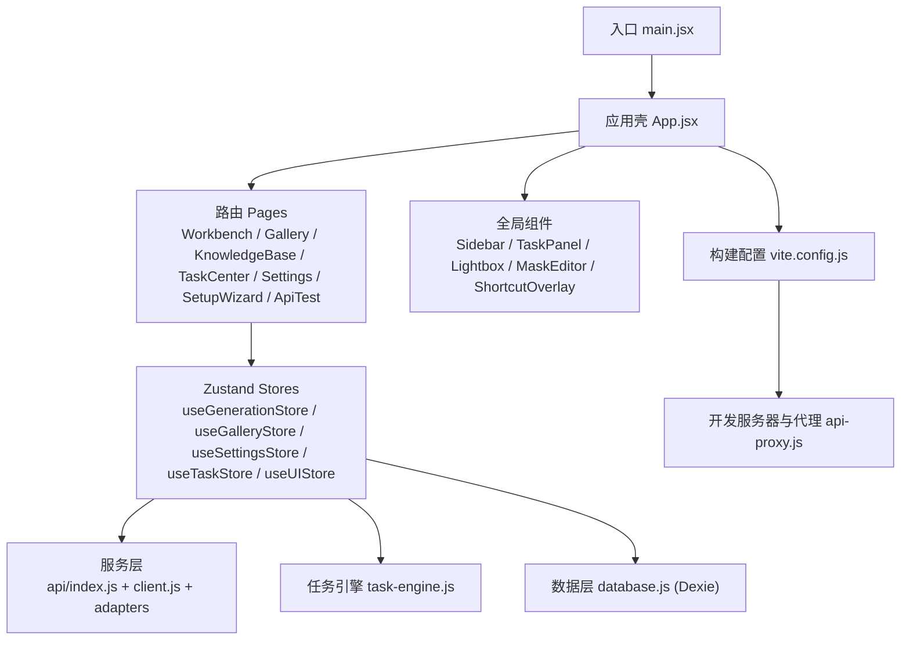
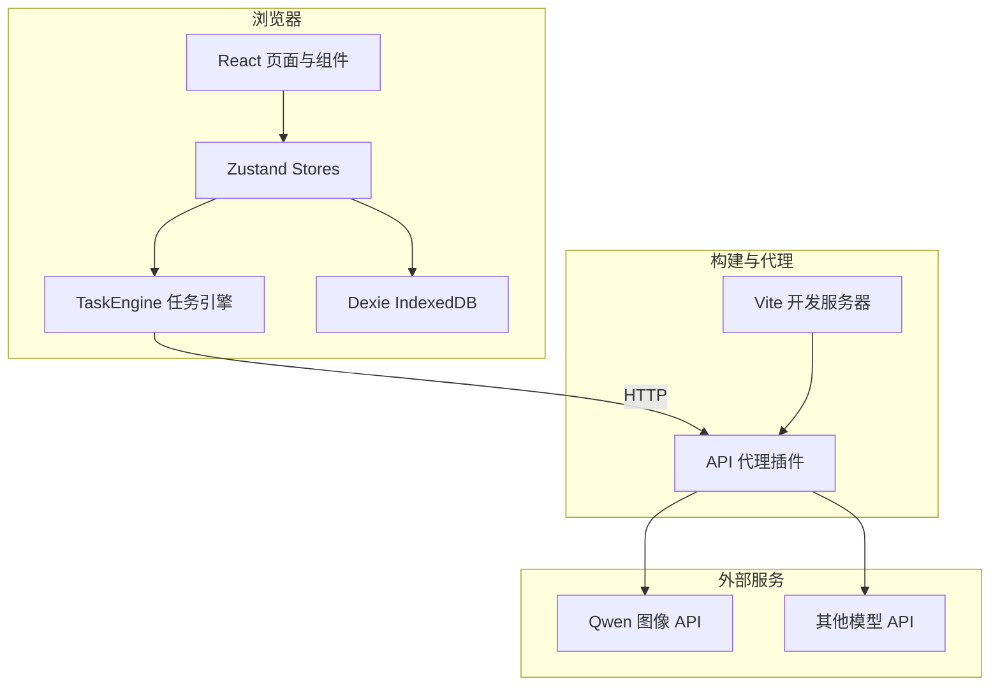
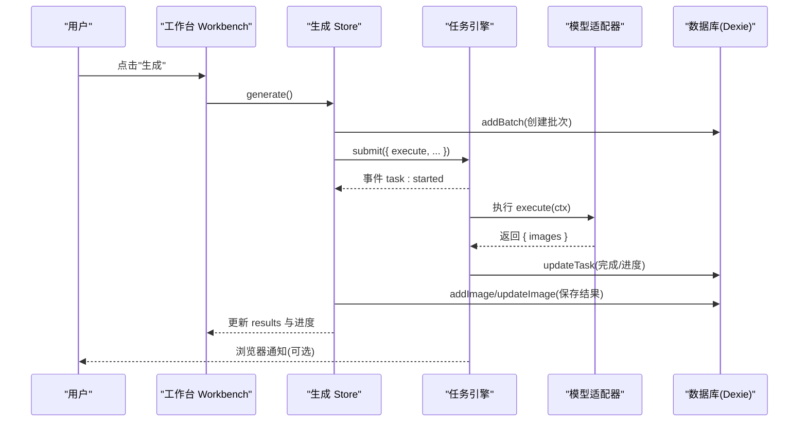
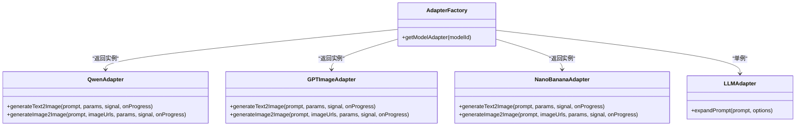
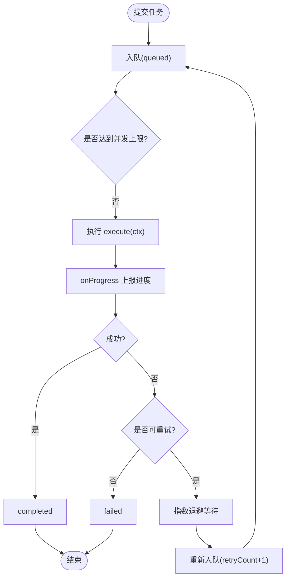
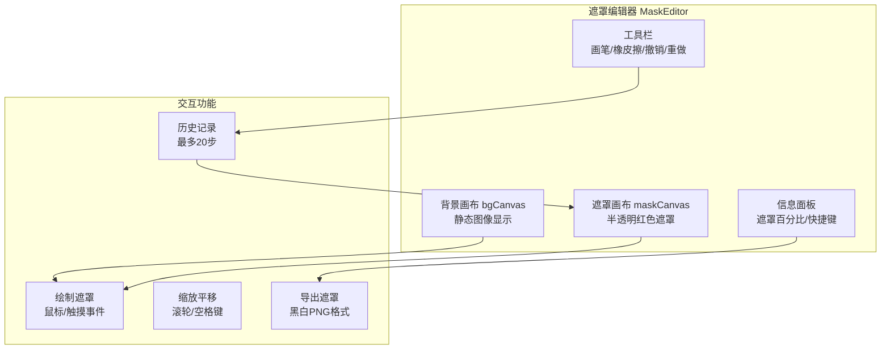
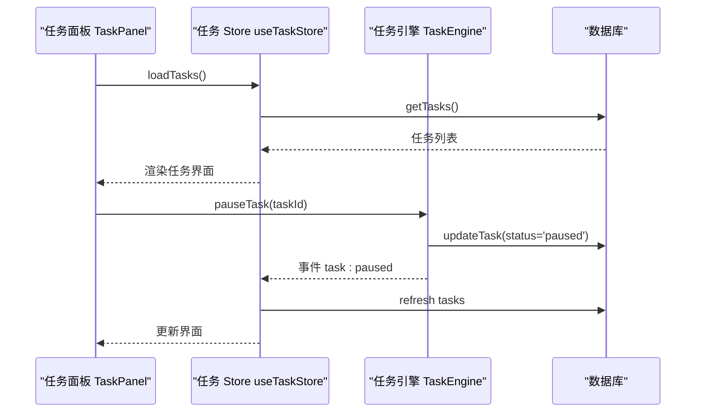
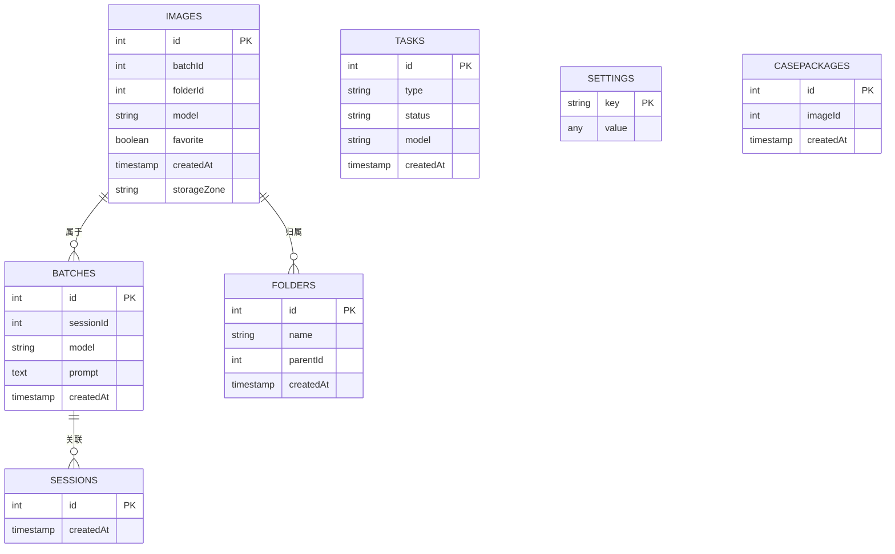
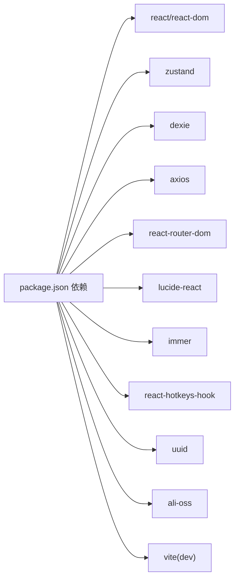

# 项目概述

<cite>
**本文引用的文件**   
- [README.md](file://README.md)
- [package.json](file://app/package.json)
- [vite.config.js](file://app/vite.config.js)
- [main.jsx](file://app/src/main.jsx)
- [App.jsx](file://app/src/App.jsx)
- [database.js](file://app/src/db/database.js)
- [useSettingsStore.js](file://app/src/stores/useSettingsStore.js)
- [models.js](file://app/src/constants/models.js)
- [index.js](file://app/src/services/api/index.js)
- [client.js](file://app/src/services/api/client.js)
- [qwen-adapter.js](file://app/src/services/api/qwen-adapter.js)
- [task-engine.js](file://app/src/services/task-engine.js)
- [Workbench.jsx](file://app/src/pages/Workbench.jsx)
- [Sidebar.jsx](file://app/src/components/Sidebar.jsx)
- [BatchPanel.jsx](file://app/src/components/BatchPanel.jsx)
- [KnowledgeBase.jsx](file://app/src/pages/KnowledgeBase.jsx)
- [MaskEditor.jsx](file://app/src/components/MaskEditor.jsx)
- [TaskPanel.jsx](file://app/src/components/TaskPanel.jsx)
- [useGenerationStore.js](file://app/src/stores/useGenerationStore.js)
- [useTaskStore.js](file://app/src/stores/useTaskStore.js)
</cite>

## 更新摘要
**所做更改**   
- 更新了应用架构描述，反映完整的多模型支持系统
- 新增了遮罩编辑器（Inpainting Editor）组件的详细分析
- 增强了任务管理系统的工作流程说明
- 完善了组件结构和状态管理的架构图
- 更新了多模型适配器的类关系图

## 目录
1. [简介](#简介)
2. [项目结构](#项目结构)
3. [核心组件](#核心组件)
4. [架构总览](#架构总览)
5. [详细组件分析](#详细组件分析)
6. [依赖分析](#依赖分析)
7. [性能考量](#性能考量)
8. [故障排查指南](#故障排查指南)
9. [结论](#结论)
10. [附录：快速开始](#附录快速开始)

## 简介
AI Image Studio 是一款专业的 AI 图像生成工作站，提供多模型统一接口、提示词工程、批量生成、知识库 RAG（基于本地案例与 LLM 辅助标注）以及完整的资产管理能力。前端采用 React 18 + Vite 6 + Zustand + Dexie.js 技术栈，强调"可插拔的模型适配器"、"后台任务调度"和"持久化数据层"，在浏览器端即可实现从提示词到成图的全流程工作流。

- **产品定位**：面向创作者与团队的本地化 AI 图像创作工作台
- **核心特性**：
  - 多模型统一接口：通过适配器模式屏蔽不同厂商 API 差异（Qwen、GPT-image、Nano Banana）
  - 提示词工程：支持扩写、模板替换、参数化组合
  - 批量生成：多批次、多变体、队列式提交
  - 知识库 RAG：案例包管理、AI 辅助标注、一键复用
  - 资产管理：图片、批次、会话、文件夹、任务、设置等完整 CRUD
  - 局部重绘：基于 Canvas 的遮罩编辑器，支持 GPT-image-2 的 Inpainting 功能
  - 任务管理：完整的任务生命周期管理，支持暂停、恢复、重试等操作
- **设计理念**：
  - 分层清晰：UI 层 → Store 层 → 服务层（API/TaskEngine/Storage）→ 数据层（Dexie IndexedDB）
  - 可扩展：新增模型只需实现适配器并注册
  - 高可用：任务引擎具备并发控制、重试、进度上报与通知

章节来源
- [README.md:1-10](file://README.md#L1-L10)

## 项目结构
- **应用入口与路由**
  - main.jsx：初始化数据库与设置后挂载 React 根节点
  - App.jsx：全局错误边界、快捷键、侧边栏、任务面板、灯箱、遮罩编辑器、路由与页面懒加载
- **页面与组件**
  - pages：工作台、图库、知识库、任务中心、设置、安装向导、API 测试
  - components：批量面板、灯箱、遮罩编辑器、侧边栏、快捷键覆盖层、任务面板等
- **状态与数据**
  - stores：Zustand 状态切片（生成、图库、设置、任务、UI）
  - db：Dexie.js 封装的数据访问层（images/batches/sessions/folders/tasks/settings/casePackages）
- **服务与集成**
  - services/api：HTTP 客户端、适配器工厂与具体适配器（Qwen/GPT/NanoBanana/LLM）
  - services/task-engine：后台任务调度器（并发、FIFO、指数退避重试、事件、持久化）
  - services/storage：存储策略（热/冷区、缩略图、OSS 配置）
- **构建与代理**
  - vite.config.js：Vite 插件（React + 自定义 API 代理插件）
  - package.json：依赖与脚本（dev/build/preview）

图表来源
- [main.jsx:1-32](file://app/src/main.jsx#L1-L32)
- [App.jsx:1-364](file://app/src/App.jsx#L1-L364)
- [vite.config.js:1-13](file://app/vite.config.js#L1-L13)

章节来源
- [main.jsx:1-32](file://app/src/main.jsx#L1-L32)
- [App.jsx:1-364](file://app/src/App.jsx#L1-L364)
- [vite.config.js:1-13](file://app/vite.config.js#L1-L13)
- [package.json:1-30](file://app/package.json#L1-L30)

## 核心组件
- **应用壳与路由**
  - 错误边界、快捷键上下文、全局灯箱、遮罩编辑器、任务指示器与面板
  - 路由懒加载各页面，Suspense 骨架屏
- **工作台 Workbench**
  - 模型选择、提示词输入、参考图上传、参数调节、生成与结果展示
  - 调用生成 Store 触发任务，联动批量面板与遮罩编辑
- **遮罩编辑器 MaskEditor**
  - 双 Canvas 架构：背景画布 + 遮罩画布叠加
  - 画笔工具、橡皮擦、撤销重做、缩放平移、对比预览
  - 导出黑白遮罩 PNG，支持外部遮罩上传
  - 仅 GPT-image-2 支持局部重绘功能
- **任务面板 TaskPanel**
  - 实时任务监控，按状态分组显示（进行中、排队中、已完成、失败）
  - 支持任务暂停、恢复、取消、重试操作
  - 进度条可视化，错误信息展示
- **批量面板 BatchPanel**
  - 多批次/多变体/Prompt 队列三种模式，循环调用生成接口
- **知识库 KnowledgeBase**
  - 案例包增删改查、AI 辅助标注、一键回填工作台参数
- **侧边栏 Sidebar**
  - 导航、文件夹树、拖拽移动图片、右键菜单、新建/重命名/删除子文件夹
- **数据层 database.js**
  - 基于 Dexie 的表结构与索引；提供 images/batches/sessions/folders/tasks/settings/casePackages 的 CRUD 与统计
- **设置与模型配置 useSettingsStore**
  - 模型开关与默认参数、存储策略（热/冷区、OSS）、LLM 扩写配置、通用设置，持久化至 IndexedDB
- **任务引擎 task-engine.js**
  - 最大并发、FIFO 队列、指数退避重试、状态机、事件总线、IndexedDB 持久化、进度回调
- **API 适配层 index.js + client.js + qwen-adapter.js**
  - 统一 HTTP 客户端（自动重试、取消、超时），适配器工厂按 modelId 返回具体实现，Qwen 适配器处理 T2I/I2I 请求与响应解析

章节来源
- [App.jsx:1-364](file://app/src/App.jsx#L1-L364)
- [Workbench.jsx:1-200](file://app/src/pages/Workbench.jsx#L1-L200)
- [MaskEditor.jsx:1-800](file://app/src/components/MaskEditor.jsx#L1-L800)
- [TaskPanel.jsx:1-538](file://app/src/components/TaskPanel.jsx#L1-L538)
- [BatchPanel.jsx:1-200](file://app/src/components/BatchPanel.jsx#L1-L200)
- [KnowledgeBase.jsx:1-200](file://app/src/pages/KnowledgeBase.jsx#L1-L200)
- [Sidebar.jsx:1-200](file://app/src/components/Sidebar.jsx#L1-L200)
- [database.js:1-348](file://app/src/db/database.js#L1-L348)
- [useSettingsStore.js:1-179](file://app/src/stores/useSettingsStore.js#L1-L179)
- [task-engine.js:1-319](file://app/src/services/task-engine.js#L1-L319)
- [index.js:1-39](file://app/src/services/api/index.js#L1-L39)
- [client.js:1-146](file://app/src/services/api/client.js#L1-L146)
- [qwen-adapter.js:1-200](file://app/src/services/api/qwen-adapter.js#L1-L200)

## 架构总览
系统采用"前端单页应用 + 本地持久化 + 外部 API 代理"的分层架构。UI 通过 Zustand 管理状态，业务逻辑下沉至服务层（API 适配器与任务引擎），数据落盘由 Dexie 完成。Vite 开发服务器通过自定义插件将 /api/* 转发至后端或第三方服务。

图表来源
- [App.jsx:1-364](file://app/src/App.jsx#L1-L364)
- [task-engine.js:1-319](file://app/src/services/task-engine.js#L1-L319)
- [database.js:1-348](file://app/src/db/database.js#L1-L348)
- [vite.config.js:1-13](file://app/vite.config.js#L1-L13)

## 详细组件分析

### 生成流程时序（工作台 → 任务引擎 → 适配器 → 数据库）

图表来源
- [Workbench.jsx:1-200](file://app/src/pages/Workbench.jsx#L1-L200)
- [useGenerationStore.js:1-386](file://app/src/stores/useGenerationStore.js#L1-L386)
- [task-engine.js:1-319](file://app/src/services/task-engine.js#L1-L319)
- [database.js:1-348](file://app/src/db/database.js#L1-L348)

章节来源
- [Workbench.jsx:1-200](file://app/src/pages/Workbench.jsx#L1-L200)
- [useGenerationStore.js:1-386](file://app/src/stores/useGenerationStore.js#L1-L386)
- [task-engine.js:1-319](file://app/src/services/task-engine.js#L1-L319)
- [database.js:1-348](file://app/src/db/database.js#L1-L348)

### 多模型适配器类关系

图表来源
- [index.js:1-39](file://app/src/services/api/index.js#L1-L39)
- [qwen-adapter.js:1-200](file://app/src/services/api/qwen-adapter.js#L1-L200)

章节来源
- [index.js:1-39](file://app/src/services/api/index.js#L1-L39)
- [qwen-adapter.js:1-200](file://app/src/services/api/qwen-adapter.js#L1-L200)

### 任务引擎状态机与流程图

图表来源
- [task-engine.js:1-319](file://app/src/services/task-engine.js#L1-L319)

章节来源
- [task-engine.js:1-319](file://app/src/services/task-engine.js#L1-L319)

### 遮罩编辑器架构（Inpainting 功能）

图表来源
- [MaskEditor.jsx:1-800](file://app/src/components/MaskEditor.jsx#L1-L800)

章节来源
- [MaskEditor.jsx:1-800](file://app/src/components/MaskEditor.jsx#L1-L800)

### 任务管理系统工作流程

图表来源
- [TaskPanel.jsx:1-538](file://app/src/components/TaskPanel.jsx#L1-L538)
- [useTaskStore.js:1-173](file://app/src/stores/useTaskStore.js#L1-L173)
- [task-engine.js:1-319](file://app/src/services/task-engine.js#L1-L319)

章节来源
- [TaskPanel.jsx:1-538](file://app/src/components/TaskPanel.jsx#L1-L538)
- [useTaskStore.js:1-173](file://app/src/stores/useTaskStore.js#L1-L173)
- [task-engine.js:1-319](file://app/src/services/task-engine.js#L1-L319)

### 数据库模型（ER 示意）

图表来源
- [database.js:1-348](file://app/src/db/database.js#L1-L348)

章节来源
- [database.js:1-348](file://app/src/db/database.js#L1-L348)

### 设置与模型配置
- **模型常量 models.js** 定义各模型的名称、供应商、能力集、尺寸与默认参数
- **useSettingsStore** 负责：
  - 根据常量构建默认模型配置
  - 维护存储配置（热/冷区、OSS 桶与区域、缩略图尺寸）
  - 维护 LLM 扩写配置（启用、模型、变体数、温度）
  - 通用设置（主题、语言、自动保存、最大并发任务）
  - 设置项持久化与恢复

章节来源
- [models.js:1-110](file://app/src/constants/models.js#L1-L110)
- [useSettingsStore.js:1-179](file://app/src/stores/useSettingsStore.js#L1-L179)

### 侧边栏与文件夹管理
- **导航项**：生成、全部图片、最近生成、收藏、知识库、设置、任务中心、API 测试
- **文件夹树**：支持展开/折叠、双击重命名、右键菜单、拖拽移动图片、递归删除
- **与图库 Store 协作**，实时更新当前文件夹与图片列表

章节来源
- [Sidebar.jsx:1-200](file://app/src/components/Sidebar.jsx#L1-L200)

### 批量生成面板
- **三种模式**：
  - 多批次：固定提示词重复 N 次
  - 多变体：对提示词进行变量替换 × 尺寸组合
  - Prompt 队列：逐行读取提示词依次生成
- **通过循环调用生成 Store 的 generate 方法**，配合 Toast 反馈

章节来源
- [BatchPanel.jsx:1-200](file://app/src/components/BatchPanel.jsx#L1-L200)

### 知识库与 RAG 能力
- **案例包**：包含图片、原始/扩写提示词、模型、参数、标签、颜色、AI 标注等
- **功能**：
  - 网格/列表视图、搜索与筛选（模型、日期）
  - 详情面板：编辑原始/扩写提示词、保存标注、AI 辅助标注
  - 一键使用：跳转到工作台并填充模型与参数
- **底层通过 casePackages 表持久化**，结合 LLM 适配器生成结构化标注

章节来源
- [KnowledgeBase.jsx:1-200](file://app/src/pages/KnowledgeBase.jsx#L1-L200)
- [database.js:1-348](file://app/src/db/database.js#L1-L348)

## 依赖分析
- **运行时依赖**
  - react/react-dom：UI 框架
  - zustand：轻量状态管理
  - dexie：IndexedDB 封装
  - axios：HTTP 客户端
  - react-router-dom：路由
  - lucide-react：图标库
  - immer：不可变更新
  - react-hotkeys-hook：快捷键
  - uuid：唯一 ID
  - ali-oss：对象存储（冷区）
- **开发依赖**
  - vite：构建与开发服务器
  - @vitejs/plugin-react：React 支持
  - dotenv：环境变量

图表来源
- [package.json:1-30](file://app/package.json#L1-L30)

章节来源
- [package.json:1-30](file://app/package.json#L1-L30)

## 性能考量
- **任务并发与队列**
  - 默认最大并发为 3，可通过设置调整；FIFO 队列避免瞬时风暴
- **重试与退避**
  - 网络/服务端错误自动重试，指数退避降低雪崩风险
- **长耗时请求**
  - 针对同步图像 API 使用独立客户端与更长超时，避免误判超时
- **本地缓存与冷热存储**
  - 热区（IndexedDB）用于近期活跃资源，冷区（OSS）用于归档，减少首屏压力
- **渲染优化**
  - 路由懒加载与 Suspense 骨架屏，按需加载页面
  - Zustand + Immer 高效不可变更新，减少不必要重渲染
- **遮罩编辑器性能**
  - 双 Canvas 架构分离背景与遮罩，仅在必要时重绘
  - 采样像素计算遮罩百分比，平衡精度与性能

## 故障排查指南
- **启动与初始化**
  - 检查数据库初始化与设置加载是否成功（控制台日志）
  - 确认端口占用与严格端口模式
- **网络与代理**
  - 确认 /api 路径被 Vite 代理正确转发
  - 观察 axios 拦截器的错误归一化输出
- **任务失败**
  - 查看任务状态与错误信息，必要时手动重试
  - 关注是否命中可重试条件（5xx、网络错误）
- **浏览器通知**
  - 首次进入需授权通知权限，否则无法弹出完成/失败通知
- **遮罩编辑器问题**
  - 确认浏览器支持 Canvas API
  - 检查跨域图片加载权限（CORS）
  - 验证遮罩文件格式（黑白 PNG）

章节来源
- [main.jsx:1-32](file://app/src/main.jsx#L1-L32)
- [client.js:1-146](file://app/src/services/api/client.js#L1-L146)
- [task-engine.js:1-319](file://app/src/services/task-engine.js#L1-L319)
- [MaskEditor.jsx:1-800](file://app/src/components/MaskEditor.jsx#L1-L800)

## 结论
AI Image Studio 以清晰的层次与可扩展的适配器设计，将多模型图像生成能力整合到统一的本地工作站中。借助任务引擎与 IndexedDB，实现了稳定可靠的异步生成与资产沉淀；通过知识库与 LLM 辅助标注，形成"生成—沉淀—复用"的闭环。新增的遮罩编辑器为 GPT-image-2 提供了强大的局部重绘能力，而完善的任务管理系统确保了复杂工作流的可靠执行。该方案既适合个人创作者快速上手，也便于团队扩展新模型与新能力。

## 附录：快速开始
- **环境要求**
  - Node.js（建议最新 LTS）
  - 现代浏览器（支持 IndexedDB、Web Worker、Canvas API 等）
- **安装步骤**
  - 克隆仓库并进入 app 目录
  - 安装依赖：npm install
  - 启动开发服务器：npm run dev
- **基本使用**
  - 打开工作台，选择模型并输入提示词
  - 可上传参考图进行图生图，或开启提示词扩写
  - 对于 GPT-image-2，可使用遮罩编辑器进行局部重绘
  - 使用批量面板进行多批次/多变体/队列生成
  - 在任务面板中监控和管理所有生成任务
  - 在图库中浏览、收藏、移动至文件夹
  - 在知识库中查看案例、AI 标注并一键回填工作台
  - 在设置中配置模型、存储与通用选项
- **常见问题**
  - 若出现跨域或代理问题，请检查 vite.config.js 与代理插件
  - 若生成超时，可在设置中调整最大并发与相关参数
  - 遮罩编辑器不支持的图片格式，请先转换为支持的格式

章节来源
- [package.json:1-30](file://app/package.json#L1-L30)
- [vite.config.js:1-13](file://app/vite.config.js#L1-L13)
- [App.jsx:1-364](file://app/src/App.jsx#L1-L364)
- [Workbench.jsx:1-200](file://app/src/pages/Workbench.jsx#L1-L200)
- [MaskEditor.jsx:1-800](file://app/src/components/MaskEditor.jsx#L1-L800)
- [TaskPanel.jsx:1-538](file://app/src/components/TaskPanel.jsx#L1-L538)
- [BatchPanel.jsx:1-200](file://app/src/components/BatchPanel.jsx#L1-L200)
- [KnowledgeBase.jsx:1-200](file://app/src/pages/KnowledgeBase.jsx#L1-L200)
- [useSettingsStore.js:1-179](file://app/src/stores/useSettingsStore.js#L1-L179)